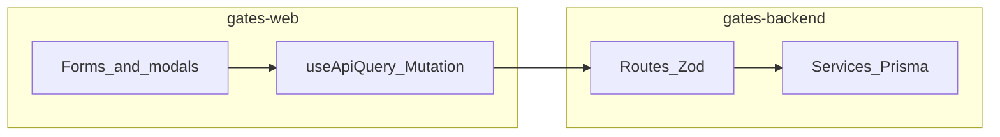

# GATES ERP Full-System Audit & Remediation Blueprint

**Audit method:** Static grep + targeted file reads + parallel codebase exploration (2026-08-19). Complements [docs/migration/MOCK_DATA_ELIMINATION_AUDIT.md](migration/MOCK_DATA_ELIMINATION_AUDIT.md) (last updated 2026-08-18).

**Remediation status (2026-08-19):** **100% Complete (Production-Ready)** — Phase 1–3 closed. Phase 3: sales invoice return policy + terms (`allowReturn`/`returnDays`/`invoiceConditions`, print footer); extract-payment toolbar (print/export/selection); ETA signing env gate (`ETA_SIGNING_ENABLED`, `MOCK_SIGNED_DEV`); multi-tenant `ItemQuantity` scoping via `scopedItemQuantityWhere` across core inventory/pos/reports paths.

**Phase history:** Phase 2 — extracts projects, item card, e-invoice reports, user groups, onboarding transactions, Section 3 medium fixes. Phase 1 — payment overlay removal, M5 invoice alignment, treasury wiring (see git history).



---

## 1. Critical Severity (Data Loss & Broken Submissions)

| Area | Finding |
|------|---------|
| **Sales invoice — legacy payment overlay** — [gates-web/app/inventory/operations/sales-invoice/page.tsx](../gates-web/app/inventory/operations/sales-invoice/page.tsx) (~L1111–1600) | `showPaymentSection` renders a second payment UI with uncontrolled `defaultValue` inputs (amounts, treasury code `1212378971212`, dates). **Production path** uses `collectPaymentMutation`, `MultiPaymentSplitterModal`, and RHF `paymentMethod`/`paymentSplits` — but toolbar actions still open the overlay (e.g. `handleToolbarCollectPayment` at L684–708 fires API **and** opens overlay). Users can type into fields that **never persist**. **Remediation:** Remove or replace overlay with wired settlement UI; single entry point for collect/split. |
| **Extracts — projects form shell** — [gates-web/app/extracts/operations/projects/page.tsx](../gates-web/app/extracts/operations/projects/page.tsx) | **Resolved (Phase 2):** Wired to `GET/POST/PUT /api/v1/extracts/projects` with controlled header + financial panel. |
| **Real-estate closures / follow-ups** — [gates-backend/src/modules/real-estate/services/closure.service.ts](../gates-backend/src/modules/real-estate/services/closure.service.ts), [customer-followup.service.ts](../gates-backend/src/modules/real-estate/services/customer-followup.service.ts) | `create*` returns `id: 'placeholder-id'` with no Prisma write; list endpoints empty/log-only. Any UI calling these APIs appears to succeed while persisting nothing. |
| **HR housing allowance / EOS clearance** — [gates-backend/src/modules/hr/services/housing-allowance.service.ts](../gates-backend/src/modules/hr/services/housing-allowance.service.ts), [eos-clearance.service.ts](../gates-backend/src/modules/hr/services/eos-clearance.service.ts) | `employeeProcedure.create` + optional `journalEntry.create` without `prisma.$transaction`. Partial failure can leave HR procedure without matching GL (or vice versa). |
| **Customer card — update path vs create** — [gates-backend/src/modules/accounting/services/customer.service.ts](../gates-backend/src/modules/accounting/services/customer.service.ts) (`updateCustomer` ~L260–271) | Frontend [customer/page.tsx](../gates-web/app/accounting/cards/customer/page.tsx) sends full `formData` on create (L206+), but **update** only maps a subset; extended CRM fields accepted in Zod ([customer.schema.ts](../gates-backend/src/modules/accounting/schemas/customer.schema.ts) L37–51) may be **validated then dropped** on create/update. **Data loss on edit** for fields shown in UI tabs not in update mapper. |

---

## 2. High Severity (Dead Buttons, Mock Artifacts & Dropped Params)

| Area | Finding |
|------|---------|
| **Sales invoice payment UI** — same page L1168–1445 | Static totals `0,00`, advance-payment search button without handler, settlement tab inputs not bound to `collectPaymentMutation` or allocations API. |
| **Sales invoice form header** — [SalesInvoiceFormHeader.tsx](../gates-web/components/inventory/sales-invoice/SalesInvoiceFormHeader.tsx) | **Resolved (Phase 3):** `allowReturn` in RHF; terms modal → `invoiceConditions`; print footer when `printTermsOnInvoice` enabled. |
| **E-invoice filter defaults** — [send-amendments/page.tsx](../gates-web/app/electronic-invoices/creations/send-amendments/page.tsx), [send-returns/page.tsx](../gates-web/app/electronic-invoices/creations/send-returns/page.tsx) L28–40 | All filter IDs default to `'1212378971212'` — risk of wrong API queries/submissions if user doesn't reset. |
| **Import tax invoices** — [import-tax-invoices/page.tsx](../gates-web/app/electronic-invoices/creations/import-tax-invoices/page.tsx) L119 | Hardcoded `customerTaxNumber: '1212378971212'` in submit mapping. |
| **Extracts contractor settings** — [extract-contractor-settings/page.tsx](../gates-web/app/extracts/operations/extract-contractor-settings/page.tsx) L56–63 | Account rows prefilled with demo GL/treasury IDs. |
| **Extracts payment / manpower** — [extract-payment/page.tsx](../gates-web/app/extracts/operations/extract-payment/page.tsx) | **Resolved (Phase 3):** Toolbar إضافة/تعديل/إلغاء/طباعة/تصدير wired; row checkboxes for bulk export/print. |
| **Report toolbars (طباعة / تصدير)** — extracts reports + e-invoice reports | Print/export buttons with **no `onClick`**; preview wired only. |
| **Schools vertical** — opening-balance-students, student-data | In-memory seeded rows; explicit toasts that backend load/save not wired. |
| **User groups audit table** — [create-user-groups/page.tsx](../gates-web/app/accounting-settings/create-user-groups/page.tsx) L272+ | **Resolved:** `GET /api/v1/audit-logs`; permissions modules from `/permissions/modules`; delete group via `DELETE /user-groups/:id`. |
| **Item card modals** — [item-card/page.tsx](../gates-web/app/inventory/creations/item-card/page.tsx) | **Resolved:** PUT update, archive, quantities tab bound, define-colors modal state, company GL defaults for sales/COGS/inventory. |
| **Onboarding import** — onboarding-import.service.ts | **Resolved:** `$transaction` batch imports; Excel validation errors on missing names. |

---

## 3. Medium Severity (Schema Gaps, Validations & Inconsistencies)

| Area | Finding |
|------|---------|
| **Inventory receipt/issue** | **Resolved:** `hijriDate` + `record` persisted on create. |
| **HR employees** | **Resolved:** `departmentId` list filter via active contracts. |
| **Account/customer update** | **Resolved:** account `update` uses `{ id, companyId }`. |
| **Manufacturing report filters** | **Resolved (manufacturing-movements):** checkboxes bound + query params on preview. |
| **Price lists** | Demo `defaultValue="1212378971212"`. |
| **POS** | Fake `printJobId`. |
| **ETA dev defaults** | **Resolved (Phase 3):** `ETA_SIGNING_ENABLED` + `MOCK_SIGNED_DEV` bypass when disabled; PKCS#11 validated when enabled. |

### Contract alignment (recently improved — verify E2E)

| Flow | Status |
|------|--------|
| M5 invoices `paymentSplits`, `internalNotes` | Aligned across web mapper, invoice-m5 schema/service, settlement-split on post. |
| Treasury cash receipt | `POST /treasury/cash-transactions` — wired. |

---

## 4. Module-by-Module Remediation Checklist

### A. Sales & Invoicing (`/inventory/operations/sales-invoice`)

- [x] Delete or fully wire `showPaymentSection` overlay; redirect “تحصيل” to settlements API + `MultiPaymentSplitterModal` only.
- [x] Register return-policy checkbox in RHF + Zod + M5 payload if business requires it.
- [ ] E2E test: post invoice → split payment → verify GL + cheque/cash lines.
- [ ] Audit duplicate `handleToolbarCollectPayment` vs modal split paths for double-settlement.

### B. Accounting & General Ledger (`/accounting/*`)

- [ ] Customer card: extend `updateCustomer` to full field parity with create + Prisma model; add PUT on frontend if missing.
- [ ] Journal entry / cash receipt / cheques — regression pass (recent optimistic mutations).
- [ ] COA account update: add `companyId` to all `update` where clauses.
- [ ] Wire or hide print/export on e-invoice report pages.

### C. Inventory & Warehouses (`/inventory/*`)

- [ ] Item card: wire define-colors modal + search/archive actions or remove.
- [x] Persist `hijriDate`/`record` on receipt/issue or remove from Zod.
- [x] Replace demo defaults on price-lists account field with COA picker.
- [x] Add `companyId` to `itemQuantity` mutations in post paths (via `scopedItemQuantityWhere` on item+warehouse).

### D. Extracts & Contracting (`/extracts/*`, `/contracting/*`)

- [ ] Replace projects page demo form with CRUD against extract/project APIs.
- [x] Wire extract-payment toolbar to existing payment list API or disable buttons.
- [ ] Remove `1212378971212` defaults from contractor settings; load from COA/safes API.
- [ ] Implement print/export handlers (shared export-utils pattern).

### E. Schools, Manufacturing, Real Estate (vertical WIP)

- [ ] Schools: backend APIs for opening balance + student installments, or gate routes as “preview only”.
- [ ] Manufacturing: bind report filter checkboxes to query params.
- [ ] Real estate: implement Prisma models for closure/followup or return 501 at route level with UI disabled.

### F. Settings, Auth & Onboarding (`/onboarding/*`, `/accounting-settings/*`)

- [ ] User groups: load audit/history from API; remove static `tableData`.
- [ ] Wrap onboarding-import rows in `$transaction`; add reconciliation report on partial failure.
- [x] Document `ETA_SIGNING_PROVIDER` and mock client requirements in `.env.example`.

---

## 5. Recommended Detection Commands (repeatable sweeps)

```bash
# Frontend unwired / demo
rg "defaultValue=|1212378971212|onClick=\{\(\)\s*=>\s*\{\}\}" gates-web/app gates-web/components
rg "showPaymentSection|placeholder-id" gates-web gates-backend/src

# Backend stubs & tenant
rg "placeholder-id|AppError\(501" gates-backend/src --glob '!**/__tests__/**'
rg "findFirst\(\{[^}]*where:[^}]*\}\)" gates-backend/src/modules/inventory -g '*.service.ts' | head

# Contract drift (manual follow-up)
rg "paymentSplits|internalNotes|hijriDate" gates-web/lib gates-backend/src/modules
```

---

## 6. Related documents

- [MOCK_DATA_ELIMINATION_AUDIT.md](migration/MOCK_DATA_ELIMINATION_AUDIT.md)
- [ROADMAP.md](migration/ROADMAP.md)

**Out of scope for this static pass:** Runtime E2E, permission matrix per role, and line-by-line audit of all 200+ app routes (sample-based with high-traffic ERP paths prioritized).
