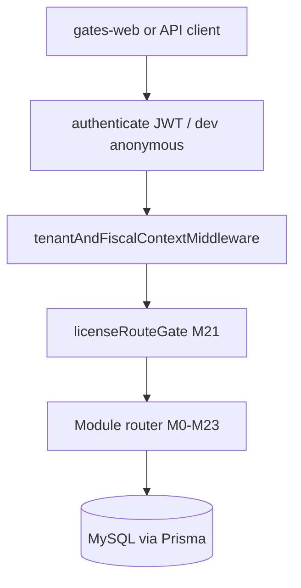

# Gates ERP — System Architecture & Operations

Single source of truth for the Delphi → Web stack: architecture, modules (M0–M23), migration, constraints, and production operations.

**Related docs:** [`docs/migration/ROADMAP.md`](migration/ROADMAP.md) (closure status), [`docs/migration/05-production-runbook.md`](migration/05-production-runbook.md), [`docs/migration/07-go-live-checklist.md`](migration/07-go-live-checklist.md).

---

## 1. System overview & high-level architecture

### Tech stack

| Layer | Technology | Location |
|--------|------------|----------|
| API | Node.js, TypeScript, Express | `gates-backend/` |
| ORM / DB | Prisma, MySQL 8 | `gates-backend/prisma/` |
| Cache / queues | Redis, BullMQ (optional) | `REDIS_*` env, workers |
| Web UI | Next.js 15, React 19, TanStack Query | `gates-web/` |
| Containers | Docker, Compose examples | `gates-backend/docker-compose.yml`, `infra/` |

### Request flow (multi-tenant)



1. **`authenticate`** — Validates JWT (Keycloak or local `JWT_DEV_SECRET` when `KEYCLOAK_ENABLED=false`).
2. **Tenant context** — Resolves `companyId`, `branchId`, `fiscalYearId` from JWT plus headers:
   - `X-Company-Id`
   - `X-Branch-Id` (explicit header wins over JWT default)
   - `X-Fiscal-Year-Id` (required for posting endpoints)
3. **`licenseRouteGate`** — Maps URL prefixes to licensed modules (`TenantSubscription.allowedModules`); core GL/inventory/treasury remain unguarded.
4. **Domain services** — Posting runs in `prisma.$transaction` where legacy Save+Post was atomic.

Context is attached on `AuthRequest` (`req.companyId`, `req.branchId`, `req.fiscalYearId`) after middleware in `gates-backend/src/shared/middleware/tenant-fiscal-context.middleware.ts`.

### Licensing (M21)

- Model: `TenantSubscription` per company.
- Route map: `gates-backend/src/modules/platform/types/license-modules.ts` (`ROUTE_MODULE_MAP`).
- Vertical prefixes (examples): `/manufacturing`, `/contracting`, `/real-estate`, `/schools`, `/hr/payroll-runs`, `/electronic-invoices`.

---

## 2. Authentication & authorization lifecycle

### API auth modes

Configured via `API_AUTH_MODE` and resolved at boot (`api-auth-mode.middleware.ts`):

| Mode | When | Behaviour |
|------|------|-----------|
| `anonymous` | Development only | Synthetic admin + first active company on `/api/v1` |
| `enforce` | Production (default) | Every `/api/v1` call requires valid JWT |

`NODE_ENV=production` always enforces JWT; `anonymous` in production fails startup.

### Frontend alignment

- `NEXT_PUBLIC_AUTH_MODE`: `enforce` in production builds.
- Edge middleware redirects unauthenticated users to `/login`.
- `apiClient` sends `Authorization` and tenant headers from stored session.

### RBAC & fine-grained access

- **`authorize({ resource, action })`** — JWT roles (e.g. `admin` when grant-all permissions exist) plus `UserPermission` rows.
- **Resources** — e.g. `invoice`, `payroll`, `journal`; actions: `view`, `edit`, `delete`, `post`, `approve`.
- **Posting guard** — `requirePostingContext` ensures open fiscal year + branch before GL/stock mutations.

---

## 3. Module directory & execution flow (M0–M23)

Smoke verification: `cd gates-backend && npm run test:waves` (19 suites).

### Wave 0 — Foundations

| Module | Purpose | API / services | Verified by |
|--------|---------|----------------|-------------|
| **M0** | Company, branch, fiscal year, document sequences | Platform routes, `documentSequenceService` | `test:wave0-gl` |
| **M1** | Chart of accounts, journal posting, 4-decimal balance | `journal-posting.service`, `/accounting/journals` | `test:wave0-gl` |
| **M3** | Customers, suppliers, persons; customer credit on sale | `party-credit.service`, party masters | `test:wave1-invoices` |
| **M4** | Items, warehouses, moving average (`getCostAsOf`, `applyMovingAverageInTx`) | `item-cost.service`, inventory routes | `test:item-cost`, invoice smoke |

### Wave 1 — Financial operations

| Module | Purpose | API / services | Verified by |
|--------|---------|----------------|-------------|
| **M5** | Dual GL + stock invoice posting | **`/api/v1/invoices`** — create, **PUT/PATCH/DELETE**, post, unpost, settlements | `test:wave1-invoices` |
| **M2** | Treasury, safes, banks, cash transactions, cheques | `/api/v1/treasury/*` | `test:wave1-treasury` |
| **M7** | VAT periods, declarations | Tax routes + posting stubs | `test:wave1-taxes` |

**M5 mutation routing (unified):**

- Canonical API: `/api/v1/invoices/:id` (PUT/PATCH/DELETE).
- Legacy `/api/v1/inventory/invoices/:id` **PUT/DELETE delegate to M5** (`invoiceM5Service` + `invoice-legacy-bridge.service`).
- Draft integrity: blocked when posted/cancelled; outbound lines checked against warehouse qty (unless negative stock allowed); customer credit checked on sales drafts.
- Moving average recalculation occurs at **post**, not on draft save (`invoice-posting-orchestrator` + `itemCostService`).

### Wave 2 — Channels & integration

| Module | Purpose | API / services | Verified by |
|--------|---------|----------------|-------------|
| **M6** | POS shifts, Z-report JE | POS routes; batch `POS_SHIFT` in M22 | `test:wave2-pos` |
| **M14** | ETA e-invoice / e-receipt, SHA-256 idempotency | `/electronic-invoices`, `e-invoice-submission.service`, `etaSigningService` / PKCS#11 wrapper | `test:wave2-einvoice` |
| **M15 / M23** | LC landed cost; LG issue, release, **confiscate** | `/api/v1/trade/*` | `test:wave2-trade` |

**LG confiscate posting (M23):** `POST /api/v1/trade/letters-of-guarantee/:id/confiscate`

- **Debit:** LG confiscation loss (`lgConfiscationLossAccountCode`, default `5210`)
- **Credit:** LG cash cover (`lgCashCoverAccountCode`, default `1410`)

### Wave 3 — Industry verticals

| Module | Purpose | API prefix | Verified by |
|--------|---------|------------|-------------|
| **M8** | Manufacturing BOM, production orders, WIP JE | `/manufacturing` | `test:wave3-manufacturing` |
| **M9** | Payroll runs, accrual/disburse JE | `/hr/payroll-runs` | `test:wave3-payroll` |
| **M10** | Schools tuition contracts, accrual, collect | `/schools` | `test:wave3-schools` |
| **M11 / M13** | Contracting projects, client extracts | `/contracting` | `test:wave3-contracting` |
| **M12** | Real estate units, contracts, installments | `/real-estate` | `test:wave3-real-estate` |

HTTP integration gate (auth + license): `test:wave3-http`.

### Wave 4 — Governance & analytics

| Module | Purpose | API | Verified by |
|--------|---------|-----|-------------|
| **M16** | TB, P&L, BS, account statement | `/reports/*` | `test:wave4-reports` |
| **M17** | AR/AP aging, executive KPIs | `/analytics/*` | `test:wave4-ops-analytics` |
| **M20** | Document archive (local / S3) | Archive routes, `resolveStorageProvider` | `test:wave4-archive-license` |
| **M21** | SaaS licensing | `TenantSubscription`, route gate | same |
| **M22** | Batch post/unpost, year-end | `/operations/batch-post`, FY close | `test:wave4-ops-analytics` |

---

## 4. Data migration ETL (Delphi → MySQL)

### Commands

```bash
cd gates-backend
npm run migrate:legacy -- --phase=ALL --company=0001 --data-path=./scripts/migration/fixtures/sample
npm run recon:migration
npm run test:migration-pipeline
npm run test:migration-recon
```

### Phases

| Phase | Content |
|-------|---------|
| **A** | Masters: company, branch, accounts, items, parties, … |
| **B** | Opening balances |
| **C** | Open transactions: journals, invoices, treasury |
| **D** | Optional persons; CKTrxHeader detection (cheque lines planned) |

Details: [`docs/migration/03-etl-pipeline.md`](migration/03-etl-pipeline.md), reconciliation: [`06-migration-reconciliation.md`](migration/06-migration-reconciliation.md).

Normalization: legacy composite keys (`CompanyCode`, `BranchCode`, `YearId`) → UUID tenancy + `legacyCompanyCode` / caches in `LegacyIdCache`.

---

## 5. Known constraints & design decisions

| Topic | Decision |
|-------|----------|
| **Fiscal year close** | Irreversible close for audit safety; reopen requires admin procedure (not exposed in UI). |
| **Invoice edit** | Only draft/unposted; stock and GL apply on post; unpost reverses movements. |
| **Dual API** | Legacy `/inventory/invoices` read/list may remain; **mutations route to M5**. Prefer `/invoices` for new UI. |
| **ETA signing** | `ETA_SIGNING_PROVIDER=mock` for dev; `pkcs11` validates `.dll`/`.so`, env, PIN cache — requires `pkcs11js` + vendor library in image. |
| **ETA live HTTP** | `ETA_USE_LIVE_CLIENT=true` + OAuth credentials; preprod before production tokens. |
| **Archive** | `ARCHIVE_STORAGE_PROVIDER=local` single-node; `s3` for multi-tenant durability. |
| **Payroll** | Flat tax / no attendance import in Wave 3 engine (Delphi parity gap documented). |
| **Supplier credit** | Customer credit enforced on post; supplier limits not yet enforced on purchase post. |
| **Negative stock** | Controlled by `allowNegativeBalance` / `AllowNegativeStore`. |

---

## 6. Deployment & production runbook

### Environment matrix (backend)

See `gates-backend/.env.example` — critical production vars:

| Variable | Purpose |
|----------|---------|
| `DATABASE_URL` | MySQL DSN |
| `NODE_ENV=production` | Forces JWT auth |
| `JWT_DEV_SECRET` / `KEYCLOAK_*` | Identity |
| `FRONTEND_URL`, `CORS_ORIGINS` | CORS |
| `REDIS_ENABLED`, `REDIS_URL` | Cache + workers |
| `ARCHIVE_STORAGE_PROVIDER`, `ARCHIVE_S3_*` | M20 |
| `ETA_*`, `ETA_PKCS11_*` | M14 |
| `LEGACY_*` | ETL CLI only (not on app servers) |

### Frontend

| Variable | Purpose |
|----------|---------|
| `NEXT_PUBLIC_API_URL` | API base (e.g. `https://api.example.com/api/v1`) |
| `NEXT_PUBLIC_AUTH_MODE` | `enforce` in prod |

### Docker Compose (full stack)

Example: [`infra/docker-compose.stack.example.yml`](../infra/docker-compose.stack.example.yml)

```bash
cd infra
cp docker-compose.stack.example.yml docker-compose.yml
# Configure .env (MySQL, DATABASE_URL, FRONTEND_URL, secrets)
docker compose up -d --build
curl -fsS http://localhost:3001/health/ready
```

Dev dependencies only: `cd gates-backend && docker compose up -d mysql redis`.

### TLS / reverse proxy

Terminate TLS at Nginx, Caddy, or Traefik; proxy to `web:3000` and `backend:3001`. Set `FRONTEND_URL` and `NEXT_PUBLIC_API_URL` to public HTTPS URLs.

### S3 archive

When `ARCHIVE_STORAGE_PROVIDER=s3`:

- Set `ARCHIVE_S3_BUCKET`, `ARCHIVE_S3_REGION`, credentials (or IAM role on ECS/EC2).
- Optional MinIO: `ARCHIVE_S3_ENDPOINT`, `ARCHIVE_S3_FORCE_PATH_STYLE=true`.
- Install `@aws-sdk/client-s3` in backend image (declared in `package.json`).

### Pre-deploy gate

```bash
cd gates-backend
npm run type-check
npm run test:waves
npm run prisma:deploy   # on target DB
```

Cutover checklist: [`docs/migration/07-go-live-checklist.md`](migration/07-go-live-checklist.md).

---

## Appendix: Primary entrypoints

| Concern | File |
|---------|------|
| API mount order | `gates-backend/src/app.ts` |
| Auth mode | `shared/middleware/api-auth-mode.middleware.ts` |
| Tenant headers | `shared/middleware/tenant-fiscal-context.middleware.ts` |
| M5 invoices | `modules/invoices/routes/invoice.routes.ts` |
| M5 posting | `modules/invoices/services/invoice-posting-orchestrator.ts` |
| License map | `modules/platform/types/license-modules.ts` |
| PKCS#11 wrapper | `modules/electronic-invoices/services/pkcs11-signing.service.ts` |

**Document version:** 2026-08-17 — aligned with migration roadmap closure (`ROADMAP.md`).
