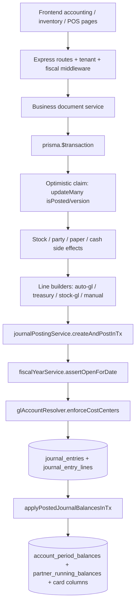
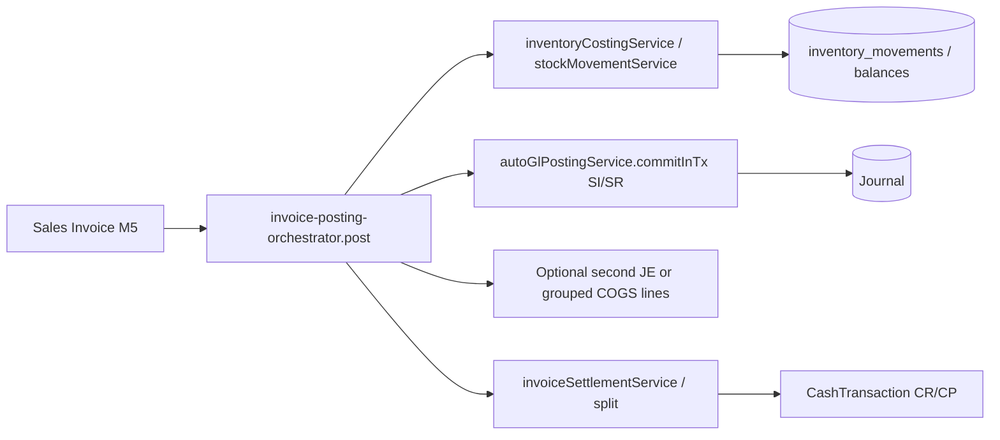
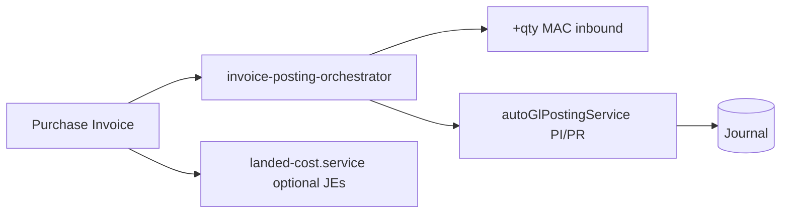
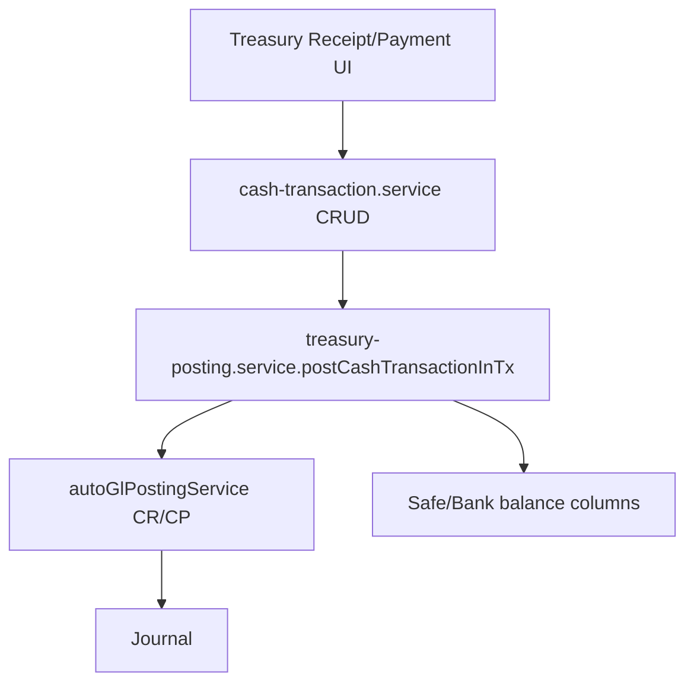
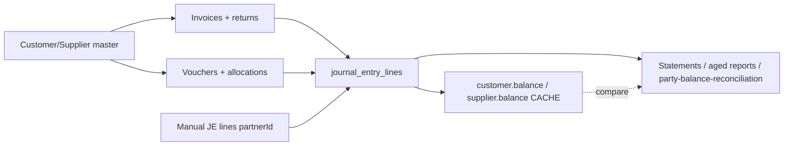
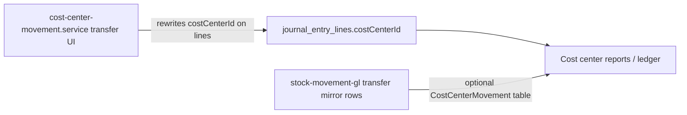
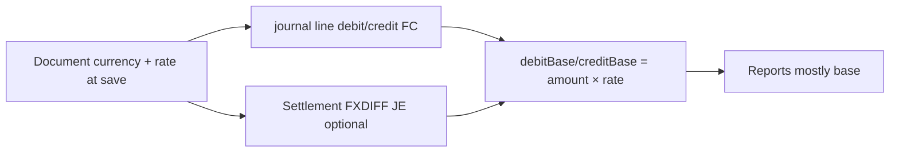
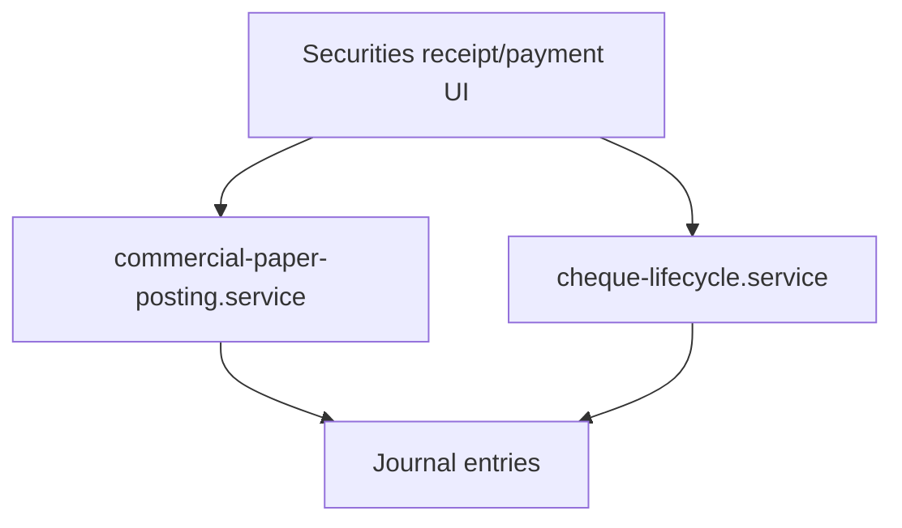
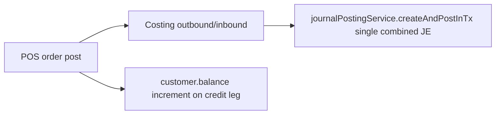
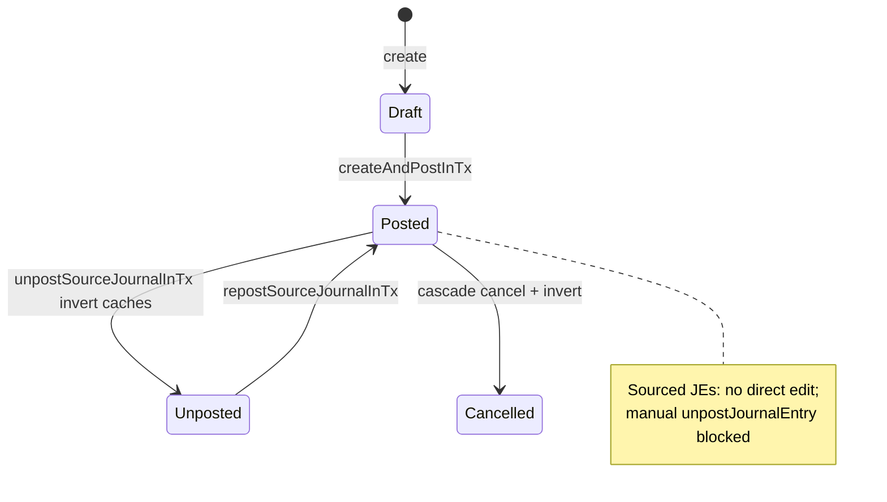

# Gates ERP — Accounting Flow Map (read-only audit)

**Scope:** Actual implementation paths as traced in `gates-backend` + `gates-web` (October 2026).  
**Rule:** Diagrams describe **current behavior**, not ideal ERP design.

---

## 1. Core posting pipeline

**Authoritative ledger:** Posted, non-cancelled, non-deleted `journal_entry_lines` (`debitBase` / `creditBase`).  
**Caches updated on post/unpost:** `account_period_balances`, `partner_running_balances`, and selectively `customer.balance` / `supplier.balance` / safe & bank card columns (`ledger-balance.service.ts`).

---

## 2. Sales → AR / revenue / tax / COGS / inventory

**CURRENT:** Stock and GL run in **one transaction** after invoice post claim (`invoice-posting-orchestrator.ts`).  
**GL optional:** `createGl` / transaction settings / `notCreateGL` can skip revenue JE while stock still posts (documented in orchestrator).

---

## 3. Purchases → AP / inventory / tax

---

## 4. Cash / bank vouchers

**Unpost:** `cascadeSourceJournalInTx` + balance inversion (`treasury-posting.service.ts`).

---

## 5. Customer / supplier → documents → GL → statements

---

## 6. Cost center

**CURRENT:** Primary analytic axis is **JE line `costCenterId`**. `CostCenterMovement` is auxiliary (stock transfer GL).

---

## 7. Multi-currency

**Rate capture:** `company-fx-rate.ts` (`rateForSave`, `persistJournalLineFxRate`) at journal create/post; invoice settlement can post `FXDIFF` (`invoice-settlement.service.ts`).

---

## 8. Commercial papers / cheques (dual stacks)

**RISK / QUESTION:** Two implementations can both touch cheque lifecycle; callers differ by screen/API path (see risk register).

---

## 9. POS (parallel to sales invoice)

**Difference from SI:** POS builds one JE in `pos-order-posting.service.ts`; invoices use `autoGlPostingService` + richer line mapping.

---

## 10. Unpost / reverse (sourced documents)

**CURRENT:** `reverseJournalEntryInTx` for some modules inverts balances **in place** without always creating a visible contra JE row (`journal-posting.service.ts` comments vs `reversalOfJournalEntryId` for explicit reversals).
