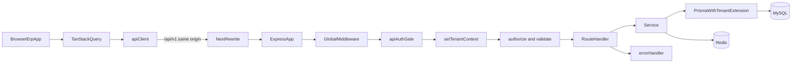
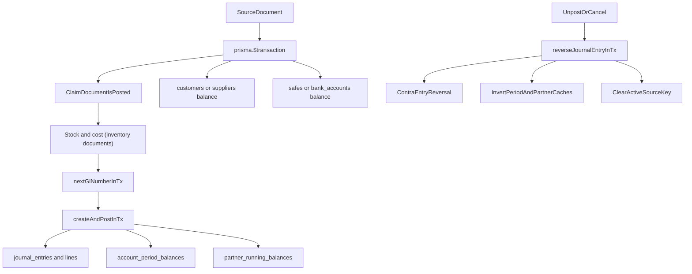
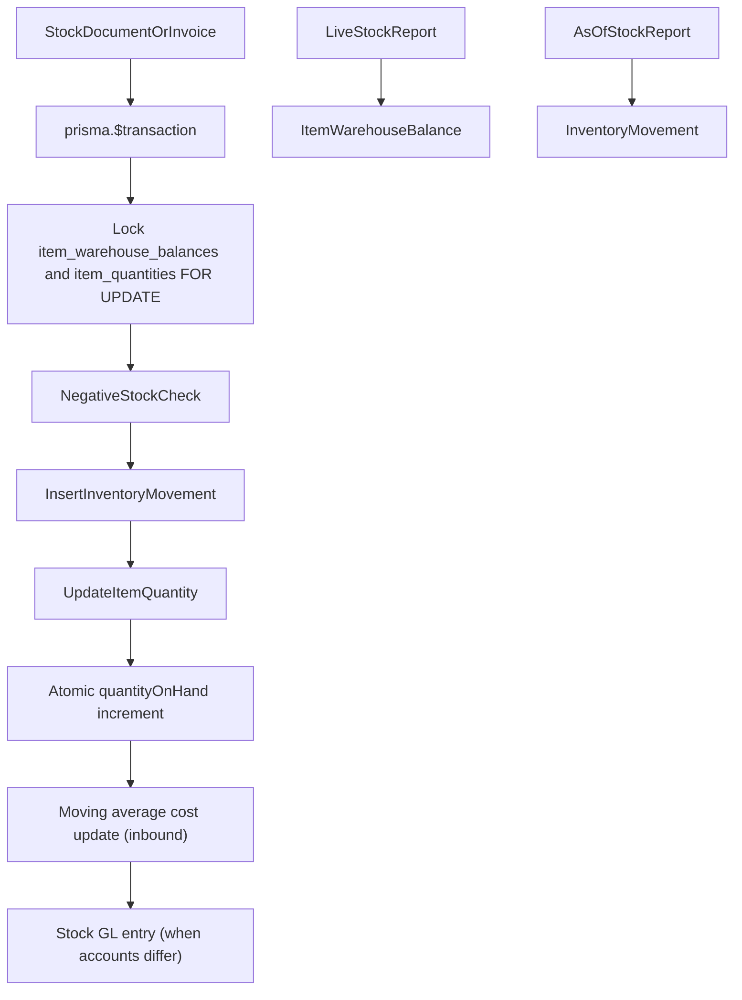
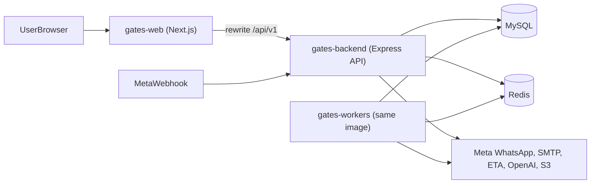
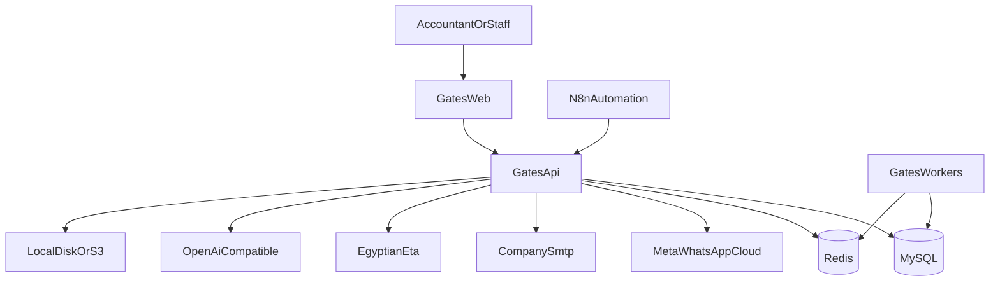
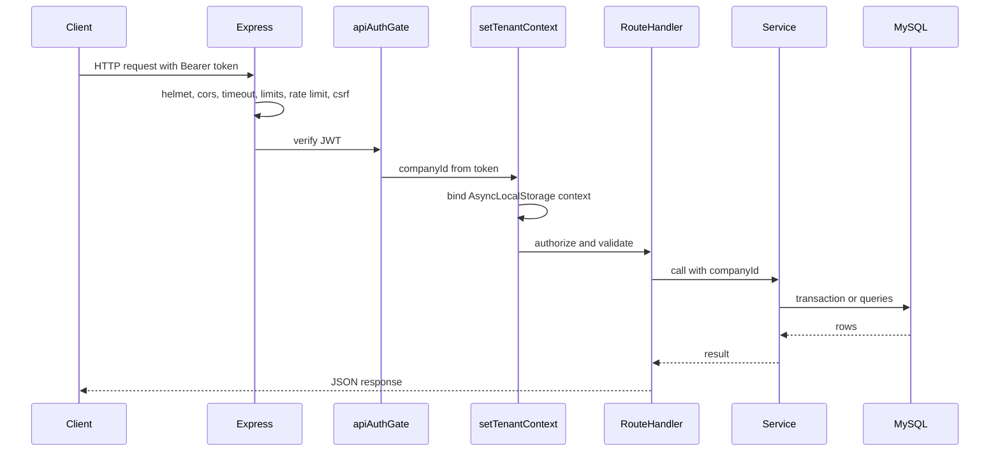

# Gates ERP: current architecture

Status: discovery snapshot, 27 September 2026. Read-only; nothing in the application was changed to produce it.

This document describes how the system works today. It does not recommend changes; see `ARCHITECTURE_AUDIT.md` for findings and `PERFORMANCE_BASELINE_PLAN.md` for how to measure before changing anything.

Evidence notation: `path:line` refers to the repository at the time of writing. Line numbers drift; search for the named function if a line has moved.

---

## 1. Executive overview

Gates is a multi-company Arabic (RTL) ERP made of two deployable Node.js applications that share one MySQL database:

- **gates-web**: a Next.js 15 / React 19 application. Almost every page is a client component that fetches data from the backend through TanStack Query. The browser calls `/api/v1/*` on the web origin, and Next rewrites those calls to the backend.
- **gates-backend**: an Express 4 / Prisma 5 API over MySQL (278 Prisma models, roughly 1,300 route handlers). The same codebase also runs as a BullMQ worker process when started with `GATES_RUN_WORKERS`.

Business logic lives in backend service files. Money correctness rests on one rule: **posted, non-cancelled, non-deleted journal lines, summed in base currency (`debitBase` / `creditBase`), are the accounting source of truth.** Several cached balances exist for speed (period balances, partner balances, customer and supplier balances, safe and bank balances, item stock and average cost); they are maintained inside the same database transactions that post documents.

Inventory follows the same shape: an append-only movement ledger (`InventoryMovement`) plus a per-warehouse cache of quantity and moving average cost (`ItemWarehouseBalance`), protected by row locks during posting.

Company isolation comes from the login token. Each request binds the company to an AsyncLocalStorage context, and a Prisma extension adds `companyId` to queries on company-owned models as a second safety layer behind the explicit filters written in each service.

---

## 2. Repository map

There is no root `package.json` and no shared workspace packages.

| Path | What it is |
|---|---|
| `gates-backend/` | Express + Prisma + MySQL API; also the BullMQ worker entrypoint (`src/workers/index.ts`) |
| `gates-backend/prisma/schema.prisma` | Single Prisma schema, about 9,250 lines, MySQL provider |
| `gates-backend/prisma/migrations/` | 184 SQL migrations (93 of them dated September 2026) |
| `gates-backend/scripts/railway-start.mjs` | Production start script (migrations, optional seed, API or workers) |
| `gates-backend/src/modules/<module>/` | Feature modules: `routes/`, `services/`, `schemas/`, sometimes `controllers/`, `processors/` |
| `gates-backend/src/shared/` | Middleware, Prisma client, cache, logger, monitoring, jobs, utilities |
| `gates-backend/src/__tests__/` | Jest unit (81 files) and integration (8 files) tests |
| `gates-backend/tests/modules/` | 6 additional Jest module specs |
| `gates-web/app/` | Next.js App Router pages (about 497 `page.tsx`, 432 of them client pages) |
| `gates-web/components/`, `gates-web/lib/` | UI components, hooks, API client, report engine, validation schemas |
| `gates-web/workers/` | Browser Web Workers (search, compute), not server workers |
| `gates-web/e2e/` | 3 Playwright specs |
| `docs/` | Existing audits, accounting notes, migration and parity docs |
| `infra/` | MySQL configuration samples and an example docker-compose stack |
| `monitoring/prometheus.yml` | Prometheus scrape configuration sample |
| `railway.env.example` | Railway variable names template |

Key versions (from `package.json`):

| Area | Backend | Frontend |
|---|---|---|
| Runtime | Node 20 (nixpacks / railpack) | Node 20 |
| Framework | Express `4.22.3` | Next `^15.5.26`, React `^19.0.0` |
| Data | `@prisma/client` / `prisma` `^5.18.0` (generated client 5.22.0) | TanStack Query `^5.90.10` |
| Validation | zod `^3.23.8` | zod `^4.3.6`, react-hook-form `^7.72.1` |
| Queues / cache | bullmq `^5.10.1`, ioredis `^5.3.2` | zustand `^5.0.15` (sparingly) |
| Documents | pdfkit `0.17.2`, exceljs `4.4.0` | SheetJS `xlsx 0.20.3`, recharts `^2.15.4` |
| Logging / telemetry | pino `^9.3.2`, OpenTelemetry SDK `0.208.0` | none |
| Tests | jest `30.2.0`, ts-jest | vitest `^3.2.7`, Playwright `^1.59.1` |

Not present anywhere: socket.io, Sentry, prom-client, puppeteer, a shared types package.

---

## 3. Frontend architecture

### 3.1 Rendering and routing
- Next.js App Router. The root layout (`app/layout.tsx`) is a thin server shell; the ERP chrome is client-only (`app/RootFrame.tsx` loads `ErpApp` with `ssr: false`).
- Data is fetched in the browser; there are no `app/api/**` route handlers and no server-component data fetching of note.
- `next.config.ts` rewrites `/api/v1/:path*` to `BACKEND_PROXY_TARGET`, so the browser talks to one origin.
- `middleware.ts` gates routes only on the presence of the auth cookie (when `NEXT_PUBLIC_AUTH_MODE=enforce` or in production). It does not validate the token. Unavailable modules are rewritten to `/unavailable`.

### 3.2 API client (`gates-web/lib/api/client.ts`)
- Base URL: `NEXT_PUBLIC_API_URL`, else `${origin}/api/v1` in the browser, else `BACKEND_INTERNAL_URL`.
- Sends `Authorization: Bearer <token>` (token kept in local/session storage and mirrored to a cookie for the Edge middleware).
- Sends tenant headers `X-Company-Id`, `X-Branch-Id`, `X-Fiscal-Year-Id` from local storage (`lib/tenant/tenant-context-storage.ts`), except on `/users/me` and `/auth/*`.
- Sends `X-CSRF-Token` from the `XSRF-TOKEN` cookie on mutations.
- Default timeout 30 s (180 s for streams and uploads). GET requests retry once with backoff; mutations are never retried.
- 401 clears the token and redirects to `/login`. There is no token refresh flow in the client.
- Errors are normalized to an `ApiError` shape and surfaced through Sonner toasts (`GlobalApiErrorToast`).

### 3.3 Server state (TanStack Query)
- Defaults (`lib/query/query-client.ts`, `lib/query/cache-policies.ts`): `staleTime` 5 min, `gcTime` 15 min, `placeholderData: keepPreviousData`, `refetchOnWindowFocus: false`, `refetchOnMount: false`, `retry: 1`.
- Tiers in `lib/query/query-keys.ts`: master data 10 min, transactional 30 s.
- `useApiQuery` (`lib/hooks/useApi.ts`) appends the params object to the query key and waits until company (and, for most endpoints, branch and fiscal year) are known.
- Invalidation is explicit (`useInvalidateQuery`) after mutations.
- Hover and navigation prefetching via `lib/navigation/route-prefetch-registry.ts`.
- Polling: executive KPIs and overview every 120 s, risk feed 60 s, analytics 180 s, notifications 20 s plus an SSE stream.

### 3.4 Forms, tables, lists
- Complex documents (sales and purchase invoices) use react-hook-form with zod resolvers; many master-data cards use local state plus zod schemas from `lib/validation/`.
- Tables are a custom `AppTable` with optional virtualization (`@tanstack/react-virtual`); PrimeReact is also installed.
- Pagination is mixed: some lists page on the server (items catalog); others fetch up to 200 rows and filter on the client (`GenericRecordsList`, `PartiesListSection`); master-data pickers fetch large pages (items 1,000, delegates 1,000, account pickers request 20,000; see the audit for how the backend clamps these).

### 3.5 Permissions on the client
- `useResourcePermissions` reads fine-grained permissions from `/users/me` and hides or disables actions and list rows.
- The sidebar is not permission-filtered, and routes are reachable by URL; enforcement is on the backend (section 8).

### 3.6 Report pipeline
Most reports share one pipeline:

1. A filter page built from `AccountReportFilterPage` (`components/report/AccountReportFilters.tsx`) writes query parameters.
2. A preview page (`CatalogReportPreviewPage`) resolves the backend path with `lib/reportPreview/resolveReportEndpoint.ts` using the report catalog (`lib/reports/reportCatalog.ts`, generated from `report-inventory.json`).
3. `UniversalReportViewer` fetches the report; `extractReportPayload` normalizes rows and summary.
4. `UniversalReportView` builds columns from the first row's keys and filters and sorts all rows in memory.

A few newer reports are dedicated pages with their own charts (for example the monthly financial performance and cost-center profitability pages under `app/accounting/account-reports/analysis/`).

### 3.7 Representative page data flows

| Page | Main requests on load |
|---|---|
| Sales invoice (`app/inventory/operations/sales-invoice/page.tsx`; `/sales/invoices/new` redirects here) | transaction settings, accounting settings, company settings, customers (limit 200), items (limit 1000), units (200), currencies (100), delegates x3 roles (limit 1000 each), sellers, branches (50), safes; when editing: `/invoices/{id}`, settlements, cheques; after picking a customer: frequent items |
| Purchase invoice (`app/inventory/operations/final-purchase-invoice/page.tsx`) | same family: settings, company settings, currencies, delegates (1000), items (1000), units, safes, invoice detail and settlements when editing |
| Customer card (`app/accounting/cards/customer/page.tsx`) | accounts (limit 1000, leaf only), delegates (1000), currencies, customer categories (200), suppliers (500), next code; list section pages through `/accounting/customers` |
| Item card (`app/inventory/creations/item-card/page.tsx`) | item detail, categories (200), units (500), items (500) to compute the next serial; saving issues sequential unit and price upserts |
| Accounting report preview (trial balance, general ledger) | the report endpoint, plus `/users/report-options`, the selected account (badge), fiscal years (100), optional comparison fetch |
| Accounting hub (`app/accounting/page.tsx`) | `/analytics/executive-kpis?months=6`, `/executive/overview` (both poll 120 s), `/analytics/aging`, `/accounting/journal-entries?page=1&limit=30` |
| Chart of accounts (`app/accounting/chart-of-accounts/page.tsx`) | `/accounting/accounts/tree` with `staleTime: 0` and `refetchOnMount: 'always'` |

The public home page (`app/page.tsx`) and `components/ui/ProductDashboard.tsx` are marketing content and make no API calls.

---

## 4. Backend architecture

### 4.1 Layering
The dominant pattern is **route handler, then service, then Prisma**:

- Route files (`src/modules/<m>/routes/*.routes.ts`) declare middleware (`authorize`, `validate`), read `req.companyId`, call a service, and map errors to HTTP. Many handlers catch errors themselves and reply with their own status codes.
- Services (`src/modules/<m>/services/*.service.ts`) hold business rules and database access, usually through `prisma.$transaction(async (tx) => ...)` for writes.
- Controllers exist only in a few modules (auth, recurring entries, tenant backup, AI, cheques). There are no repository classes.
- Shared posting services are reused across modules: `journalPostingService` (`modules/accounting/services/journal-posting.service.ts`), `autoGlPostingService`, `documentSequenceService` (`modules/platform/services/document-sequence.service.ts`), `inventoryCostingService`, and `stockMovementService`.

### 4.2 Global middleware order (`gates-backend/src/app.ts`)
1. `trust proxy`, `helmet` (strict CSP and HSTS in production), `cookieParser`, `cors`, compression
2. `defaultRequestTimeout` (30 s; skips `/api/v1/ai`)
3. IP blocking, security header validation
4. `defaultQueryLimits` on `/api/v1` (GET only: `limit` defaults to 50 and is capped at 1000)
5. JSON and urlencoded body parsers (10 MB)
6. Sanitization, SQL-injection and XSS filters
7. `pino-http` request logger, cache-control and ETag, GraphQL depth limit, metrics
8. Rate limits: in-memory `express-rate-limit` (default 5,000 per 15 min), a Redis distributed limiter, per-user limiters on journal, invoice and payroll routes
9. CSRF attach and protect on `/api/v1`, security audit middleware
10. Unauthenticated: `/health*`, `/auth/*`, internal automation endpoints, the Meta WhatsApp webhook
11. `apiAuthGate` (JWT required unless `API_AUTH_MODE=anonymous`, which is blocked in production)
12. `setTenantContext`, `enforceBranchScope`, `licenseRouteGate`
13. `tenantAndFiscalContextMiddleware` for accounting, manufacturing, contracting, real estate, payroll runs
14. Module routers (about 211 `app.use('/api/v1/...')` mounts). Some mounts add `reportRequestTimeout` (60 s) or `aiRequestTimeout` (180 s).
15. Central `errorHandler` (last)

Two routers share `/api/v1/accounting/reports`: `financial-reports.routes.ts` (mounted first, line 575, no report timeout) and the legacy `reports.routes.ts` (line 597, with the 60 s report timeout). For duplicate paths the first mount wins.

### 4.3 Validation and errors
- `validate({ body | query | params })` middleware runs zod `parseAsync`; some routes parse inline.
- `errorHandler` (`shared/middleware/error-handler.ts`) maps `ZodError` to 400, `AppError` to its status, and Prisma `P2002` (409), `P2025` (404), `P2003` (409), `P2014` (400). Other errors return 500; stacks are included only when `NODE_ENV=development`.
- The request timeout middleware answers 408 when the timer fires; it does not cancel the work already running in the handler.

### 4.4 Representative request flows

**Create sales invoice** (`POST /api/v1/inventory/invoices`)
`apiAuthGate` and `setTenantContext` (global), then the router's own `authenticate` and `setTenantContext`, then `authorize({ resource: 'invoice', action: 'edit' })` and `validate({ body: createInvoiceSchema })` (`modules/inventory/routes/invoice.routes.ts`), then `invoiceService.createInvoice` which validates, checks the fiscal year, and inside one transaction allocates the number (`documentSequenceService.nextNumberForFamilyInTx`) and writes the header and lines.

**Post journal entry** (`POST /api/v1/accounting/journal-entries/:id/post`)
Global auth and tenant, the fiscal context middleware, then `authorize({ resource: 'journal-entry', action: 'post' })` (`journal-entry.routes.ts`), then `journalEntryService.postJournalEntry`, which delegates to `journalPostingService.postJournalEntry`: a company-scoped read, then one transaction that claims the entry with a conditional `updateMany` (`isPosted: false`), updates period and partner balance tables, applies manual party balances, and writes an audit record.

**Trial balance** (`GET /api/v1/accounting/reports/trial-balance`)
`financial-reports.routes.ts` with `authorize({ resource: 'report', action: 'view' })`, then `financialReportService.getTrialBalance`: expands the cost-center subtree, resolves the currency, loads the account tree, then reads either the `account_period_balances` summary table or, when branch, cost center, fiscal year, currency or voucher filters are present, a live `GROUP BY` over journal lines.

---

## 5. Database architecture

- **Engine**: MySQL (Railway runs MySQL 9.7.2). Prisma 5 with the `fullTextIndex` preview feature; no `relationMode` override (real foreign keys).
- **Size**: 278 models, 68 enums.
- **Primary keys**: UUID strings (`@default(uuid())`), stored as `VARCHAR(191)`; seven legacy models use `CHAR(36)`. No auto-increment keys.
- **Domains (approximate model counts)**: platform, company, users and automation (~40); inventory (~41); subcontracts, extracts, contracting and letters of guarantee (~42); HR and payroll (~27); accounting GL and parties (~23); sales, invoices and POS (~23); real estate (~15); purchases and letters of credit (~13); schools (~13); e-invoicing and tax (~9); treasury and banks (~9); AI (~9); manufacturing (~6); securities / commercial papers (~5); WhatsApp (~3).
- **Company ownership**: 198 models have a `companyId` column; 80 do not. Most of the 80 are child rows owned through a parent (`JournalEntryLine` through `JournalEntry`, `InvoiceLine` through `Invoice`, stock document lines, `ItemQuantity`), plus legacy tenant tables and global settings. 177 company foreign keys cascade on delete; 7 restrict (journal entries, period and partner balances, payment allocations, landed cost allocations, item cost history, inventory movements); 14 models have `companyId` without a foreign key.
- **Document numbering uniques**: `DocumentSequence (companyId, branchId, fiscalYearId, docType)`; invoices `(companyId, branchId, fiscalYearId, invoiceType, invoiceNumber)`; journal `legacyGlNum (companyId, branchId, fiscalYearId, legacyGlNum)`; treasury receipts and payments `(companyId, voucherNumber)`; securities `(companyId, receiptNumber | paymentNumber)`; accounts and cost centers `(companyId, code)`. Journal `activeSourceKey` is globally unique; `reversalOfJournalEntryId` is unique.
- **Soft delete**: three styles coexist. `deletedAt` on 12 models (including `JournalEntry`, `Account`, `Customer`, `Company`); `isCancelled` on 22 document models; `isActive` on 76 master-data models. There is no Prisma soft-delete middleware; services filter explicitly.
- **Audit fields**: `createdAt` (~258 models), `updatedAt` (~239); `createdBy` on 5 models, `postedBy` on 6, no `updatedBy`. Optimistic-lock `version` columns on `JournalEntry`, `CashTransaction`, `Invoice`, and the stock documents. The old hash-chained `audit_logs` table was dropped (migration `20260821070000_drop_dead_audit_log_table`); runtime auditing uses `ActivityLog` and `AiAuditLog`.
- **Money and quantities**: journal lines, invoices and item costs use `DECIMAL(18,4)`; party, safe, bank and treasury amounts mostly use `DECIMAL(15,2)`; exchange rates `DECIMAL(18,6)` on journals and invoices, `DECIMAL(15,6)` on currencies and treasury, `DECIMAL(15,4)` on purchase orders; quantities `DECIMAL(18,4)` on invoice lines and stock caches, `DECIMAL(15,3)` on many stock document lines. The only `Float` column is `Subcontractor.riskScore`.

### 5.1 High-growth tables

| Table | Key indexes | Typical access (from code) |
|---|---|---|
| `journal_entries` | `(companyId, date)`, `(companyId, fiscalYearId, isPosted, date)`, `(companyId, isPosted, date desc)`, `(companyId, sourceType, sourceId)`, unique `activeSourceKey` | posting idempotency lookups, journal lists, date-bounded reports |
| `journal_entry_lines` | `journalEntryId`, `accountId`, `(accountId, journalEntryId)`, `partnerId`, `invoiceId`; unique `(journalEntryId, lineNumber)` | ledgers, trial balance live sums, party ledgers; always joined to `journal_entries` for company, date and status |
| `invoices` | unique number key, `(companyId, date)`, posting, due-date and remaining-amount composites, full-text | lists, aging, dashboards |
| `invoice_lines` | `invoiceId`, `itemId`, `(invoiceId, itemId)`, warehouse, cost center | item profit and sales reports through the parent |
| `inventory_movements` | `(companyId, itemId, effectiveAt)`, `(companyId, warehouseId, itemId)`, `(companyId, warehouseId, itemId, documentDate)`, date and type, `sourceDocumentId` | as-of stock, item movement, cost replay |
| `item_warehouse_balances` | unique `(companyId, itemId, warehouseId)` | live stock, costing, negative-stock checks (locked `FOR UPDATE`) |
| `cash_transactions` | `(companyId, date)`, `(companyId, safeId, isPosted, date)` | vouchers, safe reports |
| `account_period_balances` | unique per company, account, year, month | trial balance without filters |
| `partner_running_balances` | per company and partner | party balances |
| `cost_center_movements` | `(companyId, date)`, `accountId`, `costCenterId` | cost-center transfers |

---

## 6. Request and data flow

Typical write: the handler calls a service; the service opens one interactive transaction (default `maxWait` 15 s, `timeout` 30 s from `shared/database/prisma.ts`), takes row locks where needed, writes documents, ledger rows and caches, and returns. Typical read: the handler calls a service that runs Prisma queries or tagged-template raw SQL and returns JSON, which the frontend caches in TanStack Query.

---

## 7. Authentication

- JWT bearer tokens in the `Authorization` header, verified in `shared/middleware/auth.middleware.ts` via `jwt.verify.ts`: HS256 with `JWT_DEV_SECRET`, or RS256 through Keycloak JWKS when `KEYCLOAK_ENABLED`.
- The token carries the company; the middleware sets `req.user`, `req.companyId`, `req.tenantId`, `req.branchId`. The fiscal year comes from the `X-Fiscal-Year-Id` header (fiscal context middleware).
- Login (`modules/auth`) checks passwords with bcryptjs (cost 10) and issues a local JWT; refresh exists only for Keycloak (`POST /auth/refresh`).
- Sessions are tracked in Redis (`session:{userId}:{tokenId}`, 24 h TTL); logout blacklists the token id.
- A user belongs to exactly one company (`User.companyId`); there is no membership table.
- Cookies are used for CSRF, and on the web side a cookie copy of the token lets the Edge middleware check that a session exists.

---

## 8. Authorization

- `authorize({ resource, action })` (`shared/middleware/authorize.middleware.ts`) loads the user's fine-grained permissions (`UserPermission`, cached per company and user in the tenant metadata cache), grants everything for a `resource: '*'` row, otherwise matches resource and action (optionally module and branch), and falls back to JWT roles (`admin` gets everything; other roles map to preset grants).
- Almost every mutating route declares `authorize`. Exceptions are intentional or use custom checks: auth routes, self-scoped notifications, document edit leases, securities entities, internal automation and the Meta webhook.
- Some sensitive operations add extra checks: tenant backup export requires an `OWNER` or `SUPER_ADMIN` role; posting families check "advanced rights" (`advancedRightsService.assertCanPostFamily`); company flags such as `GLPost` and `GLUnPost` gate posting and unposting.
- Branch scoping: non-admin users are restricted to permitted branches (`enforceBranchScope`, `resolvePermittedBranchIds`).
- The frontend hides actions based on the same permissions but does not enforce them.

---

## 9. Multi-tenancy

- **Source of the company**: the JWT. `setTenantContext` (`shared/middleware/tenant.middleware.ts`) loads the company, checks it is active, sets `req.companyId`, and runs the rest of the request inside `runWithTenantContext` (AsyncLocalStorage).
- **Header**: `tenantAndFiscalContextMiddleware` accepts `X-Company-Id` only when it matches the token (403 otherwise); it uses the header only when the token has no company, which normal logins never produce.
- **Explicit filtering**: services pass `companyId` in their `where` clauses; this is the primary mechanism.
- **Defense in depth**: the Prisma extension in `shared/database/tenant-scoping.extension.ts` AND-s `{ companyId }` into filter operations, merges it into unique operations, and stamps it on creates, for every model listed in `tenant-scoped-models.generated.ts` (193 models). It does nothing outside a request context, inside `runWithoutTenantScoping`, or for raw SQL.
- **Child rows**: the 80 models without `companyId` are protected only by the parent check in each service (for example `itemUnit` deletes filter on `item: { companyId }`).

---

## 10. Accounting architecture

### 10.1 Source of truth and caches
- Source of truth: `journal_entry_lines` of entries where `isPosted = true`, `isCancelled = false`, `deletedAt IS NULL`, summed as `debitBase` / `creditBase`.
- Caches updated inside posting transactions:
  - `account_period_balances` and `partner_running_balances` via atomic `INSERT ... ON DUPLICATE KEY UPDATE` (`ledger-balance.service.ts` `applyPostedJournalBalancesInTx`).
  - `customers.balance` and `suppliers.balance` via `increment` / `decrement` in document services (invoices, treasury, papers) and `applyManualPartyBalances` for manual journals.
  - `safes.balance` and `bank_accounts.balance` in treasury and POS paths.
- `rebuildCompanyBalances` (`ledger-balance.service.ts`) wipes and re-derives the period and partner tables from journal lines.
- Cost-center balances in reports are computed from `costCenterId` on journal lines; `cost_center_movements` holds separate cost-center transfer rows.

### 10.2 Posting
- `journalPostingService.createAndPostInTx` is the canonical document posting path: open-period check (`fiscalYearService.assertOpenForDate`), FX hydration and base-amount balance check (`assertJournalBalanced` with 4-decimal equality), GL number allocation inside the transaction, entry and line creation, `activeSourceKey` claim, balance cache updates, audit.
- `activeSourceKey = companyId|sourceType|sourceNumber|sourceYearId` is unique while the entry is the active posted entry for its source document; it is cleared on reversal and on manual unpost.
- `autoGlPostingService.commitInTx` returns an existing active posted entry for the same source, replaces a draft, or creates a new posted entry.
- Manual journals are created as drafts (`createJournalEntry`, number allocated before the create transaction) and posted with `postJournalEntry` (conditional `updateMany` claim).

### 10.3 Reversal, cancellation, unposting
- `reverseJournalEntryInTx` creates a dated contra entry (`entryType: 'REVERSAL'`, no `activeSourceKey`), inverts the period and partner caches for the original lines, links `reversalOfJournalEntryId`, and leaves the original posted.
- `cascadeSourceJournalInTx` reverses posted journals linked to a source document on unpost or cancel, and marks unposted drafts cancelled.
- Manual `unpostJournalEntry` flips a non-sourced, unreversed manual entry back to draft after inverting caches; it is gated by the `GLUnPost` company flag and advanced rights, and refuses sourced, reversal and year-close entries.
- Posted cash voucher edits reverse the old journal and post a new one (`rewritePostedCashJournal`).

### 10.4 Documents traced end to end
- **Sales and purchase invoices**: `invoicePostingOrchestrator.post` (`modules/invoices/services/invoice-posting-orchestrator.ts`) runs one transaction: atomic claim, stock and cost per line in lock order, revenue or payable journal and optional COGS journal via `commitInTx`, optional cash settlement, customer or supplier balance increment, audit. Credit checks and account resolution run before the transaction.
- **Treasury vouchers**: create allocates the voucher number and writes the treasury receipt or payment plus the cash transaction in one transaction; post (`postCashTransactionInTx`) builds the journal via `commitInTx`, updates safe or bank and party balances, and marks the voucher posted.
- **Commercial papers**: issue, collect, bounce and endorse each run in their own transaction with their own journal; the receipt number is allocated before the create transaction.
- **Year-end closing**: `year-end-closing.service.ts` posts a closing journal from live sums and closes the fiscal year; period close only sets `Period.isClosed`, which `assertOpenForDate` enforces.

### 10.5 Currency
- Every header and line carries `currencyCode` and `exchangeRate`; base amounts are computed with `mulToDecimal4`. The base currency is `companySettings.defaultCurrency`, defaulting to EGP.
- Rounding helpers: `roundTo4` and `amountsEqualAt4` (`shared/utils/decimal-round.ts`). Many services convert Prisma `Decimal` to JavaScript `number` for arithmetic.

### 10.6 Hierarchies
- Accounts and cost centers are trees with `HEADER` and `POSTING` kinds; posting parents are promoted to `HEADER` when children are added, and conversion to `HEADER` is refused when the node has movements.
- Reports expand a selected account or cost center to its subtree with in-memory breadth-first helpers (`subtreeAccountIds`, `collectSubtreeIds`).

### 10.7 Report sources
- Trial balance without filters: `account_period_balances` (with an on-demand rebuild if the table is empty).
- Trial balance with filters, ledgers (account and cost center), income statement, balance sheet, monthly performance: live journal lines.
- Legacy `reports.service.ts`: mostly live journal aggregates on base amounts.
- Credit limits: `customers.balance` / `suppliers.balance` caches (`party-credit.service.ts`).

---

## 11. Inventory architecture

- **Ledger**: `InventoryMovement` (quantity delta, unit cost, resulting average cost, source document).
- **Caches**: `ItemWarehouseBalance` (quantity on hand, reserved, average cost; unique per company, item, warehouse), `ItemQuantity` (per location), `Item.averageCost` and `lastPurchasePrice`, `ItemCostHistory`.
- **Reads**: live stock from `ItemWarehouseBalance`; as-of stock and movement reports from `InventoryMovement`.
- **Write path** (`stockMovementService.postMovementInTx`, `adjust-stock-in-tx.ts`): lock the warehouse balance row and location row `FOR UPDATE`, check negative stock inside the transaction, insert the movement, update the location row, and apply an atomic `INSERT ... ON DUPLICATE KEY UPDATE quantityOnHand = quantityOnHand + delta`. Multi-line documents sort lines into a fixed lock order (`stock-lock-order.util.ts`).
- **Costing**: moving weighted average (`inventory-costing.service.ts`, `inventory-costing-math.ts`). Inbound updates warehouse and item averages; outbound values at the current average. `recalculateItemCostHistory` replays movements per item to repair costs (used by "fix average cost" and after purchase-invoice unposting).
- **Documents**: invoices (via the orchestrator), stock receipts and issues, transfers (both legs in one transaction), stocktaking, adjustments and other adjustments, opening stock (stock applied at create), assembly and disassembly, production orders, POS orders. Receipts, issues, stocktaking, assembly and disassembly use `claimDocumentPost` (conditional `updateMany`) to claim posting; transfers, adjustments, other adjustments and POS check the posted flag before the transaction and set it at the end.
- **Numbering**: invoices use `DocumentSequence`; stock documents use a client-supplied `serial` with no uniqueness constraint.

---

## 12. Caching and Redis

Redis is optional (`REDIS_ENABLED`); the API degrades without it.

| Use | Key pattern | TTL / invalidation | Company isolation |
|---|---|---|---|
| HTTP response cache (`cache.middleware.ts`) | `cache:v2:<hash>` | per route; pub/sub invalidation on `gates:cache:invalidate` | hash includes company, user, branch, fiscal year |
| Query cache (`query-cache.ts`) | `query:*`, tags `query:tag:*` | default 300 s, tag invalidation | per caller key |
| Tenant metadata (`tenant-metadata-cache.ts`) | `tenant:sub:{companyId}`, `tenant:settings:{companyId}`, `tenant:perms:{companyId}:{userId}` | L1 in-process LRU 45 s, L2 Redis about 1 h | explicit company in key |
| Sessions | `session:{userId}:{tokenId}`, `user_sessions:{userId}` | 24 h | per user |
| Distributed rate limit | `rate_limit:{user or ip}:{method}:{path}` | window | per user or IP |
| BullMQ | queue keys | job lifecycle | job payload carries company |
| Dead-letter queue | `dlq:*` | manual | payload |

The executive dashboard also keeps a short in-memory cache (about 30 s).

---

## 13. Connection management

- One shared client: `gates-backend/src/shared/database/prisma.ts` builds a `PrismaClient`, caches it on `global` outside production (hot reload), attaches query monitoring (`$on('query' | 'error')`), and wraps it with the tenant-scoping and `item.code` extensions.
- Interactive transaction defaults: `maxWait` 15 s, `timeout` 30 s; some inventory paths raise the timeout (for example 120 s for cost replay).
- Pool size: the code reads `connection_limit` and `pool_timeout` from `DATABASE_URL` for logging and pool monitoring (defaults 20 / 10 / 5 for production / development / test), but passes `DATABASE_URL` to Prisma unchanged. If the URL has no `connection_limit`, Prisma's own default applies (number of CPUs x 2 + 1).
- A production interval (60 s) reads `SHOW STATUS LIKE 'Threads_connected'` for monitoring.
- Other clients in `src/`: `shared/database/prisma-read.ts` (replica client) and `src/dbReadWrite.ts`; neither is imported anywhere. Scripts, seeds and integration tests construct their own clients.
- The worker process uses the same shared module, so it has its own pool.

---

## 14. Background processing

- **Queues (BullMQ)**: `pdf-generation`, `tax-portal-sync`, `report-export`, `payroll`, `reports`, `automation-schedulers`, `automation-domain-events`, `real-estate-cheques`, `subcontract-workflows`, `real-estate-cancellations`, `ai-proactive`, `integrity-check`.
- **Schedules (UTC unless noted)**: late fees 00:05, sales invoice overdue 00:15, integrity check 02:00, dynamic pricing Monday 03:00, proactive CFO 06:00, cheque maturity 07:00, sentinel RBAC 08:00.
- **Where they run**: the worker process (`src/workers/index.ts`, processors under `src/workers/processors/` and `src/modules/automation/processors/`). When Redis is enabled, the API process also schedules integrity, automation and proactive jobs and starts the proactive worker.
- **Realtime**: server-sent events for notifications (`/notifications/stream`, 15 s snapshots) and AI streaming; optional MQTT for manufacturing sensors. No WebSockets.
- **Runs inside HTTP requests rather than queues**: report generation for on-screen previews, fix average cost, renumbering, data import and export, tenant JSON backup, contracting Excel import and export.

---

## 15. Deployment architecture

- Railway project with services `gates-web`, `gates-backend`, `gates-workers`, plus managed MySQL and Redis (each with a volume).
- Builds: nixpacks / railpack with Node 20 (`railway.json`, `nixpacks.toml`, `railpack.toml` per app); `Dockerfile.reference` files are references only.
- **gates-backend** start: `node scripts/railway-start.mjs`, which resolves `DATABASE_URL`, runs `prisma generate` if needed, runs `prisma migrate deploy` (on failure it marks `20260924170000_whatsapp_embedded_signup` as rolled back and retries), optionally seeds (`SEED_ON_BOOT`, blocked in production unless `ALLOW_PROD_SEED`), then starts the API. Health check `/health/live` (runs `SELECT 1`), timeout 300 s.
- **gates-workers**: the same image and script with `GATES_RUN_WORKERS=1`; skips migrations and seeding; exposes a static `/health/live`.
- **gates-web**: `npm run railway:start`; health check `/login`, timeout 180 s.
- Deploys observed in this project are CLI uploads (`railway up <dir> --path-as-root`), not Git-triggered.
- CI: `gates-backend/.github/workflows/test.yml` (MySQL 8 service, migrate, lint, typecheck, Jest, accounting and GL invariant scripts); `gates-web/.github/workflows/playwright.yml` (typecheck, vitest, Playwright); a placeholder backend deploy workflow.

---

## 16. Testing architecture

- **Backend Jest** (`jest.config.js`, `jest.modules.config.js`): about 81 unit files, 8 integration files (need a database), 6 module specs. Coverage by area:
  - Accounting and GL: auto-GL posting and balance checks, ledger integrity, trial balance account filter and tree, daily journal filters, commercial paper lifecycle, round-2 posting fixes (period close, payment collection sides, posted cash edit order, cancel reversal, cost-center subtree).
  - Inventory: costing math, integrity classification, movement sync, strict-stock flags, landed cost math.
  - Concurrency: optimistic lock unit and integration tests; securities numbering.
  - Automation and WhatsApp: many unit specs.
  - Invariant scripts in CI: `test:accounting-invariants`, `test:gl-invariants`.
- **Frontend**: 11 vitest unit files under `lib/` (report engine, money, drafts, automation metadata, version conflicts); no component tests. Playwright: login and validation smoke tests and a journal entry flow.
- **Gaps visible from the inventory**: no end-to-end tests for invoice posting through stock and GL, transfer atomicity, concurrent double-posting, fix average cost, or report performance.

---

## 17. Observability

| Capability | Present | Notes |
|---|---|---|
| Structured logs | yes | pino + pino-http (`shared/logger.ts`, `request-logger.ts`) |
| Request timing | partial | pino-http response time; custom metrics collector |
| Metrics endpoint | yes | `/metrics` in Prometheus text format from a hand-written in-memory collector (`shared/monitoring/metrics.ts`) |
| Tracing | optional | OpenTelemetry NodeSDK in production or with `ENABLE_TRACING=true` (`shared/monitoring/tracing.ts`) |
| Query timing and slow queries | partial | `query-monitor.ts` warns on queries over 1,000 ms and flags repeated similar queries; depends on Prisma emitting query events |
| Pool monitoring | partial | `Threads_connected` poll every 60 s in production |
| Health checks | yes | `/health` (DB plus optional Redis, MQTT, Keycloak), `/health/live` (DB `SELECT 1`), `/health/ready`; worker `/health/live` is static |
| Error tracking | no | no Sentry or equivalent |
| Dashboards | sample only | `monitoring/prometheus.yml` and infra samples; no Grafana configuration in use |

---

## 18. Diagram index

Diagrams in this document:

1. Request and data flow (section 6)
2. Journal posting and reversal (section 10)
3. Inventory posting (section 11)
4. Deployment topology (section 15)

System context:

Backend request pipeline:

