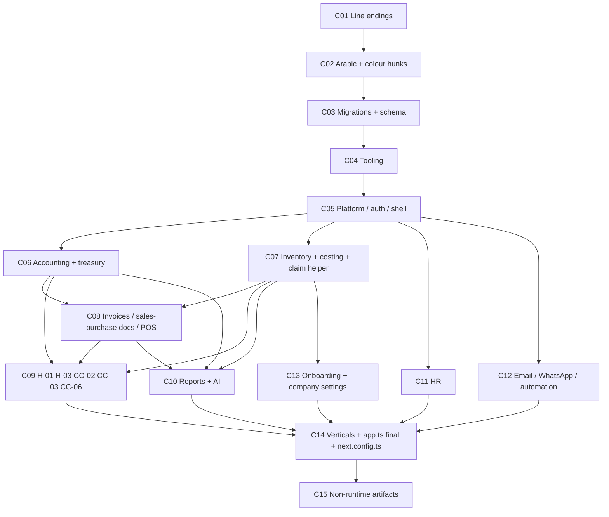

# Production Recovery Manifest — 2026-09-27

Status: **PLAN ONLY.** No branch, worktree, commit, migration, deploy or data change has been made.
Companion to `PRODUCTION_PROVENANCE_2026-09-27.md` (evidence) and `HEAD_BASELINE_GAP_AUDIT.md` (HEAD build state).

Goal: a Git branch that starts at HEAD `45fd5be` and ends byte-identical (with a small, listed allow-list) to the source that Railway is running today, split into reviewable commits. The branch must contain **production recovery only**. Every new remediation happens after it, on top of it.

---

## 1. Recovery inputs

| Input | Identity | Role |
|---|---|---|
| Git HEAD | `45fd5beec3b5979454b8cf325532fe9f157ff824` (`main`, 4 ahead of `origin/main` `3e6313b`) | Branch base |
| Production backend source | Railway deployment `a51bbc32`, 1,601 files, `/Users/hazem/Desktop/gates-provenance/production-backend-a51bbc32/source/gates-backend` | **Authoritative** for `gates-backend/**` inside the image |
| Production web source | Railway deployment `565d6cab`, 1,605 files, `.../production-web-565d6cab/source/gates-web` | **Authoritative** for `gates-web/**` inside the image |
| Production workers source | Railway deployment `bbbfa37d`, 1,567 files | Reference only (§8). Not a recovery target |
| Frozen snapshot | `/Users/hazem/Desktop/gates-provenance/snapshot-2026-09-27T171600+0300/` | Authoritative for files the Docker image **excludes** (backend root `*.md`, `.gitignore`, web `e2e/**`) and for repo-root artifacts (`.cursor/**`, `docs/**`) |
| Production DB metadata | `_prisma_migrations` rows, tables, columns, indexes, FKs (read-only capture, provenance run) | Schema gate reference |
| Production logs | Deployments `5de14a0f`, `ad9ebb83`, `a51bbc32` | Incident evidence (§9) |

The live dirty working tree is **not** an input. It was used only to cross-check; every byte in the recovery comes from the archives, the frozen snapshot or HEAD.

Image-exclusion rule (from `.dockerignore`, verified): `*.md` applies at the upload root only, so backend root `*.md` files and `.gitignore` are absent from the backend archive; web `e2e/**` is absent from the web archive. These files are **unchanged from HEAD** in the snapshot and stay as HEAD. They are not deletions.

Correction to `PRODUCTION_PROVENANCE_2026-09-27.md` §7 (recorded here; the provenance doc is not edited): `scripts/railway-start.mjs` does **not** auto-resolve any failed migration. On a failed `prisma migrate deploy` it runs `prisma migrate resolve --rolled-back 20260924170000_whatsapp_embedded_signup` (that one migration, hard-coded) and retries once. With `GATES_RUN_WORKERS=1` it skips migrate and seed entirely. The backend and workers copies are identical.

---

## 2. HEAD → production source delta

### 2.1 Counts

| | Backend | Web |
|---|---|---|
| Delta entries (git-tracked view) | 476 (390 M, 76 A, 10 D) | 521 (449 M, 59 A, 13 D) |
| Deletions that are only `.dockerignore` artifacts (keep HEAD) | 9 (root `*.md`, `.gitignore`) | 2 (`e2e/*.spec.ts`) |
| **Image-relevant entries** | **467** | **519** |
| EOL-only (CRLF→LF, no content change) | 2 | 1 |
| Generated, non-source (`docs/database-explorer.*`, `DATABASE-FULL-CATALOG.generated.md` / `next-env.d.ts`) | 4 | 1 |
| **Meaningful changed files** | **461** | **517** |

**Total meaningful: 978 files.**

Other facts about the delta:

- **CRLF→LF flips:** 107 backend and 148 web files are CRLF in HEAD and LF in production. There are no LF→CRLF flips. The repo has no `.gitattributes` and `core.autocrlf` is unset, so Git stores the bytes as-is.
- **True deletions:**
  - Backend: 1, `src/modules/inventory/services/pricing-engine.ts`. It has no importers in production.
  - Web: 11. These are `app/accounting/operations/securities/reciept/page.tsx`, the 8 legacy `app/components/*` modals and sidebars (the securities modals, `SalesSidebar`, `UserPermissionsBar`), `BankVoucherDraftPage.tsx` and `OpenInvoiceAllocationGrid.tsx`.
- **Mode-only change:** `gates-backend/scripts/deploy-migrations.sh` changes mode only.

### 2.2 Classification of modified files

| Class | Backend | Web | Meaning |
|---|---|---|---|
| EOL-only | 2 | 1 | Identical except CRLF→LF |
| Arabic-message-only (l10n) | 189 | 19 | After stripping string literals and JSX text the code is identical; changed literals contain Arabic |
| Brand-colour-only | 0 | 142 | Only `0E79AA` → `0E78AA` (66 more web files carry colour hunks among logic hunks) |
| Other-literal-only | 4 | 16 | Non-Arabic literal changes; treated as logic (not swept) |
| Logic | 195 | 271 | Code changed |

The colour sweep is **not** global. Production still contains `0E79AA` in `lib/navigation/app-modules.ts` and `app/components/Navbar.tsx`. The recovery reproduces production exactly and does not "finish" the sweep.

### 2.3 Business categories (file → commit mapping, §6)

Files are assigned by path rules. The machine assignment covered all 986 image-relevant entries with 0 unassigned. Per-commit final-owner counts:

| Commit | Category | Backend files | Web files |
|---|---|---|---|
| C01 | Line endings | 2 (+106 partially) | 1 (+147 partially) |
| C02 | Mechanical Arabic-message + colour hunks | 188 (+56 partially) | 154 (+85 partially) |
| C03 | DB contract (migrations + schema) | 9 | 0 |
| C04 | Build / deploy tooling | 6 | 9 |
| C05 | Platform, auth, shell | 17 | 58 |
| C06 | Accounting + treasury | 40 | 38 |
| C07 | Inventory + costing | 38 | 20 |
| C08 | Invoices, sales / purchase documents, POS | 23 | 18 |
| C09 | Wave-1 correctness fixes (as deployed) | 16 | 0 |
| C10 | Reports + AI | 33 | 103 |
| C11 | HR | 19 | 48 |
| C12 | Communication + automation | 40 | 25 |
| C13 | Onboarding + company settings | 6 | 6 |
| C14 | Vertical modules, `app.ts` final, `next.config.ts` | 24 | 38 |
| C15 | Non-runtime artifacts | 6 (+ repo-root extras) | 0 (+ `e2e/golden-flows.spec.ts`) |
| — | `next-env.d.ts` (generated, gitignored) | — | allowed difference |

"Partially" means the file also receives later hunks in its domain commit.

### 2.4 Traced dependencies (production import graph)

| New or changed module | Required by |
|---|---|
| `inventory/utils/claim-document-post.ts` (new) | transfer, adjustment, other-adjustment (**H-01**) **and** assembly, disassembly, issue, receipt, stocktaking (not H-01; same helper) |
| `invoices/services/invoice-line-source.service.ts` (new) + migration `…143000` | `invoice-m5.service`, `common/services/document-converter.service`, `inventory/services/price-quote.service`, `inventory/services/purchase-order.service` |
| `invoices/services/sales-document-enrichment.service.ts` (new) | `invoice-m5.service` (`applyItemOffersToSalesLines`, `contractDueDays`, `contractPaymentSplits`) |
| `invoices/services/analytical-invoice-movement.ts` (new) | `invoice-source.service` |
| `inventory-costing.service` API (`postedUnitCost`, `reverseInboundInTx`, `syncUnlocatedQuantityFromLedger`) | `invoice-posting-orchestrator` (purchase return, unpost), `other-adjustment.service` |
| `inventory/services/inventory-integrity.ts` (new) | `inventory-costing.service`, `onboarding/data-import.service`, demo seed |
| 9 new inventory report modules (`debt-age-report`, `expiry-date-report`, `invoice-number-range`, `item-movement-report`, `monthly-item-sales`, `overdue-payments-report`, `party-item-account`, `stock-valuation-profit`, `commission-engine`) | `inventory/services/reports.service` |
| `accounting/utils/daily-journal-filters.ts` (new) | `accounting/services/reports.service` |
| `shared/pagination.ts` (new) | `hr/department.service`, `inventory/stocktaking.service` |
| `company/services/company-email.service` | automation `action-validator`, `metadata.service`, email handler, `company-email.routes` |
| `whatsapp/whatsapp-connection.service` | automation `action-validator`, `metadata.service`, WhatsApp action handler, `company-whatsapp.routes` |
| `shared/config/env.ts` META vars | WhatsApp embedded signup + Meta webhook |
| `shared/database/prisma.ts` computed `item.code = serial` | Every item read |
| `src/app.ts` | Mounts HR (procedure catalog, HR lookups, attendance, entitlement disbursements), company email, company WhatsApp, `/webhooks/meta/whatsapp` (with `express.json` `verify` capturing `rawBody`), real-estate settings |
| `schema.prisma` + 8 migrations | Every Prisma model use above (C03 must precede C05+) |
| Arabic error strings | Thrown in services and **compared by string** in routes (`'العميل غير موجود'`, `'المورد غير موجود'`, `'الجرد غير موجود'`, `includes('غير موجود')`). Throwers and catchers must change in the same commit (C02). Web `lib/api/localize-api-error-message.ts` maps the remaining English backend messages |

### 2.5 Schema delta (`schema.prisma`, +151/−24)

- **New models:** `HrLookup`, `HrAttendanceRecord`, `InvoiceLineSource`, `CompanyEmailConfig`, `WhatsappOutboundMessage`.
- **`CompanyWhatsappConfig`:**
  - Adds `accessTokenEncrypted`, `displayPhoneNumber`, `connectionStatus`, `connectedAt`, `disconnectedAt`.
  - `phoneNumberId` becomes optional.
  - `accessToken` gets `@default("")`.
  - Adds `@@index([wabaId])`.
- **`ItemQuantity.quantity`:** becomes `Decimal(18,4)`.
- **`CompanySettings.logoUrl`:** becomes `@db.LongText`.
- **`SecuritiesReceipt`:** adds `endorseeSupplierId` with relation `ReceiptEndorseeSupplier`.
- **`ClothingCombo`:** adds `itemId`. The unique key changes from `[companyId, colorId, sizeId]` to `[companyId, itemId, colorId, sizeId]`. HEAD code never uses the old compound key name, so this causes no compile break.
- **`WagePolicy`:** adds `rules`.
- **`Allowance` / `Deduction`:** add `defaultAmount`.

---

## 3. Production-only migrations (8)

All 8 have one successful row with `applied_steps_count = 1`, so Prisma executed them. For each, the production checksum = the archive file SHA-256 = the snapshot file SHA-256.

| # | Migration | Prod checksum = archive checksum | Applied (UTC) |
|---|---|---|---|
| 1 | `20260923120000_hr_lookups` | `323f90bba1173d6e94ec049732dca9a7a809ad1dbc7cc6ba30255189c3eb2058` | 2026-09-24 10:14:29 |
| 2 | `20260924140000_item_quantity_decimal_18_4` | `d531900c9249990a68fe5d50f58c072af8e2dba53e756dd7f2378ee03058fb8a` | 2026-09-24 12:49:33 |
| 3 | `20260924143000_invoice_line_source_and_combo_item` | `5444b687feaafd2212a21b9a3ee1c7e0cc01ea760da676d05538e722e1e8fa77` | 2026-09-24 12:49:34 |
| 4 | `20260924150000_clothing_combo_per_item` | `f9fbfac9a2054f7531e80962905d00f319708dcf7eb18d664f340744c3cdefcc` | 2026-09-24 12:49:34 |
| 5 | `20260924160000_company_email_config` | `ca3a43743db486b4afbb880da749751d98154966b227a74afdb4e15c52a562e0` | 2026-09-24 13:23:18 |
| 6 | `20260924170000_whatsapp_embedded_signup` | `d570ce7887b305558a843932fa7f7c5c44338c33347c580586a37076e45d153e` | 2026-09-24 13:43:27 (13 rows: 12 rolled back, 1 applied) |
| 7 | `20260924180000_securities_receipt_endorsee` | `4fe6b4cf2950d99ecdcdeaa067721fbaa73650008e17b51917e88febc9810d57` | 2026-09-24 16:18:28 |
| 8 | `20260927150000_company_settings_logo_longtext` | `eb5068652f0515e013a9e169b45a4077f7b0833a99db51179a216ddfe01690ce` | 2026-09-27 12:01:31 |

| # | Purpose | Tables / columns / indexes / FKs | Dependent source | Clean-DB reproducible? | Assumes a manually changed schema? |
|---|---|---|---|---|---|
| 1 | HR lookups and attendance | Creates `hr_lookups` and `hr_attendance_records` (FK `companyId`→`companies`, cascade); `wage_policies.rules` JSON; `allowances.defaultAmount` and `deductions.defaultAmount` DECIMAL(15,2) | `hr/*` lookup, attendance, wage-policy services; C11 | Yes, on top of an existing schema. **File is CRLF: commit byte-exact** | No |
| 2 | Fractional stock quantity | `item_quantities.quantity` → DECIMAL(18,4) | `inventory-costing`, `inventory-integrity`, `adjust-stock-in-tx` | Yes | No |
| 3 | Invoice line provenance; per-item clothing combos | Creates `invoice_line_sources` (FK `invoiceLineId` cascade, indexes); adds `clothing_combos.itemId` with index and FK→`items` cascade | `invoice-line-source.service` and its 4 callers; clothing-combo service | Yes | No |
| 4 | Combo uniqueness per item | Drops unique `clothing_combos_companyId_colorId_sizeId_key`; adds unique `(companyId, itemId, colorId, sizeId)` | Clothing-combo service | Yes, if no duplicate `(companyId, itemId, colorId, sizeId)` rows exist | No |
| 5 | Per-company SMTP | Creates `company_email_configs` (unique `companyId`, FK cascade) | `company-email.service`, automation email handler | Yes | No |
| 6 | WhatsApp embedded signup | Idempotent `PREPARE`-based column adds on `company_whatsapp_configs`: `accessTokenEncrypted`, `displayPhoneNumber`, `connectionStatus`, `connectedAt`, `disconnectedAt`, `wabaId` index; `phoneNumberId` nullable; `webhookVerifyToken` default `'managed-by-platform'`; `isActive` default false; `CREATE TABLE IF NOT EXISTS whatsapp_outbound_messages` **with no FKs** (collation mismatch) | `whatsapp-connection.service`, Meta webhook, automation WhatsApp handler | **No, not identical.** A clean DB gets `whatsapp_outbound_messages` without FKs. Production has an FK `companyId`→`companies` left by an earlier failed attempt. The FK `configId`→`company_whatsapp_configs` that `schema.prisma` declares is missing in production **and** would be missing on a clean DB | **Yes.** The final file was rewritten to tolerate a partially applied earlier attempt (the 12 rolled-back rows). Production's table shape comes from an earlier, unarchived version of this file |
| 7 | Endorsed securities receipts | `securities_receipts.endorseeSupplierId` with index and FK→`suppliers` SET NULL | `securities-receipt.service` / schema / routes | Yes | No |
| 8 | Large logos | `company_settings.logoUrl` → LONGTEXT | Onboarding logo upload, company settings | Yes | No |

---

## 4. Migration-history integrity

### 4.1 Edited historical migrations (8)

HEAD, the snapshot and the production archive hold the **same** bytes for these 8 files. Those bytes differ from the checksum production recorded when the migration ran. All 8 originals were reconstructed byte-exact: each reconstruction's SHA-256 equals the production checksum. The reconstructions are held in `/tmp/rec-mig-orig-<name>.sql` (volatile; recreate them with the recipe below).

| Migration | Prod checksum (original) | Archive / HEAD checksum (current) | Steps | Semantic difference | Which version prod's schema reflects |
|---|---|---|---|---|---|
| `0004_audit_triggers` | `52c74f3fda7a92d884598281eeb1c4881d2850e8fbde5cb10b78104744ad402a` | `9fa864b46667286f3aac112cfc1777e6e63fa6f4fe81495ef22d660c66a52574` | 1 | **Comments only.** Changed by the C12 fix Item 38 (a `StrReplace` in chat 91196a88). The `DROP PROCEDURE/FUNCTION IF EXISTS` and `SELECT` SQL are unchanged | Both (identical effect) |
| `20250816153000_wave0_m3_m4_party_inventory` | `53f6f388835382fb8c41a6e239aecb93797fcc8b10a5df172fbe2973aa07a5ab` | `880f9e88dd812937b2d1e519f48281aade22dd6c748e43d5b9b4771c3670ad13` | 1 | **Statement reorder.** `CREATE TABLE customer_categories` moved before the `ALTER`s on customers, suppliers and warehouses; a dialect comment was added. The end-state schema is identical | Both (same end state) |
| `20260820140000_phase1_ledger_foundations` | `6de4cadfa32b958147a77e1ef0838899991c31f58c3c83a27ecdcca18e6c9762` | `0de78dcdb5b0497bd285aacf7e9a6c54c0cb57292153ef2be2a804f400a273b8` | **0** | **CRLF→LF only** | Neither was executed by Prisma (resolved-applied); the schema was applied out of band |
| `20260820141500_phase1_reversal_of_journal_entry` | `304d3b9483260511ba3ff20cbe44dd7e2bb9903518346701f630ec3dc8a7f039` | `bfc872fc6833bc456d7ae46124652171a03d7cf192f36151292cd561d478d7fc` | **0** | CRLF→LF only | Same as above |
| `20260821010000_phase2_landed_cost_allocation` | `41587478f9c59e2a7d2dba6c0a97bfbf0c67d05b713c664084cf8b21192a2893` | `9cbf55ab58a86c1fb5a152080fc152141115ea0f848d6ace73f362ca29cc9c69` | **0** | CRLF→LF only | Same as above |
| `20260824120000_add_item_category_and_invoice_enterprise_fields` | `c75913b0424cd811c332fcee9bff989f0d6525cd783c294ea494e1842714ad0a` | `c4df4924cc9ccebec4ee6a195423acd1afd95ebb4d11276d75e3ecc06bbd5202` | **0** | CRLF→LF only | Same as above |
| `20260824121500_invoice_line_traceability_fields` | `fa46ed64f6f91ce48b241287fe826d5c6b8e3999a5ea04cdd94468e52e38160e` | `55f274ba30ee0cd5385da863a25261ab49abc8a80f371f43c7123b1617599d89` | **0** | CRLF→LF only | Same as above |
| `20260917200000_securities_entity` | `747efa87371b41b2f866fdf0048c7bd4239a1bcfe266d0d78a6bcfa084a35636` | `287bc248e4a52673eb7856dce798e406603c6416c4ad4fbca6932bee280e5dc7` | 1 | `INSERT INTO securities_entities` → `INSERT IGNORE INTO`. The end state is the same unless duplicates exist (then the original fails and the edit skips them) | Original (it ran on 2026-09-17; a seeded end state either way) |

How each original was reconstructed:

- **The five EOL-only files:** the HEAD file converted to CRLF.
- **`0004_audit_triggers`:** reverse the recorded `StrReplace` (transcript line 5337), in LF form with a trailing newline.
- **`wave0_m3_m4`:** the chat 4b126733 transcript line 1169 `Write`, in CRLF form with a trailing newline.
- **`securities_entity`:** the chat cd4abe67 line 325 `Write`, in CRLF form with a trailing newline. The later edit is at line 373.

Git history starts 2026-09-13 (`4bd6cf9`), after all of these were applied. Git therefore never held the originals.

**Recovery decision:** the recovery branch keeps these files **exactly as production holds them** (the current bytes). Running `prisma migrate deploy` against production from the recovered tree then behaves exactly as it does today: Prisma does not re-verify applied checksums on `deploy`. `migrate dev` and `migrate status` against a copy of production would report "modified after applied".

### 4.2 Further history facts that block an empty-database replay

- **Resolved-applied migrations:** 34 have `applied_steps_count = 0`, meaning they were marked applied with `migrate resolve --applied` and never executed by Prisma. They include:
  - `20251119005824_create_all_tables` (118 KB, after 5 rollbacks).
  - `20251122234024_add_composite_indexes` (after 5 rollbacks).
  - `20251122235650_add_api_keys_and_system_settings`.
  - Most `202608xx` phase migrations (20260820–20260901).
  - `gates_ai_phase1–5` and `20260916180000_account_kind`.
  - **The production schema was not built by the migration chain.**
- **Tiny early migrations:** `0001`–`0033` were all applied in about 26 ms on 2025-11-19 with `steps = 1`. They are tiny, mostly no-op files.
- **Lexical-order inversion:** 26 migrations named `20250816…`–`20250818…` were created and applied in August 2026, but sort before the `20251119…` baseline. Example: `20250816120000_wave0_m0_m1_platform_gl` alters `api_keys`, which is created later by `20251122235650` (`CREATE TABLE IF NOT EXISTS`).
- **Shared timestamp:** `20260917200000_securities_journal_source_kind` and `20260917200000_securities_entity` have the same timestamp.
- **MySQL 9.3:** it rejects a TEXT default (board T-04).
- **Conclusion:** the schema is not reproducible from an empty database. This holds at HEAD and on the recovered branch alike.

### 4.3 Missing tables (2)

| Table | Model | Expected migration | Code usage | Failure possible now? |
|---|---|---|---|---|
| `financial_adjustment_notes` | `FinancialAdjustmentNote` (in `schema.prisma` since the initial commit) | None exists. No migration ever created it | None. It appears only in `tenant-scoped-models.generated.ts` and the docs scripts | **No (latent).** Any future `prisma.financialAdjustmentNote.*` call would fail at runtime with a missing-table error. `relationMode` is the default (`foreignKeys`), so nothing cascades through these tables |
| `financial_adjustment_line_items` | `FinancialAdjustmentLineItem` | None | None | No (latent) |

The recovery keeps the schema exactly as in production, including these models.

### 4.4 Future repair strategy (designed, NOT executed; follows recovery, needs explicit approval)

No silent rewriting: every step is reviewed, and each production DB step is dry-run first on a restored copy.

1. **Freeze bytes in Git:** add a `.gitattributes` rule `prisma/migrations/**/*.sql -text` so line endings can never change again.
2. **Checksum reconciliation:** choose one option per migration and write the choice down.
   - **(a) Restore the original bytes** into the repo. Checksums then match production, and a fresh DB gets the original SQL. This is preferred for the five EOL-only files and `0004`.
   - **(b) Keep the edited bytes** and update `_prisma_migrations.checksum` in production to match, through a reviewed, logged SQL statement with a before/after dump. This fits `wave0_m3_m4` and `securities_entity` if the edited form is judged the better SQL.
   - **Never both.** Never edit a file without a matching DB record.
3. **Empty-DB replay:** create a squashed baseline for new environments, taken from `prisma migrate diff --from-empty --to-schema-datamodel` and checked against the production `information_schema`. Mark it applied in production with `migrate resolve --applied`, as a documented one-off. Alternatively, rename the misdated migrations. That is harder, because production rows are keyed by name.
4. **WhatsApp FK drift:** decide whether production keeps `whatsapp_outbound_messages.companyId` FK (and add it to a migration for clean DBs) or drops it. Separately decide on the declared-but-absent `configId` FK, either removing it from `schema.prisma` or adding it after fixing the collation.
5. **Missing tables:** either add a migration that creates them or remove the models. Decide based on the product roadmap.
6. **Remove the hard-coded WhatsApp rollback** in `railway-start.mjs` (H-04 family) once step 2 is complete.

---

## 5. Dependency graph



The branch is linear C01→C15. The graph shows the real prerequisites.

**Changes that cannot be committed independently:**

1. **Every C03 model user.** `schema.prisma` and the 8 migrations must precede any code that uses the new models or fields: HR lookups, `InvoiceLineSource`, `CompanyEmailConfig`, WhatsApp fields, `endorseeSupplierId`, `ClothingCombo.itemId`.
2. **The claim helper.** `claim-document-post.ts` and the 5 non-H-01 stock services that use it (assembly, disassembly, issue, receipt, stocktaking) belong together in C07. H-01 (C09) depends on the helper already being present.
3. **Invoice line source.** `invoice-line-source.service` must land with, or before, all 4 of its callers (C08): `invoice-m5` non-fix hunks, `document-converter`, `price-quote`, `purchase-order`.
4. **The costing API before its users.** `inventory-costing.service` (`reverseInboundInTx`, `postedUnitCost`) and `inventory-integrity` (C07) must precede their users: the orchestrator (C08/C09) and other-adjustment (C07/C09), and later `data-import` (C13) and the demo seed (C14).
5. **Arabic message strings.** A thrower and its string-comparing catcher must change in the same commit (C02). Otherwise a 404 silently becomes a 500 between commits.
6. **Email and WhatsApp services with automation.** `company-email.service` and `whatsapp-connection.service` must land with the automation validator and metadata changes (C12).
7. **The `app.ts` mounts.** Each mount lands with its router: HR in C11, communication and the `rawBody` hook in C12, real-estate settings in C14. `app.ts` is final after C14.
8. **Report services.** Each report service lands with its sub-modules: the 9 inventory report modules and `daily-journal-filters` go with the two `reports.service` files (C10).
9. **The five fixes (C09).**
   - Each fix hunk must land after the non-fix hunks of its host file.
   - Host files: `invoice-posting-orchestrator.ts`, `invoice-m5.service.ts`, `cash-transaction.service.ts`, `transfer`, `adjustment`, `other-adjustment`.
   - The fixes were written and tested on top of those non-fix hunks, so C09 applies them in that context.
   - **CC-02 and CC-06 share the orchestrator**, so they cannot be separated into different files. Within C09 they are separate hunks.

**Biggest knot: invoice posting.**

- One file, `invoice-posting-orchestrator.ts`, carries:
  - CC-02 and CC-06.
  - The costing API (`reverseInboundInTx` for purchase return and unpost).
  - `SALES_ORDER` rights and `isSalesTaxInvoice` tax logic.
  - Posted-invoice domain events.
- Its sibling `invoice-m5.service.ts` carries CC-06 plus line sources (which need a migration), enrichment, the `unitId` guard and the `branchId` widening.

---

## 6. Recovery commits (15)

Common rules for all commits:

- **Build location:** build in a fresh `git worktree` from `45fd5be` on branch `recovery/prod-2026-09-27`. Never build in the live tree.
- **"Source" for each file:** the production archive, the snapshot, or HEAD, as set in §1. A file that a commit finalizes must equal its source bytes exactly (`sha256`) at that commit.
- **Hunk splitting:** use `git apply --include` or split hunks by hand from `diff HEAD-bytes production-bytes`. No hand-written code. If a hunk cannot be split cleanly, it moves to the later commit, and the move is recorded in the commit message.
- **Typecheck:**
  - HEAD backend has **46 errors** (RC-1…RC-6, `HEAD_BASELINE_GAP_AUDIT.md`).
  - Production backend has **10 errors**, all in `src/modules/accounting/services/reports.service.ts` (RC-D1).
  - Intermediate commits are measured and recorded. They only need to show no errors *outside* the files they touch compared with the previous commit.
  - The final state must show exactly the production 10.
- **Production-hash impact:** the number of files whose bytes equal production after the commit, reported as "finalized".

| # | Purpose | Exact files (rule; counts are finalized files) | Source | Prerequisites | Runtime behaviour changed | Schema dependency | Tests | Typecheck impact | Prod-hash impact |
|---|---|---|---|---|---|---|---|---|---|
| **C01** | Line endings | Every file that is CRLF in HEAD and LF in production: 107 backend and 148 web files. The content is **HEAD's** content converted CRLF→LF. Finalizes the 3 EOL-only files: backend `scripts/deploy-migrations.sh` (also the mode change) and `src/modules/invoices/routes/invoice.routes.ts`; web `components/inventory/sales-invoice/SalesInvoiceFormHeader.tsx` | HEAD + production EOL | — | None | None | None | None (46) | 3 finalized; 252 more become `--ignore-cr-at-eol` clean against intermediate targets |
| **C02** | Mechanical text sweep | Hunks where the literal-stripped code is identical and either (a) the changed literals contain Arabic, or (b) the change is exactly `0E79AA`→`0E78AA`. Touches 244 backend and 239 web files; finalizes 188 backend and 154 web. Throwers and string-comparing catchers are included together | Production | C01 | User-visible messages and brand colour only. Error-matching routes keep working because both sides change together | None | Existing unit tests that assert on messages (update nothing; they come with production versions later) | None expected | +342 finalized |
| **C03** | DB contract | The 8 migration directories (byte-exact; `hr_lookups` stays CRLF) + `prisma/schema.prisma` | Production | C02 | None at runtime until code uses it. `prisma generate` output changes | **Is** the schema dependency | `prisma validate`; no migrate | Adds nothing; HEAD code does not use the removed compound key | +9 |
| **C04** | Build / deploy tooling | **Backend:** `package.json`, `package-lock.json`, `scripts/railway-start.mjs`, `scripts/audit-async-routes.mjs`, `scripts/audit-prisma-selects.mjs`, `.github/workflows/test.yml`. **Web:** `package.json`, `package-lock.json`, `tsconfig.json`, `eslint.config.mjs`, `vitest.config.ts`, `tailwind.config.js`, `types/css-side-effect.d.ts`, `scripts/rewrite-generic-report-previews.mjs`, `.github/workflows/playwright.yml`. **Excludes `next.config.ts`** | Production | C03 | Dependency pins: `axios` 1.20.0, `express` 4.22.3, `helmet` 7.2.0, override `protobufjs` 7.5.4 (backend); `next` ^15.5.26, SheetJS `xlsx` 0.20.3 tgz, `vitest`, override `sharp` 0.34.5 (web). WhatsApp-only migrate retry on boot | None | `npm ci` in both apps | Web `tsconfig` excludes tests | +15 |
| **C05** | Platform, auth, app shell | **Backend:** `src/shared/**` (`env.ts` META vars, `prisma.ts` `item.code` extension, `pagination.ts`, CSRF, tenant-fiscal middleware, integrity job, auth types), `src/workers/index.ts`, `platform/**` (RC-1 `document-sequence` widening + `?? null`), `users/**`, `auth/**` (password reset via `shared/services/email.service`), `share/**`, `common/**` except `document-converter`, `database-tools`, `translation`, `transaction-settings`, `document-layout` (body cast), `document-profiles`, `operations*`, `import-export`, `archive`, `analytics`. **Web:** `lib/{api,auth,documents,drafts,export,hooks/useApi,i18n,marketing,money,navigation,notifications,print,query,theme,transaction-settings,user,validation}`, `middleware.ts` (route-visibility → `/unavailable`; `/reset-password` public), `app/{layout,ErpApp,global.css}`, shell components (`Navbar`, `Sidebar`, `AppTabs`, `WorkspaceSidebarHub`, module sidebars, `ui`, `form`), login / logout / forgot / reset / unavailable pages, deletion of `SalesSidebar` and `UserPermissionsBar`, `styles/print-report.css` | Production | C03, C04 | Password reset flow; `/unavailable` gating; `item.code` computed from `serial`; decimal parsing | C03 | `lib/drafts/draft-key.test.ts`, `lib/money/parseDecimal.test.ts` (vitest) | Clears RC-1 (`document-sequence`) | +75 |
| **C06** | Accounting + treasury (non-fix) | **Backend:** `accounting/**` except report files (19 services, 5 schemas, 4 routes, 2 utils, recurring controller); treasury non-H-03 hunks (`treasury/types`, 2 services: RC-2b widening, FX `needed`, `options?.sortDir`); securities endorsee. **Web:** `app/accounting/**` (non-report), `app/accounting-settings/**` (except email and WhatsApp), `components/accounting/**`, `lib/accounting/journal-source.ts`, deletion of the securities modals (`Collect`, `DistributionAccount`, `DistributionAmounts`, `Endorse`, `PaymentsDistribution`, `ReceiptPapersTable`, `RenewGuarantee`, `ReturnPayment`), the `reciept` page, `BankVoucherDraftPage`, `OpenInvoiceAllocationGrid` | Production (non-fix hunks) | C05 | Accounting behaviour as deployed: journal FX hydration, securities endorsee, party / credit changes, period / reconciliation changes | C03 (`endorseeSupplierId`) | `accounting-round2.spec`, `-journal`, `-paper-cancel`, `commercial-paper-unpost`, `journal-source`, `auto-gl-posting` | Clears RC-2b, RC-5 (`sortDir`) | +78 (treasury fix hosts finalize in C09) |
| **C07** | Inventory + costing (non-fix) | **Backend:** `inventory/services/**` except report modules, sales-document services and the H-01 hosts' claim hunks (23 finalized): `inventory-costing` (`FOR UPDATE` lock, `reverseInboundInTx`, `postedUnitCost`, `syncUnlocatedQuantityFromLedger`, `branchId ?? ''` pass-through), `inventory-integrity` (new), `adjust-stock-in-tx`, `stock-movement` (policy + RC-2a `branchId?: string \| null`), `receipt` / `issue` / `stocktaking` / `assembly` / `disassembly` (**complete, including their claim use**), clothing combo per item, deletion of `pricing-engine.ts`; `inventory/utils/claim-document-post.ts` (**new; shared helper**); 7 inventory routes, 2 schemas; **non-claim** hunks of `transfer` (`resolvePostingBranch`, `postingContext`, `assertSameBranchOrAllowed`), `adjustment` (`updateAdjustment` / `deleteAdjustment`, `bookQty == null`), `other-adjustment` (switch to costing service, `postedUnitCost` / `reverseInboundInTx` unpost); `scripts/inventory-integrity-report.ts`, `scripts/scan-item-duplicates.ts`. **Web:** `app/inventory/**` (non-sales / purchase / report), `components/inventory/{assembly,opening-stock}`, `lib/inventory/findItemByBarcode.ts` | Production | C05, C03 | Stock posting as deployed: row lock on `item_quantities`, decimal quantities, integrity sync, per-item combos, transfer branch resolution (**the deployed fix for the §9 incident**) | C03 (#2, #3, #4) | `inventory-integrity.spec`, `post-movement-sync.spec`, `inventory-costing.service.spec` | Clears RC-2a | +58 |
| **C08** | Invoices, sales / purchase documents, POS (non-fix) | **Backend:** `invoice-line-source.service`, `sales-document-enrichment.service`, `analytical-invoice-movement` (new); `invoice-source`, `-settlement`, `-settlement-split` (`paymentSplits?` + `?? []`), `-installment`, `-advance-link`, `-account-resolver`, `-document-type`, `invoice-posting.types`, `invoice-m5.schema`, `invoice-source.schema`; `common/services/document-converter.service`; `inventory/{services,routes}/{price-quote,purchase-order}`, `inventory/schemas/{invoice,purchase-order}.schema`; `pos/routes/pos.routes`, `pos/services/pos.service`; **non-fix hunks** of `invoice-posting-orchestrator` (`SALES_ORDER` rights, `isSalesTaxInvoice !== false`, `PURCHASE_RETURN` via `reverseInboundInTx`, unpost via `reverseInboundInTx` / `applyInboundMovement`, `emitPostedInvoiceEvent`) and `invoice-m5.service` (`recordInvoiceLineSource`, offers, contract due days and payment splits, `SALES_ORDER`, the `unitId` 422 guard, `branchId` widening). **Web:** sales invoice, final purchase invoice, purchase order, sales returns, purchase returns and customer-contract pages; `app/pos/**`; `components/inventory/{ProgressiveSalesInvoiceLineGrid,price-quote,purchase-invoice,sales-order,purchase/LandedCostPanel}`; `lib/invoices/**`; `lib/hooks/usePosSession.ts`; `InventoryInvoicesListSection` | Production | C06, C07, C03 (#3) | Invoice line provenance, sales enrichment, sales orders, purchase-return costing, posted-invoice events, POS changes | C03 (#3) | `analytical-invoice-movement.spec` | Clears RC-3, RC-4, RC-6 (the `invoice-m5` / settlement-split / client-invoice widenings) | +41 (orchestrator, m5, pos-order-posting finalize in C09) |
| **C09** | **Wave-1 correctness fixes, as deployed** | **H-01:** claim hunks in `inventory/services/{transfer,adjustment,other-adjustment}.service.ts` (claim inside the transaction; trailing `isPosted` updates removed) + `integration/inventory-document-post-concurrency.test.ts`. **H-03:** `treasury/services/cash-transaction.service.ts` (`updateInTx` extraction; `update()` delegates), `treasury/services/treasury-posting.service.ts` (`updatePostedCashTransaction` = `updateInTx({ allowPosted: true })` + `rewritePostedCashJournalInTx` in one transaction), `treasury/routes/cash-transaction.routes.ts` + `integration/posted-cash-voucher-edit-atomicity.test.ts` + `unit/accounting-round2-rewrite.spec.ts`. **CC-02:** `invoice-posting-orchestrator.ts` `claimUnpost` (`updateMany … isPosted: true` → false; 400 when count is 0) + `integration/invoice-unpost-concurrency.test.ts`. **CC-03:** `pos/services/pos-order-posting.service.ts` `claimUnpost` (`POSTED`→`DRAFT`) + `integration/pos-order-unpost-concurrency.test.ts`. **CC-06:** orchestrator `version` in the post claim + `throwStaleWrite`; `invoice-m5.service.ts` draft-update guard, `claimCancel`, guarded `deleteMany`; legacy `inventory/services/invoice.service.ts` same guards + `integration/invoice-draft-mutation-vs-post.test.ts` | Production (fix hunks only) | C06, C07 (helper), C08 | Double post / unpost, cancel and delete races become fail-closed (409 / 400 / 422); posted cash voucher edit becomes atomic | None | The 5 integration tests (on `gates_h01_test` only) + `accounting-round2-rewrite.spec` | None expected | +16. **After C09 every fix host equals production bytes** |
| **C10** | Reports + AI | **Backend:** `accounting/services/{reports.service,financial-report.service,financial-report.util}`, `accounting/routes/{reports,financial-reports}.routes`, `accounting/utils/daily-journal-filters` (new), `inventory/services/reports.service` + `routes/reports.routes` + the 9 new report modules, `invoices/routes/analytical-invoice-report.routes`, `ai/**`; 11 report unit specs. **Web:** `components/report/**`, `lib/{reportEngine,reportPreview,reports}/**`, `app/accounting/account-reports/**`, `app/*/reports/**` | Production | C06, C07, C08 | Report output as deployed, **including the RC-D1 defect** (`sr.exchangeRate` not selected, so FX falls back to 1) | None | 11 backend specs + web `reportEngine` / `reportPreview` / `reports` tests | **Introduces the 10 production errors** (all in `accounting/services/reports.service.ts`) | +136 |
| **C11** | HR | `hr/**` (5 routes, 3 schemas, 11 services); web `app/hr/**`, `app/components/hr/**`, `lib/validation/hr.schema.ts` (in C05) | Production | C05, C03 (#1) | HR lookups, attendance, wage-policy rules, allowance / deduction defaults, entitlement disbursements. **Routes are unreachable until the `app.ts` HR mount hunk**, which is applied here | C03 (#1) | — | None | +67 (`app.ts` partial) |
| **C12** | Communication + automation | `company/{routes,services}/company-email*`, `whatsapp/**` (connection service, Meta provider, webhook, phone), `automation/**` (catalog ×9, events, routes, schema, services ×10), `app.ts` communication mounts + `rawBody` `verify` hook, 10 unit specs; web company-settings `email` and `whatsapp` pages, `lib/{whatsapp,automation}/**`, `app/automation/**`, `components/automation/**` | Production | C05, C03 (#5, #6) | Per-company SMTP, WhatsApp embedded signup, Meta webhook, automation email / WhatsApp actions. **No real Meta calls in tests** | C03 (#5, #6) | Automation, communication and WhatsApp specs (mocked) | None | +65 (`app.ts` partial) |
| **C13** | Onboarding + company settings | `onboarding/{routes,schemas,services}` (`company-bootstrap`, `data-import`), `company/services/{company-copy,company-onboarding}`; web `app/onboarding`, `app/settings/{page,company/page}`, `components/onboarding/{LogoFileUpload,OnboardingRouteGuard,VipOnboardingRoot}` | Production | C07 (`inventory-integrity`), C03 (#8) | Large logos, onboarding copy, import integrity sync | C03 (#8) | — | None | +12 |
| **C14** | Vertical modules + final hubs | `real-estate/**` (+ `app.ts` settings mount; **`app.ts` final**), `manufacturing`, `extracts`, `contracting/client-billing`, `growth`, `demo/**`, `tests/modules/subcontracts.spec.ts`; web `app/{real-estate,real-estate-investment,extracts,manufacturing,electronic-invoices,importexport}/**` and matching `components/**`, `lib/real-estate/types.ts`; **`next.config.ts`** (`ignoreBuildErrors` false, `reciept`/`cost-center-balancee` redirects) | Production | All earlier | Vertical-module behaviour as deployed. Web builds with type errors fatal (same as production) | None | `subcontracts.spec`; `next build` | Web: type errors become fatal here; production build `565d6cab` passed with this config | +62. **Backend and web runtime trees now equal production** |
| **C15** | Non-runtime artifacts | `gates-backend/docs/{database-explorer.json,database-explorer.html,database-explorer-index.txt,DATABASE-FULL-CATALOG.generated.md}`, `gates-backend/scripts/{lookup-h-user.ts,wipe-hazem-company-data.ts}` (shipped in the production image), `gates-web/e2e/golden-flows.spec.ts` (from snapshot), repo root `.cursor/rules/*.mdc` (10), `.cursorignore`, `docs/QA-AR.md`, `docs/STATUS.md`, `docs/architecture/*`, `public/index.html` (from snapshot) | Production / snapshot | C14 | None (the ops scripts are not wired to npm scripts) | None | — | None | +6 image files; repo-root extras |

**Hunk-split files** (receive hunks in more than one domain commit, beyond C01 and C02):

| File | Commits |
|---|---|
| `src/app.ts` | C11 → C12 → C14 |
| `invoice-posting-orchestrator.ts`, `invoice-m5.service.ts` | C08 → C09 |
| `transfer.service.ts`, `adjustment.service.ts`, `other-adjustment.service.ts` | C07 → C09 |
| `cash-transaction.service.ts`, `treasury-posting.service.ts` | C06 → C09 |

`inventory/services/invoice.service.ts`, `pos-order-posting.service.ts` and `cash-transaction.routes.ts` are C02 (Arabic messages) plus C09 only.

**Tag after C15:** `prod-2026-09-27-recovered` (annotated, carrying the §11 report hash).

---

## 7. Recovery vs remediation classification

Every difference between HEAD and production is **PRODUCTION RECOVERY**. It is carried into the branch as deployed, including defects. Nothing below the second table enters the branch.

| Difference (kept exactly as production) | Class | Note |
|---|---|---|
| All 978 meaningful file changes, 12 real deletions, 8 new migrations, schema | PRODUCTION RECOVERY | — |
| The five fixes H-01, H-03, CC-02, CC-03, CC-06 | PRODUCTION RECOVERY | Taken from production bytes. Not rewritten |
| Transfer `resolvePostingBranch` | PRODUCTION RECOVERY | Already deployed |
| `document-sequence` `?? null`, the other RC widenings | PRODUCTION RECOVERY | Already deployed |
| `reports.service.ts` 10 type errors + `sr.exchangeRate` FX fallback | PRODUCTION RECOVERY | Defect carried knowingly |
| `railway-start.mjs` WhatsApp-only rollback + retry | PRODUCTION RECOVERY | — |
| Edited historical migration bytes | PRODUCTION RECOVERY | Current bytes kept |
| `wipe-hazem-company-data.ts`, `lookup-h-user.ts` in the image | PRODUCTION RECOVERY | Flagged below |
| Incomplete colour sweep, English messages still compared in company and branch routes | PRODUCTION RECOVERY | — |

These are **NEW REMEDIATION** and are **excluded** from the branch:

- RC-D1 (the `reports.service` type errors and the FX fallback).
- CC-22.
- GL `branchId` redesign / branchless GL semantics.
- Guarding the `?? ''` costing callers (§9).
- H-04: migrate-on-boot removal and the WhatsApp auto-rollback.
- Migration checksum repair and `.gitattributes` (§4.4).
- Empty-DB baseline (T-04).
- WhatsApp FK drift.
- The missing financial-adjustment tables.
- The production guard on the wipe script.
- `RAILWAY_API_TOKEN` exposure.
- Test DB redesign and DB-name guard.
- New or root CI.
- The fingerprint / version endpoint.
- Workers lockstep deploy.
- Everything else on `REMEDIATION_BOARD.md`.

---

## 8. Workers drift

Deployment `bbbfa37d` has 1,567 files. The workers service runs `railway-start.mjs` with `GATES_RUN_WORKERS=1`, so it never migrates or seeds.

**Identical to the production backend:**

- `src/workers/index.ts`.
- `scripts/railway-start.mjs`.

**Older than the production backend:**

- **Migrations:** 183 migrations. It lacks `securities_receipt_endorsee` and `company_settings_logo_longtext`.
- **Schema:** the Prisma schema lacks `endorseeSupplierId` and `@db.LongText`. That is harmless for read-only paths.
- **Whole tree:** 81 files differ from the production backend.
- **Worker import closure:** 161 files, versus 169 in production. 10 files differ, and 8 exist only in production.
  - Differ: `accounting/services/{account.service, financial-report.service, financial-report.util, journal-posting.service, party-group-filter, reports.service}`, `accounting/utils/{company-fx-rate, journal-source}`, `ai/proactive/detectors/receivables-risk.detector`, `inventory/services/reports.service`.
  - Missing: the 8 new inventory report modules.

| Queue | Reaches drifted code? |
|---|---|
| `payroll`, `tax-portal-sync`, `automation` | No |
| `reports`, `pdf-generation`, `report-export` | **Yes:** all the accounting and inventory report files. Accounting `reports.service` +819/−594, inventory `reports.service` +2524/−1054, `journal-posting` +69/−31 |
| `proactive` (CFO) | Yes: `receivables-risk.detector` |

**Risk:**

- **Output divergence:** a report viewed in the UI (backend) and the same report exported or emailed by workers can differ today.
- **The FX defect:** the production backend's accounting `reports.service` carries the RC-D1 FX fallback; the workers copy does not.
- **The five fixes:** none are in workers. No worker path posts or unposts documents, so the missing fixes do not matter there.
- **Recovery decision:** workers are **not** a recovery target and stay recorded as divergent. Syncing workers to `prod-2026-09-27-recovered` is a separate, approved deploy. It changes export output, including importing the FX defect into exports. Fix or explicitly accept RC-D1 before that sync.

---

## 9. Production incident candidate (recorded, NOT fixed, NOT queried further)

**What the logs show:**

- Deployment `5de14a0f` logged 8 `P2003` lines between 12:30:11 and 12:30:42 UTC (~15:30 local).
  - Model: `ItemCostHistory`, field `branchId`.
  - Tenant: one company (`d5b92313-…`), one stock transfer (`e478cdc0-…`).
- One explicit `POST …/post` returned 500.
- Saves via `PUT` returned 200 with the warning "Transfer saved; post skipped". The route is `transfer.routes.ts`, where `tryPostTransfer` calls `transferService.postTransfer(...)`.

**Mechanism:**

- In the deployed-at-the-time code, `postTransfer` passed `branchId: transfer.branchId ?? undefined`. `inventory-costing` then turned that into `branchId ?? ''` for `itemCostService.upsertCostSnapshotInTx`.
- `item_cost_history.branchId` is `varchar NOT NULL` with an FK to `branches`, so `''` violates the FK.
- `buildStockGlPostingContext` also uses `req.branchId ?? companyId`.

**Why no partial write:**

- Posting is a single `prisma.$transaction` (claim, movements, costing, cost history, GL) both at HEAD and in production. The P2003 rolled back the entire post.
- The `PUT` save is a separate, earlier commit. The document therefore stays saved, unposted and consistent.

**Current state:**

- The later deployments (`ad9ebb83`, `a51bbc32`) contain `resolvePostingBranch`, which throws 422 'يجب اختيار الفرع قبل ترحيل النقل المخزني' instead of reaching the FK.
- Their logs show 0 `P2003` and no repost of that transfer.
- The transfer's present status is unknown. Per instructions, it was not queried.
- This is **not** CC-20 / N-01 (a `serial` unique collision, `P2002`).

**Latent pattern:** the same `?? undefined` → `''` pass-through remains in about 10 other production callers of the costing service:

- Assembly, disassembly, issue, receipt, opening-stock.
- Adjustment, other-adjustment, stocktaking.
- Purchase return, landed cost, `data-import`.

For a branchless document they fail closed in the same way.

**Classification: OPERATIONAL FAILURE ONLY** (fail-closed, transaction-atomic, no ledger or stock corruption). Follow-ups, each needing explicit authorization:

- Read-only confirmation of that one transfer's `isPosted` state.
- Guarding the other callers (NEW REMEDIATION).

---

## 10. Verification gates (all must pass before tagging)

| Gate | Check | Pass condition |
|---|---|---|
| **SOURCE** | §11 script: recovered `gates-backend/` and `gates-web/` versus the production archive manifests | 0 missing, 0 extra, 0 changed, apart from the allow-list: `gates-web/next-env.d.ts` (generated, gitignored), the `.dockerignore`-excluded files (must equal HEAD / snapshot), and non-runtime repo-root files. `gates-backend/scripts/deploy-migrations.sh` mode must be the production mode |
| **SCHEMA** | (a) `schema.prisma` SHA-256 = production archive. (b) Every `prisma/migrations/*/migration.sql` SHA-256 = production archive. (c) For each production `_prisma_migrations` row with `finished_at` set and `rolled_back_at` null: the directory exists, and the file checksum equals the row checksum, **except the 8 listed in §4.1**, which must equal the *archive* bytes and are reported as known mismatches. (d) `prisma validate` passes. (e) Optional: `prisma migrate diff --from-url <restored prod copy> --to-schema-datamodel` shows only the known drift (WhatsApp FKs, 2 missing tables) | Exactly the known exceptions; nothing else |
| **BUILD** | Backend `npx tsc --noEmit` (`NODE_OPTIONS=--max-old-space-size=12288`); web `next build` with production `next.config.ts` | Backend exactly **10** errors, all in `accounting/services/reports.service.ts`, identical to the production-archive `tsc` run. Web build succeeds |
| **TEST** | Backend unit suite; the 5 integration concurrency tests against `gates_h01_test` on `localhost:3306` only (never 3307); web vitest | Same pass/fail set as the production archive run in the same environment. The 5 fix tests pass |
| **WORKER** | Diff the worker closure (from `src/workers/index.ts`) between the recovered tree and `bbbfa37d` | The expected 10 changed + 8 new files. Recorded, not a blocker. No worker deploy |
| **GIT** | Linear C01…C15 on `recovery/prod-2026-09-27` from `45fd5be`; each commit message names its category and source; no merge commits; live tree and `main` untouched (`git status` / stash / worktree list equal the pre-recovery capture) | All true; annotated tag created only after the other gates pass |

---

## 11. Hash verification script (design only)

```text
input:  RECOVERED_ROOT, PROD_BACKEND_ARCHIVE, PROD_WEB_ARCHIVE, SNAPSHOT_ROOT, HEAD_SHA
output: recovery-verify.json  { summary, perFile[] } ; exit 0 only when summary.unexpected == 0

ALLOW_GENERATED   = { "gates-web/next-env.d.ts" }
DOCKER_EXCLUDED   = files matched by each service's .dockerignore (backend root *.md, .gitignore; web e2e/**)
NON_RUNTIME_ROOT  = repo root outside gates-backend/ and gates-web/
KNOWN_MIG_MISMATCH = the 8 migration names in §4.1

function sha(path): sha256 of raw bytes (no EOL normalization)

for svc, archive in [(backend, PROD_BACKEND_ARCHIVE), (web, PROD_WEB_ARCHIVE)]:
    prod = { rel -> (sha(archive/rel), mode) for every file in archive }
    rec  = { rel -> (sha(RECOVERED_ROOT/svc/rel), mode) for every git-tracked file under svc/ }
    for rel in union(prod, rec):
        if rel in ALLOW_GENERATED:                      record(rel, "allowed-generated"); continue
        if rel in DOCKER_EXCLUDED(svc):
            expect = sha(SNAPSHOT_ROOT/svc/rel) if exists else sha(git show HEAD_SHA:svc/rel)
            record(rel, rec[rel].sha == expect ? "excluded-ok" : "UNEXPECTED-excluded"); continue
        if rel not in rec:                              record(rel, "UNEXPECTED-missing")
        elif rel not in prod:                           record(rel, "UNEXPECTED-extra")
        elif rec[rel].sha != prod[rel].sha:             record(rel, "UNEXPECTED-changed")
        elif rec[rel].mode != prod[rel].mode and rel == "scripts/deploy-migrations.sh":
                                                        record(rel, "UNEXPECTED-mode")
        else:                                           record(rel, "ok")

for f in git-tracked NON_RUNTIME_ROOT files:
    record(f, sha(f) == sha(SNAPSHOT_ROOT/f) or f in POST_FREEZE_DOCS_BY_HASH ? "root-ok" : "UNEXPECTED-root")

schema check (read-only DB capture file, not a live query):
    for row in prod_migration_rows where finished_at and not rolled_back_at:
        file = RECOVERED_ROOT/gates-backend/prisma/migrations/row.name/migration.sql
        if not exists(file):                            record(row.name, "UNEXPECTED-mig-missing")
        elif sha(file) == row.checksum:                 record(row.name, "mig-ok")
        elif row.name in KNOWN_MIG_MISMATCH and sha(file) == sha(PROD_BACKEND_ARCHIVE/...):
                                                        record(row.name, "mig-known-edited")
        else:                                           record(row.name, "UNEXPECTED-mig-checksum")
    for dir in recovered migrations not in prod rows:   record(dir, "UNEXPECTED-mig-unapplied")

summary = counts by status; also emit a tree hash = sha256(sorted "rel\tsha\n" for runtime files)
         and compare it with the same hash computed over the production archives
```

The script reads only files and the saved DB capture. It never connects to production.

---

## 12. Final sequence

**Phase A: HEAD → PRODUCTION-RECOVERED** (the only phase this manifest authorizes, once explicitly approved)

1. Re-verify the inputs: the archive manifests, the snapshot, and the migration-original recipes (§4.1).
2. `git worktree add ../gates-recovery -b recovery/prod-2026-09-27 45fd5be`. The live tree is not touched.
3. Apply C01…C15 in order. After each commit, record `tsc` error count, finalized-file count and the test subset.
4. Run the SOURCE, SCHEMA, BUILD, TEST, WORKER and GIT gates (§10) with the §11 script.
5. Create the annotated tag `prod-2026-09-27-recovered`. **No push, no deploy.** Production is already running these bytes.

**Phase B onward (each a separate, approved task, after the recovery tag):**

1. **Stabilization.**
   - Reconcile the live dirty tree against the tag. Its extra, unshipped work becomes separate branches; nothing is discarded.
   - Make `main` point at, or merge, the recovered baseline.
   - Decide on the worker sync (after RC-D1 is fixed or accepted).
2. **CI / test safety.**
   - DB-name guard for tests; root CI running `tsc`, unit and integration against a disposable DB.
   - A fingerprint endpoint so a deployed SHA can be checked.
   - `.gitattributes` for migrations.
3. **Migration-history repair** (§4.4), each DB step reviewed and dry-run on a restored copy.
4. **Remediation resumes** from `REMEDIATION_BOARD.md`: RC-D1, the `?? ''` costing guards, CC-22, GL `branchId` semantics, H-04, the WhatsApp FK drift, the wipe-script guard, and the rest.
