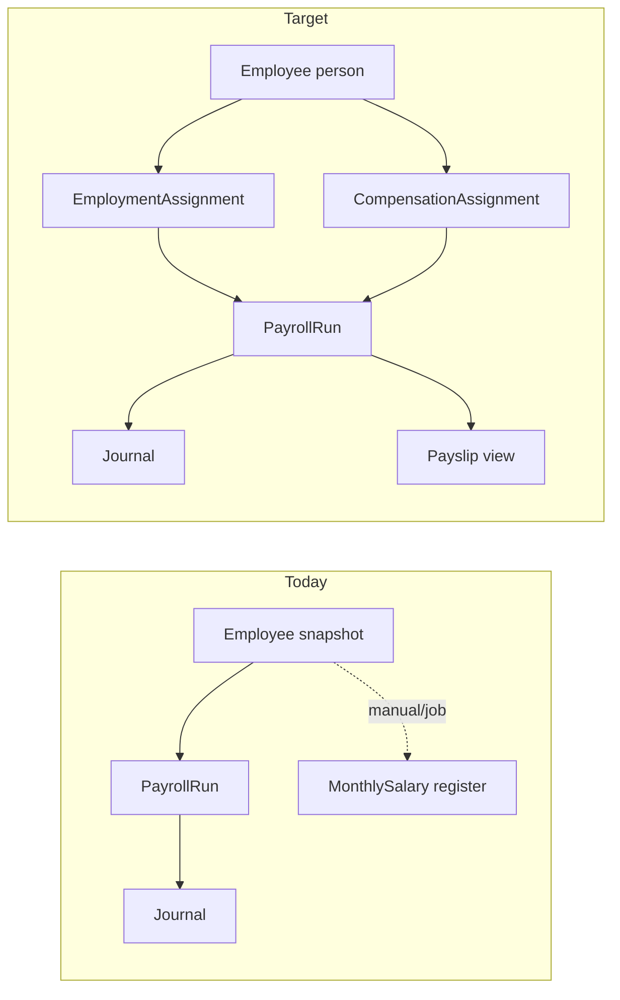

# Gates HCM — Architecture Overview (Phase 0)

## Mission

Evolve **existing Gates HR** into enterprise HCM **without** breaking payroll GL, advances, contracts, or master data.

## Principles (locked)

1. **One payroll calculation truth:** `PayrollRun` / `PayrollRunItem`.
2. **Historical payroll is immutable** after post (snapshots; change via unpost/reversal or adjustment process).
3. **Person ≠ employment ≠ assignment ≠ compensation** (effective dating in Phase 2).
4. **Procedures = audit + future workflow trigger**, not silent SoT.
5. **No big-bang schema** — phased tables per roadmap.
6. **Financial regression tests** before payroll refactors.

## Current vs target (simplified)

## Module boundaries (backend)

| Module | Path | Phase 0 |
|--------|------|---------|
| HR core | `modules/hr/` | Preserve |
| Accounting | `journal-posting`, `HrSettings` | Preserve integration |
| Treasury | safe/bank on disburse | Preserve |
| Approval | `modules/approval` | Not wired to HR yet |
| Workers | `payroll.processor` | Deprecate calc path later |

## What Phase 0 explicitly excludes

Attendance engine, leave engine, ATS, performance, LMS, ESS/MSS, payroll rule engine, new Prisma models (except security fixes).

## Related ADRs

- [HCM_PAYROLL_ARCHITECTURE.md](./HCM_PAYROLL_ARCHITECTURE.md)
- [HCM_EFFECTIVE_DATING.md](./HCM_EFFECTIVE_DATING.md)
- [HCM_DATA_OWNERSHIP.md](./HCM_DATA_OWNERSHIP.md)
- [HCM_SECURITY_MODEL.md](./HCM_SECURITY_MODEL.md)
- [HCM_DOMAIN_MAP.md](./HCM_DOMAIN_MAP.md)
- [HCM_PHASE0_REPORT.md](./HCM_PHASE0_REPORT.md)
