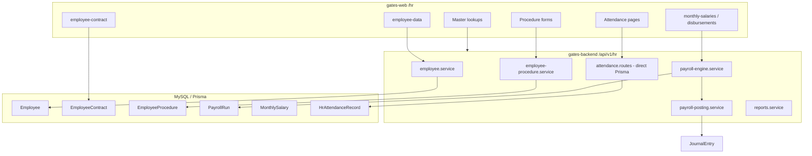

# Gates HR — Current Architecture (Forensic)

**Audit date:** 2026-10-05 · **Mode:** discovery only (no code changes).

## Stack & boundaries

| Layer | Location | Notes |
|-------|----------|--------|
| Schema | `gates-backend/prisma/schema.prisma` | HR block ~4572–4841 + payroll satellites ~7596–7710, lookups ~7784–8002, disbursements ~10081+ |
| API | `gates-backend/src/modules/hr/` | 78 files: ~25 route modules, ~30 services, Zod schemas |
| Mount | `gates-backend/src/app.ts` L553–583 | All under `/api/v1/hr/*` |
| Web | `gates-web/app/hr/` | 76 `page.tsx` routes |
| Nav | `gates-web/app/components/hr/hr-sidebar.config.ts` | Grouped sidebar (masters, ops, attendance, payroll, reports) |
| Permissions | `employee` + `payroll` resources | `permission-definitions.service.ts`, coarse RBAC |
| Jobs | `gates-backend/src/workers/processors/payroll.processor.ts` | BullMQ `payroll` queue (async calc) |
| AI | `HrPayrollTool` | `gates-backend/src/modules/ai/tools/hr-payroll.tool.ts` |
| Approval (global) | `/api/v1/approval` | **Not referenced** from `modules/hr/*` |

## Request flow (typical)

```
gates-web page
  → useApiQuery / apiClient (tenant headers: X-Company-Id, X-Branch-Id, X-Fiscal-Year-Id)
  → Express route (authenticate → setTenantContext → authorize)
  → Service (Prisma)
  → MySQL
```

Payroll run (newer path):

```
POST /api/v1/hr/payroll-runs
  → payrollEngineService.createPayrollRun
  → PayrollRun + PayrollRunItem rows (status DRAFT)
POST .../post-accrual → payrollPostingService → journalPostingService (GL)
POST .../post-payment → treasury resolver + journal
```

Legacy parallel path still exists:

- `MonthlySalary` CRUD + disbursement routes
- `POST /api/v1/hr/payroll/calculate` (async job)

## Subsystems (evidence-based classification)

| Subsystem | Backend | Frontend | E2E maturity |
|-----------|---------|----------|--------------|
| Employee master | ✅ CRUD | ✅ `employee-data` | **WORKING** (core fields) |
| Contracts | ✅ | ✅ `employee-contract` | **WORKING** |
| Lookups (nationality, dept, …) | ✅ | ✅ `HrMasterLookupPage` pattern | **WORKING** |
| HR settings (GL codes, SI/tax rates) | ✅ | ✅ `settings` | **WORKING** |
| Employee procedures (events) | ✅ | ✅ many ops pages | **PARTIAL** (log only; no master update) |
| Advances | ✅ | ✅ `employee-advance` | **WORKING** |
| Payroll run + GL | ✅ | ⚠️ limited UI (`payroll-policies`?) | **PARTIAL** |
| Monthly salary documents | ✅ | ✅ `monthly-salaries` | **WORKING** (parallel to PayrollRun) |
| EOS / leave / housing clearances & disbursements | ✅ | ✅ several pages | **PARTIAL** (forms + APIs; not full lifecycle) |
| Attendance | ✅ MVP (`HrAttendanceRecord`) | ✅ many pages | **PARTIAL** / **UI-heavy** |
| Reports | ✅ `reports.service.ts` | ✅ hub + some reports | **PARTIAL** |
| Recruitment / Performance / LMS | ❌ | ❌ | **MISSING** |
| Workflow | Global module | ❌ HR wiring | **NOT SUPPORTED** for HR |

## Duplication / parallel tracks

1. **Payroll:** `PayrollRun` engine vs `MonthlySalary` operational documents vs async `payroll` queue.
2. **Allowances/deductions:** Master rows with `defaultAmount` summed globally in `payroll-engine.service.ts` — not per-employee assignment.
3. **Leave balance:** On `EmployeeContract.leaveBalance` + procedure log — no leave request entity.
4. **Attendance:** Single polymorphic `HrAttendanceRecord` (`kind` + `payload` JSON) vs rich UI implying fingerprint pipelines.

## Integration touchpoints

- **Accounting:** `payroll-posting.service.ts`, `hr-gl-account-resolver.service.ts`, clearance services may post journals.
- **Cost center:** `Employee.costCenterId`, contract `costCenterId`; payroll GL not clearly split by CC in engine (aggregate posting).
- **Treasury:** Payment leg of payroll run uses `treasuryAccountResolverService`.
- **Branch:** `PayrollRun.branchId`, contract `workBranchId` / `salaryBranchId`; **Employee has no branchId**.
- **Users:** Optional `Employee.userId` — no full ESS portal pattern found.
- **Documents:** Employee-data UI has document **seed UI** only; no HR document model tied to archive module verified in HR routes.

## Architecture diagram (as built)



## Key risks (architecture-level)

- **No effective-dated employment layer** — current state on `Employee` + event log on `EmployeeProcedure`.
- **Frontend surface >> wired APIs** — ~76 pages, **~13** use `useApiQuery`/`useApiMutation` (remainder mostly forms/chrome or read-only patterns via `apiClient` in components).
- **Egypt-specific payroll constants** in `HrSettings` defaults (11% / 18.75% / 10% flat tax) used by engine.
- **No HR-specific approval** — sensitive actions are permission-gated only.

See linked audit files for model-level and gap detail.
