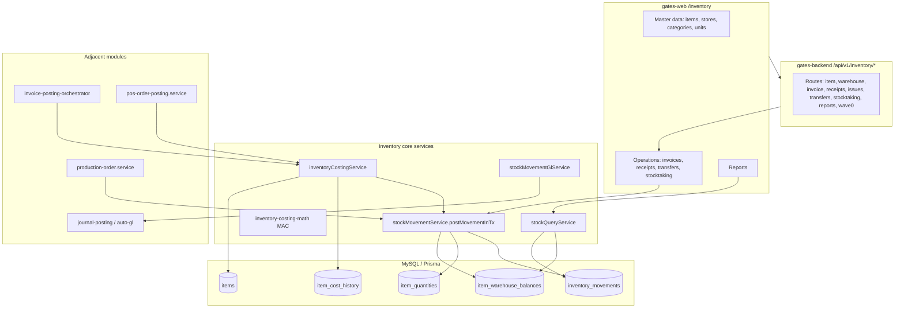
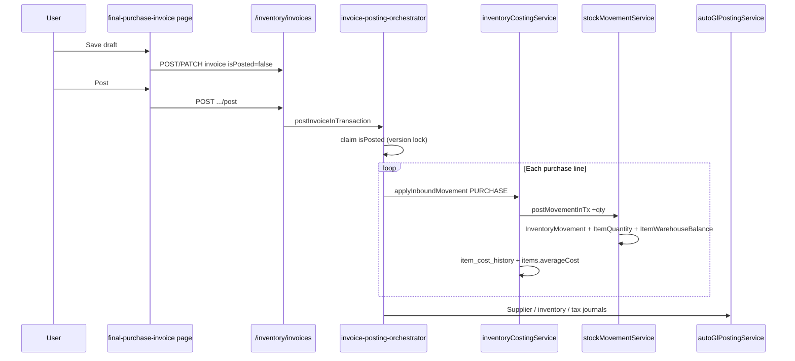
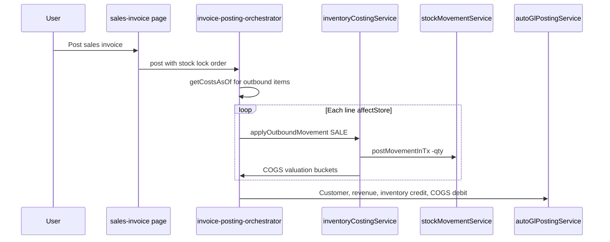
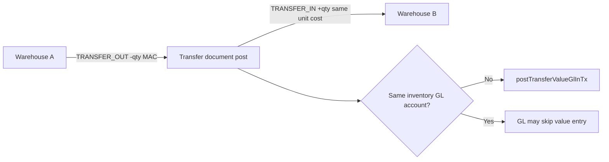
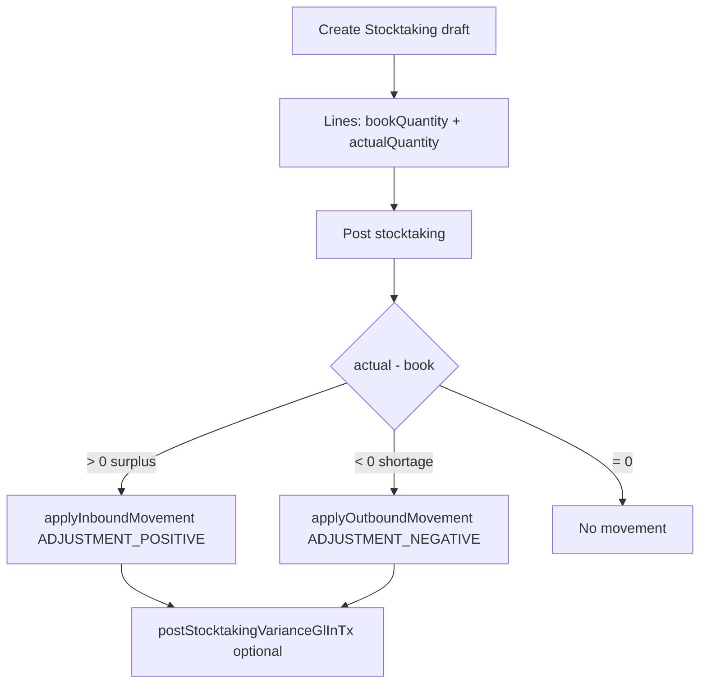
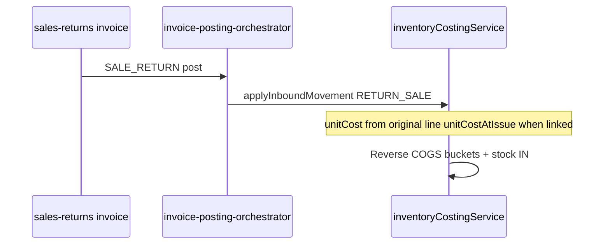
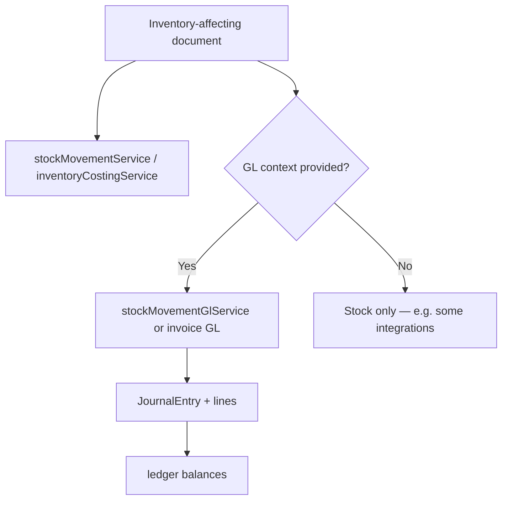
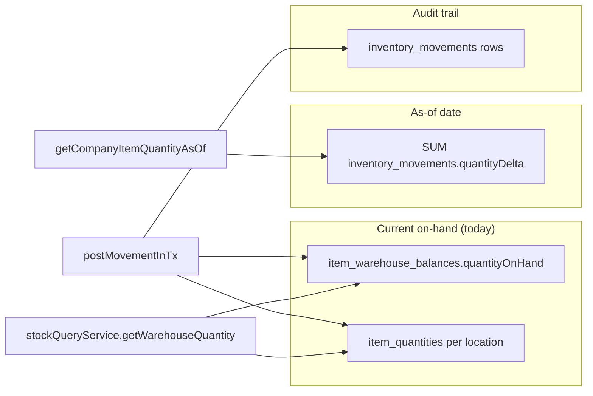
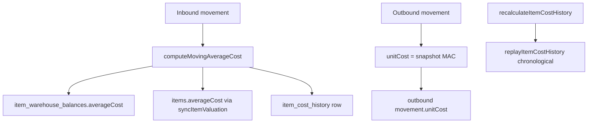

# Gates ERP — Inventory flow maps (Mermaid)

Read-only architecture diagrams. Pair with `INVENTORY_LOGIC_COMPLETE.md`.

---

## Complete inventory architecture

---

## Purchase flow

---

## Sale flow

---

## Transfer flow

---

## Stocktaking flow

---

## Return flow (sales)

---

## Accounting integration (simplified)

---

## Quantity source-of-truth

---

## Costing flow (MAC)

