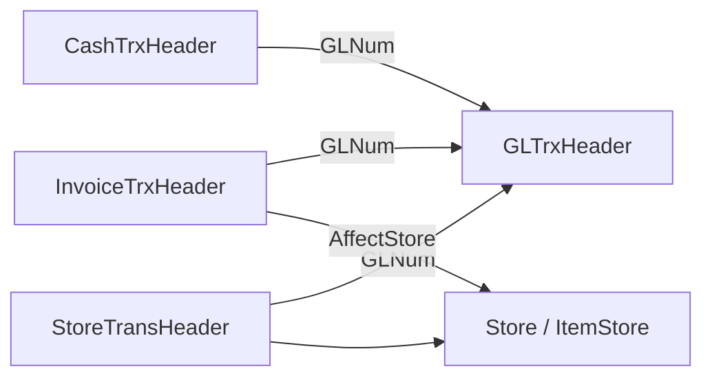

# Legacy Business Logic (outside table rows)

**Sources:** `erp/erp_procedures.txt`, `erp/ERP_FULL_TABLES_CATALOG.md` (mobile/Delphi references), `docs/migration/modules/M1-AccountingGL.md`, `docs/migration/modules/M4-InventoryMaster.md`, existing ETL/reconciliation code.

**Gap:** No stored procedure **bodies** or Delphi source in `erp/`. Rules below are **procedure names + documented Delphi flows** unless marked CONFIRMED from code in this repo.

---

## Stored procedures (names only)

| SOURCE | RULE | INPUTS | OUTPUTS | TABLES AFFECTED | MIGRATION RELEVANCE | CONFIDENCE |
|--------|------|--------|---------|-----------------|---------------------|------------|
| `PostInvoice` | Post sales/purchase invoice: likely GL + store + AR/AP | Invoice key | Status posted | `InvoiceTrxHeader`, `GLTrx*`, `ItemStore`/movements | **BLOCKER** if migrating invoices as operational docs without equivalent side effects | LOW (name only) |
| `SaveInvoices` | Persist invoice header/lines (unposted) | Invoice DTO | Rows inserted | `InvoiceTrx*` | Historical load must not double-post | LOW |
| `SaveReturnInvoices` | Return invoice save | Same | Same | `InvoiceTrx*` | Returns mapping | LOW |
| `SavePayment` / `ReturnSavePayment` | Payment documents | Payment DTO | Cash + GL links | `CashTrx*`, `GLTrx*` | Treasury migration | LOW |
| `create_Eshar_Credit` / `Return_create_Eshar_Credit` | Credit note / eshar flows | — | — | GL + invoice | Commercial paper / notices | LOW |
| `AdjustItemsCost` | Recost items | Item/cost params | `ItemCost` updates | `ItemCost`, possibly store value | Opening/historical cost reconciliation | LOW |
| `GetAllItemsInStore` / `GetAllItemsInStoreMobile` | **Read** aggregated store catalog | Store, filters | Item list + qty | Reads movements + `ItemStore` fallback | Explains why `ItemStore` may disagree with movements | MEDIUM (catalog) |
| `GetAllItemsCount*` | Count items for mobile grids | Filters | Counts | Items | Low | LOW |
| `UpdateNothing` | No-op / placeholder | — | — | — | Ignore | HIGH |
| `GetLogSQLText` | Debug logging | — | Text | — | Ignore | HIGH |

**Commented (mobile, verify on tenant):** `SaveStoreTrans`, `PostStoreTrans`, `PostStoreTransfer`, `PostPayment`, `PostCash`, `PostCashTrx` — **STRONG_INFERENCE** parallel to `PostInvoice` for inventory/treasury.

**Counts:** **15** named in dump; **0** views; **0** triggers; **0** functions in `erp/`.

---

## GL / accounting (Delphi — M1 module doc)

| SOURCE | RULE | INPUTS | OUTPUTS | TABLES | MIGRATION RELEVANCE | CONFIDENCE |
|--------|------|--------|---------|--------|---------------------|------------|
| `UntGL` CalTotals | Line debit/credit × `Change` summed; round 4 dp | Grid lines | Header totals, `Balanced` | `GLTrxDetail` | Must match `debitBase`/`creditBase` in new JE lines | HIGH |
| `UntGL` save | `Status='UnPost'` on create; soft delete `Deleted='T'` | User entry | Header+lines | `GLTrxHeader/Detail` | Map to `JournalEntry.postingStatus`, `isCancelled` | HIGH |
| `UntGL` Post | `Status='Post'` | Approved doc | Posted flag | Header | `isPosted=true`; reconciliation filters posted only | HIGH |
| Balance SQL | `Sum((DebitValue-CreditValue)*Change)` posted only | Account | Scalar balance | GL tables | Do not import cached party balance without GL | HIGH |
| `CreateGlNumSpecial` | 8-digit `GLNum`, continuous vs per-year from `CompanySetting` | Company, branch, year | Next `GLNum` | `GLTrxHeader` | Preserve `legacyGlNum` on import | HIGH |

---

## Inventory (catalog + new ERP comparison)

| SOURCE | RULE | INPUTS | OUTPUTS | TABLES | MIGRATION RELEVANCE | CONFIDENCE |
|--------|------|--------|---------|--------|---------------------|------------|
| Catalog `ItemStore` note | Quantity cache; mobile may recompute from Delphi movements | — | `Qty` | `ItemStore` | Prefer **RECONSTRUCT** from movements + opening in new ERP | MEDIUM |
| `ItemsFirstTime*` | Opening stock document | Store, lines | Opening qty/cost | `ItemsFirstTimeH/D` | Map to `OpeningStock` + movements | MEDIUM |
| `query-delphi-store-balances` (mobile ref) | Includes first-time + transactions | Item, store | Balance | Multiple | Defines legacy “truth” for mobile | MEDIUM |
| Invoice `AffectStore` | Header flag whether invoice hits stock | Invoice | Store trx | `InvoiceTrx*` | Controls whether historical invoice should create `InventoryMovement` | MEDIUM |

---

## Invoice totals (line-level — catalog columns)

| SOURCE | RULE | INPUTS | OUTPUTS | TABLES | MIGRATION RELEVANCE | CONFIDENCE |
|--------|------|--------|---------|--------|---------------------|------------|
| `InvoiceTrxDetail` | `NetValue`, discounts, `DaribaValue`, multi `Value1..6` | Line grid | Line amounts | Detail | Field mapping to `InvoiceLine` tax/discount | MEDIUM |
| `InvoiceTrxHeader` | `TotalAmount`, `NetAmount`, `PaidAmount`, `Change` | Header | Document totals | Header | Header totals vs sum(lines) validation | MEDIUM |

---

## Posting graph (STRONG_INFERENCE)

**Migration relevance:** Importing `GLTrx*` without operational documents (or vice versa) breaks trial balance vs stock vs AR.

---

## Phase 0.5 — CONFIRMED_FROM_DB (Agro2)

| Procedure | def size | Reads (sample) | Writes (inferred from body) |
|-----------|---------|----------------|-----------------------------|
| `PostInvoice` | 59,266 B | `InvoiceTrxHeader/Detail`, `Item`, `GLTrxHeader/Detail`, `Account`, `Etemad` | GL post, store/cost (`ItemCost`, movements), status on invoice |
| `SaveInvoices` | 111,729 B | `StoreTrans*`, `Store`, `Account`, invoice tables | INSERT/UPDATE invoice tables only |
| `SavePayment` | 42,260 B | cash + GL refs | treasury tables |
| `AdjustItemsCost` | 8,588 B | `ItemCost` | cost rows |
| `GetAllItemsInStore` | 27,205 B | items, balances | read-only |

**Posting flag:** `GLTrxHeader.Performed = 'T'` used with `Status='Post'` in `PostInvoice` validation — add to migration header mapping.

Full text: `scripts/migration/legacy-local-restore/audit-out/proc_*.sql`.

---

## What we cannot yet extract from repo

- Exact `PostInvoice` / `PostStoreTrans` SQL steps (debit/credit accounts, cost of sales, WIP).
- Trigger-based denormalization (if any) on customer DBs.
- Per-customer custom stored procedures.

**Required before engine implementation:** Restore backup locally and run `restore-and-audit.sh`, **or** Delphi `untgeneral.pas` / posting units in a future artifact drop.
