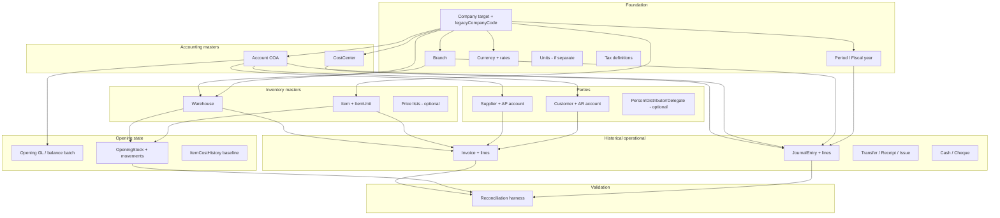

# Migration Dependency Graph

Derived from legacy composite keys, Prisma FKs, and existing ETL phases A→B→C (`03-etl-pipeline.md`).

---

## 1. Safe logical order

---

## 2. Why each dependency exists

| Edge | Reason |
|------|--------|
| Company → everything | `companyId` FK on all tenant models |
| Branch → warehouses, journals | `branchId` on `JournalEntry`, many docs |
| Period → journals, invoices | `fiscalYearId` / `sourceYearId` in legacy keys |
| Account → customer/supplier | `mainAccountId` required for AR/AP posting |
| Account + CC → journal lines | `accountId`, `costCenterId` FKs |
| Item + Warehouse → opening stock | Lines reference both; movements need both |
| Opening before historical stock docs | New ERP qty = sum(movements); opening establishes baseline |
| GL masters before JE lines | Line FK to `Account` |
| Masters before invoices | `customerId`, `itemId`, `warehouseId` FKs |
| Load before reconcile | `recon:migration` compares after ETL |

---

## 3. Cycles and resolution

| Cycle | Description | Resolution |
|-------|-------------|------------|
| Customer ↔ Account | Customer needs AR account; account may be created from customer code | **SPLIT transform:** create `Account` first (synthetic or legacy `AccountCode`), then `Customer.mainAccountId` |
| Item ↔ default warehouse | Some defaults assume warehouse | Create warehouses before items; nullable `warehouseId` on invoices only |
| GL ↔ Invoice | Invoice has `GLNum`; GL may reference invoice source | **Import order:** Option A — JE from `GLTrx*` as source of truth for posted history; invoices as **REFERENCE_ONLY** or read-only without repost. Option B — invoices first with `isPosted=false` and attach existing JE by `GLNum`. **OWNER_DECISION** |
| Opening balance batch ↔ JE | `BalanceAccounts*` vs `GLTrx` opening types | Prefer one mechanism in new ERP (journal entries); do not double-count |

No hard DB cycle in Prisma for masters if accounts are created before parties.

---

## 4. Parallelism

After foundation:

- **Parallel:** Cost centers, warehouses, items (same tier).
- **Parallel:** Customers and suppliers (after COA).
- **Sequential:** Phase C journals before relying on invoice-derived GL (if both imported).

Company workers: multiple **legacy companies** → multiple **target companies** in parallel jobs — never two jobs writing same `targetCompanyId` without locking.

---

## 5. Alignment with current ETL

| Phase | Order |
|-------|--------|
| A | Company, Branch, Year, Account, CC, Customer, Supplier, Store, Item |
| B | ItemStore, ItemCost (openings) |
| C | GLTrxHeader/Detail, InvoiceTrxHeader/Detail, CashTrxHeader (partial) |
| D | Person, cheques (planned) |

**Gap:** Opening stock (`ItemsFirstTime*`), store transactions, treasury detail — not in A–C ordering yet.
