# فهرس شامل — 570 جدول ERP

> **مصدر الأعمدة:** [`erp_schema.txt`](./erp_schema.txt) · **يُحدَّث:** `node scripts/erp/generate-erp-tables-catalog.mjs`

## كيف تقرأ هذا الملف

1. **جداول الموبايل** — شرح + علاقات + ماذا نقرأ/نكتب.
2. **امتدادات الموبايل** — جداول تُنشأ على ERP وليست في dump الـ 570.
3. **كل الجداول** — لكل جدول: ماذا يفعل، علاقاته، الأعمدة.
4. **MySQL (Prisma)** — ليست هنا → [`SQL_SERVER_ERP_GUIDE.md`](./SQL_SERVER_ERP_GUIDE.md).

Delphi **لا يضع Foreign Keys ظاهرة** في أغلب الجداول. العلاقات أدناه منطقية من أسماء الأعمدة (مثل `ItemCode` → `Item`) وأزواج الرأس/التفاصيل (`*H` / `*D`). `CompanyCode` مشترك تقريباً في الكل.

---

## خريطة العلاقات الرئيسية

```mermaid
erDiagram
  Company ||--o{ Branch : CompanyCode
  Company ||--o{ Year : CompanyCode
  Account ||--o| Customer : AccountCode
  Account ||--o| Supplier : AccountCode
  Item ||--o{ ItemUnit : ItemCode
  Item ||--o{ ItemStore : ItemCode
  Store ||--o{ ItemStore : StoreCode
  Item ||--o{ ItemColorSize : ItemCode
  PriceListH ||--|{ PriceListD : PriceListCode
  InvoiceTrxHeader ||--|{ InvoiceTrxDetail : docKey
  InvoiceTrxHeader }o--|| Account : SupplierAccountCode
  InvoiceTrxHeader }o--|| Store : StoreCode
  InvoiceTrxHeader }o--|| Person : PersonCode
  CashTrxHeader ||--|{ CashTrxDetail : CashNum
  CashTrxHeader ||--o{ CashTrxotherDetail : CashNum
  GLTrxHeader ||--|{ GLTrxDetail : GLNum
  StoreTransHeader ||--|{ StoreTransDetail : StoreTransCode
  StoreCollHeader ||--|{ StoreCollDetail : StoreCollCode
  ItemsFirstTimeH ||--|{ ItemsFirstTimeD : opening
  ManufactProcessH ||--|{ ManufactProcessD1 : rawIssue
  ManufactProcessH ||--|{ ManufactProcessD2 : finished
  ManufactWayH ||--|{ ManufactWayD1 : bom
  HREmployeeH ||--o{ HREmployeeFingerPrint : AttCode
  CostCenter ||--o{ HREmployeeFingerPrint : CCenterCode
  AbsProjectH ||--o{ AbsProjectD2 : ProjectCode
```

---

## 1) جداول gates-mobile يستخدمها (قراءة/كتابة)

**42** جدول من الـ 570 يظهر في استعلامات SQL للموبايل. الباقي لسطح المكتب فقط.

### `Account`

- **ما هو:** شجرة الحسابات — عملاء، موردين، خزائن، تجميعات.
- **في الموبايل:** قوائم العملاء والخزائن؛ التحقق من نطاق المندوب؛ كشف حساب؛ سند قبض.
- **ملفات:** `lookups/route.ts, debtor-root-resolve.ts, rep-client-scope.ts, client-statement, document-search`
- **العلاقات:** `Currency` عبر `CurrencyCode` (عملة) · شجرة حسابات عبر `ParentAccount` · `Customer` (بطاقة عميل) · `Supplier` (بطاقة مورد) · `GLTrxDetail` (أسطر قيد) · `CashTrxDetail` (أسطر سند)
- **الأعمدة (19):** `CompanyCode` (char) · `AccountCode` (nvarchar) · `ParentAccount` (nvarchar) · `FullPath` (nvarchar) · `AccountLevel` (decimal) · `AccountNameA` (nvarchar) · `AccountNameE` (nvarchar) · `AccountStatus` (char) · `AccountType` (char) · `ReportType` (char) · `AccountSide` (char) · `CurrencyCode` (char) · `CCType` (char) · `HasChild` (char) · `Deleted` (char) · `AccountSubType` (char) · `Mozana` (decimal) · `Alarm` (char) · `RCode` (nvarchar)

### `BankBoxRights`

- **ما هو:** ربط حسابات الخزينة/البنوك بحقوق المستخدم.
- **في الموبايل:** فلترة قائمة safes (خزائن).
- **ملفات:** `lookups/route.ts (SQL_SAFES)`
- **العلاقات:** `Account` عبر `AccountCode` (حساب) · `UserDefinition` عبر `UserCode` (مستخدم ERP)
- **الأعمدة (6):** `CompanyCode` (char) · `UserCode` (nvarchar) · `AccountCode` (nvarchar) · `Allow` (char) · `Type` (char) · `IsDefault` (char)

### `Branch`

- **ما هو:** فروع الشركة.
- **في الموبايل:** resolve branch code؛ defaults فاتورة.
- **ملفات:** `branch-code-resolve.ts, item-sale-line-defaults.ts`
- **العلاقات:** `PriceListH` عبر `PriceListCode` (قائمة أسعار) · `Country` عبر `CountryCode` (دولة) · `Place` عبر `Place` (مكان)
- **الأعمدة (28):** `CompanyCode` (char) · `BranchCode` (char) · `BranchNameA` (nvarchar) · `BranchNameE` (nvarchar) · `BranchWork` (nvarchar) · `Address` (nvarchar) · `Phone` (nvarchar) · `Fax` (nvarchar) · `Box` (nvarchar) · `Post` (nvarchar) · `City` (nvarchar) · `Site` (nvarchar) · `BarCodePrice` (decimal) · `Email` (nvarchar) · `EmailServer` (nvarchar) · `Passward` (nvarchar) · `PortNum` (decimal) · `PriceListCode` (nvarchar) · `SendToMail` (nvarchar) · `UserName` (nvarchar) · `ActivityCode` (nvarchar) · `BranchId` (char) · `Building` (nvarchar) · `CountryCode` (numeric) · `Place` (nvarchar) · `StateName` (nvarchar) · `Street` (nvarchar) · `TaxOfficeCode` (nvarchar)

### `CashTrxDetail`

- **ما هو:** توزيع السند على حسابات.
- **في الموبايل:** تحميل/حفظ سند قبض.
- **ملفات:** `cash-receipt-document-load.ts, client-statement-query.ts`
- **العلاقات:** `CashTrxHeader` (رأس المستند) · `Account` عبر `AccountNo` (حساب) · `Currency` عبر `CurrencyCode` (عملة) · `CostCenter` عبر `CCenterCode` (مركز تكلفة) · `Branch` عبر `BranchCode` (فرع) · `Year` عبر `YearID` (سنة مالية) · `DaribaPercent` عبر `DaribaPercentCode` (نسبة ضريبة) · `InvoiceTrxHeader` عبر `InvoiceNum` (فاتورة) · `CashTrxHeader` عبر `CashNum` (سند نقدي) · `Eshar` عبر `EsharCode` (إشعار)
- **الأعمدة (20):** `CompanyCode` (char) · `BranchCode` (char) · `YearID` (char) · `CashNum` (char) · `DetailNum` (decimal) · `Type` (char) · `AccountNo` (nvarchar) · `CCenterCode` (nvarchar) · `Amount` (decimal) · `DetailDescA` (nvarchar) · `DetailDescE` (nvarchar) · `CurrencyCode` (char) · `Change` (decimal) · `DaribaPercentCode` (char) · `DaribaPercentValue` (decimal) · `EsharCode` (char) · `Accepted` (char) · `InvoiceType` (char) · `InvoiceYearId` (char) · `InvoiceNum` (char)

### `CashTrxHeader`

- **ما هو:** رأس سند قبض/صرف.
- **في الموبايل:** إنشاء سند قبض؛ كشف حساب؛ حركة نقدية؛ sequences.
- **ملفات:** `cash/receipt/create, client-statement, reports/cash-movement, fiscal-year-resolve`
- **العلاقات:** `CashTrxDetail` (تفاصيل) · `Account` عبر `AccountNo` (حساب) · `Currency` عبر `CurrencyCode` (عملة) · `Branch` عبر `BranchCode` (فرع) · `Year` عبر `YearID` (سنة مالية) · `UserDefinition` عبر `UserCode` (مستخدم ERP) · `GLTrxHeader` عبر `GLNum` (قيد)
- **الأعمدة (23):** `CompanyCode` (char) · `BranchCode` (char) · `YearID` (char) · `CashNum` (char) · `DescA` (nvarchar) · `DescE` (nvarchar) · `Type` (char) · `Date` (datetime) · `DateH` (char) · `IsPeriodic` (char) · `Status` (char) · `Deleted` (char) · `CurrencyCode` (char) · `Audit` (char) · `ShowDariba` (char) · `SourceNum` (char) · `SourceType` (char) · `AccountNo` (nvarchar) · `Amount` (decimal) · `OtherSidesAmount` (decimal) · `DetailsAmount` (decimal) · `GLNum` (char) · `UserCode` (char)

### `CashTrxotherDetail`

- **ما هو:** جانب آخر للسند (بنك/حساب مقابل).
- **في الموبايل:** INSERT/DELETE في مسار سند القبض — الكود قد يكتب `CashTrxOtherDetail` (SQL Server غالباً case-insensitive).
- **ملفات:** `cash/receipt/create/route.ts`
- **العلاقات:** `Account` عبر `AccountNo` (حساب) · `Currency` عبر `CurrencyCode` (عملة) · `CostCenter` عبر `CCenterCode` (مركز تكلفة) · `Branch` عبر `BranchCode` (فرع) · `Year` عبر `YearID` (سنة مالية) · `CashTrxHeader` عبر `CashNum` (سند نقدي)
- **الأعمدة (15):** `CompanyCode` (char) · `BranchCode` (char) · `YearID` (char) · `CashNum` (char) · `DetailNum` (decimal) · `Type` (char) · `AccountNo` (nvarchar) · `CCenterCode` (nvarchar) · `Amount` (decimal) · `DetailDescA` (nvarchar) · `DetailDescE` (nvarchar) · `CurrencyCode` (char) · `Change` (decimal) · `Accepted` (char) · `BankAccountNo` (nvarchar)

### `CompanySetting`

- **ما هو:** إعدادات الشركة (مفاتيح Name/Value).
- **في الموبايل:** حل جذر حسابات العملاء (CustomerAccount).
- **ملفات:** `debtor-root-resolve.ts`
- **العلاقات:** `Branch` عبر `BranchCode` (فرع)
- **الأعمدة (5):** `CompanyCode` (char) · `Name` (nvarchar) · `Value` (nvarchar) · `AdditionalData` (nvarchar) · `BranchCode` (char)

### `CostCenter`

- **ما هو:** مراكز التكلفة = مواقع العمل في الحضور والزيارات.
- **في الموبايل:** lookup costCenters؛ حضور HR؛ GPS مواقع الزيارات (MySQL يربط بالكود).
- **ملفات:** `lookups/route.ts, cost-centers-query.ts, hr/attendance`
- **العلاقات:** `Branch` عبر `BranchCode` (فرع)
- **الأعمدة (16):** `CompanyCode` (char) · `CCenterCode` (nvarchar) · `CCenterNameA` (nvarchar) · `CCenterNameE` (nvarchar) · `CCType` (char) · `ParentCostCenter` (nvarchar) · `CostCenterLevel` (decimal) · `FullPath` (nvarchar) · `HasChild` (char) · `Deleted` (char) · `CCSubType` (char) · `Mozana` (decimal) · `Alarm` (char) · `YearClose` (char) · `QtyMozana` (decimal) · `BranchCode` (nvarchar)

### `Currency`

- **ما هو:** العملات وأسعار التحويل.
- **في الموبايل:** lookup عملات في الفواتير/القبض.
- **ملفات:** `lookups/route.ts`
- **العلاقات:** `Branch` عبر `BranchCode` (فرع)
- **الأعمدة (12):** `CompanyCode` (char) · `BranchCode` (char) · `CurrencyCode` (char) · `CurrencyNameA` (nvarchar) · `CurrencyNameE` (nvarchar) · `PartNameA` (nvarchar) · `PartNameE` (nvarchar) · `Symbol` (char) · `Change` (decimal) · `Equivelant` (decimal) · `PartConvert` (decimal) · `InterCode` (nvarchar)

### `Customer`

- **ما هو:** بيانات العميل مرتبطة بـ AccountCode.
- **في الموبايل:** JOIN مع Account في lookup العملاء؛ أسماء في التقارير.
- **ملفات:** `lookups/route.ts, debtor-root-resolve.ts, item-sale-line-defaults.ts`
- **العلاقات:** `Account` عبر `AccountCode` (حساب) · `Account` عبر `ParentAccountCode` (حساب أب) · `Person` عبر `PersonCode` (مندوب) · `Currency` عبر `CurrencyCode` (عملة) · `Branch` عبر `BranchCode` (فرع) · `PriceListH` عبر `PriceListCode` (قائمة أسعار) · `Nation` عبر `NationCode` (جنسية) · `Country` عبر `CountryCode` (دولة) · `City` عبر `CityCode` (مدينة) · `Region` عبر `RegionCode` (منطقة) · `Place` عبر `Place` (مكان)
- **الأعمدة (47):** `CompanyCode` (char) · `BranchCode` (char) · `CustomerCode` (char) · `CustomerNameA` (nvarchar) · `CustomerNameE` (nvarchar) · `NationCode` (char) · `BarCode` (char) · `Phone1` (char) · `Phone2` (char) · `Mobile` (char) · `Fax` (char) · `Email` (char) · `Site` (char) · `PriceCode` (char) · `DiscPercent` (decimal) · `CountryCode` (char) · `CityCode` (char) · `RegionCode` (char) · `Street` (nvarchar) · `OS` (char) · `BO` (char) · `AccountCode` (nvarchar) · `CustomerCase` (char) · `CustomerType` (char) · `SalesPolicyCode1` (char) · `SalesPolicyCode2` (char) · `PersonCode` (char) · `AdvanceAccountCode` (nvarchar) · `Alarm` (char) · `CurrencyCode` (char) · `InsuranceAccountCode` (nvarchar) · `Mozana` (decimal) · `ParentAccountCode` (nvarchar) · `PriceListCode` (nvarchar) · `Address` (nvarchar) · `Building` (nvarchar) · `City` (nvarchar) · `CountryCode1` (numeric) · `DaribaMamoriaCode` (char) · `DealTypeCode` (numeric) · `IdNum` (nvarchar) · `Place` (nvarchar) · `Post` (nvarchar) · `StateName` (nvarchar) · `Street1` (nvarchar) · `TradeNum` (nvarchar) · `InsuranceFinalAccountCode` (nvarchar)

### `DaribaPercent`

- **ما هو:** نسب الضريبة.
- **في الموبايل:** default ضريبة سطر فاتورة.
- **ملفات:** `item-sale-line-defaults.ts`
- **العلاقات:** `Branch` عبر `BranchCode` (فرع)
- **الأعمدة (9):** `CompanyCode` (char) · `BranchCode` (char) · `DaribaPercentCode` (char) · `DaribaPercentNameA` (nvarchar) · `DaribaPercentNameE` (nvarchar) · `Value` (decimal) · `MinValue` (decimal) · `TaxSubType` (nvarchar) · `TaxType` (nvarchar)

### `Etemad`

- **ما هو:** اعتماد استيراد/حسابات اعتماد.
- **في الموبايل:** defaults رقم/حقل فاتورة جديدة.
- **ملفات:** `sales-invoice-save-defaults.ts, sales-return-save-defaults.ts`
- **العلاقات:** `Account` عبر `AccountCode` (حساب) · `Account` عبر `SupplierAccountCode` (حساب مورد/عميل على المستند) · `CostCenter` عبر `CCenter` (مركز تكلفة) · `Branch` عبر `BranchCode` (فرع) · `Year` عبر `YearID` (سنة مالية) · `GLTrxHeader` عبر `GLNum` (قيد) · `MainEtemad` عبر `MainEtemadCode` (اعتماد رئيسي)
- **الأعمدة (24):** `CompanyCode` (char) · `BranchCode` (char) · `YearID` (char) · `EtemadCode` (char) · `DescA` (nvarchar) · `DescE` (nvarchar) · `Type` (char) · `Date` (datetime) · `DateH` (char) · `Deleted` (char) · `Status` (char) · `GLNum` (char) · `AccountCode` (nvarchar) · `ArriveDate` (datetime) · `ArriveDateH` (char) · `EtemadNum` (char) · `SupplierAccountCode` (nvarchar) · `PolicyNum` (char) · `DaribaGLNum` (char) · `DaribaGLYearId` (char) · `SaveDateTime` (datetime) · `MainEtemadCode` (char) · `DaribaGLType` (char) · `CCenter` (nvarchar)

### `GLTrxDetail`

- **ما هو:** أسطر القيد (مدين/دائن).
- **في الموبايل:** كشف حساب (مدين/دائن).
- **ملفات:** `client-statement-query.ts`
- **العلاقات:** `GLTrxHeader` (رأس المستند) · `Account` عبر `AccountNo` (حساب) · `Currency` عبر `CurrencyCode` (عملة) · `CostCenter` عبر `CCenterCode` (مركز تكلفة) · `Branch` عبر `BranchCode` (فرع) · `Year` عبر `YearID` (سنة مالية) · `DaribaPercent` عبر `DaribaPercentCode` (نسبة ضريبة) · `GLTrxHeader` عبر `GLNum` (قيد) · `Eshar` عبر `EsharCode` (إشعار)
- **الأعمدة (23):** `CompanyCode` (char) · `BranchCode` (char) · `YearID` (char) · `GLNum` (char) · `DetailNum` (decimal) · `Type` (char) · `AccountNo` (nvarchar) · `CCenterCode` (nvarchar) · `DebitValue` (decimal) · `CreditValue` (decimal) · `DetailDescA` (nvarchar) · `DetailDescE` (nvarchar) · `CurrencyCode` (char) · `Change` (decimal) · `DaribaPercentCode` (char) · `DaribaPercentValue` (decimal) · `EsharCode` (char) · `Accepted` (char) · `MabiatAmount` (decimal) · `Audit` (char) · `IdNum` (int) · `DetailsCount` (int) · `OtherSideAccountCode` (nvarchar)

### `GLTrxHeader`

- **ما هو:** رأس قيد يومية.
- **في الموبايل:** كشف حساب عميل؛ ترحيل؛ posted checks.
- **ملفات:** `client-statement-query.ts, invoice-gl-posted.ts, cash-receipt-sequences`
- **العلاقات:** `GLTrxDetail` (تفاصيل) · `Currency` عبر `CurrencyCode` (عملة) · `Branch` عبر `BranchCode` (فرع) · `Year` عبر `YearID` (سنة مالية) · `UserDefinition` عبر `UserCode` (مستخدم ERP)
- **الأعمدة (22):** `CompanyCode` (char) · `BranchCode` (char) · `YearID` (char) · `GlNum` (char) · `DescA` (nvarchar) · `DescE` (nvarchar) · `Type` (char) · `Date` (datetime) · `DateH` (char) · `IsPeriodic` (char) · `Status` (char) · `Deleted` (char) · `Balanced` (char) · `CurrencyCode` (char) · `Audit` (char) · `ShowDariba` (char) · `SourceNum` (char) · `RCode` (nvarchar) · `UserCode` (char) · `GLInvoiceType` (char) · `CheckType` (char) · `IdNum` (int)

### `HREmployeeFingerPrint`

- **ما هو:** بصمة/حضور يومي From–To.
- **في الموبايل:** POST حضور/انصراف من الموبايل.
- **ملفات:** `hr-attendance-save.ts`
- **العلاقات:** `HREmployeeH` عبر `EmployeeCode` (موظف)
- **الأعمدة (27):** `AttDate` (datetime) · `AttFromTime` (char) · `AttMonth` (decimal) · `AttToTime` (char) · `AttYear` (decimal) · `CompanyCode` (char) · `DayNum` (decimal) · `DayType` (decimal) · `EmployeeAttCode` (nvarchar) · `EmployeeCode` (decimal) · `FinalAbsenseDays` (decimal) · `FinalAbsenseDaysResult` (decimal) · `FinalAbsenseDaysValue` (decimal) · `FinalAbsenseHours` (decimal) · `FinalAbsenseHoursResult` (decimal) · `FinalAbsenseHoursValue` (decimal) · `FinalOverDays` (decimal) · `FinalOverDaysResult` (decimal) · `FinalOverDaysValue` (decimal) · `FinalOverHours` (decimal) · `FinalOverHoursResult` (decimal) · `FinalOverHoursValue` (decimal) · `HasDayAllowance` (char) · `HasHourAllowance` (char) · `HoursAllowanceValue` (decimal) · `ShiftFromTime` (char) · `ShiftTotime` (char)

### `HREmployeeH`

- **ما هو:** رأس ملف الموظف (كود حضور، وظيفة، قسم).
- **في الموبايل:** ربط مستخدم الموبايل بموظف ERP للحضور.
- **ملفات:** `hr-employee-resolve.ts, erp-user-code-resolve.ts`
- **العلاقات:** `HREmployeeD1` (تفاصيل) · `HREmployeeD2` (تفاصيل) · `HREmployeeD3` (تفاصيل) · `HREmployeeD4` (تفاصيل) · `HREmployeeD5` (تفاصيل) · `UserDefinition` عبر `UserCode` (مستخدم ERP) · `AbsProjectH` عبر `ProjectCode` (مشروع مقاولات) · `HREmployeeFingerPrint` (حضور يومي) · `HRRecordManualAttendanceH` (حضور يدوي)
- **الأعمدة (79):** `AbsensePolicyCode` (char) · `AdditionPolicyCode` (char) · `AllowancePolicyCode` (char) · `AnnualLeavePolicyCode` (char) · `BasicSalary` (decimal) · `BirthDate` (datetime) · `BirthDateH` (char) · `CompanyCode` (char) · `ContractFromDate` (datetime) · `ContractFromDateH` (char) · `ContractNotAutomaticRenew` (bit) · `ContractStartDate` (datetime) · `ContractStartDateH` (char) · `ContractToDate` (datetime) · `ContractToDateH` (char) · `DeductionPolicyCode` (char) · `DepartmentCode` (nvarchar) · `EmpAddress` (nvarchar) · `EmpCity` (nvarchar) · `EmpHomePhone` (nvarchar) · `EmployeeCode` (decimal) · `EmployeeCustomCode` (nvarchar) · `EmployeeNameA` (nvarchar) · `EmployeeNameE` (nvarchar) · `EmployeeStatus` (char) · `EmpMobile` (nvarchar) · `EmpOrgAddress` (nvarchar) · `EmpOrgCity` (nvarchar) · `EmpOrgHomePhone` (nvarchar) · `EmpOrgMobile` (nvarchar) · `EmpRefMobile` (nvarchar) · `EmpRefPerson` (nvarchar) · `EmpRefRelation` (nvarchar) · `EmpRemarks` (nvarchar) · `EmpWorkPhone` (nvarchar) · `EndServicePolicyCode` (char) · `FacltyName` (nvarchar) · `GenderCode` (decimal) · `GraduateDate` (datetime) · `GraduateDateH` (char) · `HousingAllowancePolicyCode` (char) · `IdNum` (nvarchar) · `IncrementsPolicyCode` (char) · `JobCode` (nvarchar) · `JobLevelCode` (nvarchar) · `LatePolicyCode` (char) · `MedicalNum` (nvarchar) · `NationalityCode` (decimal) · `NoAttendancePolicy` (bit) · `OverDaysPolicyCode` (char) · `OverHoursPolicyCode` (char) · `PartionCode` (nvarchar) · `PassportNum` (nvarchar) · `ProjectCode` (nvarchar) · `QualificationCode` (decimal) · `ReligionCode` (decimal) · `SecondmentPolicyCode` (char) · `SocialStatusCode` (decimal) · `SpecialtyCode` (decimal) · `UnusedVacationDaysSaved` (bit) · `UserCode` (nvarchar) · `VacationOpeningBalance` (decimal) · `VacationPolicyCode` (char) · `AttCode` (nvarchar) · `GraduateFaculty` (nvarchar) · `IdNumEndDate` (datetime) · `IdNumEndDateH` (char) · `IdNumStartDate` (datetime) · `IdNumStartDateH` (char) · `MedicalNumEndDate` (datetime) · `MedicalNumEndDateH` (char) · `MedicalNumStartDate` (datetime) · `MedicalNumStartDateH` (char) · `PassportNumEndDate` (datetime) · `PassportNumEndDateH` (char) · `PassportNumStartDate` (datetime) · `PassportNumStartDateH` (char) · `SocialInsurance` (nvarchar) · `SolfaAccountCode` (nvarchar)

### `HRRecordManualAttendanceH`

- **ما هو:** حركات حضور يدوية.
- **في الموبايل:** تسلسل أكواد مع الحضور.
- **ملفات:** `hr-attendance-save.ts`
- **العلاقات:** `Branch` عبر `BranchCode` (فرع) · `HREmployeeH` عبر `EmployeeCode` (موظف)
- **الأعمدة (8):** `BranchCode` (char) · `CompanyCode` (char) · `EmployeeCode` (char) · `RecordManualAttendanceCode` (char) · `RecordManualAttendanceDate` (datetime) · `RecordManualAttendanceDateH` (char) · `RecordManualAttendanceTime` (char) · `RecordManualAttendanceType` (char)

### `InvoiceTrxCashs`

- **ما هو:** دفعات نقدية مرتبطة بالفاتورة.
- **في الموبايل:** استعلام/كتابة SQL.
- **ملفات:** `src/lib/erp/repair-invoice-linked-cash-receipt.ts`
- **العلاقات:** `Branch` عبر `BranchCode` (فرع) · `Year` عبر `YearID` (سنة مالية) · `InvoiceTrxHeader` عبر `InvoiceNum` (فاتورة)
- **الأعمدة (16):** `CompanyCode` (char) · `BranchCode` (char) · `YearID` (char) · `InvoiceNum` (char) · `Type` (char) · `PaidNum` (char) · `PaidAmount` (decimal) · `PaidYearId` (char) · `PaidType` (char) · `PaidDate` (datetime) · `PaidDateH` (char) · `MainPaid` (char) · `PaidGLNum` (char) · `Serial` (char) · `PaidChange` (decimal) · `PaidCurrencyCode` (char)

### `InvoiceTrxDetail`

- **ما هو:** أسطر الفاتورة (صنف، كمية، سعر).
- **في الموبايل:** آخر سعر بيع؛ عدّ الأسطر بعد الحفظ؛ enrich.
- **ملفات:** `item-sale-line-defaults, verify-invoice-save, enrich-invoice-lines`
- **العلاقات:** `InvoiceTrxHeader` (رأس المستند) · `Item` عبر `ItemCode` (صنف) · `Store` عبر `StoreCode` (مخزن) · `CostCenter` عبر `CCenter` (مركز تكلفة) · `Branch` عبر `BranchCode` (فرع) · `Year` عبر `YearID` (سنة مالية) · `UserDefinition` عبر `UserCode` (مستخدم ERP) · `InvoiceTrxHeader` عبر `InvoiceNum` (فاتورة) · `ItemColorSize` عبر `ItemColorSizeCode` (لون/مقاس)
- **الأعمدة (76):** `CompanyCode` (char) · `BranchCode` (char) · `YearID` (char) · `InvoiceNum` (char) · `Type` (char) · `ItemCode` (nvarchar) · `UnitCode1` (char) · `Qty1` (numeric) · `UnitCode2` (char) · `Qty2` (numeric) · `Price` (decimal) · `TotalValue` (decimal) · `DiscPercent` (decimal) · `DiscValue` (decimal) · `DaribaPercent` (decimal) · `DaribaValue` (decimal) · `Value1` (decimal) · `Value2` (decimal) · `Value3` (decimal) · `Value4` (decimal) · `Value5` (decimal) · `Value6` (decimal) · `NetValue` (decimal) · `ExpDate` (datetime) · `ExpDateH` (char) · `StoreCode` (nvarchar) · `ChangeConst` (char) · `Value1Type` (char) · `Value2Type` (char) · `Value3Type` (char) · `Value4Type` (char) · `Value5Type` (char) · `Value6Type` (char) · `ItemType` (char) · `GridNum` (decimal) · `Serial` (decimal) · `PriceAgain` (decimal) · `DaribaCustomPercent1` (decimal) · `DaribaCustomPercent2` (decimal) · `DaribaCustomPercent3` (decimal) · `DaribaCustomPercent4` (decimal) · `DaribaCustomPercent5` (decimal) · `DaribaCustomPercent6` (decimal) · `DaribaCustomEquation1` (char) · `DaribaCustomEquation2` (char) · `DaribaCustomEquation3` (char) · `DaribaCustomEquation4` (char) · `DaribaCustomEquation5` (char) · `DaribaCustomEquation6` (char) · `QtyUsed1` (numeric) · `QtyUsed2` (numeric) · `QtyReturned1` (numeric) · `QtyReturned2` (numeric) · `CCenter` (nvarchar) · `WorkPrice1` (decimal) · `WorkPrice2` (decimal) · `CostPrice` (decimal) · `SerialNums` (nvarchar) · `Itemcat` (char) · `SpecialData` (nvarchar) · `Special` (char) · `ItemDesc` (nvarchar) · `Count` (decimal) · `ItemColorSizeCode` (char) · `ItemLossQty` (decimal) · `ItemWeight` (decimal) · `Length` (decimal) · `OrderNum` (nvarchar) · `UserCode` (nvarchar) · `Weight` (decimal) · `Width` (decimal) · `ManbaDaribaMinValue` (decimal) · `ManbaDaribaPercentCode` (char) · `ManbaDaribaPercentValue` (decimal) · `ManbaDaribaValue` (decimal) · `MaxCheckDate` (datetime)

### `InvoiceTrxHeader`

- **ما هو:** رأس فاتورة مبيعات أو مردود.
- **في الموبايل:** حفظ عبر SaveInvoices/SaveReturnInvoices؛ بحث مستندات؛ تقارير؛ آخر سعر؛ تحقق بعد الحفظ.
- **ملفات:** `invoices/create, returns/create, document-search, dashboard, client-statement, verify-invoice-save`
- **العلاقات:** `InvoiceTrxDetail` (تفاصيل) · `InvoiceTrxCashs` (تفاصيل) · `InvoiceTrxChecks` (تفاصيل) · `InvoiceTrxOthers` (تفاصيل) · `Store` عبر `StoreCode` (مخزن) · `Account` عبر `SupplierAccountCode` (حساب مورد/عميل على المستند) · `Person` عبر `PersonCode` (مندوب) · `Seller` عبر `SellerCode` (بائع) · `Currency` عبر `CurrencyCode` (عملة) · `CostCenter` عبر `CCenter` (مركز تكلفة) · `Branch` عبر `BranchCode` (فرع) · `Year` عبر `YearID` (سنة مالية) · `DaribaPercent` عبر `DaribaPercentCode` (نسبة ضريبة) · `UserDefinition` عبر `UserCode` (مستخدم ERP) · `GLTrxHeader` عبر `GLNum` (قيد) · `Driver` عبر `DriverCode` (سائق)
- **الأعمدة (102):** `CompanyCode` (char) · `BranchCode` (char) · `YearID` (char) · `InvoiceNum` (char) · `DescA` (nvarchar) · `DescE` (nvarchar) · `Type` (char) · `Date` (datetime) · `DateH` (char) · `IsPeriodic` (char) · `Status` (char) · `Deleted` (char) · `CurrencyCode` (char) · `Audit` (char) · `ShowDariba` (char) · `SourceNum` (char) · `SourceType` (char) · `PayAccount` (nvarchar) · `CCenter` (nvarchar) · `SupplierAccountCode` (nvarchar) · `SellerCode` (char) · `PersonCode` (char) · `StoreCode` (nvarchar) · `GLNum` (char) · `AllowReturn` (char) · `Days` (decimal) · `TotalAmount` (decimal) · `SalesDaribaAmount` (decimal) · `ManbaDaribaAmount` (decimal) · `NetAmount` (decimal) · `AffectStore` (char) · `EtmadCode` (char) · `OfferAmount` (decimal) · `OtherTaxAmount` (decimal) · `CustomeValue1` (decimal) · `CustomeValue2` (decimal) · `CustomeValue3` (decimal) · `CustomeValue4` (decimal) · `CustomeValue5` (decimal) · `CustomeValue6` (decimal) · `Change` (decimal) · `Equivelant` (decimal) · `PaidAmount` (decimal) · `PaidType` (char) · `PaidGLNum` (char) · `InvoiceType` (char) · `CashType` (char) · `CheckType` (char) · `PaidNum` (char) · `IntroPaidNum` (char) · `IntroPaidYearId` (char) · `IntroPaidType` (char) · `IntroPaidAmount` (decimal) · `IANum` (char) · `IAYearId` (char) · `IAType` (char) · `SaveDateTime` (datetime) · `DaribaPercentCode` (char) · `ReturnInvoiceNum` (char) · `ReturnInvoiceYearID` (char) · `ReturnInvoiceType` (char) · `SalesPolicyCode` (char) · `EtmadYearId` (char) · `PaymentTerms` (nvarchar) · `Conditions` (nvarchar) · `OrderYearID` (char) · `OrderNum` (char) · `OrderType` (char) · `ContractorAccountCode` (nvarchar) · `DistributorCode` (char) · `DriverCode` (char) · `IsReceived` (char) · `Option1` (nvarchar) · `Option2` (nvarchar) · `ReseiveDate` (datetime) · `ReseiveDateH` (char) · `ReturnSampleInvoiceNum` (char) · `ReturnSampleType` (char) · `SalesNum` (nvarchar) · `TransValue` (decimal) · `UserCode` (nvarchar) · `DeleteDate` (datetime) · `EditDate` (datetime) · `hashKey` (nvarchar) · `IsDeleted` (char) · `IsDeleteSent` (char) · `IsEdited` (char) · `IsEditSent` (char) · `IsSent` (char) · `longId` (nvarchar) · `POSBankValue` (decimal) · `ProgramCode` (nvarchar) · `SentByCode` (nvarchar) · `SentDate` (datetime) · `SentRemarks` (nvarchar) · `submissionId` (nvarchar) · `UUID` (nvarchar) · `PurchaseOrderDesc` (nvarchar) · `PurchaseOrderNum` (nvarchar) · `SalesOrderDesc` (nvarchar) · `SalesOrderNum` (nvarchar) · `Id` (int)

### `Item`

- **ما هو:** دليل الأصناف (مجموعات + تفصيلي).
- **في الموبايل:** lookups أصناف، أسعار، فواتير، رصيد مخزن، enrich خطوط الحفظ.
- **ملفات:** `lookups, query-delphi-store-balances, enrich-invoice-lines, item-sale-line-defaults`
- **العلاقات:** شجرة أصناف عبر `ParentItem` (مجموعة ← تفصيلي) · `Itemcat` عبر `ItemCat` (تصنيف) · `ItemUnit` (وحدات القياس / باركود) · `ItemStore` (رصيد مخزن) · `ItemColorSize` (لون×مقاس) · `ItemCost` (تكلفة) · `ItemDetail` (تفاصيل صنف) · `InvoiceTrxDetail` (أسطر فاتورة)
- **الأعمدة (24):** `CompanyCode` (char) · `ItemCode` (nvarchar) · `ParentItem` (nvarchar) · `FullPath` (nvarchar) · `ItemLevel` (decimal) · `ItemNameA` (nvarchar) · `ItemNameE` (nvarchar) · `ItemStatus` (char) · `ItemType` (char) · `HasChild` (char) · `Deleted` (char) · `ItemSubType` (char) · `Dariba` (nvarchar) · `Without` (char) · `Special` (char) · `ItemCat` (char) · `Weight` (decimal) · `fBytes` (image) · `SerialNums` (nvarchar) · `ItemPic` (nvarchar) · `InterCode` (nvarchar) · `TaxItemType` (nvarchar) · `TaxSubType` (nvarchar) · `TaxType` (nvarchar)

### `ItemColorSize`

- **ما هو:** تركيب لون×مقاس للصنف.
- **في الموبايل:** شبكة GetAllItemsInStore / fallback catalog.
- **ملفات:** `get-all-items-in-store-fallback.ts`
- **العلاقات:** `Item` عبر `ItemCode` (صنف)
- **الأعمدة (4):** `CompanyCode` (char) · `ItemCode` (nvarchar) · `ItemColorSizeCode` (char) · `ItemColorSizeName` (nvarchar)

### `ItemCost`

- **ما هو:** تكلفة الصنف عبر الزمن.
- **في الموبايل:** تكلفة سطر النقل المخزني.
- **ملفات:** `store-transfer-line-cost.ts`
- **العلاقات:** `Item` عبر `ItemCode` (صنف) · `Branch` عبر `BranchCode` (فرع)
- **الأعمدة (11):** `CompanyCode` (char) · `BranchCode` (char) · `SourceNum` (char) · `SourceYearId` (char) · `SourceType` (char) · `Serial` (char) · `ItemCode` (nvarchar) · `Date` (datetime) · `DateH` (char) · `Cost` (decimal) · `SaveDateTime` (datetime)

### `ItemsFirstTimeD`

- **ما هو:** أسطر الرصيد الافتتاحي.
- **في الموبايل:** حساب رصيد Delphi.
- **ملفات:** `query-delphi-store-balances.ts`
- **العلاقات:** `ItemsFirstTimeH` (رأس المستند) · `Item` عبر `ItemCode` (صنف) · `Store` عبر `StoreCode` (مخزن) · `Branch` عبر `BranchCode` (فرع)
- **الأعمدة (10):** `CompanyCode` (char) · `BranchCode` (char) · `ItemCode` (nvarchar) · `StoreCode` (nvarchar) · `Qty` (decimal) · `Price` (decimal) · `Total` (decimal) · `SerialNums` (nvarchar) · `Itemcat` (char) · `SpecialData` (nvarchar)

### `ItemsFirstTimeH`

- **ما هو:** رأس رصيد افتتاحي للمخزن.
- **في الموبايل:** حساب رصيد Delphi (حركة افتتاح).
- **ملفات:** `query-delphi-store-balances.ts`
- **العلاقات:** `ItemsFirstTimeD` (تفاصيل) · `Store` عبر `StoreCode` (مخزن) · `Branch` عبر `BranchCode` (فرع)
- **الأعمدة (8):** `CompanyCode` (char) · `BranchCode` (char) · `DescA` (nvarchar) · `DescE` (nvarchar) · `Date` (datetime) · `DateH` (char) · `StoreCode` (nvarchar) · `Status` (char)

### `ItemStore`

- **ما هو:** رصيد صنف في مخزن (قد يكون غير محدّث).
- **في الموبايل:** fallback رصيد؛ الموبايل يعتمد أكثر على حركات Delphi.
- **ملفات:** `query-positive-store-balances, get-all-items-in-store-fallback, resolve-item-store-code`
- **العلاقات:** `Item` عبر `ItemCode` (صنف) · `Store` عبر `StoreCode` (مخزن)
- **الأعمدة (4):** `CompanyCode` (char) · `ItemCode` (nvarchar) · `StoreCode` (char) · `Qty` (decimal)

### `ItemUnit`

- **ما هو:** وحدات القياس لكل صنف (Change، BarCode، أسعار).
- **في الموبايل:** lookups، defaults سطر الفاتورة، تكلفة النقل.
- **ملفات:** `lookups/route.ts, item-sale-line-defaults, store-transfer-line-cost`
- **العلاقات:** `Item` عبر `ItemCode` (صنف)
- **الأعمدة (15):** `CompanyCode` (char) · `ItemCode` (nvarchar) · `UnitCode` (char) · `UnitNameA` (nvarchar) · `UnitNameE` (nvarchar) · `BarCode` (nvarchar) · `Change` (decimal) · `Fixed` (char) · `Price1` (decimal) · `Price2` (decimal) · `Price3` (decimal) · `Price4` (decimal) · `Price5` (decimal) · `Price6` (decimal) · `InterUnitCode` (char)

### `ManufactProcessD1`

- **ما هو:** صرف مواد خام للتصنيع.
- **في الموبايل:** استعلام/كتابة SQL.
- **ملفات:** `src/lib/erp/query-delphi-store-balances.ts`
- **العلاقات:** `ManufactProcessH` (رأس المستند) · `Item` عبر `ItemCode` (صنف) · `Branch` عبر `BranchCode` (فرع) · `Year` عبر `YearID` (سنة مالية) · `ItemUnit` عبر `UnitCode` (وحدة صنف) · `ItemUnit` عبر `ItemCode` + `UnitCode`
- **الأعمدة (19):** `CompanyCode` (char) · `BranchCode` (char) · `ManufactProcessCode` (char) · `ItemCode` (nvarchar) · `Qty` (numeric) · `UnitCode` (char) · `Price` (numeric) · `TotalPrice` (numeric) · `CostPercent` (numeric) · `OrgQty` (numeric) · `OrgPrice` (numeric) · `OrgTotalPrice` (numeric) · `OrgItemCode` (nvarchar) · `MainQty` (numeric) · `MainUnitCode` (char) · `MainChange` (numeric) · `SerialNums` (nvarchar) · `Type` (char) · `YearID` (char)

### `ManufactProcessD2`

- **ما هو:** إنتاج تام من التصنيع.
- **في الموبايل:** استعلام/كتابة SQL.
- **ملفات:** `src/lib/erp/query-delphi-store-balances.ts`
- **العلاقات:** `ManufactProcessH` (رأس المستند) · `Item` عبر `ItemCode` (صنف) · `Branch` عبر `BranchCode` (فرع) · `Year` عبر `YearID` (سنة مالية) · `ItemUnit` عبر `UnitCode` (وحدة صنف) · `ItemUnit` عبر `ItemCode` + `UnitCode`
- **الأعمدة (15):** `CompanyCode` (char) · `BranchCode` (char) · `ManufactProcessCode` (char) · `ItemCode` (nvarchar) · `Qty` (numeric) · `UnitCode` (char) · `Price` (numeric) · `TotalPrice` (numeric) · `OrgQty` (numeric) · `OrgPrice` (numeric) · `OrgTotalPrice` (numeric) · `OrgItemCode` (nvarchar) · `SerialNums` (nvarchar) · `Type` (char) · `YearID` (char)

### `ManufactProcessH`

- **ما هو:** رأس أمر تصنيع (مخزن التصنيع، حالة).
- **في الموبايل:** استعلام/كتابة SQL.
- **ملفات:** `src/lib/erp/query-delphi-store-balances.ts`
- **العلاقات:** `ManufactProcessD1` (تفاصيل) · `ManufactProcessD2` (تفاصيل) · `ManufactProcessD3` (تفاصيل) · `ManufactProcessD4` (تفاصيل) · `Store` عبر `ManufactStoreCode` (مخزن تصنيع) · `Currency` عبر `CurrencyCode` (عملة) · `CostCenter` عبر `CCenterCode` (مركز تكلفة) · `Branch` عبر `BranchCode` (فرع) · `Year` عبر `YearID` (سنة مالية) · `GLTrxHeader` عبر `GLNum` (قيد) · `ManufactProcessD1` (صرف خام) · `ManufactProcessD2` (إنتاج تام)
- **الأعمدة (23):** `CompanyCode` (char) · `BranchCode` (char) · `YearID` (char) · `Type` (char) · `ManufactProcessCode` (char) · `ManufactProcessNameA` (nvarchar) · `ManufactProcessNameE` (nvarchar) · `ManufactSampleCode` (char) · `ManufactLevelCode` (char) · `ManufactStoreCode` (nvarchar) · `CurrencyCode` (char) · `Change` (numeric) · `CostValue` (numeric) · `BasicItemsValue` (numeric) · `CCenterCode` (nvarchar) · `ManufactSampleCount` (numeric) · `Date` (datetime) · `DateH` (char) · `SaveDateTime` (datetime) · `Deleted` (char) · `Status` (char) · `GLNum` (char) · `ManufactShiftNum` (numeric)

### `MosSetting`

- **ما هو:** وحدة المستشفى/العيادة: مريض، كشف، خدمة، تأمين، غرف، معمل، صيدلية، فواتير طبية.
- **في الموبايل:** استعلام/كتابة SQL.
- **ملفات:** `src/lib/erp/resolve-sales-account-for-invoice.ts`
- **العلاقات:** `Branch` عبر `BranchCode` (فرع)
- **الأعمدة (12):** `BoxAccount` (nvarchar) · `BranchCode` (char) · `CompanyCode` (char) · `FileCompanyAccount` (nvarchar) · `KhedmaItemCode` (nvarchar) · `MainCompanyAccount` (nvarchar) · `MasterAccount` (nvarchar) · `NetworkAccount` (nvarchar) · `PrivateCompanyAccount` (nvarchar) · `SalesAccount` (nvarchar) · `SubCompanyAccount` (nvarchar) · `VisaAccount` (nvarchar)

### `Person`

- **ما هو:** المندوبون / أشخاص المبيعات.
- **في الموبايل:** lookup persons؛ PersonCode على الفاتورة.
- **ملفات:** `person-lookup.ts, lookups/route.ts`
- **العلاقات:** `Account` عبر `AccountCode` (حساب) · `Branch` عبر `BranchCode` (فرع) · `PriceListH` عبر `PriceListCode` (قائمة أسعار) · `Nation` عبر `NationCode` (جنسية) · `Country` عبر `CountryCode` (دولة) · `City` عبر `CityCode` (مدينة) · `Region` عبر `RegionCode` (منطقة)
- **الأعمدة (27):** `CompanyCode` (char) · `BranchCode` (char) · `PersonCode` (char) · `PersonNameA` (nvarchar) · `PersonNameE` (nvarchar) · `NationCode` (char) · `BarCode` (char) · `Phone1` (char) · `Phone2` (char) · `Mobile` (char) · `Fax` (char) · `Email` (char) · `Site` (char) · `PriceCode` (char) · `DiscPercent` (decimal) · `CountryCode` (char) · `CityCode` (char) · `RegionCode` (char) · `Street` (nvarchar) · `OS` (char) · `BO` (char) · `AccountCode` (char) · `PersonCase` (char) · `PersonItemsValuesCode` (char) · `PersonGroupCode` (char) · `PriceListCode` (nvarchar) · `SalesCommCode` (nvarchar)

### `PriceListD`

- **ما هو:** سعر الصنف داخل القائمة.
- **في الموبايل:** default سعر من PriceList للمندوب.
- **ملفات:** `item-sale-line-defaults.ts`
- **العلاقات:** `PriceListH` (رأس المستند) · `Item` عبر `ItemCode` (صنف) · `PriceListH` عبر `PriceListCode` (قائمة أسعار) · `ItemUnit` عبر `UnitCode` (وحدة صنف) · `ItemUnit` عبر `ItemCode` + `UnitCode`
- **الأعمدة (11):** `CompanyCode` (char) · `DiscPercent` (decimal) · `ItemCode` (nvarchar) · `Price1` (decimal) · `Price2` (decimal) · `Price3` (decimal) · `Price4` (decimal) · `Price5` (decimal) · `Price6` (decimal) · `PriceListCode` (nvarchar) · `UnitCode` (char)

### `PriceListH`

- **ما هو:** رأس قائمة أسعار.
- **في الموبايل:** lookup قوائم أسعار؛ defaults سطر فاتورة.
- **ملفات:** `price-list-lookup.ts, item-sale-line-defaults.ts`
- **العلاقات:** `PriceListD` (تفاصيل) · `Currency` عبر `CurrencyCode` (عملة) · `PriceListD` (أسعار الأصناف)
- **الأعمدة (7):** `CompanyCode` (char) · `CurrencyCode` (char) · `PriceListCode` (nvarchar) · `PriceListDesc` (nvarchar) · `PriceListNameA` (nvarchar) · `PriceListNameE` (nvarchar) · `PriceType` (char)

### `Store`

- **ما هو:** تعريف المخازن.
- **في الموبايل:** lookup مخازن، فلترة مندوب، أسماء في الحفظ.
- **ملفات:** `lookups/route.ts, resolve-store-name-for-save.ts`
- **العلاقات:** `ItemStore` (أرصدة أصناف) · `InvoiceTrxHeader` (فواتير على المخزن) · `StoreTransHeader` (أوامر نقل)
- **الأعمدة (17):** `CompanyCode` (char) · `StoreCode` (nvarchar) · `ParentStore` (nvarchar) · `FullPath` (nvarchar) · `StoreLevel` (decimal) · `StoreNameA` (nvarchar) · `StoreNameE` (nvarchar) · `StoreStatus` (char) · `StoreType` (char) · `HasChild` (char) · `Deleted` (char) · `StoreSubType` (char) · `StoreAccountCode` (nvarchar) · `Address` (nvarchar) · `Ameen` (nvarchar) · `CostAccountCode` (nvarchar) · `OfferAccountCode` (nvarchar)

### `StoreCollDetail`

- **ما هو:** أسطر التجميع/التفكيك (مواد).
- **في الموبايل:** استعلام/كتابة SQL.
- **ملفات:** `src/lib/erp/query-delphi-store-balances.ts`
- **العلاقات:** `StoreCollHeader` (رأس المستند) · `Item` عبر `ItemCode` (صنف) · `Branch` عبر `BranchCode` (فرع) · `Year` عبر `YearID` (سنة مالية) · `ItemUnit` عبر `UnitCode` (وحدة صنف) · `StoreCollHeader` عبر `StoreCollCode` (تجميع مخزني) · `ItemUnit` عبر `ItemCode` + `UnitCode`
- **الأعمدة (12):** `CompanyCode` (char) · `BranchCode` (char) · `YearID` (nvarchar) · `StoreCollCode` (char) · `Type` (char) · `ItemCode` (nvarchar) · `Qty` (numeric) · `TransQty` (numeric) · `UnitCode` (char) · `Price` (numeric) · `TotalPrice` (numeric) · `SerialNums` (nvarchar)

### `StoreCollHeader`

- **ما هو:** رأس تجميع/تفكيك/تحصيل مخزني.
- **في الموبايل:** Delphi store balance movements.
- **ملفات:** `query-delphi-store-balances.ts`
- **العلاقات:** `StoreCollDetail` (تفاصيل) · `Item` عبر `ItemCode` (صنف) · `Store` عبر `FromStoreCode` (مخزن صادر) · `Store` عبر `ToStoreCode` (مخزن وارد) · `Branch` عبر `BranchCode` (فرع) · `Year` عبر `YearID` (سنة مالية) · `GLTrxHeader` عبر `GLNum` (قيد)
- **الأعمدة (27):** `CompanyCode` (char) · `BranchCode` (char) · `YearID` (nvarchar) · `StoreCollCode` (char) · `DescA` (nvarchar) · `DescE` (nvarchar) · `Type` (char) · `Date` (datetime) · `DateH` (char) · `Deleted` (char) · `FromStoreCode` (nvarchar) · `SaveDateTime` (datetime) · `Status` (char) · `GLNum` (char) · `ToStoreCode` (nvarchar) · `FromIANum` (char) · `FromIAYearId` (char) · `FromIAType` (char) · `ToIANum` (char) · `ToIAYearId` (char) · `ToIAType` (char) · `ItemCode` (nvarchar) · `Qty` (decimal) · `FromCCenter` (nvarchar) · `ToCCenter` (nvarchar) · `Price` (numeric) · `SerialNums` (nvarchar)

### `StoreTransDetail`

- **ما هو:** أسطر النقل المخزني.
- **في الموبايل:** مع Header عند الحفظ/التحقق.
- **ملفات:** `store-trans-save.ts, verify-store-trans-save.ts`
- **العلاقات:** `StoreTransHeader` (رأس المستند) · `Item` عبر `ItemCode` (صنف) · `Branch` عبر `BranchCode` (فرع) · `Year` عبر `YearID` (سنة مالية) · `ItemUnit` عبر `UnitCode` (وحدة صنف) · `StoreTransHeader` عبر `StoreTransCode` (أمر نقل) · `ItemColorSize` عبر `ItemColorSizeCode` (لون/مقاس) · `ItemUnit` عبر `ItemCode` + `UnitCode`
- **الأعمدة (17):** `CompanyCode` (char) · `BranchCode` (char) · `YearID` (nvarchar) · `StoreTransCode` (char) · `Type` (char) · `ItemCode` (nvarchar) · `Qty` (numeric) · `TransQty` (numeric) · `UnitCode` (char) · `Price` (numeric) · `TotalPrice` (numeric) · `Change` (numeric) · `TransMainQty` (numeric) · `Itemcat` (char) · `SpecialData` (nvarchar) · `ItemColorSizeCode` (char) · `RowNum` (int)

### `StoreTransHeader`

- **ما هو:** رأس أمر نقل بين مخازن.
- **في الموبايل:** SaveStoreTrans أو clone جداول؛ بحث؛ verify.
- **ملفات:** `inventory/transfer/create, store-trans-save, document-search`
- **العلاقات:** `StoreTransDetail` (تفاصيل) · `Store` عبر `FromStoreCode` (مخزن صادر) · `Store` عبر `ToStoreCode` (مخزن وارد) · `Branch` عبر `BranchCode` (فرع) · `Year` عبر `YearID` (سنة مالية) · `GLTrxHeader` عبر `GLNum` (قيد)
- **الأعمدة (23):** `CompanyCode` (char) · `BranchCode` (char) · `YearID` (nvarchar) · `StoreTransCode` (char) · `DescA` (nvarchar) · `DescE` (nvarchar) · `Type` (char) · `Date` (datetime) · `DateH` (char) · `Deleted` (char) · `FromStoreCode` (nvarchar) · `SaveDateTime` (datetime) · `Status` (char) · `GLNum` (char) · `ToStoreCode` (nvarchar) · `FromIANum` (char) · `FromIAYearId` (char) · `FromIAType` (char) · `ToIANum` (char) · `ToIAYearId` (char) · `ToIAType` (char) · `FromCCenter` (nvarchar) · `ToCCenter` (nvarchar)

### `Supplier`

- **ما هو:** بيانات المورد (مرتبط بحساب).
- **في الموبايل:** استعلام/كتابة SQL.
- **ملفات:** `src/app/api/(tenant)/lookups/route.ts`, `src/lib/erp/invoice-register-query.ts`, `src/lib/erp/overdue-payments-query.ts`
- **العلاقات:** `Account` عبر `AccountCode` (حساب) · `Currency` عبر `CurrencyCode` (عملة) · `Branch` عبر `BranchCode` (فرع) · `PriceListH` عبر `PriceListCode` (قائمة أسعار) · `Nation` عبر `NationCode` (جنسية) · `Country` عبر `CountryCode` (دولة) · `City` عبر `CityCode` (مدينة) · `Region` عبر `RegionCode` (منطقة)
- **الأعمدة (27):** `CompanyCode` (char) · `BranchCode` (char) · `SupplierCode` (char) · `SupplierNameA` (nvarchar) · `SupplierNameE` (nvarchar) · `NationCode` (char) · `BarCode` (char) · `Phone1` (char) · `Phone2` (char) · `Mobile` (char) · `Fax` (char) · `Email` (char) · `Site` (char) · `PriceCode` (char) · `DiscPercent` (decimal) · `CountryCode` (char) · `CityCode` (char) · `RegionCode` (char) · `Street` (nvarchar) · `OS` (char) · `BO` (char) · `AccountCode` (nvarchar) · `SupplierCase` (char) · `Alarm` (char) · `CurrencyCode` (char) · `Mozana` (decimal) · `PriceListCode` (nvarchar)

### `UserDefinition`

- **ما هو:** مستخدمو برنامج Desktop.
- **في الموبايل:** ربط UserCode بعد SaveInvoices.
- **ملفات:** `erp-user-code-resolve.ts, sync-invoice-erp-user-code.ts`
- **العلاقات:** `Branch` عبر `BranchCode` (فرع) · `PriceListH` عبر `PriceListCode` (قائمة أسعار)
- **الأعمدة (14):** `CompanyCode` (char) · `BranchCode` (char) · `UserCode` (nvarchar) · `UserNameA` (nvarchar) · `UserNameE` (nvarchar) · `Password` (nvarchar) · `GroupCode` (char) · `Stop` (char) · `POSAdmin` (char) · `AllowChangeSadad` (char) · `HidePrice` (char) · `PriceListCode` (nvarchar) · `SchoolPerson` (decimal) · `HideReportPrice` (char)

### `Year`

- **ما هو:** السنوات المالية.
- **في الموبايل:** resolve YearId/YearCode لكل مستند وreport.
- **ملفات:** `fiscal-year-resolve.ts`
- **العلاقات:** `Branch` عبر `BranchCode` (فرع)
- **الأعمدة (10):** `CompanyCode` (char) · `BranchCode` (char) · `YearCode` (char) · `YearNameA` (nvarchar) · `YearNameE` (nvarchar) · `FromDate` (datetime) · `FromDateH` (char) · `ToDate` (datetime) · `ToDateH` (char) · `Status` (nvarchar)

---

## 1b) جداول امتداد الموبايل (خارج `erp_schema.txt`)

### `HREmployeeMobilePunch`

- **ما هو:** جدول يُنشئه الموبايل — GPS + cost center لكل punch.
- **في الموبايل:** INSERT عند حفظ حضور/انصراف (ليس من Desktop).
- **ملفات:** `hr-attendance-save.ts, scripts/erp/hr-mobile-punch-table.sql`
- **العلاقات:** `HREmployeeH` عبر `EmployeeAttCode` / `EmployeeCode` · `CostCenter` عبر `CostCenterCode` · `Company` عبر `CompanyCode`
- **الأعمدة (11):** `Id` (BIGINT IDENTITY PK) · `CompanyCode` (CHAR(4)) · `BranchCode` (CHAR(4)) · `EmployeeAttCode` (NVARCHAR(50)) · `EmployeeCode` (CHAR(8)) · `PunchType` (CHAR(1)) · `PunchDateTime` (DATETIME) · `CostCenterCode` (NVARCHAR(20)) · `Latitude` (DECIMAL(10,7)) · `Longitude` (DECIMAL(10,7)) · `MobileUserId` (NVARCHAR(64))

---

## 2) كل الجداول (570) — بالمجموعة

### أستاذ عام / قيود (4 جدول)

<strong>1. GLTransVio</strong> — 5 عمود 

- **ما هو:** مخالفات توازن/ترحيل القيود.
- **في الموبايل:** لا (سطح المكتب فقط).
- **العلاقات:** `Account` عبر `AccountCode` (حساب)

**الأعمدة:**

- `CompanyCode` (char)
- `AccountCode` (nvarchar)
- `FullPath` (nvarchar)
- `DebitValue` (decimal)
- `CreditValue` (decimal)

<strong>2. GLTrxDetail</strong> — 23 عمود ✅ موبايل

- **ما هو:** أسطر القيد (مدين/دائن).
- **في الموبايل:** نعم — انظر القسم 1.
- **العلاقات:** `GLTrxHeader` (رأس المستند) · `Account` عبر `AccountNo` (حساب) · `Currency` عبر `CurrencyCode` (عملة) · `CostCenter` عبر `CCenterCode` (مركز تكلفة) · `Branch` عبر `BranchCode` (فرع) · `Year` عبر `YearID` (سنة مالية) · `DaribaPercent` عبر `DaribaPercentCode` (نسبة ضريبة) · `GLTrxHeader` عبر `GLNum` (قيد) · `Eshar` عبر `EsharCode` (إشعار)

**الأعمدة:**

- `CompanyCode` (char)
- `BranchCode` (char)
- `YearID` (char)
- `GLNum` (char)
- `DetailNum` (decimal)
- `Type` (char)
- `AccountNo` (nvarchar)
- `CCenterCode` (nvarchar)
- `DebitValue` (decimal)
- `CreditValue` (decimal)
- `DetailDescA` (nvarchar)
- `DetailDescE` (nvarchar)
- `CurrencyCode` (char)
- `Change` (decimal)
- `DaribaPercentCode` (char)
- `DaribaPercentValue` (decimal)
- `EsharCode` (char)
- `Accepted` (char)
- `MabiatAmount` (decimal)
- `Audit` (char)
- `IdNum` (int)
- `DetailsCount` (int)
- `OtherSideAccountCode` (nvarchar)

<strong>3. GLTrxHeader</strong> — 22 عمود ✅ موبايل

- **ما هو:** رأس قيد يومية.
- **في الموبايل:** نعم — انظر القسم 1.
- **العلاقات:** `GLTrxDetail` (تفاصيل) · `Currency` عبر `CurrencyCode` (عملة) · `Branch` عبر `BranchCode` (فرع) · `Year` عبر `YearID` (سنة مالية) · `UserDefinition` عبر `UserCode` (مستخدم ERP)

**الأعمدة:**

- `CompanyCode` (char)
- `BranchCode` (char)
- `YearID` (char)
- `GlNum` (char)
- `DescA` (nvarchar)
- `DescE` (nvarchar)
- `Type` (char)
- `Date` (datetime)
- `DateH` (char)
- `IsPeriodic` (char)
- `Status` (char)
- `Deleted` (char)
- `Balanced` (char)
- `CurrencyCode` (char)
- `Audit` (char)
- `ShowDariba` (char)
- `SourceNum` (char)
- `RCode` (nvarchar)
- `UserCode` (char)
- `GLInvoiceType` (char)
- `CheckType` (char)
- `IdNum` (int)

<strong>4. GLTrxHeaderTemp</strong> — 18 عمود 

- **ما هو:** قيد مؤقت أثناء الإدخال.
- **في الموبايل:** لا (سطح المكتب فقط).
- **العلاقات:** `Currency` عبر `CurrencyCode` (عملة) · `Branch` عبر `BranchCode` (فرع) · `Year` عبر `YearID` (سنة مالية) · `UserDefinition` عبر `UserCode` (مستخدم ERP) · `GLTrxHeader` عبر `GlNum` (قيد)

**الأعمدة:**

- `Audit` (char)
- `Balanced` (char)
- `BranchCode` (char)
- `CompanyCode` (char)
- `CurrencyCode` (char)
- `Date` (datetime)
- `DateH` (char)
- `Deleted` (char)
- `DescA` (nvarchar)
- `DescE` (nvarchar)
- `GlNum` (char)
- `IsPeriodic` (char)
- `ShowDariba` (char)
- `SourceNum` (char)
- `Status` (char)
- `Type` (char)
- `UserCode` (char)
- `YearID` (char)

### إعدادات ومراجع ووحدات Desktop أخرى (117 جدول)

<strong>5. ActionsHistory</strong> — 19 عمود 

- **ما هو:** سجل أفعال المستخدم على المستندات (Audit trail).
- **في الموبايل:** لا (سطح المكتب فقط).
- **العلاقات:** `CompanyCode` يربط الصف بالشركة (مفتاح مستأجر مشترك في معظم الجداول).

**الأعمدة:**

- `ActionDateTime` (datetime)
- `SqlText` (nvarchar)
- `IsTransFered` (char)
- `Id` (decimal)
- `A00010001` (nchar)
- `A00010002` (char)
- `A00010003` (char)
- `A00010004` (char)
- `A00010005` (char)
- `A00010006` (char)
- `A00010007` (char)
- `A00010008` (char)
- `A00010009` (char)
- `A00020001` (char)
- `A00030001` (char)
- `A00040001` (char)
- `A00020002` (char)
- `A00050001` (char)
- `A00060001` (char)

<strong>6. Alarms</strong> — 10 عمود 

- **ما هو:** تنبيهات النظام (حدود، استحقاقات).
- **في الموبايل:** لا (سطح المكتب فقط).
- **العلاقات:** `Branch` عبر `BranchCode` (فرع)

**الأعمدة:**

- `CompanyCode` (char)
- `BranchCode` (char)
- `AlarmCode` (char)
- `AlarmNameA` (nvarchar)
- `AlarmNameE` (nvarchar)
- `Type` (char)
- `ToType` (char)
- `SourceCode` (char)
- `SourceYearId` (char)
- `Serial` (char)

<strong>7. ArchiveFiles</strong> — 8 عمود 

- **ما هو:** فهرس ملفات الأرشيف المرفقة.
- **في الموبايل:** لا (سطح المكتب فقط).
- **العلاقات:** `Branch` عبر `BranchCode` (فرع) · `Year` عبر `YearId` (سنة مالية)

**الأعمدة:**

- `BranchCode` (char)
- `CompanyCode` (char)
- `DocCode` (nvarchar)
- `DocType` (char)
- `Filebytes` (image)
- `FileSize` (decimal)
- `ImageIndex` (int)
- `YearId` (char)

<strong>8. ArchiveFilesData</strong> — 7 عمود 

- **ما هو:** محتوى/بايتات ملف الأرشيف.
- **في الموبايل:** لا (سطح المكتب فقط).
- **العلاقات:** `Branch` عبر `BranchCode` (فرع)

**الأعمدة:**

- `BranchCode` (char)
- `CompanyCode` (char)
- `Filebytes` (image)
- `FileId` (decimal)
- `FileSize` (decimal)
- `FolderId` (decimal)
- `ImageIndex` (decimal)

<strong>9. ArchiveFolders</strong> — 6 عمود 

- **ما هو:** مجلدات شجرة الأرشيف.
- **في الموبايل:** لا (سطح المكتب فقط).
- **العلاقات:** `Branch` عبر `BranchCode` (فرع) · `Year` عبر `YearId` (سنة مالية)

**الأعمدة:**

- `BranchCode` (char)
- `CompanyCode` (char)
- `FolderCode` (decimal)
- `TransNum` (nvarchar)
- `TransType` (nvarchar)
- `YearId` (nvarchar)

<strong>10. AuditD</strong> — 5 عمود 

- **ما هو:** تفاصيل بنود المراجعة.
- **في الموبايل:** لا (سطح المكتب فقط).
- **العلاقات:** `AuditH` (رأس المستند) · `Item` عبر `ItemCode` (صنف) · `ItemUnit` عبر `UnitCode` (وحدة صنف) · `ItemUnit` عبر `ItemCode` + `UnitCode`

**الأعمدة:**

- `AuditCode` (nvarchar)
- `CompanyCode` (char)
- `ItemCode` (nvarchar)
- `ItemQty` (numeric)
- `UnitCode` (char)

<strong>11. AuditH</strong> — 5 عمود 

- **ما هو:** رأس عملية مراجعة/اعتماد مستند.
- **في الموبايل:** لا (سطح المكتب فقط).
- **العلاقات:** `AuditD` (تفاصيل)

**الأعمدة:**

- `AuditCode` (nvarchar)
- `AuditDate` (datetime)
- `AuditStoreCode` (nvarchar)
- `CompanyCode` (char)
- `IsDone` (char)

<strong>12. BalanceAccountsD</strong> — 3 عمود 

- **ما هو:** أسطر ميزان المراجعة.
- **في الموبايل:** لا (سطح المكتب فقط).
- **العلاقات:** `BalanceAccountsH` (رأس المستند)

**الأعمدة:**

- `CompanyCode` (char)
- `BalanceAccount1` (nvarchar)
- `BalanceAccount2` (nvarchar)

<strong>13. BalanceAccountsH</strong> — 6 عمود 

- **ما هو:** رأس ميزان مراجعة حسابات.
- **في الموبايل:** لا (سطح المكتب فقط).
- **العلاقات:** `BalanceAccountsD` (تفاصيل)

**الأعمدة:**

- `CompanyCode` (char)
- `BalanceAccount1` (nvarchar)
- `BalanceAccount2` (nvarchar)
- `BalanceAccount3` (nvarchar)
- `BalanceAccount4` (nvarchar)
- `BalanceAccount5` (nvarchar)

<strong>14. BankBoxRights</strong> — 6 عمود ✅ موبايل

- **ما هو:** ربط حسابات الخزينة/البنوك بحقوق المستخدم.
- **في الموبايل:** نعم — انظر القسم 1.
- **العلاقات:** `Account` عبر `AccountCode` (حساب) · `UserDefinition` عبر `UserCode` (مستخدم ERP)

**الأعمدة:**

- `CompanyCode` (char)
- `UserCode` (nvarchar)
- `AccountCode` (nvarchar)
- `Allow` (char)
- `Type` (char)
- `IsDefault` (char)

<strong>15. Branch</strong> — 28 عمود ✅ موبايل

- **ما هو:** فروع الشركة.
- **في الموبايل:** نعم — انظر القسم 1.
- **العلاقات:** `PriceListH` عبر `PriceListCode` (قائمة أسعار) · `Country` عبر `CountryCode` (دولة) · `Place` عبر `Place` (مكان)

**الأعمدة:**

- `CompanyCode` (char)
- `BranchCode` (char)
- `BranchNameA` (nvarchar)
- `BranchNameE` (nvarchar)
- `BranchWork` (nvarchar)
- `Address` (nvarchar)
- `Phone` (nvarchar)
- `Fax` (nvarchar)
- `Box` (nvarchar)
- `Post` (nvarchar)
- `City` (nvarchar)
- `Site` (nvarchar)
- `BarCodePrice` (decimal)
- `Email` (nvarchar)
- `EmailServer` (nvarchar)
- `Passward` (nvarchar)
- `PortNum` (decimal)
- `PriceListCode` (nvarchar)
- `SendToMail` (nvarchar)
- `UserName` (nvarchar)
- `ActivityCode` (nvarchar)
- `BranchId` (char)
- `Building` (nvarchar)
- `CountryCode` (numeric)
- `Place` (nvarchar)
- `StateName` (nvarchar)
- `Street` (nvarchar)
- `TaxOfficeCode` (nvarchar)

<strong>16. CCTransVio</strong> — 7 عمود 

- **ما هو:** مخالفات/قيود على حركة مركز تكلفة.
- **في الموبايل:** لا (سطح المكتب فقط).
- **العلاقات:** `CostCenter` عبر `CCenterCode` (مركز تكلفة)

**الأعمدة:**

- `CompanyCode` (char)
- `CCenterCode` (nvarchar)
- `FullPath` (nvarchar)
- `DebitValue` (decimal)
- `CreditValue` (decimal)
- `Debit_BegBal` (float)
- `Credit_BegBal` (float)

<strong>17. City</strong> — 5 عمود 

- **ما هو:** مدن.
- **في الموبايل:** لا (سطح المكتب فقط).
- **العلاقات:** `Branch` عبر `BranchCode` (فرع)

**الأعمدة:**

- `CompanyCode` (char)
- `BranchCode` (char)
- `CityCode` (char)
- `CityNameA` (nvarchar)
- `CityNameE` (nvarchar)

<strong>18. Color</strong> — 5 عمود 

- **ما هو:** دليل الألوان (أصناف ذات لون).
- **في الموبايل:** لا (سطح المكتب فقط).
- **العلاقات:** `Branch` عبر `BranchCode` (فرع)

**الأعمدة:**

- `CompanyCode` (char)
- `BranchCode` (char)
- `ColorCode` (char)
- `ColorNameA` (nvarchar)
- `ColorNameE` (nvarchar)

<strong>19. CostCenter</strong> — 16 عمود ✅ موبايل

- **ما هو:** مراكز التكلفة = مواقع العمل في الحضور والزيارات.
- **في الموبايل:** نعم — انظر القسم 1.
- **العلاقات:** `Branch` عبر `BranchCode` (فرع)

**الأعمدة:**

- `CompanyCode` (char)
- `CCenterCode` (nvarchar)
- `CCenterNameA` (nvarchar)
- `CCenterNameE` (nvarchar)
- `CCType` (char)
- `ParentCostCenter` (nvarchar)
- `CostCenterLevel` (decimal)
- `FullPath` (nvarchar)
- `HasChild` (char)
- `Deleted` (char)
- `CCSubType` (char)
- `Mozana` (decimal)
- `Alarm` (char)
- `YearClose` (char)
- `QtyMozana` (decimal)
- `BranchCode` (nvarchar)

<strong>20. Countries</strong> — 4 عمود 

- **ما هو:** دول (جدول Countries — نسخة/استخدام آخر).
- **في الموبايل:** لا (سطح المكتب فقط).
- **العلاقات:** `Country` عبر `CountryCode` (دولة)

**الأعمدة:**

- `CountryCode` (numeric)
- `CountryNameA` (nvarchar)
- `CountryNameE` (nvarchar)
- `Symbol` (char)

<strong>21. Country</strong> — 5 عمود 

- **ما هو:** دول (جدول Country).
- **في الموبايل:** لا (سطح المكتب فقط).
- **العلاقات:** `Branch` عبر `BranchCode` (فرع)

**الأعمدة:**

- `CompanyCode` (char)
- `BranchCode` (char)
- `CountryCode` (char)
- `CountryNameA` (nvarchar)
- `CountryNameE` (nvarchar)

<strong>22. Currency</strong> — 12 عمود ✅ موبايل

- **ما هو:** العملات وأسعار التحويل.
- **في الموبايل:** نعم — انظر القسم 1.
- **العلاقات:** `Branch` عبر `BranchCode` (فرع)

**الأعمدة:**

- `CompanyCode` (char)
- `BranchCode` (char)
- `CurrencyCode` (char)
- `CurrencyNameA` (nvarchar)
- `CurrencyNameE` (nvarchar)
- `PartNameA` (nvarchar)
- `PartNameE` (nvarchar)
- `Symbol` (char)
- `Change` (decimal)
- `Equivelant` (decimal)
- `PartConvert` (decimal)
- `InterCode` (nvarchar)

<strong>23. CurrencyHistory</strong> — 7 عمود 

- **ما هو:** تاريخ تغيّر سعر التحويل.
- **في الموبايل:** لا (سطح المكتب فقط).
- **العلاقات:** `Currency` عبر `CurrencyCode` (عملة) · `Branch` عبر `BranchCode` (فرع)

**الأعمدة:**

- `CompanyCode` (char)
- `BranchCode` (char)
- `CurrencyCode` (char)
- `Change` (decimal)
- `Equivelant` (decimal)
- `Date` (datetime)
- `DateH` (char)

<strong>24. Daman</strong> — 35 عمود 

- **ما هو:** وثائق ضمان.
- **في الموبايل:** لا (سطح المكتب فقط).
- **العلاقات:** `Currency` عبر `CurrencyCode` (عملة) · `CostCenter` عبر `CCenterCode` (مركز تكلفة) · `Branch` عبر `BranchCode` (فرع) · `Year` عبر `YearID` (سنة مالية)

**الأعمدة:**

- `CompanyCode` (char)
- `BranchCode` (char)
- `YearID` (char)
- `DamanCode` (char)
- `DescA` (nvarchar)
- `DescE` (nvarchar)
- `Type` (char)
- `DamanShape` (char)
- `Status` (char)
- `DamanNum` (nvarchar)
- `DamanTypeCode` (char)
- `StartDate` (datetime)
- `StartDateH` (char)
- `EndDate` (datetime)
- `EndDateH` (char)
- `DamanAmount` (decimal)
- `DamanCoverPercent` (decimal)
- `DamanNetAmount` (decimal)
- `CurrencyCode` (char)
- `AccountCode1` (nvarchar)
- `AccountCode2` (nvarchar)
- `AccountCode3` (nvarchar)
- `IncludeBank` (char)
- `PaymentAmount` (decimal)
- `AccountCode4` (nvarchar)
- `CCenterCode` (nvarchar)
- `CloseGLNum` (char)
- `CloseYearId` (char)
- `OpenGLNum` (char)
- `OpenYearId` (char)
- `DamanAccountCode` (nvarchar)
- `Change` (decimal)
- `StartTimeH` (char)
- `EndTimeH` (char)
- `CashValue` (decimal)

<strong>25. DamanSetting</strong> — 7 عمود 

- **ما هو:** إعدادات الضمان.
- **في الموبايل:** لا (سطح المكتب فقط).
- **العلاقات:** `Branch` عبر `BranchCode` (فرع)

**الأعمدة:**

- `CompanyCode` (char)
- `BranchCode` (char)
- `DamanAccountCode` (nvarchar)
- `AlarmDays` (decimal)
- `OutNotGenerateGL` (char)
- `InNotGenerateGL` (char)
- `CheckNotGenerateGL` (char)

<strong>26. Damantype</strong> — 5 عمود 

- **ما هو:** أنواع الضمان.
- **في الموبايل:** لا (سطح المكتب فقط).
- **العلاقات:** `Branch` عبر `BranchCode` (فرع)

**الأعمدة:**

- `CompanyCode` (char)
- `BranchCode` (char)
- `DamanTypeCode` (char)
- `DamanTypeNameA` (nvarchar)
- `DamanTypeNameE` (nvarchar)

<strong>27. DamanUpdate</strong> — 8 عمود 

- **ما هو:** تحديثات وثيقة ضمان.
- **في الموبايل:** لا (سطح المكتب فقط).
- **العلاقات:** `Branch` عبر `BranchCode` (فرع) · `Year` عبر `YearID` (سنة مالية)

**الأعمدة:**

- `CompanyCode` (char)
- `BranchCode` (char)
- `YearID` (char)
- `DamanCode` (char)
- `Type` (char)
- `Serial` (decimal)
- `UpdateDate` (datetime)
- `UpdateDateH` (char)

<strong>28. DealTypes</strong> — 3 عمود 

- **ما هو:** أنواع التعامل مع العميل.
- **في الموبايل:** لا (سطح المكتب فقط).
- **العلاقات:** `CompanyCode` يربط الصف بالشركة (مفتاح مستأجر مشترك في معظم الجداول).

**الأعمدة:**

- `DealTypeCode` (numeric)
- `DealTypeNameA` (nvarchar)
- `DealTypeNameE` (nvarchar)

<strong>29. Distributor</strong> — 19 عمود 

- **ما هو:** الموزعون.
- **في الموبايل:** لا (سطح المكتب فقط).
- **العلاقات:** `Branch` عبر `BranchCode` (فرع) · `Nation` عبر `NationCode` (جنسية) · `Country` عبر `CountryCode` (دولة) · `City` عبر `CityCode` (مدينة) · `Region` عبر `RegionCode` (منطقة)

**الأعمدة:**

- `BarCode` (char)
- `BO` (char)
- `BranchCode` (char)
- `CityCode` (char)
- `CompanyCode` (char)
- `CountryCode` (char)
- `DistributorCode` (char)
- `DistributorNameA` (nvarchar)
- `DistributorNameE` (nvarchar)
- `Email` (char)
- `Fax` (char)
- `Mobile` (char)
- `NationCode` (char)
- `OS` (char)
- `Phone1` (char)
- `Phone2` (char)
- `RegionCode` (char)
- `Site` (char)
- `Street` (nvarchar)

<strong>30. Division</strong> — 5 عمود 

- **ما هو:** أقسام تنظيمية.
- **في الموبايل:** لا (سطح المكتب فقط).
- **العلاقات:** `Branch` عبر `BranchCode` (فرع)

**الأعمدة:**

- `BranchCode` (char)
- `CompanyCode` (char)
- `DivisionCode` (char)
- `DivisionNameA` (nvarchar)
- `DivisionNameE` (nvarchar)

<strong>31. DocTemplateD</strong> — 5 عمود 

- **ما هو:** حقول قالب المستند.
- **في الموبايل:** لا (سطح المكتب فقط).
- **العلاقات:** `DocTemplateH` (رأس المستند)

**الأعمدة:**

- `CompanyCode` (char)
- `DocTemplateCode` (decimal)
- `ParamName` (nvarchar)
- `ParamNum` (int)
- `ParamType` (nvarchar)

<strong>32. DocTemplateH</strong> — 13 عمود 

- **ما هو:** رأس قالب مستند/طباعة.
- **في الموبايل:** لا (سطح المكتب فقط).
- **العلاقات:** `DocTemplateD` (تفاصيل)

**الأعمدة:**

- `CompanyCode` (char)
- `DocTemplateCode` (decimal)
- `DocTemplateNameA` (nvarchar)
- `DocTemplateNameE` (nvarchar)
- `EmployeeCode1` (decimal)
- `EmployeeCode2` (decimal)
- `EmployeeCode3` (decimal)
- `EmployeeCode4` (decimal)
- `EmployeeCode5` (decimal)
- `FontBold` (nvarchar)
- `FontName` (nvarchar)
- `FontSize` (int)
- `Template` (nvarchar)

<strong>33. DocumentApproval</strong> — 6 عمود 

- **ما هو:** اعتماد مستند (حالة).
- **في الموبايل:** لا (سطح المكتب فقط).
- **العلاقات:** `Branch` عبر `BranchCode` (فرع) · `UserDefinition` عبر `UserCode` (مستخدم ERP)

**الأعمدة:**

- `BranchCode` (char)
- `CompanyCode` (char)
- `DocumentCode` (int)
- `DocumentName` (nvarchar)
- `LevelNum` (int)
- `UserCode` (nvarchar)

<strong>34. DocumentsApprovementD</strong> — 5 عمود 

- **ما هو:** خطوات اعتماد المستند.
- **في الموبايل:** لا (سطح المكتب فقط).
- **العلاقات:** `DocumentsApprovementH` (رأس المستند) · `Branch` عبر `BranchCode` (فرع) · `HREmployeeH` عبر `EmployeeCode` (موظف)

**الأعمدة:**

- `BranchCode` (char)
- `CompanyCode` (char)
- `DocumentsApprovementCode` (char)
- `EmployeeCode` (char)
- `Serial` (decimal)

<strong>35. DocumentsApprovementH</strong> — 5 عمود 

- **ما هو:** رأس مسار اعتماد مستندات.
- **في الموبايل:** لا (سطح المكتب فقط).
- **العلاقات:** `DocumentsApprovementD` (تفاصيل) · `Branch` عبر `BranchCode` (فرع)

**الأعمدة:**

- `BranchCode` (char)
- `CompanyCode` (char)
- `DocumentsApprovementCode` (char)
- `DocumentsApprovementNameA` (nvarchar)
- `DocumentsApprovementNameE` (nvarchar)

<strong>36. DocWantedD</strong> — 7 عمود 

- **ما هو:** تفاصيل المستندات المطلوبة.
- **في الموبايل:** لا (سطح المكتب فقط).
- **العلاقات:** `DocWantedH` (رأس المستند)

**الأعمدة:**

- `CompanyCode` (char)
- `DocWantedCode` (decimal)
- `ParamName` (nvarchar)
- `ParamNum` (int)
- `ParamType` (nvarchar)
- `ParamValue` (nvarchar)
- `TemplateId` (decimal)

<strong>37. DocWantedH</strong> — 34 عمود 

- **ما هو:** رأس طلب مستندات مطلوبة.
- **في الموبايل:** لا (سطح المكتب فقط).
- **العلاقات:** `DocWantedD` (تفاصيل)

**الأعمدة:**

- `Approve1` (nvarchar)
- `Approve2` (nvarchar)
- `Approve3` (nvarchar)
- `Approve4` (nvarchar)
- `Approve5` (nvarchar)
- `ApproveCount` (decimal)
- `ApproveDate1` (datetime)
- `ApproveDate2` (datetime)
- `ApproveDate3` (datetime)
- `ApproveDate4` (datetime)
- `ApproveDate5` (datetime)
- `CompanyCode` (char)
- `DocDate` (datetime)
- `DocDateH` (char)
- `DocTemplate` (nvarchar)
- `DocText` (nvarchar)
- `DocWantedCode` (decimal)
- `EmpCode` (decimal)
- `EmpCode1` (decimal)
- `EmpCode2` (decimal)
- `EmpCode3` (decimal)
- `EmpCode4` (decimal)
- `EmpCode5` (decimal)
- `FontBold` (nvarchar)
- `FontName` (nvarchar)
- `FontSize` (decimal)
- `IsFinal` (nvarchar)
- `IsShow` (nvarchar)
- `RefuseReason1` (nvarchar)
- `RefuseReason2` (nvarchar)
- `RefuseReason3` (nvarchar)
- `RefuseReason4` (nvarchar)
- `RefuseReason5` (nvarchar)
- `TemplateId` (decimal)

<strong>38. Driver</strong> — 19 عمود 

- **ما هو:** السائقون.
- **في الموبايل:** لا (سطح المكتب فقط).
- **العلاقات:** `Branch` عبر `BranchCode` (فرع) · `Nation` عبر `NationCode` (جنسية) · `Country` عبر `CountryCode` (دولة) · `City` عبر `CityCode` (مدينة) · `Region` عبر `RegionCode` (منطقة)

**الأعمدة:**

- `BarCode` (char)
- `BO` (char)
- `BranchCode` (char)
- `CityCode` (char)
- `CompanyCode` (char)
- `CountryCode` (char)
- `DriverCode` (char)
- `DriverNameA` (nvarchar)
- `DriverNameE` (nvarchar)
- `Email` (char)
- `Fax` (char)
- `Mobile` (char)
- `NationCode` (char)
- `OS` (char)
- `Phone1` (char)
- `Phone2` (char)
- `RegionCode` (char)
- `Site` (char)
- `Street` (nvarchar)

<strong>39. EInvoiceSettings</strong> — 8 عمود 

- **ما هو:** إعدادات الفاتورة الإلكترونية.
- **في الموبايل:** لا (سطح المكتب فقط).
- **العلاقات:** `CompanyCode` يربط الصف بالشركة (مفتاح مستأجر مشترك في معظم الجداول).

**الأعمدة:**

- `CertThumbPrint` (nvarchar)
- `CompanyCode` (char)
- `InvoiceApi` (nvarchar)
- `Secret1` (nvarchar)
- `Secret2` (nvarchar)
- `SelectedModules` (nvarchar)
- `TokenApi` (nvarchar)
- `Userid` (nvarchar)

<strong>40. Employee</strong> — 20 عمود 

- **ما هو:** موظفون خارج وحدة HR الكاملة (جدول مختصر).
- **في الموبايل:** لا (سطح المكتب فقط).
- **العلاقات:** `Account` عبر `AccountCode` (حساب) · `Branch` عبر `BranchCode` (فرع) · `UserDefinition` عبر `UserCode` (مستخدم ERP) · `HREmployeeH` عبر `EmployeeCode` (موظف)

**الأعمدة:**

- `AccountCode` (nvarchar)
- `Address` (nvarchar)
- `BirthDate` (datetime)
- `BirthDateH` (char)
- `BranchCode` (char)
- `CanFinish` (char)
- `CompanyCode` (char)
- `Education` (nvarchar)
- `Email` (nvarchar)
- `EmployeeCode` (char)
- `EmployeeNameA` (nvarchar)
- `EmployeeNameE` (nvarchar)
- `Job` (nvarchar)
- `Mobile` (nvarchar)
- `Nationality` (nvarchar)
- `Stopped` (char)
- `Telephone` (nvarchar)
- `UserCode` (nvarchar)
- `WorkDate` (datetime)
- `WorkDateH` (char)

<strong>41. Eshar</strong> — 19 عمود 

- **ما هو:** إشعار مدين/دائن.
- **في الموبايل:** لا (سطح المكتب فقط).
- **العلاقات:** `Account` عبر `AccountCode` (حساب) · `Branch` عبر `BranchCode` (فرع) · `Year` عبر `YearID` (سنة مالية) · `DaribaPercent` عبر `DaribaPercentCode` (نسبة ضريبة) · `InvoiceTrxHeader` عبر `InvoiceNum` (فاتورة) · `GLTrxHeader` عبر `GLNum` (قيد)

**الأعمدة:**

- `CompanyCode` (char)
- `BranchCode` (char)
- `EsharCode` (char)
- `EsharNameA` (nvarchar)
- `EsharNameE` (nvarchar)
- `Date` (datetime)
- `DateH` (char)
- `AccountCode` (nvarchar)
- `Value` (decimal)
- `TotalAmount` (decimal)
- `YearID` (char)
- `GLNum` (char)
- `Type` (char)
- `Deleted` (char)
- `DaribaPercentCode` (char)
- `AllAmount` (decimal)
- `DelGLNum` (char)
- `DelYearId` (char)
- `InvoiceNum` (char)

<strong>42. Etemad</strong> — 24 عمود ✅ موبايل

- **ما هو:** اعتماد استيراد/حسابات اعتماد.
- **في الموبايل:** نعم — انظر القسم 1.
- **العلاقات:** `Account` عبر `AccountCode` (حساب) · `Account` عبر `SupplierAccountCode` (حساب مورد/عميل على المستند) · `CostCenter` عبر `CCenter` (مركز تكلفة) · `Branch` عبر `BranchCode` (فرع) · `Year` عبر `YearID` (سنة مالية) · `GLTrxHeader` عبر `GLNum` (قيد) · `MainEtemad` عبر `MainEtemadCode` (اعتماد رئيسي)

**الأعمدة:**

- `CompanyCode` (char)
- `BranchCode` (char)
- `YearID` (char)
- `EtemadCode` (char)
- `DescA` (nvarchar)
- `DescE` (nvarchar)
- `Type` (char)
- `Date` (datetime)
- `DateH` (char)
- `Deleted` (char)
- `Status` (char)
- `GLNum` (char)
- `AccountCode` (nvarchar)
- `ArriveDate` (datetime)
- `ArriveDateH` (char)
- `EtemadNum` (char)
- `SupplierAccountCode` (nvarchar)
- `PolicyNum` (char)
- `DaribaGLNum` (char)
- `DaribaGLYearId` (char)
- `SaveDateTime` (datetime)
- `MainEtemadCode` (char)
- `DaribaGLType` (char)
- `CCenter` (nvarchar)

<strong>43. ExpireDateHistory</strong> — 11 عمود 

- **ما هو:** تاريخ صلاحية الصنف (حركات).
- **في الموبايل:** لا (سطح المكتب فقط).
- **العلاقات:** `Item` عبر `ItemCode` (صنف) · `Store` عبر `StoreCode` (مخزن) · `Branch` عبر `BranchCode` (فرع) · `Year` عبر `YearId` (سنة مالية)

**الأعمدة:**

- `BatchNum` (nvarchar)
- `BranchCode` (char)
- `CompanyCode` (char)
- `ExpDate` (datetime)
- `IsDeleted` (char)
- `ItemCode` (nvarchar)
- `Qty` (numeric)
- `StoreCode` (nvarchar)
- `TransCode` (char)
- `TransType` (char)
- `YearId` (char)

<strong>44. ExpireDateHistoryCheck</strong> — 10 عمود 

- **ما هو:** مطابقة تواريخ الصلاحية.
- **في الموبايل:** لا (سطح المكتب فقط).
- **العلاقات:** `Item` عبر `ItemCode` (صنف) · `Store` عبر `StoreCode` (مخزن) · `Branch` عبر `BranchCode` (فرع) · `Year` عبر `YearId` (سنة مالية)

**الأعمدة:**

- `BatchNum` (nvarchar)
- `BranchCode` (char)
- `CompanyCode` (char)
- `ExpDate` (datetime)
- `ItemCode` (nvarchar)
- `Qty` (numeric)
- `StoreCode` (nvarchar)
- `TransCode` (char)
- `TransType` (char)
- `YearId` (char)

<strong>45. ExpireDateHistoryTemp</strong> — 10 عمود 

- **ما هو:** عمل مؤقت لتواريخ الصلاحية.
- **في الموبايل:** لا (سطح المكتب فقط).
- **العلاقات:** `Item` عبر `ItemCode` (صنف) · `Store` عبر `StoreCode` (مخزن) · `Branch` عبر `BranchCode` (فرع) · `Year` عبر `YearId` (سنة مالية)

**الأعمدة:**

- `BatchNum` (nvarchar)
- `BranchCode` (char)
- `CompanyCode` (char)
- `ExpDate` (datetime)
- `ItemCode` (nvarchar)
- `Qty` (numeric)
- `StoreCode` (nvarchar)
- `TransCode` (char)
- `TransType` (char)
- `YearId` (char)

<strong>46. Factory</strong> — 5 عمود 

- **ما هو:** مصانع.
- **في الموبايل:** لا (سطح المكتب فقط).
- **العلاقات:** `Branch` عبر `BranchCode` (فرع)

**الأعمدة:**

- `CompanyCode` (char)
- `BranchCode` (char)
- `FactoryCode` (char)
- `FactoryNameA` (nvarchar)
- `FactoryNameE` (nvarchar)

<strong>47. Field1</strong> — 5 عمود 

- **ما هو:** حقل مخصص 1 (شاشات Flex).
- **في الموبايل:** لا (سطح المكتب فقط).
- **العلاقات:** `Branch` عبر `BranchCode` (فرع)

**الأعمدة:**

- `CompanyCode` (char)
- `BranchCode` (char)
- `Field1Code` (char)
- `Field1NameA` (nvarchar)
- `Field1NameE` (nvarchar)

<strong>48. Field2</strong> — 5 عمود 

- **ما هو:** حقل مخصص 2.
- **في الموبايل:** لا (سطح المكتب فقط).
- **العلاقات:** `Branch` عبر `BranchCode` (فرع)

**الأعمدة:**

- `CompanyCode` (char)
- `BranchCode` (char)
- `Field2Code` (char)
- `Field2NameA` (nvarchar)
- `Field2NameE` (nvarchar)

<strong>49. Field3</strong> — 5 عمود 

- **ما هو:** حقل مخصص 3.
- **في الموبايل:** لا (سطح المكتب فقط).
- **العلاقات:** `Branch` عبر `BranchCode` (فرع)

**الأعمدة:**

- `CompanyCode` (char)
- `BranchCode` (char)
- `Field3Code` (char)
- `Field3NameA` (nvarchar)
- `Field3NameE` (nvarchar)

<strong>50. Field4</strong> — 5 عمود 

- **ما هو:** حقل مخصص 4.
- **في الموبايل:** لا (سطح المكتب فقط).
- **العلاقات:** `Branch` عبر `BranchCode` (فرع)

**الأعمدة:**

- `CompanyCode` (char)
- `BranchCode` (char)
- `Field4Code` (char)
- `Field4NameA` (nvarchar)
- `Field4NameE` (nvarchar)

<strong>51. Field5</strong> — 5 عمود 

- **ما هو:** حقل مخصص 5.
- **في الموبايل:** لا (سطح المكتب فقط).
- **العلاقات:** `Branch` عبر `BranchCode` (فرع)

**الأعمدة:**

- `CompanyCode` (char)
- `BranchCode` (char)
- `Field5Code` (char)
- `Field5NameA` (nvarchar)
- `Field5NameE` (nvarchar)

<strong>52. Geha</strong> — 5 عمود 

- **ما هو:** جهات (حكومية/تعامل).
- **في الموبايل:** لا (سطح المكتب فقط).
- **العلاقات:** `Branch` عبر `BranchCode` (فرع)

**الأعمدة:**

- `CompanyCode` (char)
- `BranchCode` (char)
- `GehaCode` (char)
- `GehaNameA` (nvarchar)
- `GehaNameE` (nvarchar)

<strong>53. GroupDefinition</strong> — 6 عمود 

- **ما هو:** مجموعات مستخدمين.
- **في الموبايل:** لا (سطح المكتب فقط).
- **العلاقات:** `Branch` عبر `BranchCode` (فرع)

**الأعمدة:**

- `CompanyCode` (char)
- `BranchCode` (char)
- `GroupCode` (char)
- `GroupNameA` (nvarchar)
- `GroupNameE` (nvarchar)
- `Stop` (char)

<strong>54. GroupSales</strong> — 2 عمود 

- **ما هو:** ربط مجموعة بمبيعات.
- **في الموبايل:** لا (سطح المكتب فقط).
- **العلاقات:** `CompanyCode` يربط الصف بالشركة (مفتاح مستأجر مشترك في معظم الجداول).

**الأعمدة:**

- `GroupCode1` (nvarchar)
- `GroupCode2` (nvarchar)

<strong>55. GuaranteeCompany</strong> — 4 عمود 

- **ما هو:** شركات ضمان.
- **في الموبايل:** لا (سطح المكتب فقط).
- **العلاقات:** `CompanyCode` يربط الصف بالشركة (مفتاح مستأجر مشترك في معظم الجداول).

**الأعمدة:**

- `CompanyCode` (char)
- `GuaranteeCompanyCode` (char)
- `GuaranteeCompanyNameA` (nvarchar)
- `GuaranteeCompanyNameE` (nvarchar)

<strong>56. IncomeStatementAccounts</strong> — 3 عمود 

- **ما هو:** حسابات قائمة الدخل.
- **في الموبايل:** لا (سطح المكتب فقط).
- **العلاقات:** `Account` عبر `AccountCode` (حساب)

**الأعمدة:**

- `CompanyCode` (char)
- `AccountCode` (nvarchar)
- `AccountType` (decimal)

<strong>57. InsuranceCompany</strong> — 4 عمود 

- **ما هو:** شركات تأمين.
- **في الموبايل:** لا (سطح المكتب فقط).
- **العلاقات:** `CompanyCode` يربط الصف بالشركة (مفتاح مستأجر مشترك في معظم الجداول).

**الأعمدة:**

- `CompanyCode` (char)
- `InsuranceCompanyCode` (char)
- `InsuranceCompanyNameA` (nvarchar)
- `InsuranceCompanyNameE` (nvarchar)

<strong>58. InternalSettings</strong> — 8 عمود 

- **ما هو:** إعدادات داخلية للبرنامج.
- **في الموبايل:** لا (سطح المكتب فقط).
- **العلاقات:** `Branch` عبر `BranchCode` (فرع) · `UserDefinition` عبر `UserCode` (مستخدم ERP)

**الأعمدة:**

- `BranchCode` (char)
- `CompanyCode` (char)
- `IsAdd` (char)
- `IsDelete` (char)
- `IsEdit` (char)
- `IsRead` (char)
- `RightSerial` (decimal)
- `UserCode` (nvarchar)

<strong>59. InterUnits</strong> — 3 عمود 

- **ما هو:** وحدات دولية/تحويل بين وحدات.
- **في الموبايل:** لا (سطح المكتب فقط).
- **العلاقات:** `CompanyCode` يربط الصف بالشركة (مفتاح مستأجر مشترك في معظم الجداول).

**الأعمدة:**

- `interUnitCode` (nvarchar)
- `InterUnitNameA` (nvarchar)
- `InterUnitNameE` (nvarchar)

<strong>60. JobOrderD1</strong> — 16 عمود 

- **ما هو:** مواد أمر التشغيل.
- **في الموبايل:** لا (سطح المكتب فقط).
- **العلاقات:** `JobOrderH` (رأس المستند) · `Branch` عبر `BranchCode` (فرع)

**الأعمدة:**

- `ActualTime` (decimal)
- `BranchCode` (char)
- `CarTechnicalCode` (char)
- `CompanyCode` (char)
- `FromTime` (char)
- `HourPrice` (decimal)
- `JobOrderCode` (char)
- `MaintenanceOperationCode` (char)
- `NetValue` (decimal)
- `OperationCode` (char)
- `OperationDate` (datetime)
- `Soldtime` (decimal)
- `TaxPercent` (decimal)
- `TaxValue` (decimal)
- `TotalValue` (decimal)
- `ToTime` (char)

<strong>61. JobOrderD2</strong> — 11 عمود 

- **ما هو:** تشغيل/مخرجات الأمر.
- **في الموبايل:** لا (سطح المكتب فقط).
- **العلاقات:** `JobOrderH` (رأس المستند) · `Item` عبر `ItemCode` (صنف) · `Branch` عبر `BranchCode` (فرع) · `ItemUnit` عبر `UnitCode` (وحدة صنف) · `ItemUnit` عبر `ItemCode` + `UnitCode`

**الأعمدة:**

- `BranchCode` (char)
- `CompanyCode` (char)
- `ItemCode` (nvarchar)
- `ItemPrice` (decimal)
- `ItemQty` (decimal)
- `JobOrderCode` (char)
- `NetValue` (decimal)
- `TaxPercent` (decimal)
- `TaxValue` (decimal)
- `TotalValue` (decimal)
- `UnitCode` (char)

<strong>62. JobOrderH</strong> — 35 عمود 

- **ما هو:** رأس أمر تشغيل.
- **في الموبايل:** لا (سطح المكتب فقط).
- **العلاقات:** `JobOrderD1` (تفاصيل) · `JobOrderD2` (تفاصيل) · `Branch` عبر `BranchCode` (فرع) · `Year` عبر `YearId` (سنة مالية) · `CashTrxHeader` عبر `CashNum` (سند نقدي) · `GLTrxHeader` عبر `GLNum` (قيد)

**الأعمدة:**

- `BranchCode` (char)
- `CarCode` (char)
- `CarCustomerCode` (char)
- `CashGLNum` (char)
- `CashNum` (char)
- `CashNumType` (char)
- `CompanyCode` (char)
- `CounterReading` (nvarchar)
- `CustomerComplain` (nvarchar)
- `DiscountPercent` (decimal)
- `DiscountValue` (decimal)
- `ExternalOperationAmount` (decimal)
- `GLNum` (char)
- `GLYearId` (char)
- `ItemsSpecialDiscount` (decimal)
- `JobOrderCode` (char)
- `JobOrderDate` (datetime)
- `JobOrderStatus` (char)
- `JobOrderTime` (char)
- `JobOrderTypeCode` (char)
- `NetInvoiceAmount` (decimal)
- `OperationsSpecialDiscount` (decimal)
- `PaidAmount` (decimal)
- `PaidType` (char)
- `ReceiveDate` (datetime)
- `ReceiveTime` (char)
- `Recommendations` (nvarchar)
- `SalesTaxValue` (decimal)
- `ServiceCenterCode` (char)
- `StoreDocCode` (char)
- `TotalAmount` (decimal)
- `TotalItemsAmount` (decimal)
- `TotalOilsAmount` (decimal)
- `TotalOperationsAmount` (decimal)
- `YearId` (char)

<strong>63. JobOrderType</strong> — 4 عمود 

- **ما هو:** أنواع أوامر التشغيل.
- **في الموبايل:** لا (سطح المكتب فقط).
- **العلاقات:** `CompanyCode` يربط الصف بالشركة (مفتاح مستأجر مشترك في معظم الجداول).

**الأعمدة:**

- `JobOrderTypeCode` (char)
- `JobOrderTypeManualCode` (nvarchar)
- `JobOrderTypeNameA` (nvarchar)
- `JobOrderTypeNameE` (nvarchar)

<strong>64. LateValue</strong> — 5 عمود 

- **ما هو:** غرامات تأخير.
- **في الموبايل:** لا (سطح المكتب فقط).
- **العلاقات:** `Branch` عبر `BranchCode` (فرع)

**الأعمدة:**

- `BranchCode` (char)
- `CompanyCode` (char)
- `FromDays` (decimal)
- `LateValue` (decimal)
- `ToDays` (decimal)

<strong>65. MainEtemad</strong> — 22 عمود 

- **ما هو:** اعتماد رئيسي.
- **في الموبايل:** لا (سطح المكتب فقط).
- **العلاقات:** `Account` عبر `SupplierAccountCode` (حساب مورد/عميل على المستند) · `Currency` عبر `CurrencyCode` (عملة) · `CostCenter` عبر `CCenter` (مركز تكلفة) · `Branch` عبر `BranchCode` (فرع) · `Year` عبر `YearID` (سنة مالية)

**الأعمدة:**

- `CompanyCode` (char)
- `BranchCode` (char)
- `YearID` (char)
- `MainEtemadCode` (char)
- `DescA` (nvarchar)
- `DescE` (nvarchar)
- `FromDate` (datetime)
- `FromDateH` (char)
- `ToDate` (datetime)
- `ToDateH` (char)
- `EtemadNum` (char)
- `EtemadValue` (decimal)
- `ChargePort` (nvarchar)
- `ChargeWay` (nvarchar)
- `SupplierAccountCode` (nvarchar)
- `CurrencyCode` (char)
- `Change` (decimal)
- `Equivelant` (decimal)
- `ChargeDate` (datetime)
- `ChargeDateH` (char)
- `PayWay` (nvarchar)
- `CCenter` (nvarchar)

<strong>66. MainEtemad1</strong> — 22 عمود 

- **ما هو:** اعتماد رئيسي — نسخة/نوع 1.
- **في الموبايل:** لا (سطح المكتب فقط).
- **العلاقات:** `Account` عبر `SupplierAccountCode` (حساب مورد/عميل على المستند) · `Currency` عبر `CurrencyCode` (عملة) · `CostCenter` عبر `CCenter` (مركز تكلفة) · `Branch` عبر `BranchCode` (فرع) · `Year` عبر `YearID` (سنة مالية) · `MainEtemad` عبر `MainEtemadCode` (اعتماد رئيسي)

**الأعمدة:**

- `BranchCode` (char)
- `CCenter` (nvarchar)
- `Change` (decimal)
- `ChargeDate` (datetime)
- `ChargeDateH` (char)
- `ChargePort` (nvarchar)
- `ChargeWay` (nvarchar)
- `CompanyCode` (char)
- `CurrencyCode` (char)
- `DescA` (nvarchar)
- `DescE` (nvarchar)
- `Equivelant` (decimal)
- `EtemadNum` (char)
- `EtemadValue` (decimal)
- `FromDate` (datetime)
- `FromDateH` (char)
- `MainEtemadCode` (char)
- `PayWay` (nvarchar)
- `SupplierAccountCode` (nvarchar)
- `ToDate` (datetime)
- `ToDateH` (char)
- `YearID` (char)

<strong>67. MainEtemad12</strong> — 22 عمود 

- **ما هو:** اعتماد رئيسي — نسخة 12.
- **في الموبايل:** لا (سطح المكتب فقط).
- **العلاقات:** `Account` عبر `SupplierAccountCode` (حساب مورد/عميل على المستند) · `Currency` عبر `CurrencyCode` (عملة) · `CostCenter` عبر `CCenter` (مركز تكلفة) · `Branch` عبر `BranchCode` (فرع) · `Year` عبر `YearID` (سنة مالية) · `MainEtemad` عبر `MainEtemadCode` (اعتماد رئيسي)

**الأعمدة:**

- `BranchCode` (char)
- `CCenter` (nvarchar)
- `Change` (decimal)
- `ChargeDate` (datetime)
- `ChargeDateH` (char)
- `ChargePort` (nvarchar)
- `ChargeWay` (nvarchar)
- `CompanyCode` (char)
- `CurrencyCode` (char)
- `DescA` (nvarchar)
- `DescE` (nvarchar)
- `Equivelant` (decimal)
- `EtemadNum` (decimal)
- `EtemadValue` (decimal)
- `FromDate` (datetime)
- `FromDateH` (char)
- `MainEtemadCode` (char)
- `PayWay` (nvarchar)
- `SupplierAccountCode` (nvarchar)
- `ToDate` (datetime)
- `ToDateH` (char)
- `YearID` (char)

<strong>68. MainEtemad2</strong> — 22 عمود 

- **ما هو:** اعتماد رئيسي — نوع 2.
- **في الموبايل:** لا (سطح المكتب فقط).
- **العلاقات:** `Account` عبر `SupplierAccountCode` (حساب مورد/عميل على المستند) · `Currency` عبر `CurrencyCode` (عملة) · `CostCenter` عبر `CCenter` (مركز تكلفة) · `Branch` عبر `BranchCode` (فرع) · `Year` عبر `YearID` (سنة مالية) · `MainEtemad` عبر `MainEtemadCode` (اعتماد رئيسي)

**الأعمدة:**

- `BranchCode` (char)
- `CCenter` (nvarchar)
- `Change` (decimal)
- `ChargeDate` (datetime)
- `ChargeDateH` (char)
- `ChargePort` (nvarchar)
- `ChargeWay` (nvarchar)
- `CompanyCode` (char)
- `CurrencyCode` (char)
- `DescA` (nvarchar)
- `DescE` (nvarchar)
- `Equivelant` (decimal)
- `EtemadNum` (decimal)
- `EtemadValue` (decimal)
- `FromDate` (datetime)
- `FromDateH` (char)
- `MainEtemadCode` (char)
- `PayWay` (nvarchar)
- `SupplierAccountCode` (nvarchar)
- `ToDate` (datetime)
- `ToDateH` (char)
- `YearID` (char)

<strong>69. MainEtemad4</strong> — 22 عمود 

- **ما هو:** اعتماد رئيسي — نوع 4.
- **في الموبايل:** لا (سطح المكتب فقط).
- **العلاقات:** `Account` عبر `SupplierAccountCode` (حساب مورد/عميل على المستند) · `Currency` عبر `CurrencyCode` (عملة) · `CostCenter` عبر `CCenter` (مركز تكلفة) · `Branch` عبر `BranchCode` (فرع) · `Year` عبر `YearID` (سنة مالية) · `MainEtemad` عبر `MainEtemadCode` (اعتماد رئيسي)

**الأعمدة:**

- `BranchCode` (char)
- `CCenter` (nvarchar)
- `Change` (decimal)
- `ChargeDate` (datetime)
- `ChargeDateH` (char)
- `ChargePort` (nvarchar)
- `ChargeWay` (nvarchar)
- `CompanyCode` (char)
- `CurrencyCode` (char)
- `DescA` (nvarchar)
- `DescE` (nvarchar)
- `Equivelant` (decimal)
- `EtemadNum` (char)
- `EtemadValue` (decimal)
- `FromDate` (datetime)
- `FromDateH` (char)
- `MainEtemadCode` (char)
- `PayWay` (nvarchar)
- `SupplierAccountCode` (nvarchar)
- `ToDate` (datetime)
- `ToDateH` (char)
- `YearID` (char)

<strong>70. MainEtemad5</strong> — 22 عمود 

- **ما هو:** اعتماد رئيسي — نوع 5.
- **في الموبايل:** لا (سطح المكتب فقط).
- **العلاقات:** `Account` عبر `SupplierAccountCode` (حساب مورد/عميل على المستند) · `Currency` عبر `CurrencyCode` (عملة) · `CostCenter` عبر `CCenter` (مركز تكلفة) · `Branch` عبر `BranchCode` (فرع) · `Year` عبر `YearID` (سنة مالية) · `MainEtemad` عبر `MainEtemadCode` (اعتماد رئيسي)

**الأعمدة:**

- `BranchCode` (char)
- `CCenter` (nvarchar)
- `Change` (decimal)
- `ChargeDate` (datetime)
- `ChargeDateH` (char)
- `ChargePort` (nvarchar)
- `ChargeWay` (nvarchar)
- `CompanyCode` (char)
- `CurrencyCode` (char)
- `DescA` (nvarchar)
- `DescE` (nvarchar)
- `Equivelant` (decimal)
- `EtemadNum` (decimal)
- `EtemadValue` (decimal)
- `FromDate` (datetime)
- `FromDateH` (char)
- `MainEtemadCode` (char)
- `PayWay` (nvarchar)
- `SupplierAccountCode` (nvarchar)
- `ToDate` (datetime)
- `ToDateH` (char)
- `YearID` (char)

<strong>71. MaintenanceOperation</strong> — 7 عمود 

- **ما هو:** عمليات صيانة.
- **في الموبايل:** لا (سطح المكتب فقط).
- **العلاقات:** `CompanyCode` يربط الصف بالشركة (مفتاح مستأجر مشترك في معظم الجداول).

**الأعمدة:**

- `HourPrice` (decimal)
- `MaintenanceOperationCode` (char)
- `MaintenanceOperationNameA` (nvarchar)
- `MaintenanceOperationNameE` (nvarchar)
- `NetPrice` (decimal)
- `OperationTime` (decimal)
- `TaxPercent` (decimal)

<strong>72. ManualDaribaSadadD</strong> — 13 عمود 

- **ما هو:** تفاصيل سداد ضريبة يدوي.
- **في الموبايل:** لا (سطح المكتب فقط).
- **العلاقات:** `ManualDaribaSadadH` (رأس المستند) · `Account` عبر `AccountCode` (حساب) · `Branch` عبر `BranchCode` (فرع) · `DaribaPercent` عبر `DaribaPercentCode` (نسبة ضريبة)

**الأعمدة:**

- `AccountCode` (nvarchar)
- `ActionDate` (datetime)
- `BranchCode` (char)
- `CompanyCode` (char)
- `DaribaMamoriaCode` (char)
- `DaribaPercentCode` (char)
- `ManualDaribaSadadCode` (char)
- `MinValue` (decimal)
- `NetValue` (decimal)
- `PaidValue` (decimal)
- `SalesTaxPercent` (decimal)
- `TotalValue` (decimal)
- `Value` (decimal)

<strong>73. ManualDaribaSadadH</strong> — 17 عمود 

- **ما هو:** رأس سداد ضريبة يدوي.
- **في الموبايل:** لا (سطح المكتب فقط).
- **العلاقات:** `ManualDaribaSadadD` (تفاصيل) · `Branch` عبر `BranchCode` (فرع)

**الأعمدة:**

- `Address` (nvarchar)
- `Amount` (decimal)
- `BankCode` (nvarchar)
- `BranchCode` (char)
- `CheckNum` (nvarchar)
- `CompanyCode` (char)
- `GehaName` (nvarchar)
- `GehaNum` (nvarchar)
- `GehaType` (nvarchar)
- `gehaTypeCode` (nvarchar)
- `IsMailSendt` (char)
- `ManualDaribaSadadCode` (char)
- `PeriodNum` (decimal)
- `SadadDate` (datetime)
- `SerialNum` (nvarchar)
- `Telephone` (nvarchar)
- `YearValue` (char)

<strong>74. MarketingCompanyD</strong> — 3 عمود 

- **ما هو:** تفاصيل شركة التسويق.
- **في الموبايل:** لا (سطح المكتب فقط).
- **العلاقات:** `MarketingCompanyH` (رأس المستند)

**الأعمدة:**

- `CompanyCode` (char)
- `EmployeeName` (nvarchar)
- `MarketingCompanyCode` (char)

<strong>75. MarketingCompanyH</strong> — 7 عمود 

- **ما هو:** رأس شركة تسويق.
- **في الموبايل:** لا (سطح المكتب فقط).
- **العلاقات:** `MarketingCompanyD` (تفاصيل)

**الأعمدة:**

- `CommPercent` (decimal)
- `CompanyCode` (char)
- `ExpensesPercent` (decimal)
- `MarketingCompanyAccountCode` (nvarchar)
- `MarketingCompanyCode` (char)
- `MarketingCompanyNameA` (nvarchar)
- `MarketingCompanyNameE` (nvarchar)

<strong>76. Medcine1D1</strong> — 5 عمود 

- **ما هو:** تفاصيل (1) لمستند — أدوية (عيادة/صيدلية).
- **في الموبايل:** لا (سطح المكتب فقط).
- **العلاقات:** `Medcine1H` (رأس المستند) · `Item` عبر `ItemCode` (صنف) · `Branch` عبر `BranchCode` (فرع)

**الأعمدة:**

- `BranchCode` (char)
- `CompanyCode` (char)
- `ItemCode` (char)
- `ItemQty` (decimal)
- `Medcine1Code` (char)

<strong>77. Medcine1D2</strong> — 5 عمود 

- **ما هو:** تفاصيل (2) لمستند — أدوية (عيادة/صيدلية).
- **في الموبايل:** لا (سطح المكتب فقط).
- **العلاقات:** `Medcine1H` (رأس المستند) · `Item` عبر `ItemCode` (صنف) · `Branch` عبر `BranchCode` (فرع)

**الأعمدة:**

- `BranchCode` (char)
- `CompanyCode` (char)
- `ItemCode` (char)
- `ItemQty` (decimal)
- `Medcine1Code` (char)

<strong>78. Medcine1H</strong> — 7 عمود 

- **ما هو:** رأس مستند — أدوية (عيادة/صيدلية).
- **في الموبايل:** لا (سطح المكتب فقط).
- **العلاقات:** `Medcine1D1` (تفاصيل) · `Medcine1D2` (تفاصيل) · `Branch` عبر `BranchCode` (فرع)

**الأعمدة:**

- `BranchCode` (char)
- `CompanyCode` (char)
- `LandPoundryCode` (decimal)
- `Medcine1Code` (char)
- `Medcine1NameA` (nvarchar)
- `Medcine1NameE` (nvarchar)
- `Station1Code` (char)

<strong>79. Medcine2D1</strong> — 5 عمود 

- **ما هو:** تفاصيل (1) لمستند — أدوية (عيادة/صيدلية).
- **في الموبايل:** لا (سطح المكتب فقط).
- **العلاقات:** `Medcine2H` (رأس المستند) · `Item` عبر `ItemCode` (صنف) · `Branch` عبر `BranchCode` (فرع)

**الأعمدة:**

- `BranchCode` (char)
- `CompanyCode` (char)
- `ItemCode` (char)
- `ItemQty` (decimal)
- `Medcine2Code` (char)

<strong>80. Medcine2D2</strong> — 5 عمود 

- **ما هو:** تفاصيل (2) لمستند — أدوية (عيادة/صيدلية).
- **في الموبايل:** لا (سطح المكتب فقط).
- **العلاقات:** `Medcine2H` (رأس المستند) · `Item` عبر `ItemCode` (صنف) · `Branch` عبر `BranchCode` (فرع)

**الأعمدة:**

- `BranchCode` (char)
- `CompanyCode` (char)
- `ItemCode` (char)
- `ItemQty` (decimal)
- `Medcine2Code` (char)

<strong>81. Medcine2H</strong> — 7 عمود 

- **ما هو:** رأس مستند — أدوية (عيادة/صيدلية).
- **في الموبايل:** لا (سطح المكتب فقط).
- **العلاقات:** `Medcine2D1` (تفاصيل) · `Medcine2D2` (تفاصيل) · `Branch` عبر `BranchCode` (فرع)

**الأعمدة:**

- `BranchCode` (char)
- `CompanyCode` (char)
- `LandPoundryCode` (decimal)
- `Medcine2Code` (char)
- `Medcine2NameA` (nvarchar)
- `Medcine2NameE` (nvarchar)
- `Station2Code` (char)

<strong>82. Nation</strong> — 5 عمود 

- **ما هو:** جنسيات.
- **في الموبايل:** لا (سطح المكتب فقط).
- **العلاقات:** `Branch` عبر `BranchCode` (فرع)

**الأعمدة:**

- `CompanyCode` (char)
- `BranchCode` (char)
- `NationCode` (char)
- `NationNameA` (nvarchar)
- `NationNameE` (nvarchar)

<strong>83. NewArchiveFiles</strong> — 8 عمود 

- **ما هو:** نسخة أحدث لفهرس الأرشيف.
- **في الموبايل:** لا (سطح المكتب فقط).
- **العلاقات:** `Branch` عبر `BranchCode` (فرع)

**الأعمدة:**

- `BranchCode` (char)
- `CompanyCode` (char)
- `CreateDate` (datetime)
- `FileExt` (nvarchar)
- `FileId` (int)
- `FileName` (nvarchar)
- `FileType` (int)
- `FolderId` (int)

<strong>84. NewModule</strong> — 8 عمود 

- **ما هو:** تعريف وحدة Desktop إضافية.
- **في الموبايل:** لا (سطح المكتب فقط).
- **العلاقات:** `PriceListH` عبر `PriceListCode` (قائمة أسعار)

**الأعمدة:**

- `CompanyCode` (char)
- `NewModuleCode` (char)
- `NewModuleNameA` (nvarchar)
- `NewModuleNameE` (nvarchar)
- `MenuNameA` (nvarchar)
- `MenuNameE` (nvarchar)
- `Type` (char)
- `PriceListCode` (nvarchar)

<strong>85. NewModuleStore</strong> — 3 عمود 

- **ما هو:** ربط وحدة بمخزن.
- **في الموبايل:** لا (سطح المكتب فقط).
- **العلاقات:** `Store` عبر `StoreCode` (مخزن)

**الأعمدة:**

- `CompanyCode` (char)
- `ModuleCode` (char)
- `StoreCode` (nvarchar)

<strong>86. NotAllowedAccount</strong> — 4 عمود 

- **ما هو:** حسابات ممنوع استخدامها في حركة معيّنة.
- **في الموبايل:** لا (سطح المكتب فقط).
- **العلاقات:** `Account` عبر `AccountCode` (حساب) · `UserDefinition` عبر `UserCode` (مستخدم ERP)

**الأعمدة:**

- `AccountCode` (nvarchar)
- `CompanyCode` (char)
- `IsAllowed` (char)
- `UserCode` (nvarchar)

<strong>87. Original</strong> — 5 عمود 

- **ما هو:** أصل/مصدر بيانات lookup.
- **في الموبايل:** لا (سطح المكتب فقط).
- **العلاقات:** `Branch` عبر `BranchCode` (فرع)

**الأعمدة:**

- `CompanyCode` (char)
- `BranchCode` (char)
- `OriginalCode` (char)
- `OriginalNameA` (nvarchar)
- `OriginalNameE` (nvarchar)

<strong>88. OtherModulesRights</strong> — 3 عمود 

- **ما هو:** صلاحيات وحدات إضافية.
- **في الموبايل:** لا (سطح المكتب فقط).
- **العلاقات:** `CompanyCode` يربط الصف بالشركة (مفتاح مستأجر مشترك في معظم الجداول).

**الأعمدة:**

- `CompanyCode` (char)
- `SanadModule` (char)
- `ReadModule` (char)

<strong>89. PartenerAction</strong> — 16 عمود 

- **ما هو:** شركاء.
- **في الموبايل:** لا (سطح المكتب فقط).
- **العلاقات:** `Currency` عبر `CurrencyCode` (عملة) · `Branch` عبر `BranchCode` (فرع) · `Year` عبر `YearID` (سنة مالية) · `GLTrxHeader` عبر `GLNum` (قيد)

**الأعمدة:**

- `ActionDate` (datetime)
- `ActionDateH` (char)
- `ActionType` (char)
- `BoxAccountCode` (nvarchar)
- `BranchCode` (char)
- `Change` (decimal)
- `CompanyCode` (char)
- `CurrencyCode` (char)
- `GLNum` (char)
- `GLYearId` (char)
- `PartenerAccountCode` (nvarchar)
- `PartenerActionCode` (char)
- `PartenerActionNameA` (nvarchar)
- `PartenerActionNameE` (nvarchar)
- `Value` (decimal)
- `YearID` (char)

<strong>90. Person</strong> — 27 عمود ✅ موبايل

- **ما هو:** المندوبون / أشخاص المبيعات.
- **في الموبايل:** نعم — انظر القسم 1.
- **العلاقات:** `Account` عبر `AccountCode` (حساب) · `Branch` عبر `BranchCode` (فرع) · `PriceListH` عبر `PriceListCode` (قائمة أسعار) · `Nation` عبر `NationCode` (جنسية) · `Country` عبر `CountryCode` (دولة) · `City` عبر `CityCode` (مدينة) · `Region` عبر `RegionCode` (منطقة)

**الأعمدة:**

- `CompanyCode` (char)
- `BranchCode` (char)
- `PersonCode` (char)
- `PersonNameA` (nvarchar)
- `PersonNameE` (nvarchar)
- `NationCode` (char)
- `BarCode` (char)
- `Phone1` (char)
- `Phone2` (char)
- `Mobile` (char)
- `Fax` (char)
- `Email` (char)
- `Site` (char)
- `PriceCode` (char)
- `DiscPercent` (decimal)
- `CountryCode` (char)
- `CityCode` (char)
- `RegionCode` (char)
- `Street` (nvarchar)
- `OS` (char)
- `BO` (char)
- `AccountCode` (char)
- `PersonCase` (char)
- `PersonItemsValuesCode` (char)
- `PersonGroupCode` (char)
- `PriceListCode` (nvarchar)
- `SalesCommCode` (nvarchar)

<strong>91. PersonGroup</strong> — 5 عمود 

- **ما هو:** مجموعات المندوبين.
- **في الموبايل:** لا (سطح المكتب فقط).
- **العلاقات:** `Branch` عبر `BranchCode` (فرع)

**الأعمدة:**

- `CompanyCode` (char)
- `BranchCode` (char)
- `PersonGroupCode` (char)
- `PersonGroupNameA` (nvarchar)
- `PersonGroupNameE` (nvarchar)

<strong>92. PersonItems</strong> — 11 عمود 

- **ما هو:** أصناف مسموحة/مستهدفة للمندوب.
- **في الموبايل:** لا (سطح المكتب فقط).
- **العلاقات:** `Item` عبر `ItemCode` (صنف) · `Branch` عبر `BranchCode` (فرع)

**الأعمدة:**

- `CompanyCode` (char)
- `BranchCode` (char)
- `ItemCode` (nvarchar)
- `Type` (char)
- `Days` (decimal)
- `BeforeDays` (decimal)
- `AfterDays` (decimal)
- `CashValue` (decimal)
- `LaterValue` (decimal)
- `PercentValue` (decimal)
- `Target` (decimal)

<strong>93. PersonItemsValuesD</strong> — 5 عمود 

- **ما هو:** تفاصيل قيم مستهدف أصناف المندوب.
- **في الموبايل:** لا (سطح المكتب فقط).
- **العلاقات:** `PersonItemsValuesH` (رأس المستند) · `Branch` عبر `BranchCode` (فرع)

**الأعمدة:**

- `CompanyCode` (char)
- `BranchCode` (char)
- `PersonItemsValuesCode` (char)
- `DaysCount` (decimal)
- `TakePercent` (decimal)

<strong>94. PersonItemsValuesH</strong> — 7 عمود 

- **ما هو:** رأس قيم مستهدف أصناف المندوب.
- **في الموبايل:** لا (سطح المكتب فقط).
- **العلاقات:** `PersonItemsValuesD` (تفاصيل) · `Branch` عبر `BranchCode` (فرع)

**الأعمدة:**

- `CompanyCode` (char)
- `BranchCode` (char)
- `PersonItemsValuesCode` (char)
- `PersonItemsValuesNameA` (nvarchar)
- `PersonItemsValuesNameE` (nvarchar)
- `TargetValue` (decimal)
- `TargetPercent` (decimal)

<strong>95. PivotCostCenter</strong> — 19 عمود 

- **ما هو:** تجميع pivot لمراكز التكلفة في التقارير.
- **في الموبايل:** لا (سطح المكتب فقط).
- **العلاقات:** `Account` عبر `AccountNo` (حساب) · `Currency` عبر `CurrencyCode` (عملة) · `CostCenter` عبر `CCenterCode` (مركز تكلفة) · `Branch` عبر `BranchCode` (فرع)

**الأعمدة:**

- `AccountNo` (nvarchar)
- `CCenterCode` (nvarchar)
- `CreditBalance` (decimal)
- `CCenterNameA` (nvarchar)
- `AccountNameA` (nvarchar)
- `CCenterNameE` (nvarchar)
- `AccountNameE` (nvarchar)
- `DebitValue` (decimal)
- `CreditValue` (decimal)
- `Date` (datetime)
- `DateH` (char)
- `Status` (char)
- `Deleted` (char)
- `CurrencyCode` (char)
- `Change` (decimal)
- `AccountFullPath` (nvarchar)
- `CCenterFullPath` (nvarchar)
- `CompanyCode` (char)
- `BranchCode` (char)

<strong>96. Place</strong> — 5 عمود 

- **ما هو:** أماكن/أحياء — يُستخدم مع عنوان العميل.
- **في الموبايل:** لا (سطح المكتب فقط).
- **العلاقات:** `Branch` عبر `BranchCode` (فرع)

**الأعمدة:**

- `BranchCode` (char)
- `CompanyCode` (char)
- `PlaceCode` (char)
- `PlaceNameA` (nvarchar)
- `PlaceNameE` (nvarchar)

<strong>97. Price</strong> — 4 عمود 

- **ما هو:** أسعار مختصرة/افتراضية.
- **في الموبايل:** لا (سطح المكتب فقط).
- **العلاقات:** `CompanyCode` يربط الصف بالشركة (مفتاح مستأجر مشترك في معظم الجداول).

**الأعمدة:**

- `PriceCode` (char)
- `PriceNameA` (nvarchar)
- `PriceNameE` (nvarchar)
- `OriginalCode` (char)

<strong>98. PriceListD</strong> — 11 عمود ✅ موبايل

- **ما هو:** سعر الصنف داخل القائمة.
- **في الموبايل:** نعم — انظر القسم 1.
- **العلاقات:** `PriceListH` (رأس المستند) · `Item` عبر `ItemCode` (صنف) · `PriceListH` عبر `PriceListCode` (قائمة أسعار) · `ItemUnit` عبر `UnitCode` (وحدة صنف) · `ItemUnit` عبر `ItemCode` + `UnitCode`

**الأعمدة:**

- `CompanyCode` (char)
- `DiscPercent` (decimal)
- `ItemCode` (nvarchar)
- `Price1` (decimal)
- `Price2` (decimal)
- `Price3` (decimal)
- `Price4` (decimal)
- `Price5` (decimal)
- `Price6` (decimal)
- `PriceListCode` (nvarchar)
- `UnitCode` (char)

<strong>99. PriceListH</strong> — 7 عمود ✅ موبايل

- **ما هو:** رأس قائمة أسعار.
- **في الموبايل:** نعم — انظر القسم 1.
- **العلاقات:** `PriceListD` (تفاصيل) · `Currency` عبر `CurrencyCode` (عملة) · `PriceListD` (أسعار الأصناف)

**الأعمدة:**

- `CompanyCode` (char)
- `CurrencyCode` (char)
- `PriceListCode` (nvarchar)
- `PriceListDesc` (nvarchar)
- `PriceListNameA` (nvarchar)
- `PriceListNameE` (nvarchar)
- `PriceType` (char)

<strong>100. ProductionD</strong> — 5 عمود 

- **ما هو:** أسطر أمر الإنتاج.
- **في الموبايل:** لا (سطح المكتب فقط).
- **العلاقات:** `ProductionH` (رأس المستند) · `Branch` عبر `BranchCode` (فرع)

**الأعمدة:**

- `BranchCode` (char)
- `CompanyCode` (char)
- `EggCode` (char)
- `EggQty` (decimal)
- `ProductionCode` (char)

<strong>101. ProductionH</strong> — 9 عمود 

- **ما هو:** رأس أمر إنتاج.
- **في الموبايل:** لا (سطح المكتب فقط).
- **العلاقات:** `ProductionD` (تفاصيل) · `Branch` عبر `BranchCode` (فرع)

**الأعمدة:**

- `BranchCode` (char)
- `CompanyCode` (char)
- `LandPoundryCode` (decimal)
- `ProductionCode` (char)
- `ProductionDate` (datetime)
- `ProductionDateH` (char)
- `ProductionNameA` (nvarchar)
- `ProductionNameE` (nvarchar)
- `Station1Code` (char)

<strong>102. Region</strong> — 5 عمود 

- **ما هو:** مناطق.
- **في الموبايل:** لا (سطح المكتب فقط).
- **العلاقات:** `Branch` عبر `BranchCode` (فرع)

**الأعمدة:**

- `CompanyCode` (char)
- `BranchCode` (char)
- `RegionCode` (char)
- `RegionNameA` (nvarchar)
- `RegionNameE` (nvarchar)

<strong>103. Religon</strong> — 5 عمود 

- **ما هو:** أديان (إملاء Desktop).
- **في الموبايل:** لا (سطح المكتب فقط).
- **العلاقات:** `Branch` عبر `BranchCode` (فرع)

**الأعمدة:**

- `CompanyCode` (char)
- `BranchCode` (char)
- `ReligonCode` (char)
- `ReligonNameA` (nvarchar)
- `ReligonNameE` (nvarchar)

<strong>104. SalesCommD</strong> — 7 عمود 

- **ما هو:** تفاصيل عمولة المندوب/الصنف.
- **في الموبايل:** لا (سطح المكتب فقط).
- **العلاقات:** `SalesCommH` (رأس المستند)

**الأعمدة:**

- `Addition` (decimal)
- `Comm` (decimal)
- `CompanyCode` (char)
- `OverPercent` (decimal)
- `SalesCommCode` (char)
- `TargetPercent` (decimal)
- `TargetValue` (decimal)

<strong>105. SalesCommH</strong> — 4 عمود 

- **ما هو:** رأس عمولة مبيعات.
- **في الموبايل:** لا (سطح المكتب فقط).
- **العلاقات:** `SalesCommD` (تفاصيل)

**الأعمدة:**

- `CompanyCode` (char)
- `SalesCommCode` (char)
- `SalesCommNameA` (nvarchar)
- `SalesCommNameE` (nvarchar)

<strong>106. SalesDaribaEshar</strong> — 13 عمود 

- **ما هو:** إشعار ضريبة مبيعات.
- **في الموبايل:** لا (سطح المكتب فقط).
- **العلاقات:** `Account` عبر `SupplierAccountCode` (حساب مورد/عميل على المستند) · `Branch` عبر `BranchCode` (فرع) · `InvoiceTrxHeader` عبر `InvoiceNum` (فاتورة)

**الأعمدة:**

- `CompanyCode` (char)
- `BranchCode` (char)
- `DaribaSalesCode` (char)
- `DaribaSalesNameA` (nvarchar)
- `DaribaSalesNameE` (nvarchar)
- `Date` (datetime)
- `DateH` (char)
- `SupplierAccountCode` (nvarchar)
- `InvoiceNum` (char)
- `InvoiceYearID` (char)
- `InvoiceType` (char)
- `InvoiceAmount` (decimal)
- `DaribaAmount` (decimal)

<strong>107. SalesPolicyD</strong> — 6 عمود 

- **ما هو:** تفاصيل سياسة البيع.
- **في الموبايل:** لا (سطح المكتب فقط).
- **العلاقات:** `SalesPolicyH` (رأس المستند) · `Branch` عبر `BranchCode` (فرع)

**الأعمدة:**

- `CompanyCode` (char)
- `BranchCode` (char)
- `SalesPolicyCode` (char)
- `PaymentDaysCount` (decimal)
- `PaymentCashPercent` (decimal)
- `PaymentCashDiscountPercent` (decimal)

<strong>108. SalesPolicyH</strong> — 9 عمود 

- **ما هو:** رأس سياسة بيع (خصم/ائتمان).
- **في الموبايل:** لا (سطح المكتب فقط).
- **العلاقات:** `SalesPolicyD` (تفاصيل) · `Branch` عبر `BranchCode` (فرع)

**الأعمدة:**

- `CompanyCode` (char)
- `BranchCode` (char)
- `SalesPolicyCode` (char)
- `SalesPolicyNameA` (nvarchar)
- `SalesPolicyNameE` (nvarchar)
- `CashPercent` (decimal)
- `CashDiscountPercent` (decimal)
- `DaysCount` (decimal)
- `PreventCustomer` (char)

<strong>109. Seller</strong> — 22 عمود 

- **ما هو:** البائعون (قد يختلف عن Person).
- **في الموبايل:** لا (سطح المكتب فقط).
- **العلاقات:** `Account` عبر `AccountCode` (حساب) · `Branch` عبر `BranchCode` (فرع) · `UserDefinition` عبر `UserCode` (مستخدم ERP) · `Nation` عبر `NationCode` (جنسية) · `Country` عبر `CountryCode` (دولة) · `City` عبر `CityCode` (مدينة) · `Region` عبر `RegionCode` (منطقة)

**الأعمدة:**

- `CompanyCode` (char)
- `BranchCode` (char)
- `SellerCode` (char)
- `SellerNameA` (nvarchar)
- `SellerNameE` (nvarchar)
- `NationCode` (char)
- `Phone1` (char)
- `Phone2` (char)
- `Mobile` (char)
- `Fax` (char)
- `Email` (char)
- `Site` (char)
- `CountryCode` (char)
- `CityCode` (char)
- `RegionCode` (char)
- `Street` (nvarchar)
- `OS` (char)
- `BO` (char)
- `AccountCode` (char)
- `PersonCase` (char)
- `UserCode` (char)
- `MaxDisc` (decimal)

<strong>110. ServiceCenter</strong> — 3 عمود 

- **ما هو:** مراكز خدمة.
- **في الموبايل:** لا (سطح المكتب فقط).
- **العلاقات:** `CompanyCode` يربط الصف بالشركة (مفتاح مستأجر مشترك في معظم الجداول).

**الأعمدة:**

- `ServiceCenterCode` (char)
- `ServiceCenterNameA` (nvarchar)
- `ServiceCenterNameE` (nvarchar)

<strong>111. Size</strong> — 5 عمود 

- **ما هو:** دليل المقاسات.
- **في الموبايل:** لا (سطح المكتب فقط).
- **العلاقات:** `Branch` عبر `BranchCode` (فرع)

**الأعمدة:**

- `CompanyCode` (char)
- `BranchCode` (char)
- `SizeCode` (char)
- `SizeNameA` (nvarchar)
- `SizeNameE` (nvarchar)

<strong>112. SpecialCustomerContractD</strong> — 4 عمود 

- **ما هو:** بنود عقد العميل الخاص.
- **في الموبايل:** لا (سطح المكتب فقط).
- **العلاقات:** `SpecialCustomerContractH` (رأس المستند)

**الأعمدة:**

- `CompanyCode` (char)
- `GroupCode` (nvarchar)
- `GroupPaymentDays` (decimal)
- `SpecialCustomerContractCode` (char)

<strong>113. SpecialCustomerContractH</strong> — 7 عمود 

- **ما هو:** رأس عقد عميل خاص.
- **في الموبايل:** لا (سطح المكتب فقط).
- **العلاقات:** `SpecialCustomerContractD` (تفاصيل)

**الأعمدة:**

- `CashPercent` (decimal)
- `CompanyCode` (char)
- `CreditPercent` (decimal)
- `CustomerAccountCode` (nvarchar)
- `PaymentDays` (decimal)
- `PaymentOptions` (decimal)
- `SpecialCustomerContractCode` (char)

<strong>114. TempPayment</strong> — 15 عمود 

- **ما هو:** سداد مؤقت.
- **في الموبايل:** لا (سطح المكتب فقط).
- **العلاقات:** `Account` عبر `AccountNo` (حساب) · `Currency` عبر `CurrencyCode` (عملة) · `Branch` عبر `BranchCode` (فرع) · `Year` عبر `YearID` (سنة مالية)

**الأعمدة:**

- `CompanyCode` (char)
- `BranchCode` (char)
- `YearID` (char)
- `PaymentNum` (char)
- `DescA` (nvarchar)
- `DescE` (nvarchar)
- `Type` (char)
- `Date` (datetime)
- `DateH` (char)
- `IsEnded` (char)
- `AccountNo` (nvarchar)
- `Amount` (decimal)
- `Name` (nvarchar)
- `CurrencyCode` (char)
- `Change` (decimal)

<strong>115. Trace1</strong> — 9 عمود 

- **ما هو:** تتبع إضافي.
- **في الموبايل:** لا (سطح المكتب فقط).
- **العلاقات:** `Branch` عبر `BranchCode` (فرع) · `UserDefinition` عبر `UserCode` (مستخدم ERP)

**الأعمدة:**

- `Action` (nvarchar)
- `ActionDate` (datetime)
- `BranchCode` (char)
- `CompanyCode` (char)
- `Date` (datetime)
- `Name` (nvarchar)
- `RecordCode` (char)
- `ScreenName` (nvarchar)
- `UserCode` (char)

<strong>116. Type</strong> — 5 عمود 

- **ما هو:** أنواع عامة (lookup).
- **في الموبايل:** لا (سطح المكتب فقط).
- **العلاقات:** `Branch` عبر `BranchCode` (فرع)

**الأعمدة:**

- `CompanyCode` (char)
- `BranchCode` (char)
- `TypeCode` (char)
- `TypeNameA` (nvarchar)
- `TypeNameE` (nvarchar)

<strong>117. Workers</strong> — 4 عمود 

- **ما هو:** عمالة عامة.
- **في الموبايل:** لا (سطح المكتب فقط).
- **العلاقات:** `CompanyCode` يربط الصف بالشركة (مفتاح مستأجر مشترك في معظم الجداول).

**الأعمدة:**

- `CompanyCode` (char)
- `WorkerCode` (char)
- `WorkerId` (nvarchar)
- `WorkerName` (nvarchar)

<strong>118. WorkShiftD</strong> — 4 عمود 

- **ما هو:** تفاصيل أيام/ساعات الوردية.
- **في الموبايل:** لا (سطح المكتب فقط).
- **العلاقات:** `WorkShiftH` (رأس المستند) · `Branch` عبر `BranchCode` (فرع) · `HREmployeeH` عبر `EmployeeCode` (موظف)

**الأعمدة:**

- `BranchCode` (char)
- `CompanyCode` (char)
- `EmployeeCode` (char)
- `WorkShiftCode` (char)

<strong>119. WorkShiftH</strong> — 14 عمود 

- **ما هو:** رأس وردية عمل.
- **في الموبايل:** لا (سطح المكتب فقط).
- **العلاقات:** `WorkShiftD` (تفاصيل) · `Branch` عبر `BranchCode` (فرع)

**الأعمدة:**

- `BranchCode` (char)
- `Closed` (char)
- `CompanyCode` (char)
- `DivisionCode` (char)
- `FromDate` (datetime)
- `FromDateH` (char)
- `FromTime` (char)
- `ShiftNum` (char)
- `ToDate` (datetime)
- `ToDateH` (char)
- `ToTime` (char)
- `WorkShiftCode` (char)
- `WorkShiftNameA` (nvarchar)
- `WorkShiftNameE` (nvarchar)

<strong>120. WriteComplain</strong> — 7 عمود 

- **ما هو:** شكاوى مكتوبة من المستخدمين.
- **في الموبايل:** لا (سطح المكتب فقط).
- **العلاقات:** `Branch` عبر `BranchCode` (فرع) · `HREmployeeH` عبر `EmployeeCode` (موظف)

**الأعمدة:**

- `BranchCode` (char)
- `CompanyCode` (char)
- `ComplainDate` (datetime)
- `ComplainText` (nvarchar)
- `ComplainTime` (char)
- `CustomerAccountCode` (nvarchar)
- `EmployeeCode` (char)

<strong>121. Year</strong> — 10 عمود ✅ موبايل

- **ما هو:** السنوات المالية.
- **في الموبايل:** نعم — انظر القسم 1.
- **العلاقات:** `Branch` عبر `BranchCode` (فرع)

**الأعمدة:**

- `CompanyCode` (char)
- `BranchCode` (char)
- `YearCode` (char)
- `YearNameA` (nvarchar)
- `YearNameE` (nvarchar)
- `FromDate` (datetime)
- `FromDateH` (char)
- `ToDate` (datetime)
- `ToDateH` (char)
- `Status` (nvarchar)

### الموارد البشرية (HR) (150 جدول)

<strong>122. HRAbsensePolicyD</strong> — 5 عمود 

- **ما هو:** تفاصيل مستند — سياسة الغياب وخصم أيام الانقطاع.
- **في الموبايل:** لا (سطح المكتب فقط).
- **العلاقات:** `HRAbsensePolicyH` (رأس المستند) · `Branch` عبر `BranchCode` (فرع)

**الأعمدة:**

- `AbsensePolicyCode` (decimal)
- `AdditionCode` (char)
- `BranchCode` (decimal)
- `CompanyCode` (decimal)
- `IsChoosed1` (bit)

<strong>123. HRAbsensePolicyH</strong> — 8 عمود 

- **ما هو:** رأس مستند — سياسة الغياب وخصم أيام الانقطاع.
- **في الموبايل:** لا (سطح المكتب فقط).
- **العلاقات:** `HRAbsensePolicyD` (تفاصيل) · `Branch` عبر `BranchCode` (فرع)

**الأعمدة:**

- `AbsensePolicyCode` (char)
- `AbsensePolicyNameA` (nvarchar)
- `AbsensePolicyNameE` (nvarchar)
- `AbsenseValue` (decimal)
- `AbsenseValueType` (char)
- `BranchCode` (char)
- `CanTakeAbsense` (bit)
- `CompanyCode` (char)

<strong>124. HRAction</strong> — 5 عمود 

- **ما هو:** أنواع جزاءات/إجراءات.
- **في الموبايل:** لا (سطح المكتب فقط).
- **العلاقات:** `CompanyCode` يربط الصف بالشركة (مفتاح مستأجر مشترك في معظم الجداول).

**الأعمدة:**

- `ActionType` (char)
- `Code` (decimal)
- `CompanyCode` (char)
- `NameA` (nvarchar)
- `NameE` (nvarchar)

<strong>125. HRAdditionPolicyD</strong> — 7 عمود 

- **ما هو:** تفاصيل مستند — بدلات/إضافات على الراتب.
- **في الموبايل:** لا (سطح المكتب فقط).
- **العلاقات:** `HRAdditionPolicyH` (رأس المستند) · `Branch` عبر `BranchCode` (فرع)

**الأعمدة:**

- `AdditionCode` (char)
- `AdditionPolicyCode` (char)
- `AdditionType` (char)
- `AdditionValue` (decimal)
- `AdditionValueType` (char)
- `BranchCode` (char)
- `CompanyCode` (char)

<strong>126. HRAdditionPolicyH</strong> — 5 عمود 

- **ما هو:** رأس مستند — بدلات/إضافات على الراتب.
- **في الموبايل:** لا (سطح المكتب فقط).
- **العلاقات:** `HRAdditionPolicyD` (تفاصيل) · `Branch` عبر `BranchCode` (فرع)

**الأعمدة:**

- `AdditionPolicyCode` (char)
- `AdditionPolicyNameA` (nvarchar)
- `AdditionPolicyNameE` (nvarchar)
- `BranchCode` (char)
- `CompanyCode` (char)

<strong>127. HRAdditions</strong> — 5 عمود 

- **ما هو:** بدلات/إضافات على الراتب.
- **في الموبايل:** لا (سطح المكتب فقط).
- **العلاقات:** `CompanyCode` يربط الصف بالشركة (مفتاح مستأجر مشترك في معظم الجداول).

**الأعمدة:**

- `Code` (decimal)
- `CompanyCode` (char)
- `NameA` (nvarchar)
- `NameE` (nvarchar)
- `HasTax` (char)

<strong>128. HRAllowancePolicyD</strong> — 6 عمود 

- **ما هو:** تفاصيل مستند — بدلات الموظف.
- **في الموبايل:** لا (سطح المكتب فقط).
- **العلاقات:** `HRAllowancePolicyH` (رأس المستند) · `Branch` عبر `BranchCode` (فرع)

**الأعمدة:**

- `AllowanceCode` (char)
- `AllowancePolicyCode` (char)
- `BranchCode` (char)
- `CompanyCode` (char)
- `IncludeAdditions` (char)
- `SalaryPercent` (decimal)

<strong>129. HRAllowancePolicyH</strong> — 5 عمود 

- **ما هو:** رأس مستند — بدلات الموظف.
- **في الموبايل:** لا (سطح المكتب فقط).
- **العلاقات:** `HRAllowancePolicyD` (تفاصيل) · `Branch` عبر `BranchCode` (فرع)

**الأعمدة:**

- `AllowancePolicyCode` (char)
- `AllowancePolicyNameA` (nvarchar)
- `AllowancePolicyNameE` (nvarchar)
- `BranchCode` (char)
- `CompanyCode` (char)

<strong>130. HRAllowances</strong> — 4 عمود 

- **ما هو:** بدلات الموظف.
- **في الموبايل:** لا (سطح المكتب فقط).
- **العلاقات:** `CompanyCode` يربط الصف بالشركة (مفتاح مستأجر مشترك في معظم الجداول).

**الأعمدة:**

- `Code` (char)
- `CompanyCode` (char)
- `NameA` (nvarchar)
- `NameE` (nvarchar)

<strong>131. HRAnnualLeavePolicyD</strong> — 5 عمود 

- **ما هو:** تفاصيل مستند — سياسة الإجازة السنوية.
- **في الموبايل:** لا (سطح المكتب فقط).
- **العلاقات:** `HRAnnualLeavePolicyH` (رأس المستند) · `Branch` عبر `BranchCode` (فرع)

**الأعمدة:**

- `AdditionCode` (char)
- `AnnualLeavePolicyCode` (decimal)
- `BranchCode` (decimal)
- `CompanyCode` (decimal)
- `IsChoosed1` (bit)

<strong>132. HRAnnualLeavePolicyH</strong> — 12 عمود 

- **ما هو:** رأس مستند — سياسة الإجازة السنوية.
- **في الموبايل:** لا (سطح المكتب فقط).
- **العلاقات:** `HRAnnualLeavePolicyD` (تفاصيل) · `Branch` عبر `BranchCode` (فرع)

**الأعمدة:**

- `AnnualLeavePolicyCode` (char)
- `AnnualLeavePolicyNameA` (nvarchar)
- `AnnualLeavePolicyNameE` (nvarchar)
- `AnnualVacationTakeDays` (decimal)
- `AnnualVactionAbsense` (bit)
- `AnnualVactionEveryDays` (decimal)
- `AnnualVactionInTime` (bit)
- `AnnualVactionUnusedVocation` (bit)
- `AnnualVactionYearPercent` (bit)
- `BranchCode` (char)
- `CanTakeAnnualVacation` (bit)
- `CompanyCode` (char)

<strong>133. HRCadres</strong> — 4 عمود 

- **ما هو:** الكادر الوظيفي.
- **في الموبايل:** لا (سطح المكتب فقط).
- **العلاقات:** `CompanyCode` يربط الصف بالشركة (مفتاح مستأجر مشترك في معظم الجداول).

**الأعمدة:**

- `Code` (decimal)
- `CompanyCode` (char)
- `NameA` (nvarchar)
- `NameE` (nvarchar)

<strong>134. HRCity</strong> — 5 عمود 

- **ما هو:** مدن HR.
- **في الموبايل:** لا (سطح المكتب فقط).
- **العلاقات:** `Branch` عبر `BranchCode` (فرع)

**الأعمدة:**

- `BranchCode` (char)
- `Code` (decimal)
- `CompanyCode` (char)
- `NameA` (nvarchar)
- `NameE` (nvarchar)

<strong>135. HRCompanyHoliday</strong> — 6 عمود 

- **ما هو:** إجازات رسمية للشركة.
- **في الموبايل:** لا (سطح المكتب فقط).
- **العلاقات:** `CompanyCode` يربط الصف بالشركة (مفتاح مستأجر مشترك في معظم الجداول).

**الأعمدة:**

- `CompanyCode` (char)
- `CompanyHolidayCode` (decimal)
- `CompanyHolidayDate` (datetime)
- `CompanyHolidayDateH` (char)
- `CompanyHolidayNameA` (nvarchar)
- `CompanyHolidayNameE` (nvarchar)

<strong>136. HRCompanyHolidays</strong> — 11 عمود 

- **ما هو:** إجازات رسمية للشركة.
- **في الموبايل:** لا (سطح المكتب فقط).
- **العلاقات:** `Branch` عبر `BranchCode` (فرع)

**الأعمدة:**

- `BranchCode` (char)
- `CompanyCode` (char)
- `CompanyHolidayCode` (decimal)
- `CompanyHolidayNameA` (nvarchar)
- `CompanyHolidayNameE` (nvarchar)
- `FromDate` (datetime)
- `FromDateH` (char)
- `ToDate` (datetime)
- `ToDateH` (char)
- `CompanyHolidayDate` (datetime)
- `CompanyHolidayDateH` (char)

<strong>137. HRCompanyTree</strong> — 21 عمود 

- **ما هو:** الهيكل التنظيمي.
- **في الموبايل:** لا (سطح المكتب فقط).
- **العلاقات:** `ItemUnit` عبر `UnitCode` (وحدة صنف)

**الأعمدة:**

- `AbsensePolicyCode` (char)
- `AdditionPolicyCode` (char)
- `AllowancePolicyCode` (char)
- `AnnualLeavePolicyCode` (char)
- `CompanyCode` (char)
- `DeductionPolicyCode` (char)
- `EndServicePolicyCode` (char)
- `FullPath` (nvarchar)
- `HasChild` (char)
- `HousingAllowancePolicyCode` (char)
- `IncrementsPolicyCode` (char)
- `LatePolicyCode` (char)
- `OverDaysPolicyCode` (char)
- `OverHoursPolicyCode` (char)
- `ParentUnit` (nvarchar)
- `SecondmentPolicyCode` (char)
- `UnitCode` (nvarchar)
- `UnitNameA` (nvarchar)
- `UnitNameE` (nvarchar)
- `UnitType` (char)
- `VacationPolicyCode` (char)

<strong>138. HRCustodyPaymentH</strong> — 11 عمود 

- **ما هو:** رأس مستند — حركة عهدة (صرف/استلام).
- **في الموبايل:** لا (سطح المكتب فقط).
- **العلاقات:** `Branch` عبر `BranchCode` (فرع) · `HREmployeeH` عبر `EmployeeCode` (موظف)

**الأعمدة:**

- `BranchCode` (char)
- `CompanyCode` (char)
- `CustodyPaid` (decimal)
- `CustodyPayment` (decimal)
- `CustodyPaymentCode` (char)
- `CustodyPaymentDate` (datetime)
- `CustodyPaymentDateH` (char)
- `CustodyReceiveCode` (char)
- `CustodyValue` (decimal)
- `EmployeeCode` (char)
- `Remarks` (nvarchar)

<strong>139. HRCustodyReceiveH</strong> — 9 عمود 

- **ما هو:** رأس مستند — حركة عهدة (صرف/استلام).
- **في الموبايل:** لا (سطح المكتب فقط).
- **العلاقات:** `Branch` عبر `BranchCode` (فرع) · `HREmployeeH` عبر `EmployeeCode` (موظف)

**الأعمدة:**

- `BranchCode` (char)
- `CompanyCode` (char)
- `CustodyReceiveCode` (char)
- `CustodyReceiveDate` (datetime)
- `CustodyReceiveDateH` (char)
- `CustodyReceivePaid` (decimal)
- `CustodyReceiveValue` (decimal)
- `EmployeeCode` (char)
- `Remarks` (nvarchar)

<strong>140. HRDeductionPolicyD</strong> — 7 عمود 

- **ما هو:** تفاصيل مستند — خصومات الراتب.
- **في الموبايل:** لا (سطح المكتب فقط).
- **العلاقات:** `HRDeductionPolicyH` (رأس المستند) · `Branch` عبر `BranchCode` (فرع)

**الأعمدة:**

- `BranchCode` (char)
- `CompanyCode` (char)
- `DeductionCode` (char)
- `DeductionPolicyCode` (char)
- `DeductionType` (char)
- `DeductionValue` (decimal)
- `DeductionValueType` (char)

<strong>141. HRDeductionPolicyH</strong> — 5 عمود 

- **ما هو:** رأس مستند — خصومات الراتب.
- **في الموبايل:** لا (سطح المكتب فقط).
- **العلاقات:** `HRDeductionPolicyD` (تفاصيل) · `Branch` عبر `BranchCode` (فرع)

**الأعمدة:**

- `BranchCode` (char)
- `CompanyCode` (char)
- `DeductionPolicyCode` (char)
- `DeductionPolicyNameA` (nvarchar)
- `DeductionPolicyNameE` (nvarchar)

<strong>142. HRDeductions</strong> — 4 عمود 

- **ما هو:** خصومات الراتب.
- **في الموبايل:** لا (سطح المكتب فقط).
- **العلاقات:** `CompanyCode` يربط الصف بالشركة (مفتاح مستأجر مشترك في معظم الجداول).

**الأعمدة:**

- `Code` (decimal)
- `CompanyCode` (char)
- `NameA` (nvarchar)
- `NameE` (nvarchar)

<strong>143. HRDepartment</strong> — 5 عمود 

- **ما هو:** الأقسام.
- **في الموبايل:** لا (سطح المكتب فقط).
- **العلاقات:** `Branch` عبر `BranchCode` (فرع)

**الأعمدة:**

- `BranchCode` (char)
- `Code` (decimal)
- `CompanyCode` (char)
- `NameA` (nvarchar)
- `NameE` (nvarchar)

<strong>144. HRDocType</strong> — 4 عمود 

- **ما هو:** أنواع ومستندات HR.
- **في الموبايل:** لا (سطح المكتب فقط).
- **العلاقات:** `CompanyCode` يربط الصف بالشركة (مفتاح مستأجر مشترك في معظم الجداول).

**الأعمدة:**

- `Code` (decimal)
- `CompanyCode` (char)
- `NameA` (nvarchar)
- `NameE` (nvarchar)

<strong>145. HRDocument</strong> — 4 عمود 

- **ما هو:** أنواع ومستندات HR.
- **في الموبايل:** لا (سطح المكتب فقط).
- **العلاقات:** `CompanyCode` يربط الصف بالشركة (مفتاح مستأجر مشترك في معظم الجداول).

**الأعمدة:**

- `Code` (decimal)
- `CompanyCode` (char)
- `NameA` (nvarchar)
- `NameE` (nvarchar)

<strong>146. HRDocumentsApprovementD</strong> — 5 عمود 

- **ما هو:** تفاصيل مستند — أنواع ومستندات HR.
- **في الموبايل:** لا (سطح المكتب فقط).
- **العلاقات:** `HRDocumentsApprovementH` (رأس المستند) · `Branch` عبر `BranchCode` (فرع) · `HREmployeeH` عبر `EmployeeCode` (موظف)

**الأعمدة:**

- `BranchCode` (char)
- `CompanyCode` (char)
- `DocumentsApprovementCode` (char)
- `EmployeeCode` (char)
- `Serial` (decimal)

<strong>147. HRDocumentsApprovementH</strong> — 5 عمود 

- **ما هو:** رأس مستند — أنواع ومستندات HR.
- **في الموبايل:** لا (سطح المكتب فقط).
- **العلاقات:** `HRDocumentsApprovementD` (تفاصيل) · `Branch` عبر `BranchCode` (فرع)

**الأعمدة:**

- `BranchCode` (char)
- `CompanyCode` (char)
- `DocumentsApprovementCode` (char)
- `DocumentsApprovementNameA` (nvarchar)
- `DocumentsApprovementNameE` (nvarchar)

<strong>148. HREmployeeAddition</strong> — 16 عمود 

- **ما هو:** إضافة على راتب موظف.
- **في الموبايل:** لا (سطح المكتب فقط).
- **العلاقات:** `Branch` عبر `BranchCode` (فرع) · `HREmployeeH` عبر `EmployeeCode` (موظف)

**الأعمدة:**

- `AdditionCode` (char)
- `AdditionDate` (datetime)
- `AdditionDateH` (char)
- `AdditionUnit` (char)
- `AdditionValue` (decimal)
- `BranchCode` (char)
- `CompanyCode` (char)
- `EmployeeCode` (decimal)
- `Reason` (nvarchar)
- `Remarks` (nvarchar)
- `EmployeeAdditionCode` (decimal)
- `EmployeeAdditionDate` (datetime)
- `EmployeeAdditionDateH` (char)
- `EmployeeAdditionReason` (nvarchar)
- `EmployeeAdditionType` (char)
- `EmployeeAdditionValue` (decimal)

<strong>149. HREmployeeAllowance</strong> — 8 عمود 

- **ما هو:** بدل موظف.
- **في الموبايل:** لا (سطح المكتب فقط).
- **العلاقات:** `HREmployeeH` عبر `EmployeeCode` (موظف)

**الأعمدة:**

- `AllowanceCode` (decimal)
- `AllowanceDate` (datetime)
- `AllowanceDateH` (char)
- `AllowanceNameA` (nvarchar)
- `AllowanceNameE` (nvarchar)
- `AllowanceReason` (nvarchar)
- `CompanyCode` (char)
- `EmployeeCode` (decimal)

<strong>150. HREmployeeAnnualVacation</strong> — 38 عمود 

- **ما هو:** رصيد/صرف إجازة سنوية.
- **في الموبايل:** لا (سطح المكتب فقط).
- **العلاقات:** `Year` عبر `YearId` (سنة مالية) · `HREmployeeH` عبر `EmployeeCode` (موظف) · `GLTrxHeader` عبر `GLNum` (قيد)

**الأعمدة:**

- `AllDays` (decimal)
- `AllowedAdditions` (decimal)
- `AnnualLeaveDays` (decimal)
- `AnnualVacationCode` (decimal)
- `AnnualVactionDate` (datetime)
- `AnnualVactionDateH` (char)
- `BasicSalary` (decimal)
- `CompanyCode` (char)
- `EmployeeCode` (decimal)
- `FinalValue` (decimal)
- `FromDate` (datetime)
- `FromDateH` (char)
- `FullPriceCount` (decimal)
- `FullPriceTotal` (decimal)
- `FullPriceValue` (decimal)
- `GLNum` (char)
- `HalfPriceCount` (decimal)
- `HalfPriceTotal` (decimal)
- `HalfPriceValue` (decimal)
- `LastStartWork` (datetime)
- `LastStartWorkH` (char)
- `NetVacationValue` (decimal)
- `PerviousDays` (decimal)
- `RegisterEmployeeAnnualVacationCode` (decimal)
- `Remarks` (nvarchar)
- `SmallPriceCount` (decimal)
- `SmallPriceTotal` (decimal)
- `SmallPriceValue` (decimal)
- `ToDate` (datetime)
- `ToDateH` (char)
- `TotalTakenTickets` (decimal)
- `TotalTicketsValue` (decimal)
- `TotalValue` (decimal)
- `VacationAdditionValue` (decimal)
- `VacationDeductionValue` (decimal)
- `WantedDays` (decimal)
- `WorkDays` (decimal)
- `YearId` (char)

<strong>151. HREmployeeAnnualVacationPayment</strong> — 11 عمود 

- **ما هو:** رصيد/صرف إجازة سنوية.
- **في الموبايل:** لا (سطح المكتب فقط).
- **العلاقات:** `Year` عبر `YearId` (سنة مالية) · `HREmployeeH` عبر `EmployeeCode` (موظف) · `GLTrxHeader` عبر `GLNum` (قيد)

**الأعمدة:**

- `Amount` (decimal)
- `AnnualVacationCode` (decimal)
- `AnnualVacationPaymentCode` (decimal)
- `CompanyCode` (char)
- `DocType` (char)
- `EmployeeCode` (decimal)
- `GLNum` (char)
- `PaymentDate` (datetime)
- `PaymentDateH` (char)
- `Remarks` (nvarchar)
- `YearId` (char)

<strong>152. HREmployeeContractD1</strong> — 8 عمود 

- **ما هو:** تفاصيل (1) لمستند — عقد الموظف.
- **في الموبايل:** لا (سطح المكتب فقط).
- **العلاقات:** `HREmployeeContractH` (رأس المستند) · `Branch` عبر `BranchCode` (فرع)

**الأعمدة:**

- `AdditionCode` (decimal)
- `AdditionMoneyValue` (decimal)
- `AdditionType` (char)
- `AdditionValue` (decimal)
- `AdditionValueType` (char)
- `BranchCode` (char)
- `CompanyCode` (char)
- `EmployeeContractCode` (decimal)

<strong>153. HREmployeeContractD2</strong> — 8 عمود 

- **ما هو:** تفاصيل (2) لمستند — عقد الموظف.
- **في الموبايل:** لا (سطح المكتب فقط).
- **العلاقات:** `HREmployeeContractH` (رأس المستند) · `Branch` عبر `BranchCode` (فرع)

**الأعمدة:**

- `BranchCode` (char)
- `CompanyCode` (char)
- `DeductionCode` (decimal)
- `DeductionMoneyValue` (decimal)
- `DeductionType` (char)
- `DeductionValue` (decimal)
- `DeductionValueType` (char)
- `EmployeeContractCode` (decimal)

<strong>154. HREmployeeContractD3</strong> — 10 عمود 

- **ما هو:** تفاصيل (3) لمستند — عقد الموظف.
- **في الموبايل:** لا (سطح المكتب فقط).
- **العلاقات:** `HREmployeeContractH` (رأس المستند) · `Branch` عبر `BranchCode` (فرع)

**الأعمدة:**

- `AdditionCode` (decimal)
- `BranchCode` (char)
- `CompanyCode` (char)
- `EmployeeContractCode` (decimal)
- `IsChoosed1` (bit)
- `IsChoosed2` (bit)
- `IsChoosed3` (bit)
- `IsChoosed4` (bit)
- `IsChoosed5` (bit)
- `IsChoosed6` (bit)

<strong>155. HREmployeeContractH</strong> — 69 عمود 

- **ما هو:** رأس مستند — عقد الموظف.
- **في الموبايل:** لا (سطح المكتب فقط).
- **العلاقات:** `HREmployeeContractD1` (تفاصيل) · `HREmployeeContractD2` (تفاصيل) · `HREmployeeContractD3` (تفاصيل) · `Branch` عبر `BranchCode` (فرع) · `HREmployeeH` عبر `EmployeeCode` (موظف) · `City` عبر `CityCode` (مدينة)

**الأعمدة:**

- `AbsebseDayValue` (decimal)
- `AbsebseHourValue` (decimal)
- `AbsenseDayValueType` (char)
- `AbsenseHourValueType` (char)
- `AdditionalMoneyPaidMethod` (bit)
- `AdditionalMoneyPaidTime` (decimal)
- `AdditionalMoneyValue` (decimal)
- `AdditionalMoneyValueType` (char)
- `AnnualVacationBalance` (decimal)
- `AnnualVacationTakeDays` (decimal)
- `AnnualVactionEveryDays` (decimal)
- `AnnualVactionInTime` (bit)
- `AutoRenewContract` (bit)
- `BasicSalary` (decimal)
- `BranchCode` (char)
- `CaderCode` (decimal)
- `CanTakeAdditionalMoney` (bit)
- `CanTakeAnnualVacation` (bit)
- `CanTakeEndOfWork` (bit)
- `CanTakeHousing` (bit)
- `CanTakeSecondment` (bit)
- `CityCode` (decimal)
- `CompanyCode` (char)
- `CompanyPercent` (decimal)
- `ContractStatus` (char)
- `CostCenterCode` (char)
- `DepartmentCode` (decimal)
- `EmployeeCode` (decimal)
- `EmployeeContractCode` (decimal)
- `EmployeeContractRemarks` (nvarchar)
- `EmployeePercent` (decimal)
- `EndOfWorkAbsense` (bit)
- `EndOfWorkInTime` (bit)
- `EndOfWorkOverYearsValue` (decimal)
- `EndOfWorkUnusedVocation` (bit)
- `EndOfWorkValue` (decimal)
- `EndOfWorkYearPercent` (bit)
- `EndOfWorkYears` (decimal)
- `FromDate` (datetime)
- `FromDateH` (char)
- `FullPriceCount` (decimal)
- `HalfPriceCount` (decimal)
- `HousingPaidMethod` (bit)
- `HousingPaidTime` (decimal)
- `HousingValue` (decimal)
- `HousingValueType` (char)
- `InsurancePercent` (decimal)
- `InsuranceSalary` (decimal)
- `JobNameCode` (decimal)
- `LocationCode` (decimal)
- `NoAttendance` (bit)
- `NoTaxes` (bit)
- `OverDayValue` (decimal)
- `OverDayValueType` (char)
- `OverHourValue` (decimal)
- `OverHourValueType` (char)
- `PaidEvery` (decimal)
- `PartionCode` (decimal)
- `SalaryBranchCode` (decimal)
- `SalaryPolicyCode` (decimal)
- `SalaryTakeType` (char)
- `SecondmentMoneyValue` (decimal)
- `SecondmentPaidMethod` (bit)
- `SmallPriceCount` (decimal)
- `TicketCode` (decimal)
- `ToDate` (datetime)
- `ToDateH` (char)
- `UnsedAnnualToNextyear` (bit)
- `WorkBranchCode` (char)

<strong>156. HREmployeeD1</strong> — 6 عمود 

- **ما هو:** تفاصيل (1) لمستند — تابعات ملف الموظف (مستندات/بيانات إضافية).
- **في الموبايل:** لا (سطح المكتب فقط).
- **العلاقات:** `HREmployeeH` (رأس المستند) · `HREmployeeH` عبر `EmployeeCode` (موظف)

**الأعمدة:**

- `CompanyCode` (char)
- `EmployeeCode` (decimal)
- `QualificationDate` (datetime)
- `QualificationFaculty` (nvarchar)
- `QualificationName` (nvarchar)
- `QualificationRemarks` (nvarchar)

<strong>157. HREmployeeD2</strong> — 7 عمود 

- **ما هو:** تفاصيل (2) لمستند — تابعات ملف الموظف (مستندات/بيانات إضافية).
- **في الموبايل:** لا (سطح المكتب فقط).
- **العلاقات:** `HREmployeeH` (رأس المستند) · `HREmployeeH` عبر `EmployeeCode` (موظف)

**الأعمدة:**

- `CompanyCode` (char)
- `EmployeeCode` (decimal)
- `TrainingDate` (datetime)
- `TrainingFaculty` (nvarchar)
- `TrainingName` (nvarchar)
- `TrainingPeriod` (nvarchar)
- `TrainingRemarks` (nvarchar)

<strong>158. HREmployeeD3</strong> — 8 عمود 

- **ما هو:** تفاصيل (3) لمستند — تابعات ملف الموظف (مستندات/بيانات إضافية).
- **في الموبايل:** لا (سطح المكتب فقط).
- **العلاقات:** `HREmployeeH` (رأس المستند) · `HREmployeeH` عبر `EmployeeCode` (موظف)

**الأعمدة:**

- `CompanyCode` (char)
- `EmployeeCode` (decimal)
- `ExpCompanyName` (nvarchar)
- `ExpFromDate` (datetime)
- `ExpJob` (nvarchar)
- `ExpPlace` (nvarchar)
- `ExpRemarks` (nvarchar)
- `ExpToDate` (datetime)

<strong>159. HREmployeeD4</strong> — 9 عمود 

- **ما هو:** تفاصيل (4) لمستند — تابعات ملف الموظف (مستندات/بيانات إضافية).
- **في الموبايل:** لا (سطح المكتب فقط).
- **العلاقات:** `HREmployeeH` (رأس المستند) · `HREmployeeH` عبر `EmployeeCode` (موظف)

**الأعمدة:**

- `CompanyCode` (char)
- `DocAlarmDays` (decimal)
- `DocFromDate` (datetime)
- `DocName` (nvarchar)
- `DocPlace` (nvarchar)
- `DocRemarks` (nvarchar)
- `DocToDate` (datetime)
- `EmployeeCode` (decimal)
- `DocumentCode` (decimal)

<strong>160. HREmployeeD5</strong> — 7 عمود 

- **ما هو:** تفاصيل (5) لمستند — تابعات ملف الموظف (مستندات/بيانات إضافية).
- **في الموبايل:** لا (سطح المكتب فقط).
- **العلاقات:** `HREmployeeH` (رأس المستند) · `HREmployeeH` عبر `EmployeeCode` (موظف)

**الأعمدة:**

- `CompanyCode` (char)
- `EmployeeCode` (decimal)
- `PersonBirthDate` (datetime)
- `PersonGenderCode` (decimal)
- `PersonName` (nvarchar)
- `PersonRelation` (nvarchar)
- `PersonRemarks` (nvarchar)

<strong>161. HREmployeeDeduction</strong> — 16 عمود 

- **ما هو:** خصم على راتب موظف.
- **في الموبايل:** لا (سطح المكتب فقط).
- **العلاقات:** `Branch` عبر `BranchCode` (فرع) · `HREmployeeH` عبر `EmployeeCode` (موظف)

**الأعمدة:**

- `BranchCode` (char)
- `CompanyCode` (char)
- `DeductionCode` (char)
- `DeductionDate` (datetime)
- `DeductionDateH` (char)
- `DeductionUnit` (char)
- `DeductionValue` (decimal)
- `EmployeeCode` (decimal)
- `Reason` (nvarchar)
- `Remarks` (nvarchar)
- `EmployeeDeductionCode` (decimal)
- `EmployeeDeductionDate` (datetime)
- `EmployeeDeductionDateH` (char)
- `EmployeeDeductionReason` (nvarchar)
- `EmployeeDeductionType` (char)
- `EmployeeDeductionValue` (decimal)

<strong>162. HREmployeeEndOfWork</strong> — 8 عمود 

- **ما هو:** إنهاء خدمة / تسوية.
- **في الموبايل:** لا (سطح المكتب فقط).
- **العلاقات:** `Branch` عبر `BranchCode` (فرع) · `HREmployeeH` عبر `EmployeeCode` (موظف)

**الأعمدة:**

- `BranchCode` (char)
- `CompanyCode` (char)
- `EmployeeCode` (char)
- `EndOfWorkCode` (char)
- `EndOfWorkDate` (datetime)
- `EndOfWorkDateH` (char)
- `Reason` (nvarchar)
- `Remarks` (nvarchar)

<strong>163. HREmployeeEndOfWorkMoney</strong> — 21 عمود 

- **ما هو:** إنهاء خدمة / تسوية.
- **في الموبايل:** لا (سطح المكتب فقط).
- **العلاقات:** `Year` عبر `YearId` (سنة مالية) · `HREmployeeH` عبر `EmployeeCode` (موظف) · `GLTrxHeader` عبر `GLNum` (قيد)

**الأعمدة:**

- `AbsenseDays` (decimal)
- `AllowedAdditional` (decimal)
- `BasicSalary` (decimal)
- `CompanyCode` (char)
- `EmployeeCode` (decimal)
- `EmployeeEndWorkCode` (decimal)
- `EndOFWorkMoneyCode` (decimal)
- `EndOfWorkMoneyDate` (datetime)
- `EndOfWorkMoneyDateH` (char)
- `FinalValue` (decimal)
- `GLNum` (char)
- `NetDays` (decimal)
- `Remarks` (nvarchar)
- `TakenDays` (decimal)
- `TakenDaysValue` (decimal)
- `TotalValue` (decimal)
- `VacationDays` (decimal)
- `VacDaysValue` (decimal)
- `WorkDays` (decimal)
- `WorkYears` (decimal)
- `YearId` (char)

<strong>164. HREmployeeEndOfWorkPayment</strong> — 11 عمود 

- **ما هو:** إنهاء خدمة / تسوية.
- **في الموبايل:** لا (سطح المكتب فقط).
- **العلاقات:** `Year` عبر `YearId` (سنة مالية) · `HREmployeeH` عبر `EmployeeCode` (موظف) · `GLTrxHeader` عبر `GLNum` (قيد)

**الأعمدة:**

- `Amount` (decimal)
- `CompanyCode` (char)
- `DocType` (char)
- `EmployeeCode` (decimal)
- `EndOfWorkMoneyCode` (decimal)
- `EndOfWorkPaymentCode` (decimal)
- `GLNum` (char)
- `PaymentDate` (datetime)
- `PaymentDateH` (char)
- `Remarks` (nvarchar)
- `YearId` (char)

<strong>165. HREmployeeEndWork</strong> — 8 عمود 

- **ما هو:** إنهاء خدمة / تسوية.
- **في الموبايل:** لا (سطح المكتب فقط).
- **العلاقات:** `Branch` عبر `BranchCode` (فرع) · `HREmployeeH` عبر `EmployeeCode` (موظف)

**الأعمدة:**

- `BranchCode` (char)
- `CompanyCode` (char)
- `EmployeeCode` (decimal)
- `EmployeeEndWorkCode` (decimal)
- `EmployeeEndWorkDate` (datetime)
- `EmployeeEndWorkDateH` (char)
- `EmployeeEndWorkReason` (nvarchar)
- `Remarks` (nvarchar)

<strong>166. HREmployeeEvaluation</strong> — 8 عمود 

- **ما هو:** تقييم أداء.
- **في الموبايل:** لا (سطح المكتب فقط).
- **العلاقات:** `Branch` عبر `BranchCode` (فرع) · `HREmployeeH` عبر `EmployeeCode` (موظف)

**الأعمدة:**

- `BranchCode` (char)
- `CompanyCode` (char)
- `EmployeeCode` (char)
- `EvaluationCode` (char)
- `EvaluationDate` (datetime)
- `EvaluationDateH` (char)
- `EvaluationNameA` (nvarchar)
- `EvaluationNameE` (nvarchar)

<strong>167. HREmployeeEvaluationD1</strong> — 6 عمود 

- **ما هو:** تفاصيل (1) لمستند — تقييم أداء.
- **في الموبايل:** لا (سطح المكتب فقط).
- **العلاقات:** `Branch` عبر `BranchCode` (فرع)

**الأعمدة:**

- `BranchCode` (char)
- `CompanyCode` (char)
- `EmployeeDegree` (decimal)
- `EvaluationCode` (char)
- `EvaluationDegree` (decimal)
- `EvaluationStepCode` (char)

<strong>168. HREmployeeExtraditionCustody</strong> — 8 عمود 

- **ما هو:** رد عهدة.
- **في الموبايل:** لا (سطح المكتب فقط).
- **العلاقات:** `Branch` عبر `BranchCode` (فرع) · `HREmployeeH` عبر `EmployeeCode` (موظف)

**الأعمدة:**

- `BranchCode` (char)
- `CompanyCode` (char)
- `EmployeeCode` (char)
- `ExtraditionCustodyCode` (char)
- `ExtraditionCustodyDate` (datetime)
- `ExtraditionCustodyDateH` (char)
- `Reason` (nvarchar)
- `Remarks` (nvarchar)

<strong>169. HREmployeeExtraditionCustodyD1</strong> — 7 عمود 

- **ما هو:** تفاصيل (1) لمستند — رد عهدة.
- **في الموبايل:** لا (سطح المكتب فقط).
- **العلاقات:** `Branch` عبر `BranchCode` (فرع)

**الأعمدة:**

- `BranchCode` (char)
- `CompanyCode` (char)
- `CustodyNameA` (nvarchar)
- `CustodyNameE` (nvarchar)
- `CustodyQty` (decimal)
- `ExtraditionCustodyCode` (char)
- `Serial` (decimal)

<strong>170. HREmployeeFingerPrint</strong> — 27 عمود ✅ موبايل

- **ما هو:** بصمة/حضور يومي From–To.
- **في الموبايل:** نعم — انظر القسم 1.
- **العلاقات:** `HREmployeeH` عبر `EmployeeCode` (موظف)

**الأعمدة:**

- `AttDate` (datetime)
- `AttFromTime` (char)
- `AttMonth` (decimal)
- `AttToTime` (char)
- `AttYear` (decimal)
- `CompanyCode` (char)
- `DayNum` (decimal)
- `DayType` (decimal)
- `EmployeeAttCode` (nvarchar)
- `EmployeeCode` (decimal)
- `FinalAbsenseDays` (decimal)
- `FinalAbsenseDaysResult` (decimal)
- `FinalAbsenseDaysValue` (decimal)
- `FinalAbsenseHours` (decimal)
- `FinalAbsenseHoursResult` (decimal)
- `FinalAbsenseHoursValue` (decimal)
- `FinalOverDays` (decimal)
- `FinalOverDaysResult` (decimal)
- `FinalOverDaysValue` (decimal)
- `FinalOverHours` (decimal)
- `FinalOverHoursResult` (decimal)
- `FinalOverHoursValue` (decimal)
- `HasDayAllowance` (char)
- `HasHourAllowance` (char)
- `HoursAllowanceValue` (decimal)
- `ShiftFromTime` (char)
- `ShiftTotime` (char)

<strong>171. HREmployeeGroupD</strong> — 4 عمود 

- **ما هو:** تفاصيل مستند — تجميع موظفين.
- **في الموبايل:** لا (سطح المكتب فقط).
- **العلاقات:** `HREmployeeGroupH` (رأس المستند) · `Branch` عبر `BranchCode` (فرع) · `HREmployeeH` عبر `EmployeeCode` (موظف)

**الأعمدة:**

- `BranchCode` (char)
- `CompanyCode` (char)
- `EmployeeCode` (char)
- `EmployeeGroupCode` (char)

<strong>172. HREmployeeGroupH</strong> — 4 عمود 

- **ما هو:** رأس مستند — تجميع موظفين.
- **في الموبايل:** لا (سطح المكتب فقط).
- **العلاقات:** `HREmployeeGroupD` (تفاصيل) · `Branch` عبر `BranchCode` (فرع)

**الأعمدة:**

- `BranchCode` (char)
- `CompanyCode` (char)
- `EmployeeGroupCode` (char)
- `GroupCode` (nvarchar)

<strong>173. HREmployeeGroups</strong> — 4 عمود 

- **ما هو:** تجميع موظفين.
- **في الموبايل:** لا (سطح المكتب فقط).
- **العلاقات:** `CompanyCode` يربط الصف بالشركة (مفتاح مستأجر مشترك في معظم الجداول).

**الأعمدة:**

- `Code` (char)
- `CompanyCode` (char)
- `NameA` (nvarchar)
- `NameE` (nvarchar)

<strong>174. HREmployeeH</strong> — 79 عمود ✅ موبايل

- **ما هو:** رأس ملف الموظف (كود حضور، وظيفة، قسم).
- **في الموبايل:** نعم — انظر القسم 1.
- **العلاقات:** `HREmployeeD1` (تفاصيل) · `HREmployeeD2` (تفاصيل) · `HREmployeeD3` (تفاصيل) · `HREmployeeD4` (تفاصيل) · `HREmployeeD5` (تفاصيل) · `UserDefinition` عبر `UserCode` (مستخدم ERP) · `AbsProjectH` عبر `ProjectCode` (مشروع مقاولات) · `HREmployeeFingerPrint` (حضور يومي) · `HRRecordManualAttendanceH` (حضور يدوي)

**الأعمدة:**

- `AbsensePolicyCode` (char)
- `AdditionPolicyCode` (char)
- `AllowancePolicyCode` (char)
- `AnnualLeavePolicyCode` (char)
- `BasicSalary` (decimal)
- `BirthDate` (datetime)
- `BirthDateH` (char)
- `CompanyCode` (char)
- `ContractFromDate` (datetime)
- `ContractFromDateH` (char)
- `ContractNotAutomaticRenew` (bit)
- `ContractStartDate` (datetime)
- `ContractStartDateH` (char)
- `ContractToDate` (datetime)
- `ContractToDateH` (char)
- `DeductionPolicyCode` (char)
- `DepartmentCode` (nvarchar)
- `EmpAddress` (nvarchar)
- `EmpCity` (nvarchar)
- `EmpHomePhone` (nvarchar)
- `EmployeeCode` (decimal)
- `EmployeeCustomCode` (nvarchar)
- `EmployeeNameA` (nvarchar)
- `EmployeeNameE` (nvarchar)
- `EmployeeStatus` (char)
- `EmpMobile` (nvarchar)
- `EmpOrgAddress` (nvarchar)
- `EmpOrgCity` (nvarchar)
- `EmpOrgHomePhone` (nvarchar)
- `EmpOrgMobile` (nvarchar)
- `EmpRefMobile` (nvarchar)
- `EmpRefPerson` (nvarchar)
- `EmpRefRelation` (nvarchar)
- `EmpRemarks` (nvarchar)
- `EmpWorkPhone` (nvarchar)
- `EndServicePolicyCode` (char)
- `FacltyName` (nvarchar)
- `GenderCode` (decimal)
- `GraduateDate` (datetime)
- `GraduateDateH` (char)
- `HousingAllowancePolicyCode` (char)
- `IdNum` (nvarchar)
- `IncrementsPolicyCode` (char)
- `JobCode` (nvarchar)
- `JobLevelCode` (nvarchar)
- `LatePolicyCode` (char)
- `MedicalNum` (nvarchar)
- `NationalityCode` (decimal)
- `NoAttendancePolicy` (bit)
- `OverDaysPolicyCode` (char)
- `OverHoursPolicyCode` (char)
- `PartionCode` (nvarchar)
- `PassportNum` (nvarchar)
- `ProjectCode` (nvarchar)
- `QualificationCode` (decimal)
- `ReligionCode` (decimal)
- `SecondmentPolicyCode` (char)
- `SocialStatusCode` (decimal)
- `SpecialtyCode` (decimal)
- `UnusedVacationDaysSaved` (bit)
- `UserCode` (nvarchar)
- `VacationOpeningBalance` (decimal)
- `VacationPolicyCode` (char)
- `AttCode` (nvarchar)
- `GraduateFaculty` (nvarchar)
- `IdNumEndDate` (datetime)
- `IdNumEndDateH` (char)
- `IdNumStartDate` (datetime)
- `IdNumStartDateH` (char)
- `MedicalNumEndDate` (datetime)
- `MedicalNumEndDateH` (char)
- `MedicalNumStartDate` (datetime)
- `MedicalNumStartDateH` (char)
- `PassportNumEndDate` (datetime)
- `PassportNumEndDateH` (char)
- `PassportNumStartDate` (datetime)
- `PassportNumStartDateH` (char)
- `SocialInsurance` (nvarchar)
- `SolfaAccountCode` (nvarchar)

<strong>175. HREmployeeHousingMoney</strong> — 14 عمود 

- **ما هو:** بدل/سداد سكن الموظف.
- **في الموبايل:** لا (سطح المكتب فقط).
- **العلاقات:** `Year` عبر `YearId` (سنة مالية) · `HREmployeeH` عبر `EmployeeCode` (موظف) · `GLTrxHeader` عبر `GLNum` (قيد)

**الأعمدة:**

- `AllowedAdditional` (decimal)
- `BasicSalary` (decimal)
- `CompanyCode` (char)
- `DaysCount` (decimal)
- `EmployeeCode` (decimal)
- `FinalValue` (decimal)
- `GLNum` (char)
- `HousingMoneyCode` (decimal)
- `HousingMoneyDate` (datetime)
- `HousingMoneyDateH` (char)
- `MonthsCount` (decimal)
- `Remarks` (nvarchar)
- `TotalValue` (decimal)
- `YearId` (char)

<strong>176. HREmployeeHousingPayment</strong> — 11 عمود 

- **ما هو:** بدل/سداد سكن الموظف.
- **في الموبايل:** لا (سطح المكتب فقط).
- **العلاقات:** `Year` عبر `YearId` (سنة مالية) · `HREmployeeH` عبر `EmployeeCode` (موظف) · `GLTrxHeader` عبر `GLNum` (قيد)

**الأعمدة:**

- `Amount` (decimal)
- `CompanyCode` (char)
- `DocType` (char)
- `EmployeeCode` (decimal)
- `GLNum` (char)
- `HousingMoneyCode` (decimal)
- `HousingPaymentCode` (decimal)
- `PaymentDate` (datetime)
- `PaymentDateH` (char)
- `Remarks` (nvarchar)
- `YearId` (char)

<strong>177. HREmployeeLate</strong> — 9 عمود 

- **ما هو:** سجل موارد بشرية على Desktop.
- **في الموبايل:** لا (سطح المكتب فقط).
- **العلاقات:** `HREmployeeH` عبر `EmployeeCode` (موظف)

**الأعمدة:**

- `CompanyCode` (char)
- `EmployeeCode` (decimal)
- `LateCode` (decimal)
- `LateDate` (datetime)
- `LateDateH` (char)
- `LateHours` (decimal)
- `LateNameA` (nvarchar)
- `LateNameE` (nvarchar)
- `LateReason` (nvarchar)

<strong>178. HREmployeeLoan</strong> — 15 عمود 

- **ما هو:** سلفة الموظف.
- **في الموبايل:** لا (سطح المكتب فقط).
- **العلاقات:** `Branch` عبر `BranchCode` (فرع) · `Year` عبر `YearId` (سنة مالية) · `HREmployeeH` عبر `EmployeeCode` (موظف) · `GLTrxHeader` عبر `GLNum` (قيد)

**الأعمدة:**

- `BranchCode` (char)
- `CompanyCode` (char)
- `DocType` (char)
- `EmployeeCode` (decimal)
- `EmployeeLoanCode` (decimal)
- `EmployeeLoanDate` (datetime)
- `EmployeeLoanDateH` (char)
- `EmployeeLoanIntallment` (decimal)
- `EmployeeLoanPaidAmount` (decimal)
- `EmployeeLoanValue` (decimal)
- `FromMonth` (decimal)
- `FromYear` (decimal)
- `GLNum` (char)
- `Remarks` (nvarchar)
- `YearId` (char)

<strong>179. HREmployeeMonthAbsenseD</strong> — 15 عمود 

- **ما هو:** تفاصيل مستند — غياب الشهر.
- **في الموبايل:** لا (سطح المكتب فقط).
- **العلاقات:** `HREmployeeMonthAbsenseH` (رأس المستند) · `Branch` عبر `BranchCode` (فرع) · `HREmployeeH` عبر `EmployeeCode` (موظف)

**الأعمدة:**

- `AbsenseDays` (decimal)
- `AbsenseDaysValue` (decimal)
- `BranchCode` (char)
- `CompanyCode` (char)
- `EmployeeCode` (decimal)
- `LateHours` (decimal)
- `LateHoursValue` (decimal)
- `MonthAbsenseCode` (decimal)
- `NetValue` (decimal)
- `OverDays` (decimal)
- `OverDaysValue` (decimal)
- `OverHours` (decimal)
- `OverHoursValue` (decimal)
- `TotalAbsenseValue` (decimal)
- `TotalOverValue` (decimal)

<strong>180. HREmployeeMonthAbsenseH</strong> — 18 عمود 

- **ما هو:** رأس مستند — غياب الشهر.
- **في الموبايل:** لا (سطح المكتب فقط).
- **العلاقات:** `HREmployeeMonthAbsenseD` (تفاصيل) · `Branch` عبر `BranchCode` (فرع) · `City` عبر `CityCode` (مدينة)

**الأعمدة:**

- `AbsenseMonth` (decimal)
- `AbsenseYear` (decimal)
- `BranchCode` (char)
- `CaderCode` (decimal)
- `CityCode` (decimal)
- `CompanyCode` (char)
- `DepartmentCode` (decimal)
- `EmployeeCostCenterCode` (char)
- `JobNameCode` (decimal)
- `LocationCostCenterCode` (char)
- `MonthAbsenseCode` (decimal)
- `MonthAbsenseDate` (datetime)
- `MonthAbsenseDateH` (char)
- `MonthAbsenseDescA` (nvarchar)
- `MonthAbsenseDescE` (nvarchar)
- `PartionCode` (decimal)
- `SalaryBranchCode` (decimal)
- `SalaryPolicyCode` (decimal)

<strong>181. HREmployeeMonthActionD</strong> — 11 عمود 

- **ما هو:** تفاصيل مستند — جزاءات/حركات الشهر.
- **في الموبايل:** لا (سطح المكتب فقط).
- **العلاقات:** `HREmployeeMonthActionH` (رأس المستند) · `Branch` عبر `BranchCode` (فرع) · `HREmployeeH` عبر `EmployeeCode` (موظف)

**الأعمدة:**

- `ActionCode` (decimal)
- `ActionKind` (char)
- `ActionMoneyValue` (decimal)
- `ActionType` (char)
- `ActionUnit` (char)
- `ActionValue` (decimal)
- `BranchCode` (char)
- `CompanyCode` (char)
- `Details` (nvarchar)
- `EmployeeCode` (decimal)
- `MonthActionCode` (decimal)

<strong>182. HREmployeeMonthActionH</strong> — 18 عمود 

- **ما هو:** رأس مستند — جزاءات/حركات الشهر.
- **في الموبايل:** لا (سطح المكتب فقط).
- **العلاقات:** `HREmployeeMonthActionD` (تفاصيل) · `Branch` عبر `BranchCode` (فرع) · `City` عبر `CityCode` (مدينة)

**الأعمدة:**

- `ActionMonth` (decimal)
- `ActionYear` (decimal)
- `BranchCode` (char)
- `CaderCode` (decimal)
- `CityCode` (decimal)
- `CompanyCode` (char)
- `DepartmentCode` (decimal)
- `EmployeeCostCenterCode` (char)
- `JobNameCode` (decimal)
- `LocationCostCenterCode` (char)
- `MonthActionCode` (decimal)
- `MonthActionDate` (datetime)
- `MonthActionDateH` (char)
- `MonthActionDescA` (nvarchar)
- `MonthActionDescE` (nvarchar)
- `PartionCode` (decimal)
- `SalaryBranchCode` (decimal)
- `SalaryPolicyCode` (decimal)

<strong>183. HREmployeeMonthSalaryD</strong> — 18 عمود 

- **ما هو:** تفاصيل مستند — مسير راتب شهري.
- **في الموبايل:** لا (سطح المكتب فقط).
- **العلاقات:** `HREmployeeMonthSalaryH` (رأس المستند) · `Branch` عبر `BranchCode` (فرع) · `HREmployeeH` عبر `EmployeeCode` (موظف)

**الأعمدة:**

- `BranchCode` (char)
- `CompanyCode` (char)
- `CompanyInsuranceValue` (decimal)
- `EmployeeCode` (decimal)
- `EmployeeInsuranceValue` (decimal)
- `EmployeeSalary` (decimal)
- `Loans` (decimal)
- `MonthDays` (decimal)
- `MonthSalaryCode` (decimal)
- `NetSalaryValue` (decimal)
- `TotalAddActions` (decimal)
- `TotalAdditions` (decimal)
- `TotalDeductActions` (decimal)
- `TotalDeductions` (decimal)
- `TotalLateValue` (decimal)
- `TotalOverValue` (decimal)
- `TotalSalaryAdditions` (decimal)
- `WorkDays` (decimal)

<strong>184. HREmployeeMonthSalaryD1</strong> — 9 عمود 

- **ما هو:** تفاصيل (1) لمستند — مسير راتب شهري.
- **في الموبايل:** لا (سطح المكتب فقط).
- **العلاقات:** `HREmployeeMonthSalaryH` (رأس المستند) · `Branch` عبر `BranchCode` (فرع) · `HREmployeeH` عبر `EmployeeCode` (موظف)

**الأعمدة:**

- `AdditionCode` (decimal)
- `AdditionMoneyValue` (decimal)
- `AdditionValue` (decimal)
- `BranchCode` (char)
- `CompanyCode` (char)
- `EmployeeCode` (decimal)
- `MonthSalaryCode` (decimal)
- `SalaryMonth` (decimal)
- `SalaryYear` (decimal)

<strong>185. HREmployeeMonthSalaryD2</strong> — 9 عمود 

- **ما هو:** تفاصيل (2) لمستند — مسير راتب شهري.
- **في الموبايل:** لا (سطح المكتب فقط).
- **العلاقات:** `HREmployeeMonthSalaryH` (رأس المستند) · `Branch` عبر `BranchCode` (فرع) · `HREmployeeH` عبر `EmployeeCode` (موظف)

**الأعمدة:**

- `BranchCode` (char)
- `CompanyCode` (char)
- `DeductionCode` (decimal)
- `DeductionMoneyValue` (decimal)
- `DeductionValue` (decimal)
- `EmployeeCode` (decimal)
- `MonthSalaryCode` (decimal)
- `SalaryMonth` (decimal)
- `SalaryYear` (decimal)

<strong>186. HREmployeeMonthSalaryH</strong> — 20 عمود 

- **ما هو:** رأس مستند — مسير راتب شهري.
- **في الموبايل:** لا (سطح المكتب فقط).
- **العلاقات:** `HREmployeeMonthSalaryD` (تفاصيل) · `HREmployeeMonthSalaryD1` (تفاصيل) · `HREmployeeMonthSalaryD2` (تفاصيل) · `Branch` عبر `BranchCode` (فرع) · `Year` عبر `YearId` (سنة مالية) · `GLTrxHeader` عبر `GLNum` (قيد) · `City` عبر `CityCode` (مدينة)

**الأعمدة:**

- `BranchCode` (char)
- `CaderCode` (decimal)
- `CityCode` (decimal)
- `CompanyCode` (char)
- `DepartmentCode` (decimal)
- `EmployeeCostCenterCode` (char)
- `GLNum` (char)
- `JobNameCode` (decimal)
- `LocationCostCenterCode` (char)
- `MonthSalaryCode` (decimal)
- `MonthSalaryDate` (datetime)
- `MonthSalaryDateH` (char)
- `MonthSalaryDescA` (nvarchar)
- `MonthSalaryDescE` (nvarchar)
- `PartionCode` (decimal)
- `SalaryBranchCode` (decimal)
- `SalaryMonth` (decimal)
- `SalaryPolicyCode` (decimal)
- `SalaryYear` (decimal)
- `YearId` (char)

<strong>187. HREmployeeMonthSalaryPaymentD</strong> — 6 عمود 

- **ما هو:** تفاصيل مستند — مسير راتب شهري.
- **في الموبايل:** لا (سطح المكتب فقط).
- **العلاقات:** `HREmployeeMonthSalaryPaymentH` (رأس المستند) · `HREmployeeH` عبر `EmployeeCode` (موظف)

**الأعمدة:**

- `CompanyCode` (char)
- `EmployeeCode` (decimal)
- `MonthSalaryPaymentCode` (decimal)
- `NetSalary` (decimal)
- `PaidStatus` (char)
- `SalaryTakeType` (char)

<strong>188. HREmployeeMonthSalaryPaymentH</strong> — 7 عمود 

- **ما هو:** رأس مستند — مسير راتب شهري.
- **في الموبايل:** لا (سطح المكتب فقط).
- **العلاقات:** `HREmployeeMonthSalaryPaymentD` (تفاصيل) · `Year` عبر `YearId` (سنة مالية) · `GLTrxHeader` عبر `GLNum` (قيد)

**الأعمدة:**

- `CompanyCode` (char)
- `GLNum` (char)
- `MonthNum` (decimal)
- `MonthSalaryPaymentCode` (decimal)
- `Remarks` (nvarchar)
- `YearId` (char)
- `YearNum` (decimal)

<strong>189. HREmployeePic</strong> — 3 عمود 

- **ما هو:** صورة الموظف.
- **في الموبايل:** لا (سطح المكتب فقط).
- **العلاقات:** `HREmployeeH` عبر `EmployeeCode` (موظف)

**الأعمدة:**

- `CompanyCode` (char)
- `EmployeeCode` (decimal)
- `EmpPic` (image)

<strong>190. HREmployeeReceiveCustody</strong> — 8 عمود 

- **ما هو:** استلام عهدة.
- **في الموبايل:** لا (سطح المكتب فقط).
- **العلاقات:** `Branch` عبر `BranchCode` (فرع) · `HREmployeeH` عبر `EmployeeCode` (موظف)

**الأعمدة:**

- `BranchCode` (char)
- `CompanyCode` (char)
- `EmployeeCode` (char)
- `Reason` (nvarchar)
- `ReceiveCustodyCode` (char)
- `ReceiveCustodyDate` (datetime)
- `ReceiveCustodyDateH` (char)
- `Remarks` (nvarchar)

<strong>191. HREmployeeReceiveCustodyD1</strong> — 7 عمود 

- **ما هو:** تفاصيل (1) لمستند — استلام عهدة.
- **في الموبايل:** لا (سطح المكتب فقط).
- **العلاقات:** `Branch` عبر `BranchCode` (فرع)

**الأعمدة:**

- `BranchCode` (char)
- `CompanyCode` (char)
- `CustodyNameA` (nvarchar)
- `CustodyNameE` (nvarchar)
- `CustodyQty` (decimal)
- `ReceiveCustodyCode` (char)
- `Serial` (decimal)

<strong>192. HREmployeeSecondment</strong> — 10 عمود 

- **ما هو:** سجل موارد بشرية على Desktop.
- **في الموبايل:** لا (سطح المكتب فقط).
- **العلاقات:** `Branch` عبر `BranchCode` (فرع) · `HREmployeeH` عبر `EmployeeCode` (موظف) · `Place` عبر `Place` (مكان)

**الأعمدة:**

- `BranchCode` (char)
- `CompanyCode` (char)
- `EmployeeCode` (char)
- `FromDate` (datetime)
- `FromDateH` (char)
- `Place` (nvarchar)
- `Remarks` (nvarchar)
- `SecondmentCode` (char)
- `ToDate` (datetime)
- `ToDateH` (char)

<strong>193. HREmployeeShiftD</strong> — 4 عمود 

- **ما هو:** تفاصيل مستند — ورديات الموظف.
- **في الموبايل:** لا (سطح المكتب فقط).
- **العلاقات:** `HREmployeeShiftH` (رأس المستند) · `Branch` عبر `BranchCode` (فرع) · `HREmployeeH` عبر `EmployeeCode` (موظف)

**الأعمدة:**

- `BranchCode` (char)
- `CompanyCode` (char)
- `EmployeeCode` (char)
- `EmployeeShiftCode` (char)

<strong>194. HREmployeeShiftH</strong> — 4 عمود 

- **ما هو:** رأس مستند — ورديات الموظف.
- **في الموبايل:** لا (سطح المكتب فقط).
- **العلاقات:** `HREmployeeShiftD` (تفاصيل) · `Branch` عبر `BranchCode` (فرع)

**الأعمدة:**

- `BranchCode` (char)
- `CompanyCode` (char)
- `EmployeeShiftCode` (char)
- `ShiftCode` (nvarchar)

<strong>195. HREmployeeStopOfWork</strong> — 10 عمود 

- **ما هو:** إيقاف عن العمل.
- **في الموبايل:** لا (سطح المكتب فقط).
- **العلاقات:** `Branch` عبر `BranchCode` (فرع) · `HREmployeeH` عبر `EmployeeCode` (موظف)

**الأعمدة:**

- `BranchCode` (char)
- `CompanyCode` (char)
- `EmployeeCode` (char)
- `FromDate` (datetime)
- `FromDateH` (char)
- `Reason` (nvarchar)
- `Remarks` (nvarchar)
- `StopOfWorkCode` (char)
- `ToDate` (datetime)
- `ToDateH` (char)

<strong>196. HREmployeeThanking</strong> — 8 عمود 

- **ما هو:** شكر/مكافأة معنوية.
- **في الموبايل:** لا (سطح المكتب فقط).
- **العلاقات:** `Branch` عبر `BranchCode` (فرع) · `HREmployeeH` عبر `EmployeeCode` (موظف)

**الأعمدة:**

- `BranchCode` (char)
- `CompanyCode` (char)
- `EmployeeCode` (char)
- `Reason` (nvarchar)
- `Remarks` (nvarchar)
- `ThankingCode` (char)
- `ThankingDate` (datetime)
- `ThankingDateH` (char)

<strong>197. HREmployeeTraining</strong> — 11 عمود 

- **ما هو:** تدريب.
- **في الموبايل:** لا (سطح المكتب فقط).
- **العلاقات:** `Branch` عبر `BranchCode` (فرع) · `HREmployeeH` عبر `EmployeeCode` (موظف) · `Place` عبر `Place` (مكان)

**الأعمدة:**

- `BranchCode` (char)
- `CompanyCode` (char)
- `EmployeeCode` (char)
- `FromDate` (datetime)
- `FromDateH` (char)
- `Place` (nvarchar)
- `Remarks` (nvarchar)
- `ToDate` (datetime)
- `ToDateH` (char)
- `TrainingCode` (char)
- `TrainingName` (nvarchar)

<strong>198. HREmployeeTransfer</strong> — 22 عمود 

- **ما هو:** نقل موظف.
- **في الموبايل:** لا (سطح المكتب فقط).
- **العلاقات:** `Branch` عبر `BranchCode` (فرع) · `HREmployeeH` عبر `EmployeeCode` (موظف)

**الأعمدة:**

- `BranchCode` (char)
- `CompanyCode` (char)
- `EmployeeCode` (decimal)
- `NewDepartmentCode` (nvarchar)
- `NewPartionCode` (nvarchar)
- `NewProjectCode` (char)
- `OldDepartmentCode` (nvarchar)
- `OldPartionCode` (nvarchar)
- `OldProjectCode` (char)
- `Reason` (nvarchar)
- `Remarks` (nvarchar)
- `TransferCode` (char)
- `TransferDate` (datetime)
- `TransferDateH` (char)
- `EmployeeTransferCode` (decimal)
- `EmployeeTransferDate` (datetime)
- `EmployeeTransferDateH` (char)
- `EmployeeTransferReason` (nvarchar)
- `FromDepartmentCode` (decimal)
- `FromPartionCode` (decimal)
- `ToDepartmentCode` (decimal)
- `ToPartionCode` (decimal)

<strong>199. HREmployeeUpgrade</strong> — 20 عمود 

- **ما هو:** ترقية.
- **في الموبايل:** لا (سطح المكتب فقط).
- **العلاقات:** `Branch` عبر `BranchCode` (فرع) · `HREmployeeH` عبر `EmployeeCode` (موظف)

**الأعمدة:**

- `BranchCode` (char)
- `CompanyCode` (char)
- `EmployeeCode` (decimal)
- `NewJobCode` (nvarchar)
- `NewJobLevelCode` (nvarchar)
- `OldJobCode` (nvarchar)
- `OldJobLevelCode` (nvarchar)
- `Reason` (nvarchar)
- `Remarks` (nvarchar)
- `UpgradeCode` (char)
- `UpgradeDate` (datetime)
- `UpgradeDateH` (char)
- `EmployeeUpgradeCode` (decimal)
- `EmployeeUpgradeDate` (datetime)
- `EmployeeUpgradeDateH` (char)
- `EmployeeUpgradeReason` (nvarchar)
- `FromCaderCode` (decimal)
- `FromJobNameCode` (decimal)
- `ToCaderCode` (decimal)
- `ToJobNameCode` (decimal)

<strong>200. HREmployeeWarning</strong> — 12 عمود 

- **ما هو:** إنذار.
- **في الموبايل:** لا (سطح المكتب فقط).
- **العلاقات:** `Branch` عبر `BranchCode` (فرع) · `HREmployeeH` عبر `EmployeeCode` (موظف)

**الأعمدة:**

- `BranchCode` (char)
- `CompanyCode` (char)
- `EmployeeCode` (decimal)
- `Reason` (nvarchar)
- `Remarks` (nvarchar)
- `WarningCode` (char)
- `WarningDate` (datetime)
- `WarningDateH` (char)
- `EmployeeWarningCode` (decimal)
- `EmployeeWarningDate` (datetime)
- `EmployeeWarningDateH` (char)
- `EmployeeWarningReason` (nvarchar)

<strong>201. HREmployeeWorkDaysD</strong> — 11 عمود 

- **ما هو:** تفاصيل مستند — أيام/ورديات عمل الموظف.
- **في الموبايل:** لا (سطح المكتب فقط).
- **العلاقات:** `HREmployeeWorkDaysH` (رأس المستند) · `Branch` عبر `BranchCode` (فرع) · `HREmployeeH` عبر `EmployeeCode` (موظف)

**الأعمدة:**

- `BranchCode` (char)
- `CompanyCode` (char)
- `Day1` (char)
- `Day2` (char)
- `Day3` (char)
- `Day4` (char)
- `Day5` (char)
- `Day6` (char)
- `Day7` (char)
- `EmployeeCode` (decimal)
- `WorkDayCode` (decimal)

<strong>202. HREmployeeWorkDaysH</strong> — 5 عمود 

- **ما هو:** رأس مستند — أيام/ورديات عمل الموظف.
- **في الموبايل:** لا (سطح المكتب فقط).
- **العلاقات:** `HREmployeeWorkDaysD` (تفاصيل) · `Branch` عبر `BranchCode` (فرع)

**الأعمدة:**

- `BranchCode` (char)
- `CompanyCode` (char)
- `WorkDayCode` (decimal)
- `WorkDayNameA` (nvarchar)
- `WorkDayNameE` (nvarchar)

<strong>203. HREmployeeWorkShifts</strong> — 7 عمود 

- **ما هو:** أيام/ورديات عمل الموظف.
- **في الموبايل:** لا (سطح المكتب فقط).
- **العلاقات:** `Branch` عبر `BranchCode` (فرع)

**الأعمدة:**

- `BranchCode` (char)
- `CompanyCode` (char)
- `FromTime` (char)
- `ShiftCode` (decimal)
- `ShiftNameA` (nvarchar)
- `ShiftNameE` (nvarchar)
- `ToTime` (char)

<strong>204. HREndServicePolicyD</strong> — 5 عمود 

- **ما هو:** تفاصيل مستند — سياسة نهاية الخدمة.
- **في الموبايل:** لا (سطح المكتب فقط).
- **العلاقات:** `HREndServicePolicyH` (رأس المستند) · `Branch` عبر `BranchCode` (فرع)

**الأعمدة:**

- `AdditionCode` (decimal)
- `BranchCode` (decimal)
- `CompanyCode` (decimal)
- `EndServicePolicyCode` (decimal)
- `IsChoosed1` (bit)

<strong>205. HREndServicePolicyH</strong> — 13 عمود 

- **ما هو:** رأس مستند — سياسة نهاية الخدمة.
- **في الموبايل:** لا (سطح المكتب فقط).
- **العلاقات:** `HREndServicePolicyD` (تفاصيل) · `Branch` عبر `BranchCode` (فرع)

**الأعمدة:**

- `AbsenseDaysNotWorkDays` (bit)
- `BranchCode` (char)
- `CanTakeEndService` (bit)
- `CompanyCode` (char)
- `EndServiceOverYearsDays` (decimal)
- `EndServicePolicyCode` (char)
- `EndServicePolicyNameA` (nvarchar)
- `EndServicePolicyNameE` (nvarchar)
- `EndServiceTime` (bit)
- `EndServiceYearPercent` (bit)
- `EndServiceYears` (decimal)
- `EndServiceYearsDays` (decimal)
- `UnusedVacationsToMoney` (bit)

<strong>206. HREvaluationSteps</strong> — 6 عمود 

- **ما هو:** درجات التقييم.
- **في الموبايل:** لا (سطح المكتب فقط).
- **العلاقات:** `Branch` عبر `BranchCode` (فرع)

**الأعمدة:**

- `BranchCode` (char)
- `CompanyCode` (char)
- `EvaluationDegree` (decimal)
- `EvaluationStepCode` (char)
- `EvaluationStepNameA` (nvarchar)
- `EvaluationStepNameE` (nvarchar)

<strong>207. HRGroups</strong> — 4 عمود 

- **ما هو:** مجموعات حضور/عمل.
- **في الموبايل:** لا (سطح المكتب فقط).
- **العلاقات:** `CompanyCode` يربط الصف بالشركة (مفتاح مستأجر مشترك في معظم الجداول).

**الأعمدة:**

- `Code` (char)
- `CompanyCode` (char)
- `NameA` (nvarchar)
- `NameE` (nvarchar)

<strong>208. HRGroupsWorkDays</strong> — 6 عمود 

- **ما هو:** مجموعات حضور/عمل.
- **في الموبايل:** لا (سطح المكتب فقط).
- **العلاقات:** `Branch` عبر `BranchCode` (فرع)

**الأعمدة:**

- `BranchCode` (char)
- `CompanyCode` (char)
- `GroupCode` (char)
- `StartFrom` (datetime)
- `StopDays` (decimal)
- `WorkDays` (decimal)

<strong>209. HRHiddenScreen</strong> — 9 عمود 

- **ما هو:** شاشات HR المخفية.
- **في الموبايل:** لا (سطح المكتب فقط).
- **العلاقات:** `Branch` عبر `BranchCode` (فرع) · `UserDefinition` عبر `UserCode` (مستخدم ERP)

**الأعمدة:**

- `BranchCode` (char)
- `CanAdd` (char)
- `CanDelete` (char)
- `CanModify` (char)
- `CanNavigate` (char)
- `CanPrint` (char)
- `CompanyCode` (char)
- `MenuItem` (nvarchar)
- `UserCode` (nvarchar)

<strong>210. HRHousingAllowancePolicyD</strong> — 5 عمود 

- **ما هو:** تفاصيل مستند — بدل سكن.
- **في الموبايل:** لا (سطح المكتب فقط).
- **العلاقات:** `HRHousingAllowancePolicyH` (رأس المستند) · `Branch` عبر `BranchCode` (فرع)

**الأعمدة:**

- `AdditionCode` (char)
- `BranchCode` (decimal)
- `CompanyCode` (decimal)
- `HousingAllowancePolicyCode` (decimal)
- `IsChoosed1` (bit)

<strong>211. HRHousingAllowancePolicyH</strong> — 10 عمود 

- **ما هو:** رأس مستند — بدل سكن.
- **في الموبايل:** لا (سطح المكتب فقط).
- **العلاقات:** `HRHousingAllowancePolicyD` (تفاصيل) · `Branch` عبر `BranchCode` (فرع)

**الأعمدة:**

- `BranchCode` (char)
- `CanTakeHousing` (bit)
- `CompanyCode` (char)
- `HousingAllowancePolicyCode` (char)
- `HousingAllowancePolicyNameA` (nvarchar)
- `HousingAllowancePolicyNameE` (nvarchar)
- `HousingPaidMethod` (bit)
- `HousingPaidTime` (decimal)
- `HousingValue` (decimal)
- `HousingValueType` (char)

<strong>212. HRIncrementsPolicyD</strong> — 5 عمود 

- **ما هو:** تفاصيل مستند — علاوات دورية.
- **في الموبايل:** لا (سطح المكتب فقط).
- **العلاقات:** `HRIncrementsPolicyH` (رأس المستند) · `Branch` عبر `BranchCode` (فرع)

**الأعمدة:**

- `AdditionCode` (char)
- `BranchCode` (decimal)
- `CompanyCode` (decimal)
- `IncrementsPolicyCode` (decimal)
- `IsChoosed1` (bit)

<strong>213. HRIncrementsPolicyH</strong> — 10 عمود 

- **ما هو:** رأس مستند — علاوات دورية.
- **في الموبايل:** لا (سطح المكتب فقط).
- **العلاقات:** `HRIncrementsPolicyD` (تفاصيل) · `Branch` عبر `BranchCode` (فرع)

**الأعمدة:**

- `BranchCode` (char)
- `CanTakeIncrements` (bit)
- `CompanyCode` (char)
- `IncrementsPaidMethod` (bit)
- `IncrementsPaidTime` (decimal)
- `IncrementsPolicyCode` (char)
- `IncrementsPolicyNameA` (nvarchar)
- `IncrementsPolicyNameE` (nvarchar)
- `IncrementsValue` (decimal)
- `IncrementsValueType` (char)

<strong>214. HRJobLevels</strong> — 4 عمود 

- **ما هو:** وظائف ومسميات وظيفية.
- **في الموبايل:** لا (سطح المكتب فقط).
- **العلاقات:** `CompanyCode` يربط الصف بالشركة (مفتاح مستأجر مشترك في معظم الجداول).

**الأعمدة:**

- `Code` (char)
- `CompanyCode` (char)
- `NameA` (nvarchar)
- `NameE` (nvarchar)

<strong>215. HRJobs</strong> — 4 عمود 

- **ما هو:** وظائف ومسميات وظيفية.
- **في الموبايل:** لا (سطح المكتب فقط).
- **العلاقات:** `CompanyCode` يربط الصف بالشركة (مفتاح مستأجر مشترك في معظم الجداول).

**الأعمدة:**

- `Code` (char)
- `CompanyCode` (char)
- `NameA` (nvarchar)
- `NameE` (nvarchar)

<strong>216. HRJobsNames</strong> — 4 عمود 

- **ما هو:** وظائف ومسميات وظيفية.
- **في الموبايل:** لا (سطح المكتب فقط).
- **العلاقات:** `CompanyCode` يربط الصف بالشركة (مفتاح مستأجر مشترك في معظم الجداول).

**الأعمدة:**

- `Code` (decimal)
- `CompanyCode` (char)
- `NameA` (nvarchar)
- `NameE` (nvarchar)

<strong>217. HRLatePolicyD</strong> — 5 عمود 

- **ما هو:** تفاصيل مستند — سياسة التأخير.
- **في الموبايل:** لا (سطح المكتب فقط).
- **العلاقات:** `HRLatePolicyH` (رأس المستند) · `Branch` عبر `BranchCode` (فرع)

**الأعمدة:**

- `AdditionCode` (decimal)
- `BranchCode` (decimal)
- `CompanyCode` (decimal)
- `IsChoosed1` (bit)
- `LatePolicyCode` (decimal)

<strong>218. HRLatePolicyH</strong> — 8 عمود 

- **ما هو:** رأس مستند — سياسة التأخير.
- **في الموبايل:** لا (سطح المكتب فقط).
- **العلاقات:** `HRLatePolicyD` (تفاصيل) · `Branch` عبر `BranchCode` (فرع)

**الأعمدة:**

- `BranchCode` (char)
- `CanTakeLate` (bit)
- `CompanyCode` (char)
- `LatePolicyCode` (char)
- `LatePolicyNameA` (nvarchar)
- `LatePolicyNameE` (nvarchar)
- `LateValue` (decimal)
- `LateValueType` (char)

<strong>219. HRLoanPaymentH</strong> — 11 عمود 

- **ما هو:** رأس مستند — سلف (رأس حركة).
- **في الموبايل:** لا (سطح المكتب فقط).
- **العلاقات:** `Branch` عبر `BranchCode` (فرع) · `HREmployeeH` عبر `EmployeeCode` (موظف)

**الأعمدة:**

- `BranchCode` (char)
- `CompanyCode` (char)
- `EmployeeCode` (char)
- `LoadPaid` (decimal)
- `LoanPayment` (decimal)
- `LoanPaymentCode` (char)
- `LoanPaymentDate` (datetime)
- `LoanPaymentDateH` (char)
- `LoanReceiveCode` (char)
- `LoanValue` (decimal)
- `Remarks` (nvarchar)

<strong>220. HRLoanReceiveH</strong> — 12 عمود 

- **ما هو:** رأس مستند — سلف (رأس حركة).
- **في الموبايل:** لا (سطح المكتب فقط).
- **العلاقات:** `Branch` عبر `BranchCode` (فرع) · `HREmployeeH` عبر `EmployeeCode` (موظف)

**الأعمدة:**

- `BranchCode` (char)
- `CompanyCode` (char)
- `EmployeeCode` (char)
- `LoanReceiveCode` (char)
- `LoanReceiveDate` (datetime)
- `LoanReceiveDateH` (char)
- `LoanReceiveInstallment` (decimal)
- `LoanReceivePaid` (decimal)
- `LoanReceiveValue` (decimal)
- `MonthNum` (decimal)
- `Remarks` (nvarchar)
- `YearNum` (decimal)

<strong>221. HRNationalities</strong> — 4 عمود 

- **ما هو:** جنسيات HR.
- **في الموبايل:** لا (سطح المكتب فقط).
- **العلاقات:** `CompanyCode` يربط الصف بالشركة (مفتاح مستأجر مشترك في معظم الجداول).

**الأعمدة:**

- `Code` (char)
- `CompanyCode` (char)
- `NameA` (nvarchar)
- `NameE` (nvarchar)

<strong>222. HRNationality</strong> — 4 عمود 

- **ما هو:** جنسيات HR.
- **في الموبايل:** لا (سطح المكتب فقط).
- **العلاقات:** `CompanyCode` يربط الصف بالشركة (مفتاح مستأجر مشترك في معظم الجداول).

**الأعمدة:**

- `Code` (decimal)
- `CompanyCode` (char)
- `NameA` (nvarchar)
- `NameE` (nvarchar)

<strong>223. HROverDaysPolicyD</strong> — 5 عمود 

- **ما هو:** تفاصيل مستند — سياسة أيام إضافية.
- **في الموبايل:** لا (سطح المكتب فقط).
- **العلاقات:** `HROverDaysPolicyH` (رأس المستند) · `Branch` عبر `BranchCode` (فرع)

**الأعمدة:**

- `AdditionCode` (char)
- `BranchCode` (decimal)
- `CompanyCode` (decimal)
- `IsChoosed1` (bit)
- `OverDaysPolicyCode` (decimal)

<strong>224. HROverDaysPolicyH</strong> — 8 عمود 

- **ما هو:** رأس مستند — سياسة أيام إضافية.
- **في الموبايل:** لا (سطح المكتب فقط).
- **العلاقات:** `HROverDaysPolicyD` (تفاصيل) · `Branch` عبر `BranchCode` (فرع)

**الأعمدة:**

- `BranchCode` (char)
- `CanTakeOverDays` (bit)
- `CompanyCode` (char)
- `OverDaysPolicyCode` (char)
- `OverDaysPolicyNameA` (nvarchar)
- `OverDaysPolicyNameE` (nvarchar)
- `OverDaysValue` (decimal)
- `OverDaysValueType` (char)

<strong>225. HROverHoursPolicyD</strong> — 5 عمود 

- **ما هو:** تفاصيل مستند — سياسة ساعات إضافية.
- **في الموبايل:** لا (سطح المكتب فقط).
- **العلاقات:** `HROverHoursPolicyH` (رأس المستند) · `Branch` عبر `BranchCode` (فرع)

**الأعمدة:**

- `AdditionCode` (char)
- `BranchCode` (decimal)
- `CompanyCode` (decimal)
- `IsChoosed1` (bit)
- `OverHoursPolicyCode` (decimal)

<strong>226. HROverHoursPolicyH</strong> — 8 عمود 

- **ما هو:** رأس مستند — سياسة ساعات إضافية.
- **في الموبايل:** لا (سطح المكتب فقط).
- **العلاقات:** `HROverHoursPolicyD` (تفاصيل) · `Branch` عبر `BranchCode` (فرع)

**الأعمدة:**

- `BranchCode` (char)
- `CanTakeOverHours` (bit)
- `CompanyCode` (char)
- `OverHoursPolicyCode` (char)
- `OverHoursPolicyNameA` (nvarchar)
- `OverHoursPolicyNameE` (nvarchar)
- `OverHoursValue` (decimal)
- `OverHoursValueType` (char)

<strong>227. HRPartion</strong> — 6 عمود 

- **ما هو:** تقسيمات إدارية.
- **في الموبايل:** لا (سطح المكتب فقط).
- **العلاقات:** `Branch` عبر `BranchCode` (فرع)

**الأعمدة:**

- `BranchCode` (char)
- `Code` (decimal)
- `CompanyCode` (char)
- `DepartmentCode` (decimal)
- `NameA` (nvarchar)
- `NameE` (nvarchar)

<strong>228. HRProjects</strong> — 12 عمود 

- **ما هو:** مشاريع HR (توزيع عمالة).
- **في الموبايل:** لا (سطح المكتب فقط).
- **العلاقات:** `Branch` عبر `BranchCode` (فرع) · `AbsProjectH` عبر `ProjectCode` (مشروع مقاولات) · `Place` عبر `Place` (مكان)

**الأعمدة:**

- `BranchCode` (char)
- `CompanyCode` (char)
- `FromDate` (datetime)
- `FromDateH` (char)
- `Person` (nvarchar)
- `Place` (nvarchar)
- `ProjectCode` (char)
- `ProjectNameA` (nvarchar)
- `ProjectNameE` (nvarchar)
- `Remarks` (nvarchar)
- `ToDate` (datetime)
- `ToDateH` (char)

<strong>229. HRQualification</strong> — 4 عمود 

- **ما هو:** مؤهلات.
- **في الموبايل:** لا (سطح المكتب فقط).
- **العلاقات:** `CompanyCode` يربط الصف بالشركة (مفتاح مستأجر مشترك في معظم الجداول).

**الأعمدة:**

- `Code` (decimal)
- `CompanyCode` (char)
- `NameA` (nvarchar)
- `NameE` (nvarchar)

<strong>230. HRQualifications</strong> — 4 عمود 

- **ما هو:** مؤهلات.
- **في الموبايل:** لا (سطح المكتب فقط).
- **العلاقات:** `CompanyCode` يربط الصف بالشركة (مفتاح مستأجر مشترك في معظم الجداول).

**الأعمدة:**

- `Code` (char)
- `CompanyCode` (char)
- `NameA` (nvarchar)
- `NameE` (nvarchar)

<strong>231. HRRecordAllowanceH</strong> — 11 عمود 

- **ما هو:** رأس مستند — تسجيل حركة HR (بدل، إجازة، حضور يدوي).
- **في الموبايل:** لا (سطح المكتب فقط).
- **العلاقات:** `Branch` عبر `BranchCode` (فرع) · `HREmployeeH` عبر `EmployeeCode` (موظف)

**الأعمدة:**

- `AllowanceCode` (char)
- `BranchCode` (char)
- `CompanyCode` (char)
- `EmployeeCode` (char)
- `FromTime` (char)
- `Reason` (nvarchar)
- `RecordAllowanceCode` (char)
- `RecordAllowanceDate` (datetime)
- `RecordAllowanceDateH` (char)
- `Remarks` (nvarchar)
- `ToTime` (char)

<strong>232. HRRecordManualAttendanceH</strong> — 8 عمود ✅ موبايل

- **ما هو:** حركات حضور يدوية.
- **في الموبايل:** نعم — انظر القسم 1.
- **العلاقات:** `Branch` عبر `BranchCode` (فرع) · `HREmployeeH` عبر `EmployeeCode` (موظف)

**الأعمدة:**

- `BranchCode` (char)
- `CompanyCode` (char)
- `EmployeeCode` (char)
- `RecordManualAttendanceCode` (char)
- `RecordManualAttendanceDate` (datetime)
- `RecordManualAttendanceDateH` (char)
- `RecordManualAttendanceTime` (char)
- `RecordManualAttendanceType` (char)

<strong>233. HRRecordVacationH</strong> — 11 عمود 

- **ما هو:** رأس مستند — تسجيل حركة HR (بدل، إجازة، حضور يدوي).
- **في الموبايل:** لا (سطح المكتب فقط).
- **العلاقات:** `Branch` عبر `BranchCode` (فرع) · `HREmployeeH` عبر `EmployeeCode` (موظف)

**الأعمدة:**

- `BranchCode` (char)
- `CompanyCode` (char)
- `EmployeeCode` (char)
- `FromDate` (datetime)
- `FromDateH` (char)
- `Reason` (nvarchar)
- `RecordVacationCode` (char)
- `Remarks` (nvarchar)
- `ToDate` (datetime)
- `ToDateH` (char)
- `VacationCode` (char)

<strong>234. HRRegisterEmployeeAnnualVacation</strong> — 12 عمود 

- **ما هو:** سجل موارد بشرية على Desktop.
- **في الموبايل:** لا (سطح المكتب فقط).
- **العلاقات:** `Branch` عبر `BranchCode` (فرع) · `HREmployeeH` عبر `EmployeeCode` (موظف)

**الأعمدة:**

- `AvailableDays` (decimal)
- `BranchCode` (char)
- `CompanyCode` (char)
- `EmployeeCode` (decimal)
- `FromDate` (datetime)
- `FromDateH` (char)
- `IsFinished` (char)
- `RegisterEmployeeAnnualVacationCode` (decimal)
- `Remarks` (nvarchar)
- `ToDate` (datetime)
- `ToDateH` (char)
- `WantedDays` (decimal)

<strong>235. HRReligion</strong> — 4 عمود 

- **ما هو:** أديان HR.
- **في الموبايل:** لا (سطح المكتب فقط).
- **العلاقات:** `CompanyCode` يربط الصف بالشركة (مفتاح مستأجر مشترك في معظم الجداول).

**الأعمدة:**

- `Code` (decimal)
- `CompanyCode` (char)
- `NameA` (nvarchar)
- `NameE` (nvarchar)

<strong>236. HRReligions</strong> — 4 عمود 

- **ما هو:** أديان HR.
- **في الموبايل:** لا (سطح المكتب فقط).
- **العلاقات:** `CompanyCode` يربط الصف بالشركة (مفتاح مستأجر مشترك في معظم الجداول).

**الأعمدة:**

- `Code` (char)
- `CompanyCode` (char)
- `NameA` (nvarchar)
- `NameE` (nvarchar)

<strong>237. HRRestartWork</strong> — 12 عمود 

- **ما هو:** إعادة مباشرة.
- **في الموبايل:** لا (سطح المكتب فقط).
- **العلاقات:** `Branch` عبر `BranchCode` (فرع) · `HREmployeeH` عبر `EmployeeCode` (موظف)

**الأعمدة:**

- `BranchCode` (char)
- `CompanyCode` (char)
- `EmployeeCode` (decimal)
- `FromDate` (datetime)
- `FromDateH` (char)
- `RegisterEmployeeAnnualVacationCode` (decimal)
- `Remarks` (nvarchar)
- `RestartStartWorkDate` (datetime)
- `RestartStartWorkDateH` (char)
- `RestartWorkCode` (decimal)
- `ToDate` (datetime)
- `ToDateH` (char)

<strong>238. HRSalaryPolicyD1</strong> — 7 عمود 

- **ما هو:** تفاصيل (1) لمستند — سياسة الراتب (شرائح وبدلات).
- **في الموبايل:** لا (سطح المكتب فقط).
- **العلاقات:** `HRSalaryPolicyH` (رأس المستند) · `Branch` عبر `BranchCode` (فرع)

**الأعمدة:**

- `AdditionCode` (decimal)
- `AdditionType` (char)
- `AdditionValue` (decimal)
- `AdditionValueType` (char)
- `BranchCode` (char)
- `CompanyCode` (char)
- `SalaryPolicyCode` (decimal)

<strong>239. HRSalaryPolicyD2</strong> — 7 عمود 

- **ما هو:** تفاصيل (2) لمستند — سياسة الراتب (شرائح وبدلات).
- **في الموبايل:** لا (سطح المكتب فقط).
- **العلاقات:** `HRSalaryPolicyH` (رأس المستند) · `Branch` عبر `BranchCode` (فرع)

**الأعمدة:**

- `BranchCode` (char)
- `CompanyCode` (char)
- `DeductionCode` (decimal)
- `DeductionType` (char)
- `DeductionValue` (decimal)
- `DeductionValueType` (char)
- `SalaryPolicyCode` (decimal)

<strong>240. HRSalaryPolicyD3</strong> — 10 عمود 

- **ما هو:** تفاصيل (3) لمستند — سياسة الراتب (شرائح وبدلات).
- **في الموبايل:** لا (سطح المكتب فقط).
- **العلاقات:** `HRSalaryPolicyH` (رأس المستند) · `Branch` عبر `BranchCode` (فرع)

**الأعمدة:**

- `AdditionCode` (decimal)
- `BranchCode` (char)
- `CompanyCode` (char)
- `IsChoosed1` (bit)
- `IsChoosed2` (bit)
- `IsChoosed3` (bit)
- `IsChoosed4` (bit)
- `IsChoosed5` (bit)
- `IsChoosed6` (bit)
- `SalaryPolicyCode` (decimal)

<strong>241. HRSalaryPolicyH</strong> — 38 عمود 

- **ما هو:** رأس مستند — سياسة الراتب (شرائح وبدلات).
- **في الموبايل:** لا (سطح المكتب فقط).
- **العلاقات:** `HRSalaryPolicyD1` (تفاصيل) · `HRSalaryPolicyD2` (تفاصيل) · `HRSalaryPolicyD3` (تفاصيل) · `Branch` عبر `BranchCode` (فرع)

**الأعمدة:**

- `AbsebseDayValue` (decimal)
- `AbsebseHourValue` (decimal)
- `AbsenseDayValueType` (char)
- `AbsenseHourValueType` (char)
- `AdditionalMoneyPaidMethod` (bit)
- `AdditionalMoneyPaidTime` (decimal)
- `AdditionalMoneyValue` (decimal)
- `AdditionalMoneyValueType` (char)
- `AnnualVacationTakeDays` (decimal)
- `AnnualVactionEveryDays` (decimal)
- `AnnualVactionInTime` (bit)
- `BranchCode` (char)
- `CanTakeAdditionalMoney` (bit)
- `CanTakeAnnualVacation` (bit)
- `CanTakeEndOfWork` (bit)
- `CanTakeHousing` (bit)
- `CanTakeSecondment` (bit)
- `CompanyCode` (char)
- `EndOfWorkAbsense` (bit)
- `EndOfWorkInTime` (bit)
- `EndOfWorkOverYearsValue` (decimal)
- `EndOfWorkUnusedVocation` (bit)
- `EndOfWorkValue` (decimal)
- `EndOfWorkYearPercent` (bit)
- `EndOfWorkYears` (decimal)
- `HousingPaidMethod` (bit)
- `HousingPaidTime` (decimal)
- `HousingValue` (decimal)
- `HousingValueType` (char)
- `OverDayValue` (decimal)
- `OverDayValueType` (char)
- `OverHourValue` (decimal)
- `OverHourValueType` (char)
- `SalaryPolicyCode` (decimal)
- `SalaryPolicyNameA` (nvarchar)
- `SalaryPolicyNameE` (nvarchar)
- `SecondmentMoneyValue` (decimal)
- `SecondmentPaidMethod` (bit)

<strong>242. HRSecondment</strong> — 10 عمود 

- **ما هو:** ندب/إعارة.
- **في الموبايل:** لا (سطح المكتب فقط).
- **العلاقات:** `Branch` عبر `BranchCode` (فرع) · `HREmployeeH` عبر `EmployeeCode` (موظف)

**الأعمدة:**

- `BranchCode` (char)
- `CompanyCode` (char)
- `EmployeeCode` (decimal)
- `FromDate` (datetime)
- `FromDateH` (char)
- `Remarks` (nvarchar)
- `SecondmentCode` (decimal)
- `SecondmentPlace` (nvarchar)
- `ToDate` (datetime)
- `ToDateH` (char)

<strong>243. HRSecondmentPolicyD</strong> — 5 عمود 

- **ما هو:** تفاصيل مستند — ندب/إعارة.
- **في الموبايل:** لا (سطح المكتب فقط).
- **العلاقات:** `HRSecondmentPolicyH` (رأس المستند) · `Branch` عبر `BranchCode` (فرع)

**الأعمدة:**

- `AdditionCode` (char)
- `BranchCode` (decimal)
- `CompanyCode` (decimal)
- `IsChoosed1` (bit)
- `SecondmentPolicyCode` (decimal)

<strong>244. HRSecondmentPolicyH</strong> — 8 عمود 

- **ما هو:** رأس مستند — ندب/إعارة.
- **في الموبايل:** لا (سطح المكتب فقط).
- **العلاقات:** `HRSecondmentPolicyD` (تفاصيل) · `Branch` عبر `BranchCode` (فرع)

**الأعمدة:**

- `BranchCode` (char)
- `CanTakeSecondment` (bit)
- `CompanyCode` (char)
- `SecondmentMoneyValue` (decimal)
- `SecondmentPaidMethod` (bit)
- `SecondmentPolicyCode` (char)
- `SecondmentPolicyNameA` (nvarchar)
- `SecondmentPolicyNameE` (nvarchar)

<strong>245. HRSettingAccounts</strong> — 15 عمود 

- **ما هو:** إعدادات وحدة الموارد البشرية.
- **في الموبايل:** لا (سطح المكتب فقط).
- **العلاقات:** `Branch` عبر `BranchCode` (فرع)

**الأعمدة:**

- `BankAccount` (nvarchar)
- `BoxAccount` (nvarchar)
- `BranchCode` (char)
- `CompanyCode` (char)
- `EndofworkAccount` (nvarchar)
- `HousingAccount` (nvarchar)
- `InsuranceAccount` (nvarchar)
- `SalariesAccount` (nvarchar)
- `TaxAccount` (nvarchar)
- `VacationAccount` (nvarchar)
- `WorthyEndofworkAccount` (nvarchar)
- `WorthyHousingAccount` (nvarchar)
- `WorthyInsuranceAccount` (nvarchar)
- `WorthySalariesAccount` (nvarchar)
- `WorthyVacationAccount` (nvarchar)

<strong>246. HRSettingAlarms</strong> — 9 عمود 

- **ما هو:** إعدادات وحدة الموارد البشرية.
- **في الموبايل:** لا (سطح المكتب فقط).
- **العلاقات:** `CompanyCode` يربط الصف بالشركة (مفتاح مستأجر مشترك في معظم الجداول).

**الأعمدة:**

- `CompanyCode` (char)
- `IdNumAlarm` (decimal)
- `InStatement` (nvarchar)
- `InsuranceAlarm` (decimal)
- `MinutesBeforePeriod` (decimal)
- `OutStatement` (nvarchar)
- `PassportAlarm` (decimal)
- `PercentageAllowance` (decimal)
- `PersonalAllowance` (decimal)

<strong>247. HRSettingDays</strong> — 4 عمود 

- **ما هو:** إعدادات وحدة الموارد البشرية.
- **في الموبايل:** لا (سطح المكتب فقط).
- **العلاقات:** `CompanyCode` يربط الصف بالشركة (مفتاح مستأجر مشترك في معظم الجداول).

**الأعمدة:**

- `CompanyCode` (char)
- `DayHours` (decimal)
- `MonthDays` (decimal)
- `YearDays` (decimal)

<strong>248. HRSettingInsurance</strong> — 7 عمود 

- **ما هو:** إعدادات وحدة الموارد البشرية.
- **في الموبايل:** لا (سطح المكتب فقط).
- **العلاقات:** `CompanyCode` يربط الصف بالشركة (مفتاح مستأجر مشترك في معظم الجداول).

**الأعمدة:**

- `Company1` (decimal)
- `Company2` (decimal)
- `CompanyCode` (char)
- `Employee1` (decimal)
- `Employee2` (decimal)
- `Insurance1` (decimal)
- `Insurance2` (decimal)

<strong>249. HRSettingLateRules</strong> — 5 عمود 

- **ما هو:** إعدادات وحدة الموارد البشرية.
- **في الموبايل:** لا (سطح المكتب فقط).
- **العلاقات:** `CompanyCode` يربط الصف بالشركة (مفتاح مستأجر مشترك في معظم الجداول).

**الأعمدة:**

- `CompanyCode` (char)
- `FromMinutes` (char)
- `ToMinutes` (char)
- `Value` (decimal)
- `ValueType` (char)

<strong>250. HRSettingTaxes</strong> — 5 عمود 

- **ما هو:** إعدادات وحدة الموارد البشرية.
- **في الموبايل:** لا (سطح المكتب فقط).
- **العلاقات:** `CompanyCode` يربط الصف بالشركة (مفتاح مستأجر مشترك في معظم الجداول).

**الأعمدة:**

- `CompanyCode` (char)
- `TypeFromValue` (decimal)
- `TypeName` (nvarchar)
- `TypePercent` (decimal)
- `TypeToValue` (decimal)

<strong>251. HRShifts</strong> — 7 عمود 

- **ما هو:** تعريف الورديات.
- **في الموبايل:** لا (سطح المكتب فقط).
- **العلاقات:** `Branch` عبر `BranchCode` (فرع)

**الأعمدة:**

- `BranchCode` (char)
- `CompanyCode` (char)
- `FromTime` (char)
- `ShiftCode` (char)
- `ShiftNameA` (nvarchar)
- `ShiftNameE` (nvarchar)
- `ToTime` (char)

<strong>252. HRSocialStatus</strong> — 4 عمود 

- **ما هو:** الحالة الاجتماعية.
- **في الموبايل:** لا (سطح المكتب فقط).
- **العلاقات:** `CompanyCode` يربط الصف بالشركة (مفتاح مستأجر مشترك في معظم الجداول).

**الأعمدة:**

- `Code` (decimal)
- `CompanyCode` (char)
- `NameA` (nvarchar)
- `NameE` (nvarchar)

<strong>253. HRSpecialities</strong> — 4 عمود 

- **ما هو:** تخصصات.
- **في الموبايل:** لا (سطح المكتب فقط).
- **العلاقات:** `CompanyCode` يربط الصف بالشركة (مفتاح مستأجر مشترك في معظم الجداول).

**الأعمدة:**

- `Code` (char)
- `CompanyCode` (char)
- `NameA` (nvarchar)
- `NameE` (nvarchar)

<strong>254. HRSpecialty</strong> — 5 عمود 

- **ما هو:** تخصصات.
- **في الموبايل:** لا (سطح المكتب فقط).
- **العلاقات:** `CompanyCode` يربط الصف بالشركة (مفتاح مستأجر مشترك في معظم الجداول).

**الأعمدة:**

- `Code` (decimal)
- `CompanyCode` (char)
- `NameA` (nvarchar)
- `NameE` (nvarchar)
- `QualificationCode` (decimal)

<strong>255. HRStartWork</strong> — 7 عمود 

- **ما هو:** مباشرة عمل.
- **في الموبايل:** لا (سطح المكتب فقط).
- **العلاقات:** `Branch` عبر `BranchCode` (فرع) · `HREmployeeH` عبر `EmployeeCode` (موظف)

**الأعمدة:**

- `BranchCode` (char)
- `CompanyCode` (char)
- `EmployeeCode` (decimal)
- `Remarks` (nvarchar)
- `StartWorkCode` (decimal)
- `StartWorkDate` (datetime)
- `StartWorkDateH` (char)

<strong>256. HRStopWork</strong> — 11 عمود 

- **ما هو:** إيقاف عمل.
- **في الموبايل:** لا (سطح المكتب فقط).
- **العلاقات:** `Branch` عبر `BranchCode` (فرع) · `HREmployeeH` عبر `EmployeeCode` (موظف)

**الأعمدة:**

- `BranchCode` (char)
- `CompanyCode` (char)
- `EmployeeCode` (decimal)
- `FromDate` (datetime)
- `FromDateH` (char)
- `Remarks` (nvarchar)
- `SalaryPercent` (decimal)
- `StopWorkCode` (decimal)
- `StopWorkReason` (nvarchar)
- `ToDate` (datetime)
- `ToDateH` (char)

<strong>257. HRStopWorkD</strong> — 5 عمود 

- **ما هو:** تفاصيل مستند — إيقاف عمل.
- **في الموبايل:** لا (سطح المكتب فقط).
- **العلاقات:** `Branch` عبر `BranchCode` (فرع)

**الأعمدة:**

- `AdditionCode` (decimal)
- `BranchCode` (char)
- `CompanyCode` (char)
- `IsChoosed1` (bit)
- `StopWorkCode` (decimal)

<strong>258. HRTicket</strong> — 7 عمود 

- **ما هو:** تذاكر سفر.
- **في الموبايل:** لا (سطح المكتب فقط).
- **العلاقات:** `CompanyCode` يربط الصف بالشركة (مفتاح مستأجر مشترك في معظم الجداول).

**الأعمدة:**

- `Code` (decimal)
- `CompanyCode` (char)
- `FullPrice` (decimal)
- `HalfPrice` (decimal)
- `NameA` (nvarchar)
- `NameE` (nvarchar)
- `SmallPrice` (decimal)

<strong>259. HRTraining</strong> — 11 عمود 

- **ما هو:** دورات تدريبية.
- **في الموبايل:** لا (سطح المكتب فقط).
- **العلاقات:** `Branch` عبر `BranchCode` (فرع) · `HREmployeeH` عبر `EmployeeCode` (موظف)

**الأعمدة:**

- `BranchCode` (char)
- `CompanyCode` (char)
- `EmployeeCode` (decimal)
- `FromDate` (datetime)
- `FromDateH` (char)
- `Remarks` (nvarchar)
- `ToDate` (datetime)
- `ToDateH` (char)
- `TrainingCode` (decimal)
- `TrainingName` (nvarchar)
- `TrainingPlace` (nvarchar)

<strong>260. HRVacationPolicyD</strong> — 6 عمود 

- **ما هو:** تفاصيل مستند — أنواع/سياسات الإجازات.
- **في الموبايل:** لا (سطح المكتب فقط).
- **العلاقات:** `HRVacationPolicyH` (رأس المستند) · `Branch` عبر `BranchCode` (فرع)

**الأعمدة:**

- `BranchCode` (char)
- `CompanyCode` (char)
- `IncludeAdditions` (char)
- `SalaryPercent` (decimal)
- `VacationCode` (char)
- `VacationPolicyCode` (char)

<strong>261. HRVacationPolicyH</strong> — 5 عمود 

- **ما هو:** رأس مستند — أنواع/سياسات الإجازات.
- **في الموبايل:** لا (سطح المكتب فقط).
- **العلاقات:** `HRVacationPolicyD` (تفاصيل) · `Branch` عبر `BranchCode` (فرع)

**الأعمدة:**

- `BranchCode` (char)
- `CompanyCode` (char)
- `VacationPolicyCode` (char)
- `VacationPolicyNameA` (nvarchar)
- `VacationPolicyNameE` (nvarchar)

<strong>262. HRVacations</strong> — 4 عمود 

- **ما هو:** أنواع/سياسات الإجازات.
- **في الموبايل:** لا (سطح المكتب فقط).
- **العلاقات:** `CompanyCode` يربط الصف بالشركة (مفتاح مستأجر مشترك في معظم الجداول).

**الأعمدة:**

- `Code` (char)
- `CompanyCode` (char)
- `NameA` (nvarchar)
- `NameE` (nvarchar)

<strong>263. HRWantEndOfServiceCodeD</strong> — 5 عمود 

- **ما هو:** تفاصيل مستند — طلب إنهاء خدمة.
- **في الموبايل:** لا (سطح المكتب فقط).
- **العلاقات:** `Branch` عبر `BranchCode` (فرع) · `HREmployeeH` عبر `EmployeeCode` (موظف)

**الأعمدة:**

- `BranchCode` (char)
- `CompanyCode` (char)
- `EmployeeCode` (char)
- `IsChoosed1` (bit)
- `WantEndOfServiceCode` (char)

<strong>264. HRWantEndOfServiceD</strong> — 5 عمود 

- **ما هو:** تفاصيل مستند — طلب إنهاء خدمة.
- **في الموبايل:** لا (سطح المكتب فقط).
- **العلاقات:** `HRWantEndOfServiceH` (رأس المستند) · `Branch` عبر `BranchCode` (فرع) · `HREmployeeH` عبر `EmployeeCode` (موظف)

**الأعمدة:**

- `BranchCode` (char)
- `CompanyCode` (char)
- `EmployeeCode` (char)
- `IsChoosed1` (bit)
- `WantEndOfServiceCode` (char)

<strong>265. HRWantEndOfServiceH</strong> — 8 عمود 

- **ما هو:** رأس مستند — طلب إنهاء خدمة.
- **في الموبايل:** لا (سطح المكتب فقط).
- **العلاقات:** `HRWantEndOfServiceD` (تفاصيل) · `Branch` عبر `BranchCode` (فرع) · `HREmployeeH` عبر `EmployeeCode` (موظف)

**الأعمدة:**

- `BranchCode` (char)
- `CompanyCode` (char)
- `EmployeeCode` (char)
- `Reason` (nvarchar)
- `Remarks` (nvarchar)
- `WantEndOfServiceCode` (char)
- `WantEndOfServiceDate` (datetime)
- `WantEndOfServiceDateH` (char)

<strong>266. HRWantLoanD</strong> — 5 عمود 

- **ما هو:** تفاصيل مستند — طلب سلفة.
- **في الموبايل:** لا (سطح المكتب فقط).
- **العلاقات:** `HRWantLoanH` (رأس المستند) · `Branch` عبر `BranchCode` (فرع) · `HREmployeeH` عبر `EmployeeCode` (موظف)

**الأعمدة:**

- `BranchCode` (char)
- `CompanyCode` (char)
- `EmployeeCode` (char)
- `IsChoosed1` (bit)
- `WantLoanCode` (char)

<strong>267. HRWantLoanH</strong> — 9 عمود 

- **ما هو:** رأس مستند — طلب سلفة.
- **في الموبايل:** لا (سطح المكتب فقط).
- **العلاقات:** `HRWantLoanD` (تفاصيل) · `Branch` عبر `BranchCode` (فرع) · `HREmployeeH` عبر `EmployeeCode` (موظف)

**الأعمدة:**

- `BranchCode` (char)
- `CompanyCode` (char)
- `EmployeeCode` (char)
- `Reason` (nvarchar)
- `Remarks` (nvarchar)
- `WantLoanCode` (char)
- `WantLoanDate` (datetime)
- `WantLoanDateH` (char)
- `WantLoanValue` (decimal)

<strong>268. HRWantTransferD</strong> — 5 عمود 

- **ما هو:** تفاصيل مستند — طلب نقل.
- **في الموبايل:** لا (سطح المكتب فقط).
- **العلاقات:** `HRWantTransferH` (رأس المستند) · `Branch` عبر `BranchCode` (فرع) · `HREmployeeH` عبر `EmployeeCode` (موظف)

**الأعمدة:**

- `BranchCode` (char)
- `CompanyCode` (char)
- `EmployeeCode` (char)
- `IsChoosed1` (bit)
- `WantTransferCode` (char)

<strong>269. HRWantTransferH</strong> — 11 عمود 

- **ما هو:** رأس مستند — طلب نقل.
- **في الموبايل:** لا (سطح المكتب فقط).
- **العلاقات:** `HRWantTransferD` (تفاصيل) · `Branch` عبر `BranchCode` (فرع) · `HREmployeeH` عبر `EmployeeCode` (موظف) · `AbsProjectH` عبر `ProjectCode` (مشروع مقاولات)

**الأعمدة:**

- `BranchCode` (char)
- `CompanyCode` (char)
- `DepartmentCode` (nvarchar)
- `EmployeeCode` (char)
- `PartionCode` (nvarchar)
- `ProjectCode` (char)
- `Reason` (nvarchar)
- `Remarks` (nvarchar)
- `WantTransferCode` (char)
- `WantTransferDate` (datetime)
- `WantTransferDateH` (char)

<strong>270. HRWantVacationD</strong> — 5 عمود 

- **ما هو:** تفاصيل مستند — طلب إجازة.
- **في الموبايل:** لا (سطح المكتب فقط).
- **العلاقات:** `HRWantVacationH` (رأس المستند) · `Branch` عبر `BranchCode` (فرع) · `HREmployeeH` عبر `EmployeeCode` (موظف)

**الأعمدة:**

- `BranchCode` (char)
- `CompanyCode` (char)
- `EmployeeCode` (char)
- `IsChoosed1` (bit)
- `WantVacationCode` (char)

<strong>271. HRWantVacationH</strong> — 13 عمود 

- **ما هو:** رأس مستند — طلب إجازة.
- **في الموبايل:** لا (سطح المكتب فقط).
- **العلاقات:** `HRWantVacationD` (تفاصيل) · `Branch` عبر `BranchCode` (فرع) · `HREmployeeH` عبر `EmployeeCode` (موظف)

**الأعمدة:**

- `BranchCode` (char)
- `CompanyCode` (char)
- `EmployeeCode` (char)
- `FromDate` (datetime)
- `FromDateH` (char)
- `Reason` (nvarchar)
- `Remarks` (nvarchar)
- `ToDate` (datetime)
- `ToDateH` (char)
- `VacationCode` (char)
- `WantVacationCode` (char)
- `WantVacationDate` (datetime)
- `WantVacationDateH` (char)

### إنتاج دواجن / بيض (18 جدول)

<strong>272. Cycle1D</strong> — 6 عمود 

- **ما هو:** تفاصيل مستند — دورة إنتاج (دواجن).
- **في الموبايل:** لا (سطح المكتب فقط).
- **العلاقات:** `Cycle1H` (رأس المستند) · `Branch` عبر `BranchCode` (فرع)

**الأعمدة:**

- `BranchCode` (char)
- `CompanyCode` (char)
- `Cycle1Code` (char)
- `FemaleCont` (decimal)
- `LandPoundryCode` (decimal)
- `MaleCount` (decimal)

<strong>273. Cycle1H</strong> — 10 عمود 

- **ما هو:** رأس مستند — دورة إنتاج (دواجن).
- **في الموبايل:** لا (سطح المكتب فقط).
- **العلاقات:** `Cycle1D` (تفاصيل) · `Branch` عبر `BranchCode` (فرع)

**الأعمدة:**

- `BranchCode` (char)
- `CompanyCode` (char)
- `Cycle1Code` (char)
- `Cycle1NameA` (nvarchar)
- `Cycle1NameE` (nvarchar)
- `StartDate` (datetime)
- `StartDateH` (char)
- `Station1Code` (char)
- `WeeksBeforeEggs` (decimal)
- `WeeksDuringEggs` (decimal)

<strong>274. Cycle2D</strong> — 6 عمود 

- **ما هو:** تفاصيل مستند — دورة إنتاج (دواجن).
- **في الموبايل:** لا (سطح المكتب فقط).
- **العلاقات:** `Cycle2H` (رأس المستند) · `Branch` عبر `BranchCode` (فرع)

**الأعمدة:**

- `BranchCode` (char)
- `CompanyCode` (char)
- `Cycle2Code` (char)
- `FemaleCont` (decimal)
- `LandPoundryCode` (decimal)
- `MaleCount` (decimal)

<strong>275. Cycle2H</strong> — 10 عمود 

- **ما هو:** رأس مستند — دورة إنتاج (دواجن).
- **في الموبايل:** لا (سطح المكتب فقط).
- **العلاقات:** `Cycle2D` (تفاصيل) · `Branch` عبر `BranchCode` (فرع)

**الأعمدة:**

- `BranchCode` (char)
- `CompanyCode` (char)
- `Cycle2Code` (char)
- `Cycle2NameA` (nvarchar)
- `Cycle2NameE` (nvarchar)
- `StartDate` (datetime)
- `StartDateH` (char)
- `Station2Code` (char)
- `WeeksBeforeEggs` (decimal)
- `WeeksDuringEggs` (decimal)

<strong>276. Dead1D</strong> — 7 عمود 

- **ما هو:** تفاصيل مستند — نفوق (دواجن).
- **في الموبايل:** لا (سطح المكتب فقط).
- **العلاقات:** `Dead1H` (رأس المستند) · `Branch` عبر `BranchCode` (فرع)

**الأعمدة:**

- `BranchCode` (char)
- `CompanyCode` (char)
- `Dead1Code` (char)
- `FemaleCont` (decimal)
- `LandPoundryCode` (decimal)
- `MaleCount` (decimal)
- `Reason` (nvarchar)

<strong>277. Dead1H</strong> — 8 عمود 

- **ما هو:** رأس مستند — نفوق (دواجن).
- **في الموبايل:** لا (سطح المكتب فقط).
- **العلاقات:** `Dead1D` (تفاصيل) · `Branch` عبر `BranchCode` (فرع)

**الأعمدة:**

- `BranchCode` (char)
- `CompanyCode` (char)
- `Dead1Code` (char)
- `Dead1NameA` (nvarchar)
- `Dead1NameE` (nvarchar)
- `DeadDate` (datetime)
- `DeadDateH` (char)
- `Station1Code` (char)

<strong>278. Dead2D</strong> — 7 عمود 

- **ما هو:** تفاصيل مستند — نفوق (دواجن).
- **في الموبايل:** لا (سطح المكتب فقط).
- **العلاقات:** `Dead2H` (رأس المستند) · `Branch` عبر `BranchCode` (فرع)

**الأعمدة:**

- `BranchCode` (char)
- `CompanyCode` (char)
- `Dead2Code` (char)
- `FemaleCont` (decimal)
- `LandPoundryCode` (decimal)
- `MaleCount` (decimal)
- `Reason` (nvarchar)

<strong>279. Dead2H</strong> — 8 عمود 

- **ما هو:** رأس مستند — نفوق (دواجن).
- **في الموبايل:** لا (سطح المكتب فقط).
- **العلاقات:** `Dead2D` (تفاصيل) · `Branch` عبر `BranchCode` (فرع)

**الأعمدة:**

- `BranchCode` (char)
- `CompanyCode` (char)
- `Dead2Code` (char)
- `Dead2NameA` (nvarchar)
- `Dead2NameE` (nvarchar)
- `DeadDate` (datetime)
- `DeadDateH` (char)
- `Station2Code` (char)

<strong>280. Egg</strong> — 5 عمود 

- **ما هو:** حركة بيض/إنتاج دواجن.
- **في الموبايل:** لا (سطح المكتب فقط).
- **العلاقات:** `Branch` عبر `BranchCode` (فرع)

**الأعمدة:**

- `BranchCode` (char)
- `CompanyCode` (char)
- `EggCode` (char)
- `EggNameA` (nvarchar)
- `EggNameE` (nvarchar)

<strong>281. EnterEgg</strong> — 13 عمود 

- **ما هو:** حركة بيض/إنتاج دواجن.
- **في الموبايل:** لا (سطح المكتب فقط).
- **العلاقات:** `CostCenter` عبر `CCenterCode` (مركز تكلفة) · `Branch` عبر `BranchCode` (فرع)

**الأعمدة:**

- `BadEggs` (decimal)
- `BranchCode` (char)
- `CCenterCode` (char)
- `CompanyCode` (char)
- `EnterDate` (datetime)
- `EnterDateH` (char)
- `EnterEggCode` (char)
- `EnterEggNameA` (nvarchar)
- `EnterEggNameE` (nvarchar)
- `GoodEggs` (decimal)
- `LandPoundryCode` (decimal)
- `SaveDateTime` (datetime)
- `Station1Code` (char)

<strong>282. ProdEgg</strong> — 10 عمود 

- **ما هو:** حركة بيض/إنتاج دواجن.
- **في الموبايل:** لا (سطح المكتب فقط).
- **العلاقات:** `Branch` عبر `BranchCode` (فرع)

**الأعمدة:**

- `BranchCode` (char)
- `CompanyCode` (char)
- `LandPoundryCode` (decimal)
- `ProdDate` (datetime)
- `ProdDateH` (char)
- `ProdEggCode` (char)
- `ProdEggNameA` (nvarchar)
- `ProdEggNameE` (nvarchar)
- `ProdQty` (decimal)
- `Station1Code` (char)

<strong>283. PutEgg</strong> — 14 عمود 

- **ما هو:** حركة بيض/إنتاج دواجن.
- **في الموبايل:** لا (سطح المكتب فقط).
- **العلاقات:** `Branch` عبر `BranchCode` (فرع)

**الأعمدة:**

- `BadEggs` (decimal)
- `BranchCode` (char)
- `CompanyCode` (char)
- `GoodEggs` (decimal)
- `LandPoundryCode` (decimal)
- `PutDate` (datetime)
- `PutDateH` (char)
- `PutEggCode` (char)
- `PutEggNameA` (nvarchar)
- `PutEggNameE` (nvarchar)
- `SaveDateTime` (datetime)
- `Station1Code` (char)
- `WantedBadEggs` (decimal)
- `WantedGoodEggs` (decimal)

<strong>284. Station1D</strong> — 6 عمود 

- **ما هو:** تفاصيل مستند — محطة/مرحلة إنتاج.
- **في الموبايل:** لا (سطح المكتب فقط).
- **العلاقات:** `Station1H` (رأس المستند) · `Branch` عبر `BranchCode` (فرع)

**الأعمدة:**

- `BranchCode` (char)
- `CompanyCode` (char)
- `LandPoundryCode` (decimal)
- `LandPoundryNameA` (nvarchar)
- `LandPoundryNameE` (nvarchar)
- `Station1Code` (char)

<strong>285. Station1H</strong> — 10 عمود 

- **ما هو:** رأس مستند — محطة/مرحلة إنتاج.
- **في الموبايل:** لا (سطح المكتب فقط).
- **العلاقات:** `Station1D` (تفاصيل) · `Store` عبر `StoreCode` (مخزن) · `Branch` عبر `BranchCode` (فرع)

**الأعمدة:**

- `AlafGroupCode` (nvarchar)
- `BranchCode` (char)
- `CompanyCode` (char)
- `DirectCodeAccountCode` (nvarchar)
- `InDirectCodeAccountCode` (nvarchar)
- `MedicationGroupCode` (nvarchar)
- `Station1Code` (char)
- `Station1NameA` (nvarchar)
- `Station1NameE` (nvarchar)
- `StoreCode` (nvarchar)

<strong>286. Station2D</strong> — 6 عمود 

- **ما هو:** تفاصيل مستند — محطة/مرحلة إنتاج.
- **في الموبايل:** لا (سطح المكتب فقط).
- **العلاقات:** `Station2H` (رأس المستند) · `Branch` عبر `BranchCode` (فرع)

**الأعمدة:**

- `BranchCode` (char)
- `CompanyCode` (char)
- `LandPoundryCode` (decimal)
- `LandPoundryNameA` (nvarchar)
- `LandPoundryNameE` (nvarchar)
- `Station2Code` (char)

<strong>287. Station2H</strong> — 10 عمود 

- **ما هو:** رأس مستند — محطة/مرحلة إنتاج.
- **في الموبايل:** لا (سطح المكتب فقط).
- **العلاقات:** `Station2D` (تفاصيل) · `Store` عبر `StoreCode` (مخزن) · `Branch` عبر `BranchCode` (فرع)

**الأعمدة:**

- `AlafGroupCode` (nvarchar)
- `BranchCode` (char)
- `CompanyCode` (char)
- `DirectCodeAccountCode` (nvarchar)
- `InDirectCodeAccountCode` (nvarchar)
- `MedicationGroupCode` (nvarchar)
- `Station2Code` (char)
- `Station2NameA` (nvarchar)
- `Station2NameE` (nvarchar)
- `StoreCode` (nvarchar)

<strong>288. WeightD</strong> — 5 عمود 

- **ما هو:** تفاصيل مستند — وزن (مزرعة/محطة).
- **في الموبايل:** لا (سطح المكتب فقط).
- **العلاقات:** `WeightH` (رأس المستند) · `Branch` عبر `BranchCode` (فرع)

**الأعمدة:**

- `BranchCode` (char)
- `CompanyCode` (char)
- `LandPoundryCode` (decimal)
- `Qty` (decimal)
- `WeightCode` (char)

<strong>289. WeightH</strong> — 8 عمود 

- **ما هو:** رأس مستند — وزن (مزرعة/محطة).
- **في الموبايل:** لا (سطح المكتب فقط).
- **العلاقات:** `WeightD` (تفاصيل) · `Branch` عبر `BranchCode` (فرع)

**الأعمدة:**

- `BranchCode` (char)
- `CompanyCode` (char)
- `Station2Code` (char)
- `WeightCode` (char)
- `WeightDate` (datetime)
- `WeightDateH` (char)
- `WeightNameA` (nvarchar)
- `WeightNameE` (nvarchar)

### بيع وحدات / متابعة عملاء (BL) (11 جدول)

<strong>290. BLChannel</strong> — 6 عمود 

- **ما هو:** وحدة بيع الوحدات/متابعة العملاء (عقارات أو تقسيط).
- **في الموبايل:** لا (سطح المكتب فقط).
- **العلاقات:** `Place` عبر `Place` (مكان)

**الأعمدة:**

- `ChannelCode` (char)
- `ChannelNameA` (nvarchar)
- `ChannelNameE` (nvarchar)
- `CompanyCode` (char)
- `Period` (nvarchar)
- `Place` (nvarchar)

<strong>291. BLCustomer</strong> — 38 عمود 

- **ما هو:** وحدة بيع الوحدات/متابعة العملاء (عقارات أو تقسيط).
- **في الموبايل:** لا (سطح المكتب فقط).
- **العلاقات:** `Account` عبر `AccountCode` (حساب) · `Customer` عبر `CustomerCode` (عميل) · `HREmployeeH` عبر `EmployeeCode` (موظف)

**الأعمدة:**

- `AccountCode` (nvarchar)
- `Address` (nvarchar)
- `Area` (decimal)
- `AveragePrice` (nvarchar)
- `BathCount` (decimal)
- `CallDate` (datetime)
- `CallDateH` (char)
- `ChannelCode` (char)
- `Closedate` (datetime)
- `CloseDateH` (char)
- `CloseReason` (nvarchar)
- `CompanyCode` (char)
- `ContractNum` (char)
- `CustomerCode` (char)
- `CustomerGender` (char)
- `CustomerNameA` (nvarchar)
- `CustomerNameE` (nvarchar)
- `Email` (nvarchar)
- `EmployeeCode` (char)
- `Floor` (decimal)
- `FollowDate` (datetime)
- `FollowDateH` (char)
- `IsClosed` (char)
- `IsReserve` (char)
- `Other1` (nvarchar)
- `Other2` (nvarchar)
- `Other3` (nvarchar)
- `ReserveBuilding` (nvarchar)
- `ReserveDate` (datetime)
- `ReserveDateH` (char)
- `ReserveUnitCode` (char)
- `ReserveUnitNum` (nvarchar)
- `ReserveUnitType` (nvarchar)
- `RoomsCount` (decimal)
- `SalesType` (char)
- `TelPhone1` (nvarchar)
- `TelPhone2` (nvarchar)
- `UnitView` (nvarchar)

<strong>292. BLCustomerFollow</strong> — 7 عمود 

- **ما هو:** وحدة بيع الوحدات/متابعة العملاء (عقارات أو تقسيط).
- **في الموبايل:** لا (سطح المكتب فقط).
- **العلاقات:** `Customer` عبر `CustomerCode` (عميل)

**الأعمدة:**

- `CompanyCode` (char)
- `CustomerCode` (char)
- `FollowDate` (datetime)
- `FollowDateH` (char)
- `FollowDetails` (nvarchar)
- `NextFollowDate` (datetime)
- `NextFollowDateH` (char)

<strong>293. BLCustomerView</strong> — 9 عمود 

- **ما هو:** وحدة بيع الوحدات/متابعة العملاء (عقارات أو تقسيط).
- **في الموبايل:** لا (سطح المكتب فقط).
- **العلاقات:** `Customer` عبر `CustomerCode` (عميل)

**الأعمدة:**

- `CompanyCode` (char)
- `CustomerCode` (char)
- `ViewBuilding` (nvarchar)
- `ViewDate` (datetime)
- `ViewDateH` (char)
- `ViewUnitCode` (char)
- `ViewUnitNum` (nvarchar)
- `ViewUnitOwner` (nvarchar)
- `ViewUnitType` (nvarchar)

<strong>294. BLEmployee</strong> — 10 عمود 

- **ما هو:** وحدة بيع الوحدات/متابعة العملاء (عقارات أو تقسيط).
- **في الموبايل:** لا (سطح المكتب فقط).
- **العلاقات:** `UserDefinition` عبر `UserCode` (مستخدم ERP) · `HREmployeeH` عبر `EmployeeCode` (موظف)

**الأعمدة:**

- `Address` (nvarchar)
- `CompanyCode` (char)
- `EmployeeCode` (char)
- `EmployeeGender` (char)
- `EmployeeNameA` (nvarchar)
- `EmployeeNameE` (nvarchar)
- `EmployeeType` (char)
- `Telephone` (nvarchar)
- `UserCode` (nvarchar)
- `ViewAllCustomers` (char)

<strong>295. BLSetting</strong> — 9 عمود 

- **ما هو:** وحدة بيع الوحدات/متابعة العملاء (عقارات أو تقسيط).
- **في الموبايل:** لا (سطح المكتب فقط).
- **العلاقات:** `CompanyCode` يربط الصف بالشركة (مفتاح مستأجر مشترك في معظم الجداول).

**الأعمدة:**

- `AreaMinus` (decimal)
- `AreaPlus` (decimal)
- `CompanyCode` (char)
- `FollowDays` (decimal)
- `GroupCode` (nvarchar)
- `Other1` (nvarchar)
- `Other2` (nvarchar)
- `Other3` (nvarchar)
- `ViewDays` (decimal)

<strong>296. BLUnitForSalesD1</strong> — 5 عمود 

- **ما هو:** تفاصيل (1) لمستند — وحدة بيع الوحدات/متابعة العملاء (عقارات أو تقسيط).
- **في الموبايل:** لا (سطح المكتب فقط).
- **العلاقات:** `BLUnitForSalesH` (رأس المستند) · `ItemUnit` عبر `UnitCode` (وحدة صنف)

**الأعمدة:**

- `CompanyCode` (char)
- `Floor` (nvarchar)
- `Serial` (decimal)
- `UnitCode` (char)
- `UnitCount` (decimal)

<strong>297. BLUnitForSalesD2</strong> — 17 عمود 

- **ما هو:** تفاصيل (2) لمستند — وحدة بيع الوحدات/متابعة العملاء (عقارات أو تقسيط).
- **في الموبايل:** لا (سطح المكتب فقط).
- **العلاقات:** `BLUnitForSalesH` (رأس المستند) · `Item` عبر `ItemCode` (صنف) · `ItemUnit` عبر `UnitCode` (وحدة صنف) · `ItemUnit` عبر `ItemCode` + `UnitCode`

**الأعمدة:**

- `Area` (decimal)
- `BathCount` (decimal)
- `CompanyCode` (char)
- `Floor` (nvarchar)
- `ItemCode` (nvarchar)
- `Other1` (nvarchar)
- `Other2` (nvarchar)
- `Other3` (nvarchar)
- `Price` (decimal)
- `ReadyForSales` (char)
- `RoomCount` (decimal)
- `Serial` (decimal)
- `Sold` (char)
- `Total` (decimal)
- `UnitCode` (char)
- `UnitNum` (nvarchar)
- `UnitView` (nvarchar)

<strong>298. BLUnitForSalesH</strong> — 22 عمود 

- **ما هو:** رأس مستند — وحدة بيع الوحدات/متابعة العملاء (عقارات أو تقسيط).
- **في الموبايل:** لا (سطح المكتب فقط).
- **العلاقات:** `BLUnitForSalesD1` (تفاصيل) · `BLUnitForSalesD2` (تفاصيل) · `ItemUnit` عبر `UnitCode` (وحدة صنف) · `Place` عبر `Place` (مكان)

**الأعمدة:**

- `Adress` (nvarchar)
- `Area` (nvarchar)
- `Building` (nvarchar)
- `CompanyCode` (char)
- `DescA` (nvarchar)
- `DescE` (nvarchar)
- `DownPayment` (decimal)
- `FinishType` (char)
- `Floor` (char)
- `FloorCount` (decimal)
- `Ground` (char)
- `MonthsCount` (decimal)
- `PayType` (char)
- `Place` (nvarchar)
- `Project` (nvarchar)
- `ReceiveType` (char)
- `Roof` (char)
- `Total` (decimal)
- `UnderGround` (char)
- `UnitCode` (char)
- `YearlyPay` (decimal)
- `YearsCount` (decimal)

<strong>299. BLUnitSalesD2</strong> — 14 عمود 

- **ما هو:** تفاصيل (2) لمستند — وحدة بيع الوحدات/متابعة العملاء (عقارات أو تقسيط).
- **في الموبايل:** لا (سطح المكتب فقط).
- **العلاقات:** `ItemUnit` عبر `UnitCode` (وحدة صنف)

**الأعمدة:**

- `Area` (decimal)
- `BathCount` (decimal)
- `CompanyCode` (char)
- `Floor` (nvarchar)
- `Other1` (nvarchar)
- `Other2` (nvarchar)
- `Other3` (nvarchar)
- `Price` (decimal)
- `RoomCount` (decimal)
- `Serial` (decimal)
- `Total` (decimal)
- `UnitCode` (char)
- `UnitNum` (nvarchar)
- `UnitView` (nvarchar)

<strong>300. BLUnitToOthers</strong> — 33 عمود 

- **ما هو:** وحدة بيع الوحدات/متابعة العملاء (عقارات أو تقسيط).
- **في الموبايل:** لا (سطح المكتب فقط).
- **العلاقات:** `Item` عبر `ItemCode` (صنف) · `ItemUnit` عبر `UnitCode` (وحدة صنف) · `ItemUnit` عبر `ItemCode` + `UnitCode`

**الأعمدة:**

- `Address` (nvarchar)
- `Area` (decimal)
- `BathCount` (decimal)
- `CompanyCode` (char)
- `DescA` (nvarchar)
- `DescE` (nvarchar)
- `DownPayment` (decimal)
- `Email` (nvarchar)
- `FinishType` (char)
- `Floor` (decimal)
- `ItemCode` (nvarchar)
- `MonthsCount` (decimal)
- `Other1` (nvarchar)
- `Other2` (nvarchar)
- `Other3` (nvarchar)
- `Owner` (nvarchar)
- `PayType` (char)
- `Price` (decimal)
- `ReadyForSales` (char)
- `ReceiveType` (char)
- `RoomsCount` (decimal)
- `SalesType` (char)
- `Sold` (char)
- `TelPhone1` (nvarchar)
- `TelPhone2` (nvarchar)
- `Total` (decimal)
- `TotalValue` (decimal)
- `UnitAddress` (nvarchar)
- `UnitCode` (char)
- `UnitNum` (nvarchar)
- `UnitView` (nvarchar)
- `YearlyPay` (decimal)
- `YearsCount` (decimal)

### ترجمة واجهة Desktop (8 جدول)

<strong>301. LangFormsTitles</strong> — 4 عمود 

- **ما هو:** ترجمة عناوين الشاشات والرسائل والتقارير.
- **في الموبايل:** لا (سطح المكتب فقط).
- **العلاقات:** `CompanyCode` يربط الصف بالشركة (مفتاح مستأجر مشترك في معظم الجداول).

**الأعمدة:**

- `FormName` (nvarchar)
- `Caption1` (nvarchar)
- `Caption2` (nvarchar)
- `Caption3` (nvarchar)

<strong>302. LangLabelCaptions</strong> — 8 عمود 

- **ما هو:** ترجمة عناوين الشاشات والرسائل والتقارير.
- **في الموبايل:** لا (سطح المكتب فقط).
- **العلاقات:** `CompanyCode` يربط الصف بالشركة (مفتاح مستأجر مشترك في معظم الجداول).

**الأعمدة:**

- `FormName` (nvarchar)
- `ControlName` (nvarchar)
- `ControlClassName` (nvarchar)
- `Caption1` (nvarchar)
- `Caption2` (nvarchar)
- `ColumnNum` (decimal)
- `RowNum` (decimal)
- `Caption3` (nvarchar)

<strong>303. LangLabelCaptionsTemp</strong> — 8 عمود 

- **ما هو:** ترجمة عناوين الشاشات والرسائل والتقارير.
- **في الموبايل:** لا (سطح المكتب فقط).
- **العلاقات:** `CompanyCode` يربط الصف بالشركة (مفتاح مستأجر مشترك في معظم الجداول).

**الأعمدة:**

- `Caption1` (nvarchar)
- `Caption2` (nvarchar)
- `Caption3` (nvarchar)
- `ColumnNum` (decimal)
- `ControlClassName` (nvarchar)
- `ControlName` (nvarchar)
- `FormName` (nvarchar)
- `RowNum` (decimal)

<strong>304. LangMessages</strong> — 7 عمود 

- **ما هو:** ترجمة عناوين الشاشات والرسائل والتقارير.
- **في الموبايل:** لا (سطح المكتب فقط).
- **العلاقات:** `CompanyCode` يربط الصف بالشركة (مفتاح مستأجر مشترك في معظم الجداول).

**الأعمدة:**

- `MessageId` (decimal)
- `MessagePart1A` (nvarchar)
- `MessagePart2A` (nvarchar)
- `MessagePart1E` (nvarchar)
- `MessagePart2E` (nvarchar)
- `MessagePart1T` (nvarchar)
- `MessagePart2T` (nvarchar)

<strong>305. LangReportCaptions</strong> — 6 عمود 

- **ما هو:** ترجمة عناوين الشاشات والرسائل والتقارير.
- **في الموبايل:** لا (سطح المكتب فقط).
- **العلاقات:** `CompanyCode` يربط الصف بالشركة (مفتاح مستأجر مشترك في معظم الجداول).

**الأعمدة:**

- `FormName` (nvarchar)
- `ReportName` (nvarchar)
- `Caption1` (nvarchar)
- `Caption2` (nvarchar)
- `Caption3` (nvarchar)
- `ControlName` (nvarchar)

<strong>306. LangReportsTitles</strong> — 4 عمود 

- **ما هو:** ترجمة عناوين الشاشات والرسائل والتقارير.
- **في الموبايل:** لا (سطح المكتب فقط).
- **العلاقات:** `CompanyCode` يربط الصف بالشركة (مفتاح مستأجر مشترك في معظم الجداول).

**الأعمدة:**

- `ReportName` (nvarchar)
- `Caption1` (nvarchar)
- `Caption2` (nvarchar)
- `Caption3` (nvarchar)

<strong>307. Langs</strong> — 3 عمود 

- **ما هو:** ترجمة عناوين الشاشات والرسائل والتقارير.
- **في الموبايل:** لا (سطح المكتب فقط).
- **العلاقات:** `CompanyCode` يربط الصف بالشركة (مفتاح مستأجر مشترك في معظم الجداول).

**الأعمدة:**

- `LangId` (decimal)
- `LangName` (nvarchar)
- `Value` (char)

<strong>308. TempLangLabelCaptions</strong> — 8 عمود 

- **ما هو:** ترجمة مؤقتة أثناء التحرير.
- **في الموبايل:** لا (سطح المكتب فقط).
- **العلاقات:** `CompanyCode` يربط الصف بالشركة (مفتاح مستأجر مشترك في معظم الجداول).

**الأعمدة:**

- `Caption1` (nvarchar)
- `Caption2` (nvarchar)
- `Caption3` (nvarchar)
- `ColumnNum` (decimal)
- `ControlClassName` (nvarchar)
- `ControlName` (nvarchar)
- `FormName` (nvarchar)
- `RowNum` (decimal)

### حسابات وعملاء وموردين (10 جدول)

<strong>309. Account</strong> — 19 عمود ✅ موبايل

- **ما هو:** شجرة الحسابات — عملاء، موردين، خزائن، تجميعات.
- **في الموبايل:** نعم — انظر القسم 1.
- **العلاقات:** `Currency` عبر `CurrencyCode` (عملة) · شجرة حسابات عبر `ParentAccount` · `Customer` (بطاقة عميل) · `Supplier` (بطاقة مورد) · `GLTrxDetail` (أسطر قيد) · `CashTrxDetail` (أسطر سند)

**الأعمدة:**

- `CompanyCode` (char)
- `AccountCode` (nvarchar)
- `ParentAccount` (nvarchar)
- `FullPath` (nvarchar)
- `AccountLevel` (decimal)
- `AccountNameA` (nvarchar)
- `AccountNameE` (nvarchar)
- `AccountStatus` (char)
- `AccountType` (char)
- `ReportType` (char)
- `AccountSide` (char)
- `CurrencyCode` (char)
- `CCType` (char)
- `HasChild` (char)
- `Deleted` (char)
- `AccountSubType` (char)
- `Mozana` (decimal)
- `Alarm` (char)
- `RCode` (nvarchar)

<strong>310. AccountCardDist</strong> — 4 عمود 

- **ما هو:** توزيع كروت/صلاحيات على حساب.
- **في الموبايل:** لا (سطح المكتب فقط).
- **العلاقات:** `Account` عبر `AccountCode` (حساب)

**الأعمدة:**

- `CompanyCode` (char)
- `AccountCode` (nvarchar)
- `OtherAccount` (nvarchar)
- `AccountPercent` (decimal)

<strong>311. AccountTemp1</strong> — 18 عمود 

- **ما هو:** نسخة عمل مؤقتة لشجرة الحسابات (شاشة).
- **في الموبايل:** لا (سطح المكتب فقط).
- **العلاقات:** `Account` عبر `AccountCode` (حساب) · `Account` عبر `ParentAccount` (حساب أب) · `Currency` عبر `CurrencyCode` (عملة)

**الأعمدة:**

- `CompanyCode` (char)
- `AccountCode` (nvarchar)
- `ParentAccount` (nvarchar)
- `FullPath` (nvarchar)
- `AccountLevel` (decimal)
- `AccountNameA` (nvarchar)
- `AccountNameE` (nvarchar)
- `AccountStatus` (char)
- `AccountType` (char)
- `ReportType` (char)
- `AccountSide` (char)
- `CurrencyCode` (char)
- `CCType` (char)
- `HasChild` (char)
- `Deleted` (char)
- `AccountSubType` (char)
- `Mozana` (decimal)
- `Alarm` (char)

<strong>312. AccountTemp2</strong> — 18 عمود 

- **ما هو:** نسخة عمل مؤقتة ثانية لشجرة الحسابات.
- **في الموبايل:** لا (سطح المكتب فقط).
- **العلاقات:** `Account` عبر `AccountCode` (حساب) · `Account` عبر `ParentAccount` (حساب أب) · `Currency` عبر `CurrencyCode` (عملة)

**الأعمدة:**

- `CompanyCode` (char)
- `AccountCode` (nvarchar)
- `ParentAccount` (nvarchar)
- `FullPath` (nvarchar)
- `AccountLevel` (decimal)
- `AccountNameA` (nvarchar)
- `AccountNameE` (nvarchar)
- `AccountStatus` (char)
- `AccountType` (char)
- `ReportType` (char)
- `AccountSide` (char)
- `CurrencyCode` (char)
- `CCType` (char)
- `HasChild` (char)
- `Deleted` (char)
- `AccountSubType` (char)
- `Mozana` (decimal)
- `Alarm` (char)

<strong>313. Company</strong> — 12 عمود 

- **ما هو:** تعريف الشركة (اسم، نشاط).
- **في الموبايل:** لا (سطح المكتب فقط).
- **العلاقات:** `CompanyCode` يربط الصف بالشركة (مفتاح مستأجر مشترك في معظم الجداول).

**الأعمدة:**

- `CompanyCode` (char)
- `CompanyNameA` (nvarchar)
- `CompanyNameE` (nvarchar)
- `GehaNum` (nvarchar)
- `GehaTypeCode` (nvarchar)
- `Address` (nvarchar)
- `Telephone1` (nvarchar)
- `Telephone2` (nvarchar)
- `GehaType` (nvarchar)
- `DaribaTasgeel1` (char)
- `DaribaTasgeel2` (char)
- `DaribaTasgeel3` (char)

<strong>314. CompanySetting</strong> — 5 عمود ✅ موبايل

- **ما هو:** إعدادات الشركة (مفاتيح Name/Value).
- **في الموبايل:** نعم — انظر القسم 1.
- **العلاقات:** `Branch` عبر `BranchCode` (فرع)

**الأعمدة:**

- `CompanyCode` (char)
- `Name` (nvarchar)
- `Value` (nvarchar)
- `AdditionalData` (nvarchar)
- `BranchCode` (char)

<strong>315. Customer</strong> — 47 عمود ✅ موبايل

- **ما هو:** بيانات العميل مرتبطة بـ AccountCode.
- **في الموبايل:** نعم — انظر القسم 1.
- **العلاقات:** `Account` عبر `AccountCode` (حساب) · `Account` عبر `ParentAccountCode` (حساب أب) · `Person` عبر `PersonCode` (مندوب) · `Currency` عبر `CurrencyCode` (عملة) · `Branch` عبر `BranchCode` (فرع) · `PriceListH` عبر `PriceListCode` (قائمة أسعار) · `Nation` عبر `NationCode` (جنسية) · `Country` عبر `CountryCode` (دولة) · `City` عبر `CityCode` (مدينة) · `Region` عبر `RegionCode` (منطقة) · `Place` عبر `Place` (مكان)

**الأعمدة:**

- `CompanyCode` (char)
- `BranchCode` (char)
- `CustomerCode` (char)
- `CustomerNameA` (nvarchar)
- `CustomerNameE` (nvarchar)
- `NationCode` (char)
- `BarCode` (char)
- `Phone1` (char)
- `Phone2` (char)
- `Mobile` (char)
- `Fax` (char)
- `Email` (char)
- `Site` (char)
- `PriceCode` (char)
- `DiscPercent` (decimal)
- `CountryCode` (char)
- `CityCode` (char)
- `RegionCode` (char)
- `Street` (nvarchar)
- `OS` (char)
- `BO` (char)
- `AccountCode` (nvarchar)
- `CustomerCase` (char)
- `CustomerType` (char)
- `SalesPolicyCode1` (char)
- `SalesPolicyCode2` (char)
- `PersonCode` (char)
- `AdvanceAccountCode` (nvarchar)
- `Alarm` (char)
- `CurrencyCode` (char)
- `InsuranceAccountCode` (nvarchar)
- `Mozana` (decimal)
- `ParentAccountCode` (nvarchar)
- `PriceListCode` (nvarchar)
- `Address` (nvarchar)
- `Building` (nvarchar)
- `City` (nvarchar)
- `CountryCode1` (numeric)
- `DaribaMamoriaCode` (char)
- `DealTypeCode` (numeric)
- `IdNum` (nvarchar)
- `Place` (nvarchar)
- `Post` (nvarchar)
- `StateName` (nvarchar)
- `Street1` (nvarchar)
- `TradeNum` (nvarchar)
- `InsuranceFinalAccountCode` (nvarchar)

<strong>316. Customer1</strong> — 46 عمود 

- **ما هو:** نسخة/امتداد لبيانات العميل (شاشة أخرى).
- **في الموبايل:** لا (سطح المكتب فقط).
- **العلاقات:** `Account` عبر `AccountCode` (حساب) · `Account` عبر `ParentAccountCode` (حساب أب) · `Customer` عبر `CustomerCode` (عميل) · `Person` عبر `PersonCode` (مندوب) · `Currency` عبر `CurrencyCode` (عملة) · `Branch` عبر `BranchCode` (فرع) · `PriceListH` عبر `PriceListCode` (قائمة أسعار) · `Nation` عبر `NationCode` (جنسية) · `Country` عبر `CountryCode` (دولة) · `City` عبر `CityCode` (مدينة) · `Region` عبر `RegionCode` (منطقة) · `Place` عبر `Place` (مكان)

**الأعمدة:**

- `AccountCode` (nvarchar)
- `Address` (nvarchar)
- `AdvanceAccountCode` (nvarchar)
- `Alarm` (char)
- `BarCode` (char)
- `BO` (char)
- `BranchCode` (char)
- `Building` (nvarchar)
- `City` (nvarchar)
- `CityCode` (char)
- `CompanyCode` (char)
- `CountryCode` (char)
- `CountryCode1` (numeric)
- `CurrencyCode` (char)
- `CustomerCase` (char)
- `CustomerCode` (char)
- `CustomerNameA` (nvarchar)
- `CustomerNameE` (nvarchar)
- `CustomerType` (char)
- `DaribaMamoriaCode` (char)
- `DealTypeCode` (numeric)
- `DiscPercent` (decimal)
- `Email` (char)
- `Fax` (char)
- `IdNum` (nvarchar)
- `InsuranceAccountCode` (nvarchar)
- `Mobile` (char)
- `Mozana` (decimal)
- `NationCode` (char)
- `OS` (char)
- `ParentAccountCode` (nvarchar)
- `PersonCode` (char)
- `Phone1` (char)
- `Phone2` (char)
- `Place` (nvarchar)
- `Post` (nvarchar)
- `PriceCode` (char)
- `PriceListCode` (nvarchar)
- `RegionCode` (char)
- `SalesPolicyCode1` (char)
- `SalesPolicyCode2` (char)
- `Site` (char)
- `StateName` (nvarchar)
- `Street` (nvarchar)
- `Street1` (nvarchar)
- `TradeNum` (nvarchar)

<strong>317. CustomerCategory</strong> — 3 عمود 

- **ما هو:** تصنيف العملاء.
- **في الموبايل:** لا (سطح المكتب فقط).
- **العلاقات:** `CompanyCode` يربط الصف بالشركة (مفتاح مستأجر مشترك في معظم الجداول).

**الأعمدة:**

- `CustomerCategoryCode` (char)
- `CustomerCategoryNameA` (nvarchar)
- `CustomerCategoryNameE` (nvarchar)

<strong>318. Supplier</strong> — 27 عمود ✅ موبايل

- **ما هو:** بيانات المورد (مرتبط بحساب).
- **في الموبايل:** نعم — انظر القسم 1.
- **العلاقات:** `Account` عبر `AccountCode` (حساب) · `Currency` عبر `CurrencyCode` (عملة) · `Branch` عبر `BranchCode` (فرع) · `PriceListH` عبر `PriceListCode` (قائمة أسعار) · `Nation` عبر `NationCode` (جنسية) · `Country` عبر `CountryCode` (دولة) · `City` عبر `CityCode` (مدينة) · `Region` عبر `RegionCode` (منطقة)

**الأعمدة:**

- `CompanyCode` (char)
- `BranchCode` (char)
- `SupplierCode` (char)
- `SupplierNameA` (nvarchar)
- `SupplierNameE` (nvarchar)
- `NationCode` (char)
- `BarCode` (char)
- `Phone1` (char)
- `Phone2` (char)
- `Mobile` (char)
- `Fax` (char)
- `Email` (char)
- `Site` (char)
- `PriceCode` (char)
- `DiscPercent` (decimal)
- `CountryCode` (char)
- `CityCode` (char)
- `RegionCode` (char)
- `Street` (nvarchar)
- `OS` (char)
- `BO` (char)
- `AccountCode` (nvarchar)
- `SupplierCase` (char)
- `Alarm` (char)
- `CurrencyCode` (char)
- `Mozana` (decimal)
- `PriceListCode` (nvarchar)

### سيارات / أسطول (14 جدول)

<strong>319. CarBrand</strong> — 3 عمود 

- **ما هو:** وحدة السيارات: تعريف المركبة، رخصة، تأمين، صيانة، عقد، تتبع.
- **في الموبايل:** لا (سطح المكتب فقط).
- **العلاقات:** `CompanyCode` يربط الصف بالشركة (مفتاح مستأجر مشترك في معظم الجداول).

**الأعمدة:**

- `CarBrandCode` (char)
- `CarBrandNameA` (nvarchar)
- `CarBrandNameE` (nvarchar)

<strong>320. CarContractD</strong> — 5 عمود 

- **ما هو:** تفاصيل مستند — وحدة السيارات: تعريف المركبة، رخصة، تأمين، صيانة، عقد، تتبع.
- **في الموبايل:** لا (سطح المكتب فقط).
- **العلاقات:** `CarContractH` (رأس المستند)

**الأعمدة:**

- `CarContractCode` (char)
- `CompanyCode` (char)
- `InstDate` (datetime)
- `InstDateH` (char)
- `InstValue` (decimal)

<strong>321. CarContractH</strong> — 26 عمود 

- **ما هو:** رأس مستند — وحدة السيارات: تعريف المركبة، رخصة، تأمين، صيانة، عقد، تتبع.
- **في الموبايل:** لا (سطح المكتب فقط).
- **العلاقات:** `CarContractD` (تفاصيل) · `Customer` عبر `CustomerCode` (عميل) · `GLTrxHeader` عبر `GLNum` (قيد)

**الأعمدة:**

- `Additional` (nvarchar)
- `BankName` (nvarchar)
- `BankValue` (decimal)
- `CarContractCode` (char)
- `CarDefCode` (char)
- `CarValue` (decimal)
- `CompanyCode` (char)
- `ContractDate` (datetime)
- `ContractDateH` (char)
- `CustomerCode` (char)
- `DescA` (nvarchar)
- `DescE` (nvarchar)
- `FirstIns` (decimal)
- `GLNum` (char)
- `GLYearId` (char)
- `GuaranteeCompanyCode` (char)
- `GuaranteePercent` (decimal)
- `GuaranteeValue` (decimal)
- `InsuranceCompanyCode` (char)
- `InsurancePercent` (decimal)
- `InsuranceValue` (decimal)
- `IntCount` (decimal)
- `IntValue` (decimal)
- `PayType` (char)
- `SetValue` (decimal)
- `TotalValue` (decimal)

<strong>322. CarCustomerD</strong> — 8 عمود 

- **ما هو:** تفاصيل مستند — وحدة السيارات: تعريف المركبة، رخصة، تأمين، صيانة، عقد، تتبع.
- **في الموبايل:** لا (سطح المكتب فقط).
- **العلاقات:** `CarCustomerH` (رأس المستند)

**الأعمدة:**

- `BodyNum` (nvarchar)
- `CarBrandCode` (char)
- `CarCode` (char)
- `CarCustomerCode` (char)
- `CarModelCode` (char)
- `CompanyCode` (char)
- `ManufYear` (char)
- `PlateNum` (nvarchar)

<strong>323. CarCustomerH</strong> — 11 عمود 

- **ما هو:** رأس مستند — وحدة السيارات: تعريف المركبة، رخصة، تأمين، صيانة، عقد، تتبع.
- **في الموبايل:** لا (سطح المكتب فقط).
- **العلاقات:** `CarCustomerD` (تفاصيل) · `Account` عبر `AccountCode` (حساب)

**الأعمدة:**

- `AccountCode` (nvarchar)
- `Address` (nvarchar)
- `CarCustomerCode` (char)
- `CarCustomerNameA` (nvarchar)
- `CarCustomerNameE` (nvarchar)
- `CompanyCode` (char)
- `CustomerCategoryCode` (char)
- `CustomerCompany` (nvarchar)
- `Email` (nvarchar)
- `Phone` (nvarchar)
- `Responsible` (nvarchar)

<strong>324. CarDef</strong> — 9 عمود 

- **ما هو:** وحدة السيارات: تعريف المركبة، رخصة، تأمين، صيانة، عقد، تتبع.
- **في الموبايل:** لا (سطح المكتب فقط).
- **العلاقات:** `CompanyCode` يربط الصف بالشركة (مفتاح مستأجر مشترك في معظم الجداول).

**الأعمدة:**

- `CarBody` (nvarchar)
- `CarColor` (nvarchar)
- `CarDefCode` (char)
- `CarDefNameA` (nvarchar)
- `CarDefNameE` (nvarchar)
- `CarModel` (nvarchar)
- `CarMotor` (nvarchar)
- `CarNum` (nvarchar)
- `CompanyCode` (char)

<strong>325. CarHiddenScreen</strong> — 9 عمود 

- **ما هو:** وحدة السيارات: تعريف المركبة، رخصة، تأمين، صيانة، عقد، تتبع.
- **في الموبايل:** لا (سطح المكتب فقط).
- **العلاقات:** `Branch` عبر `BranchCode` (فرع) · `UserDefinition` عبر `UserCode` (مستخدم ERP)

**الأعمدة:**

- `BranchCode` (char)
- `CanAdd` (char)
- `CanDelete` (char)
- `CanModify` (char)
- `CanNavigate` (char)
- `CanPrint` (char)
- `CompanyCode` (char)
- `MenuItem` (nvarchar)
- `UserCode` (nvarchar)

<strong>326. CarInsurance</strong> — 11 عمود 

- **ما هو:** وحدة السيارات: تعريف المركبة، رخصة، تأمين، صيانة، عقد، تتبع.
- **في الموبايل:** لا (سطح المكتب فقط).
- **العلاقات:** `Customer` عبر `CustomerCode` (عميل)

**الأعمدة:**

- `CarDefCode` (char)
- `CarInsuranceCode` (char)
- `CarPrice` (decimal)
- `CompanyCode` (char)
- `CustomerCode` (char)
- `DescA` (nvarchar)
- `DescE` (nvarchar)
- `InsuranceCompanyCode` (char)
- `InsuranceForName` (nvarchar)
- `InsuranceForType` (char)
- `InsuranceType` (char)

<strong>327. CarLisence</strong> — 11 عمود 

- **ما هو:** وحدة السيارات: تعريف المركبة، رخصة، تأمين، صيانة، عقد، تتبع.
- **في الموبايل:** لا (سطح المكتب فقط).
- **العلاقات:** `Customer` عبر `CustomerCode` (عميل)

**الأعمدة:**

- `ApproveNum` (nvarchar)
- `CarDefCode` (char)
- `CarLisenceCode` (char)
- `CompanyCode` (char)
- `CustomerCode` (char)
- `DescA` (nvarchar)
- `DescE` (nvarchar)
- `LetterNum` (nvarchar)
- `LisDate` (datetime)
- `Manager` (nvarchar)
- `PayType` (char)

<strong>328. CarMaintenanceSetting</strong> — 8 عمود 

- **ما هو:** وحدة السيارات: تعريف المركبة، رخصة، تأمين، صيانة، عقد، تتبع.
- **في الموبايل:** لا (سطح المكتب فقط).
- **العلاقات:** `Store` عبر `StoreCode` (مخزن) · `Branch` عبر `BranchCode` (فرع)

**الأعمدة:**

- `BankAccountCode` (nvarchar)
- `BoxAccountCode` (nvarchar)
- `BranchCode` (char)
- `CompanyCode` (char)
- `HourPrice` (char)
- `OilsGroupCode` (nvarchar)
- `OutWorkTaxPercent` (decimal)
- `StoreCode` (nvarchar)

<strong>329. CarModel</strong> — 5 عمود 

- **ما هو:** وحدة السيارات: تعريف المركبة، رخصة، تأمين، صيانة، عقد، تتبع.
- **في الموبايل:** لا (سطح المكتب فقط).
- **العلاقات:** `CompanyCode` يربط الصف بالشركة (مفتاح مستأجر مشترك في معظم الجداول).

**الأعمدة:**

- `CarBrandCode` (char)
- `CarModelCode` (char)
- `CarModelNameA` (nvarchar)
- `CarModelNameE` (nvarchar)
- `HourPrice` (decimal)

<strong>330. CarOrder</strong> — 8 عمود 

- **ما هو:** وحدة السيارات: تعريف المركبة، رخصة، تأمين، صيانة، عقد، تتبع.
- **في الموبايل:** لا (سطح المكتب فقط).
- **العلاقات:** `Customer` عبر `CustomerCode` (عميل)

**الأعمدة:**

- `CarDefCode` (char)
- `CarOrderCode` (char)
- `CompanyCode` (char)
- `CustomerCode` (char)
- `DescA` (nvarchar)
- `DescE` (nvarchar)
- `Email` (nvarchar)
- `SupplierCode` (char)

<strong>331. CarTechnical</strong> — 4 عمود 

- **ما هو:** وحدة السيارات: تعريف المركبة، رخصة، تأمين، صيانة، عقد، تتبع.
- **في الموبايل:** لا (سطح المكتب فقط).
- **العلاقات:** `CompanyCode` يربط الصف بالشركة (مفتاح مستأجر مشترك في معظم الجداول).

**الأعمدة:**

- `CarTechnicalCode` (char)
- `CarTechnicalNameA` (nvarchar)
- `CarTechnicalNameE` (nvarchar)
- `Special` (nvarchar)

<strong>332. CarTrace</strong> — 9 عمود 

- **ما هو:** وحدة السيارات: تعريف المركبة، رخصة، تأمين، صيانة، عقد، تتبع.
- **في الموبايل:** لا (سطح المكتب فقط).
- **العلاقات:** `Branch` عبر `BranchCode` (فرع) · `UserDefinition` عبر `UserCode` (مستخدم ERP)

**الأعمدة:**

- `Action` (nvarchar)
- `ActionDate` (datetime)
- `BranchCode` (char)
- `CompanyCode` (char)
- `Date` (datetime)
- `Name` (nvarchar)
- `RecordCode` (char)
- `ScreenName` (nvarchar)
- `UserCode` (char)

### شاشات عرض / إعلانات (9 جدول)

<strong>333. Display</strong> — 7 عمود 

- **ما هو:** شاشات عرض وإعلانات داخل البرنامج.
- **في الموبايل:** لا (سطح المكتب فقط).
- **العلاقات:** `CompanyCode` يربط الصف بالشركة (مفتاح مستأجر مشترك في معظم الجداول).

**الأعمدة:**

- `HasTraining` (char)
- `ID` (int)
- `MenuName` (nvarchar)
- `NameA` (nvarchar)
- `NameE` (nvarchar)
- `TopicCode` (int)
- `TrainingCount` (int)

<strong>334. DisplayDownloads</strong> — 4 عمود 

- **ما هو:** شاشات عرض وإعلانات داخل البرنامج.
- **في الموبايل:** لا (سطح المكتب فقط).
- **العلاقات:** `CompanyCode` يربط الصف بالشركة (مفتاح مستأجر مشترك في معظم الجداول).

**الأعمدة:**

- `FileDesc` (nvarchar)
- `FileName` (nvarchar)
- `id` (int)
- `Remarks` (nvarchar)

<strong>335. DisplayExamine</strong> — 8 عمود 

- **ما هو:** شاشات عرض وإعلانات داخل البرنامج.
- **في الموبايل:** لا (سطح المكتب فقط).
- **العلاقات:** `CompanyCode` يربط الصف بالشركة (مفتاح مستأجر مشترك في معظم الجداول).

**الأعمدة:**

- `Answer1` (nvarchar)
- `Answer2` (nvarchar)
- `Answer3` (nvarchar)
- `Answer4` (nvarchar)
- `id` (int)
- `QuestionDesc` (nvarchar)
- `RightAnswer` (decimal)
- `Type` (char)

<strong>336. DisplayMarquee</strong> — 2 عمود 

- **ما هو:** شاشات عرض وإعلانات داخل البرنامج.
- **في الموبايل:** لا (سطح المكتب فقط).
- **العلاقات:** `CompanyCode` يربط الصف بالشركة (مفتاح مستأجر مشترك في معظم الجداول).

**الأعمدة:**

- `ItemData` (nvarchar)
- `Num` (int)

<strong>337. DisplayMessages</strong> — 8 عمود 

- **ما هو:** شاشات عرض وإعلانات داخل البرنامج.
- **في الموبايل:** لا (سطح المكتب فقط).
- **العلاقات:** `UserDefinition` عبر `UserCode` (مستخدم ERP)

**الأعمدة:**

- `CompanyCode` (char)
- `IsRead` (char)
- `MessageBody` (nvarchar)
- `MessageDate` (datetime)
- `MessageId` (int)
- `MessageSubject` (nvarchar)
- `Status` (char)
- `UserCode` (nvarchar)

<strong>338. DisplayProgress</strong> — 7 عمود 

- **ما هو:** شاشات عرض وإعلانات داخل البرنامج.
- **في الموبايل:** لا (سطح المكتب فقط).
- **العلاقات:** `UserDefinition` عبر `UserCode` (مستخدم ERP)

**الأعمدة:**

- `CompanyCode` (char)
- `DisplayID` (int)
- `IsTrainingFinished` (char)
- `IsWatchFinished` (char)
- `LastSecond` (int)
- `TrainingFinishedCount` (int)
- `UserCode` (nvarchar)

<strong>339. DisplaySettings</strong> — 4 عمود 

- **ما هو:** شاشات عرض وإعلانات داخل البرنامج.
- **في الموبايل:** لا (سطح المكتب فقط).
- **العلاقات:** `CompanyCode` يربط الصف بالشركة (مفتاح مستأجر مشترك في معظم الجداول).

**الأعمدة:**

- `CourseDays` (int)
- `DownLoadId` (int)
- `ExamineTime` (decimal)
- `TopData` (nvarchar)

<strong>340. DisplayTopics</strong> — 3 عمود 

- **ما هو:** شاشات عرض وإعلانات داخل البرنامج.
- **في الموبايل:** لا (سطح المكتب فقط).
- **العلاقات:** `CompanyCode` يربط الصف بالشركة (مفتاح مستأجر مشترك في معظم الجداول).

**الأعمدة:**

- `ID` (int)
- `TopicNameA` (nvarchar)
- `TopicNameE` (nvarchar)

<strong>341. DisplayUsers</strong> — 11 عمود 

- **ما هو:** شاشات عرض وإعلانات داخل البرنامج.
- **في الموبايل:** لا (سطح المكتب فقط).
- **العلاقات:** `UserDefinition` عبر `UserCode` (مستخدم ERP)

**الأعمدة:**

- `CompanyCode` (char)
- `Email` (nvarchar)
- `ExamineAll` (int)
- `ExamineRight` (int)
- `ExamineStartTime` (datetime)
- `IsExamineFinish` (char)
- `IsExamineStart` (char)
- `NameA` (nvarchar)
- `NameE` (nvarchar)
- `StartDate` (datetime)
- `UserCode` (nvarchar)

### ضرائب (14 جدول)

<strong>342. DaribaAccounts</strong> — 12 عمود 

- **ما هو:** حسابات الضريبة في الدليل.
- **في الموبايل:** لا (سطح المكتب فقط).
- **العلاقات:** `Account` عبر `AccountCode` (حساب) · `Branch` عبر `BranchCode` (فرع) · `DaribaPercent` عبر `DaribaPercentCode` (نسبة ضريبة)

**الأعمدة:**

- `CompanyCode` (char)
- `BranchCode` (char)
- `DaribaAccountsCode` (char)
- `DaribaAccountsNameA` (nvarchar)
- `DaribaAccountsNameE` (nvarchar)
- `AccountCode` (nvarchar)
- `TasgeelNum` (nvarchar)
- `FileNum` (nvarchar)
- `Name` (nvarchar)
- `Address` (nvarchar)
- `DaribaMamoriaCode` (char)
- `DaribaPercentCode` (char)

<strong>343. DaribaAlarms</strong> — 12 عمود 

- **ما هو:** تنبيهات ضريبية.
- **في الموبايل:** لا (سطح المكتب فقط).
- **العلاقات:** `Branch` عبر `BranchCode` (فرع)

**الأعمدة:**

- `CompanyCode` (char)
- `BranchCode` (char)
- `AlarmCode` (char)
- `AlarmNameA` (nvarchar)
- `AlarmNameE` (nvarchar)
- `Type` (char)
- `ToType` (char)
- `PeriodNum` (decimal)
- `FromDate` (datetime)
- `FromDateH` (char)
- `ToDate` (datetime)
- `ToDateH` (char)

<strong>344. DaribaCustom</strong> — 10 عمود 

- **ما هو:** ضريبة جمارك.
- **في الموبايل:** لا (سطح المكتب فقط).
- **العلاقات:** `Account` عبر `AccountCode` (حساب) · `Branch` عبر `BranchCode` (فرع)

**الأعمدة:**

- `CompanyCode` (char)
- `BranchCode` (char)
- `DaribaCustomCode` (char)
- `DaribaCustomNameA` (nvarchar)
- `DaribaCustomNameE` (nvarchar)
- `Type` (char)
- `Active` (char)
- `Equation` (char)
- `Name` (char)
- `AccountCode` (nvarchar)

<strong>345. DaribaCustomPercent</strong> — 4 عمود 

- **ما هو:** نسب الجمارك.
- **في الموبايل:** لا (سطح المكتب فقط).
- **العلاقات:** `Branch` عبر `BranchCode` (فرع)

**الأعمدة:**

- `CompanyCode` (char)
- `BranchCode` (char)
- `DaribaCustomCode` (char)
- `DaribaPercent` (decimal)

<strong>346. DaribaCustomUse</strong> — 6 عمود 

- **ما هو:** استخدام نسبة جمارك على حركة.
- **في الموبايل:** لا (سطح المكتب فقط).
- **العلاقات:** `Branch` عبر `BranchCode` (فرع)

**الأعمدة:**

- `CompanyCode` (char)
- `BranchCode` (char)
- `DaribaCustomCode` (char)
- `SourceCode` (char)
- `DaribaPercent` (decimal)
- `Type` (char)

<strong>347. DaribaMabiat</strong> — 83 عمود 

- **ما هو:** إقرار/بيان ضريبة مبيعات.
- **في الموبايل:** لا (سطح المكتب فقط).
- **العلاقات:** `Branch` عبر `BranchCode` (فرع)

**الأعمدة:**

- `CompanyCode` (char)
- `BranchCode` (char)
- `DaribaMabiatCode` (char)
- `DaribaMabiatNameA` (nvarchar)
- `DaribaMabiatNameE` (nvarchar)
- `Month` (char)
- `Year` (char)
- `MabiatValue1` (decimal)
- `MabiatValue2` (decimal)
- `MabiatValue3` (decimal)
- `MabiatTax1` (decimal)
- `MabiatTax2` (decimal)
- `MabiatTax3` (decimal)
- `MoshtariatValue1` (decimal)
- `MoshtariatValue2` (decimal)
- `MoshtariatTax1` (decimal)
- `MoshtariatTax2` (decimal)
- `MoshtariatTotal` (decimal)
- `PeriodTotal` (decimal)
- `PrevTotal` (decimal)
- `AllTotal` (decimal)
- `Mokadam` (char)
- `MokadamBy` (char)
- `MokadamDate` (datetime)
- `MokadamDateH` (char)
- `MokadamEsalNum` (nvarchar)
- `Date` (datetime)
- `DateH` (char)
- `PaidType` (char)
- `MabiatMainValue1` (decimal)
- `MabiatMainValue2` (decimal)
- `MabiatMainValue3` (decimal)
- `MabiatReturnValue1` (decimal)
- `MabiatReturnValue2` (decimal)
- `MabiatReturnValue3` (decimal)
- `MoshtariatMainValue1` (decimal)
- `MoshtariatMainValue2` (decimal)
- `MoshtariatReturnValue1` (decimal)
- `MoshtariatReturnValue2` (decimal)
- `SingleDariba` (char)
- `MultiDariba` (char)
- `MabiatEsharValue1` (decimal)
- `MabiatEsharValue2` (decimal)
- `MabiatEsharValue3` (decimal)
- `MoshtariatEsharValue1` (decimal)
- `MoshtariatEsharValue2` (decimal)
- `ExtraValue1` (nvarchar)
- `ExtraValue10` (nvarchar)
- `ExtraValue11` (nvarchar)
- `ExtraValue12` (nvarchar)
- `ExtraValue13` (nvarchar)
- `ExtraValue14` (nvarchar)
- `ExtraValue2` (nvarchar)
- `ExtraValue3` (nvarchar)
- `ExtraValue4` (nvarchar)
- `ExtraValue5` (nvarchar)
- `ExtraValue6` (nvarchar)
- `ExtraValue7` (nvarchar)
- `ExtraValue8` (nvarchar)
- `ExtraValue9` (nvarchar)
- `LateEsharMabiatTax1` (decimal)
- `LateEsharMoshtariatTax1` (decimal)
- `MabiatMainValue1_S` (decimal)
- `MabiatMainValue2_S` (decimal)
- `MabiatMainValue3_S` (decimal)
- `MoshtariatMainValue1_A` (decimal)
- `MoshtariatMainValue1_S` (decimal)
- `MoshtariatMainValue2_A` (decimal)
- `MoshtariatMainValue2_S` (decimal)
- `MoshtariatTax3` (decimal)
- `MoshtariatTax4` (decimal)
- `MoshtariatValue3` (decimal)
- `ReturnMabiatTax1` (decimal)
- `ReturnMoshtariatTax1` (decimal)
- `TaxesRatio` (decimal)
- `TotalMabiatTax1` (decimal)
- `TotalMabiatValue1` (decimal)
- `TotalMabiatValue2` (decimal)
- `TotalMabiatValue3` (decimal)
- `TotalMoshtariatTax1` (decimal)
- `TotalMoshtariatValue1` (decimal)
- `TotalMoshtariatValue2` (decimal)
- `TotalMoshtariatValue3` (decimal)

<strong>348. DaribaMabiatPaid</strong> — 8 عمود 

- **ما هو:** سداد ضريبة مبيعات.
- **في الموبايل:** لا (سطح المكتب فقط).
- **العلاقات:** `Branch` عبر `BranchCode` (فرع)

**الأعمدة:**

- `CompanyCode` (char)
- `BranchCode` (char)
- `Month` (char)
- `Year` (char)
- `PaidNum` (char)
- `PaidYearId` (char)
- `PaidType` (char)
- `Amount` (decimal)

<strong>349. DaribaMamoria</strong> — 8 عمود 

- **ما هو:** مأمورية ضرائب.
- **في الموبايل:** لا (سطح المكتب فقط).
- **العلاقات:** `Branch` عبر `BranchCode` (فرع)

**الأعمدة:**

- `CompanyCode` (char)
- `BranchCode` (char)
- `DaribaMamoriaCode` (char)
- `DaribaMamoriaNameA` (nvarchar)
- `DaribaMamoriaNameE` (nvarchar)
- `Telephone` (nvarchar)
- `Address` (nvarchar)
- `Code` (nvarchar)

<strong>350. DaribaPercent</strong> — 9 عمود ✅ موبايل

- **ما هو:** نسب الضريبة.
- **في الموبايل:** نعم — انظر القسم 1.
- **العلاقات:** `Branch` عبر `BranchCode` (فرع)

**الأعمدة:**

- `CompanyCode` (char)
- `BranchCode` (char)
- `DaribaPercentCode` (char)
- `DaribaPercentNameA` (nvarchar)
- `DaribaPercentNameE` (nvarchar)
- `Value` (decimal)
- `MinValue` (decimal)
- `TaxSubType` (nvarchar)
- `TaxType` (nvarchar)

<strong>351. DaribaPeriods</strong> — 17 عمود 

- **ما هو:** فترات ضريبية.
- **في الموبايل:** لا (سطح المكتب فقط).
- **العلاقات:** `CompanyCode` يربط الصف بالشركة (مفتاح مستأجر مشترك في معظم الجداول).

**الأعمدة:**

- `CompanyCode` (char)
- `FromDate1` (datetime)
- `FromDate1H` (char)
- `ToDate1` (datetime)
- `ToDate1H` (char)
- `FromDate2` (datetime)
- `FromDate2H` (char)
- `ToDate2` (datetime)
- `ToDate2H` (char)
- `FromDate3` (datetime)
- `FromDate3H` (char)
- `ToDate3` (datetime)
- `ToDate3H` (char)
- `FromDate4` (datetime)
- `FromDate4H` (char)
- `ToDate4` (datetime)
- `ToDate4H` (char)

<strong>352. DaribaSadad</strong> — 24 عمود 

- **ما هو:** سداد ضريبة.
- **في الموبايل:** لا (سطح المكتب فقط).
- **العلاقات:** `Branch` عبر `BranchCode` (فرع)

**الأعمدة:**

- `CompanyCode` (char)
- `BranchCode` (char)
- `DaribaSadadCode` (char)
- `DaribaSadadNameA` (nvarchar)
- `DaribaSadadNameE` (nvarchar)
- `PeriodNum` (decimal)
- `Amount` (decimal)
- `Paid` (decimal)
- `PaidType` (char)
- `PaidNum` (char)
- `EsalNum` (char)
- `Nothing` (char)
- `Date` (datetime)
- `DateH` (char)
- `FromDate` (datetime)
- `FromDateH` (char)
- `ToDate` (datetime)
- `ToDateH` (char)
- `TotalAmount` (decimal)
- `PaidYearId` (char)
- `SendEmail` (char)
- `SendEmailDate` (datetime)
- `SendEmailDateH` (char)
- `PaidTypeNum` (char)

<strong>353. MainTaxes</strong> — 3 عمود 

- **ما هو:** ضرائب رئيسية.
- **في الموبايل:** لا (سطح المكتب فقط).
- **العلاقات:** `CompanyCode` يربط الصف بالشركة (مفتاح مستأجر مشترك في معظم الجداول).

**الأعمدة:**

- `MainTaxCode` (numeric)
- `MainTaxNameA` (nvarchar)
- `MainTaxNameE` (nvarchar)

<strong>354. SubTaxes</strong> — 3 عمود 

- **ما هو:** ضرائب فرعية.
- **في الموبايل:** لا (سطح المكتب فقط).
- **العلاقات:** `CompanyCode` يربط الصف بالشركة (مفتاح مستأجر مشترك في معظم الجداول).

**الأعمدة:**

- `SubTaxCode` (numeric)
- `SubTaxNameA` (nvarchar)
- `SubTaxNameE` (nvarchar)

<strong>355. SubTaxes2</strong> — 3 عمود 

- **ما هو:** ضرائب فرعية (مجموعة 2).
- **في الموبايل:** لا (سطح المكتب فقط).
- **العلاقات:** `CompanyCode` يربط الصف بالشركة (مفتاح مستأجر مشترك في معظم الجداول).

**الأعمدة:**

- `SubTaxCode` (nvarchar)
- `SubTaxNameA` (nvarchar)
- `SubTaxNameE` (nvarchar)

### فواتير / مبيعات (9 جدول)

<strong>356. InvoiceContractor</strong> — 19 عمود 

- **ما هو:** فاتورة/حساب مقاول مرتبطة بالمبيعات.
- **في الموبايل:** لا (سطح المكتب فقط).
- **العلاقات:** `Branch` عبر `BranchCode` (فرع) · `Nation` عبر `NationCode` (جنسية) · `Country` عبر `CountryCode` (دولة) · `City` عبر `CityCode` (مدينة) · `Region` عبر `RegionCode` (منطقة)

**الأعمدة:**

- `BarCode` (char)
- `BO` (char)
- `BranchCode` (char)
- `CityCode` (char)
- `CompanyCode` (char)
- `CountryCode` (char)
- `Email` (char)
- `Fax` (char)
- `InvoiceContractorCode` (char)
- `InvoiceContractorNameA` (nvarchar)
- `InvoiceContractorNameE` (nvarchar)
- `Mobile` (char)
- `NationCode` (char)
- `OS` (char)
- `Phone1` (char)
- `Phone2` (char)
- `RegionCode` (char)
- `Site` (char)
- `Street` (nvarchar)

<strong>357. InvoiceTrxCashs</strong> — 16 عمود ✅ موبايل

- **ما هو:** دفعات نقدية مرتبطة بالفاتورة.
- **في الموبايل:** نعم — انظر القسم 1.
- **العلاقات:** `Branch` عبر `BranchCode` (فرع) · `Year` عبر `YearID` (سنة مالية) · `InvoiceTrxHeader` عبر `InvoiceNum` (فاتورة)

**الأعمدة:**

- `CompanyCode` (char)
- `BranchCode` (char)
- `YearID` (char)
- `InvoiceNum` (char)
- `Type` (char)
- `PaidNum` (char)
- `PaidAmount` (decimal)
- `PaidYearId` (char)
- `PaidType` (char)
- `PaidDate` (datetime)
- `PaidDateH` (char)
- `MainPaid` (char)
- `PaidGLNum` (char)
- `Serial` (char)
- `PaidChange` (decimal)
- `PaidCurrencyCode` (char)

<strong>358. InvoiceTrxChecks</strong> — 19 عمود 

- **ما هو:** شيكات مرتبطة بالفاتورة.
- **في الموبايل:** لا (سطح المكتب فقط).
- **العلاقات:** `Branch` عبر `BranchCode` (فرع) · `Year` عبر `YearID` (سنة مالية) · `InvoiceTrxHeader` عبر `InvoiceNum` (فاتورة)

**الأعمدة:**

- `CompanyCode` (char)
- `BranchCode` (char)
- `YearID` (char)
- `InvoiceNum` (char)
- `Type` (char)
- `CheckNum` (char)
- `CheckType` (char)
- `CheckGLNum` (char)
- `Amount` (decimal)
- `TakeDate` (datetime)
- `TakeDateH` (char)
- `GehaCode` (char)
- `MainPaid` (char)
- `Serial` (char)
- `PaidYearId` (char)
- `EditDate` (datetime)
- `EditDateH` (char)
- `PaidChange` (decimal)
- `PaidCurrencyCode` (char)

<strong>359. InvoiceTrxDetail</strong> — 76 عمود ✅ موبايل

- **ما هو:** أسطر الفاتورة (صنف، كمية، سعر).
- **في الموبايل:** نعم — انظر القسم 1.
- **العلاقات:** `InvoiceTrxHeader` (رأس المستند) · `Item` عبر `ItemCode` (صنف) · `Store` عبر `StoreCode` (مخزن) · `CostCenter` عبر `CCenter` (مركز تكلفة) · `Branch` عبر `BranchCode` (فرع) · `Year` عبر `YearID` (سنة مالية) · `UserDefinition` عبر `UserCode` (مستخدم ERP) · `InvoiceTrxHeader` عبر `InvoiceNum` (فاتورة) · `ItemColorSize` عبر `ItemColorSizeCode` (لون/مقاس)

**الأعمدة:**

- `CompanyCode` (char)
- `BranchCode` (char)
- `YearID` (char)
- `InvoiceNum` (char)
- `Type` (char)
- `ItemCode` (nvarchar)
- `UnitCode1` (char)
- `Qty1` (numeric)
- `UnitCode2` (char)
- `Qty2` (numeric)
- `Price` (decimal)
- `TotalValue` (decimal)
- `DiscPercent` (decimal)
- `DiscValue` (decimal)
- `DaribaPercent` (decimal)
- `DaribaValue` (decimal)
- `Value1` (decimal)
- `Value2` (decimal)
- `Value3` (decimal)
- `Value4` (decimal)
- `Value5` (decimal)
- `Value6` (decimal)
- `NetValue` (decimal)
- `ExpDate` (datetime)
- `ExpDateH` (char)
- `StoreCode` (nvarchar)
- `ChangeConst` (char)
- `Value1Type` (char)
- `Value2Type` (char)
- `Value3Type` (char)
- `Value4Type` (char)
- `Value5Type` (char)
- `Value6Type` (char)
- `ItemType` (char)
- `GridNum` (decimal)
- `Serial` (decimal)
- `PriceAgain` (decimal)
- `DaribaCustomPercent1` (decimal)
- `DaribaCustomPercent2` (decimal)
- `DaribaCustomPercent3` (decimal)
- `DaribaCustomPercent4` (decimal)
- `DaribaCustomPercent5` (decimal)
- `DaribaCustomPercent6` (decimal)
- `DaribaCustomEquation1` (char)
- `DaribaCustomEquation2` (char)
- `DaribaCustomEquation3` (char)
- `DaribaCustomEquation4` (char)
- `DaribaCustomEquation5` (char)
- `DaribaCustomEquation6` (char)
- `QtyUsed1` (numeric)
- `QtyUsed2` (numeric)
- `QtyReturned1` (numeric)
- `QtyReturned2` (numeric)
- `CCenter` (nvarchar)
- `WorkPrice1` (decimal)
- `WorkPrice2` (decimal)
- `CostPrice` (decimal)
- `SerialNums` (nvarchar)
- `Itemcat` (char)
- `SpecialData` (nvarchar)
- `Special` (char)
- `ItemDesc` (nvarchar)
- `Count` (decimal)
- `ItemColorSizeCode` (char)
- `ItemLossQty` (decimal)
- `ItemWeight` (decimal)
- `Length` (decimal)
- `OrderNum` (nvarchar)
- `UserCode` (nvarchar)
- `Weight` (decimal)
- `Width` (decimal)
- `ManbaDaribaMinValue` (decimal)
- `ManbaDaribaPercentCode` (char)
- `ManbaDaribaPercentValue` (decimal)
- `ManbaDaribaValue` (decimal)
- `MaxCheckDate` (datetime)

<strong>360. InvoiceTrxDiscountGLNum</strong> — 7 عمود 

- **ما هو:** ربط خصم الفاتورة برقم قيد.
- **في الموبايل:** لا (سطح المكتب فقط).
- **العلاقات:** `Branch` عبر `BranchCode` (فرع) · `Year` عبر `YearID` (سنة مالية) · `InvoiceTrxHeader` عبر `InvoiceNum` (فاتورة) · `GLTrxHeader` عبر `GLNum` (قيد)

**الأعمدة:**

- `CompanyCode` (char)
- `BranchCode` (char)
- `YearID` (char)
- `InvoiceNum` (char)
- `Type` (char)
- `GLNum` (char)
- `DiscValue` (decimal)

<strong>361. InvoiceTrxDistCash</strong> — 11 عمود 

- **ما هو:** توزيع نقدية الفاتورة.
- **في الموبايل:** لا (سطح المكتب فقط).
- **العلاقات:** `Branch` عبر `BranchCode` (فرع) · `Year` عبر `YearID` (سنة مالية) · `InvoiceTrxHeader` عبر `InvoiceNum` (فاتورة)

**الأعمدة:**

- `CompanyCode` (char)
- `BranchCode` (char)
- `YearID` (char)
- `InvoiceNum` (char)
- `Type` (char)
- `Date` (datetime)
- `DateH` (char)
- `Serial` (decimal)
- `Value` (decimal)
- `DisPercent` (decimal)
- `PaidValue` (decimal)

<strong>362. InvoiceTrxHeader</strong> — 102 عمود ✅ موبايل

- **ما هو:** رأس فاتورة مبيعات أو مردود.
- **في الموبايل:** نعم — انظر القسم 1.
- **العلاقات:** `InvoiceTrxDetail` (تفاصيل) · `InvoiceTrxCashs` (تفاصيل) · `InvoiceTrxChecks` (تفاصيل) · `InvoiceTrxOthers` (تفاصيل) · `Store` عبر `StoreCode` (مخزن) · `Account` عبر `SupplierAccountCode` (حساب مورد/عميل على المستند) · `Person` عبر `PersonCode` (مندوب) · `Seller` عبر `SellerCode` (بائع) · `Currency` عبر `CurrencyCode` (عملة) · `CostCenter` عبر `CCenter` (مركز تكلفة) · `Branch` عبر `BranchCode` (فرع) · `Year` عبر `YearID` (سنة مالية) · `DaribaPercent` عبر `DaribaPercentCode` (نسبة ضريبة) · `UserDefinition` عبر `UserCode` (مستخدم ERP) · `GLTrxHeader` عبر `GLNum` (قيد) · `Driver` عبر `DriverCode` (سائق)

**الأعمدة:**

- `CompanyCode` (char)
- `BranchCode` (char)
- `YearID` (char)
- `InvoiceNum` (char)
- `DescA` (nvarchar)
- `DescE` (nvarchar)
- `Type` (char)
- `Date` (datetime)
- `DateH` (char)
- `IsPeriodic` (char)
- `Status` (char)
- `Deleted` (char)
- `CurrencyCode` (char)
- `Audit` (char)
- `ShowDariba` (char)
- `SourceNum` (char)
- `SourceType` (char)
- `PayAccount` (nvarchar)
- `CCenter` (nvarchar)
- `SupplierAccountCode` (nvarchar)
- `SellerCode` (char)
- `PersonCode` (char)
- `StoreCode` (nvarchar)
- `GLNum` (char)
- `AllowReturn` (char)
- `Days` (decimal)
- `TotalAmount` (decimal)
- `SalesDaribaAmount` (decimal)
- `ManbaDaribaAmount` (decimal)
- `NetAmount` (decimal)
- `AffectStore` (char)
- `EtmadCode` (char)
- `OfferAmount` (decimal)
- `OtherTaxAmount` (decimal)
- `CustomeValue1` (decimal)
- `CustomeValue2` (decimal)
- `CustomeValue3` (decimal)
- `CustomeValue4` (decimal)
- `CustomeValue5` (decimal)
- `CustomeValue6` (decimal)
- `Change` (decimal)
- `Equivelant` (decimal)
- `PaidAmount` (decimal)
- `PaidType` (char)
- `PaidGLNum` (char)
- `InvoiceType` (char)
- `CashType` (char)
- `CheckType` (char)
- `PaidNum` (char)
- `IntroPaidNum` (char)
- `IntroPaidYearId` (char)
- `IntroPaidType` (char)
- `IntroPaidAmount` (decimal)
- `IANum` (char)
- `IAYearId` (char)
- `IAType` (char)
- `SaveDateTime` (datetime)
- `DaribaPercentCode` (char)
- `ReturnInvoiceNum` (char)
- `ReturnInvoiceYearID` (char)
- `ReturnInvoiceType` (char)
- `SalesPolicyCode` (char)
- `EtmadYearId` (char)
- `PaymentTerms` (nvarchar)
- `Conditions` (nvarchar)
- `OrderYearID` (char)
- `OrderNum` (char)
- `OrderType` (char)
- `ContractorAccountCode` (nvarchar)
- `DistributorCode` (char)
- `DriverCode` (char)
- `IsReceived` (char)
- `Option1` (nvarchar)
- `Option2` (nvarchar)
- `ReseiveDate` (datetime)
- `ReseiveDateH` (char)
- `ReturnSampleInvoiceNum` (char)
- `ReturnSampleType` (char)
- `SalesNum` (nvarchar)
- `TransValue` (decimal)
- `UserCode` (nvarchar)
- `DeleteDate` (datetime)
- `EditDate` (datetime)
- `hashKey` (nvarchar)
- `IsDeleted` (char)
- `IsDeleteSent` (char)
- `IsEdited` (char)
- `IsEditSent` (char)
- `IsSent` (char)
- `longId` (nvarchar)
- `POSBankValue` (decimal)
- `ProgramCode` (nvarchar)
- `SentByCode` (nvarchar)
- `SentDate` (datetime)
- `SentRemarks` (nvarchar)
- `submissionId` (nvarchar)
- `UUID` (nvarchar)
- `PurchaseOrderDesc` (nvarchar)
- `PurchaseOrderNum` (nvarchar)
- `SalesOrderDesc` (nvarchar)
- `SalesOrderNum` (nvarchar)
- `Id` (int)

<strong>363. InvoiceTrxHeaderBackup</strong> — 101 عمود 

- **ما هو:** نسخة احتياطية من رأس الفاتورة.
- **في الموبايل:** لا (سطح المكتب فقط).
- **العلاقات:** `Store` عبر `StoreCode` (مخزن) · `Account` عبر `SupplierAccountCode` (حساب مورد/عميل على المستند) · `Person` عبر `PersonCode` (مندوب) · `Seller` عبر `SellerCode` (بائع) · `Currency` عبر `CurrencyCode` (عملة) · `CostCenter` عبر `CCenter` (مركز تكلفة) · `Branch` عبر `BranchCode` (فرع) · `Year` عبر `YearID` (سنة مالية) · `DaribaPercent` عبر `DaribaPercentCode` (نسبة ضريبة) · `UserDefinition` عبر `UserCode` (مستخدم ERP) · `InvoiceTrxHeader` عبر `InvoiceNum` (فاتورة) · `GLTrxHeader` عبر `GLNum` (قيد) · `Driver` عبر `DriverCode` (سائق)

**الأعمدة:**

- `CompanyCode` (char)
- `BranchCode` (char)
- `YearID` (char)
- `InvoiceNum` (char)
- `DescA` (nvarchar)
- `DescE` (nvarchar)
- `Type` (char)
- `Date` (datetime)
- `DateH` (char)
- `IsPeriodic` (char)
- `Status` (char)
- `Deleted` (char)
- `CurrencyCode` (char)
- `Audit` (char)
- `ShowDariba` (char)
- `SourceNum` (char)
- `SourceType` (char)
- `PayAccount` (nvarchar)
- `CCenter` (nvarchar)
- `SupplierAccountCode` (nvarchar)
- `SellerCode` (char)
- `PersonCode` (char)
- `StoreCode` (nvarchar)
- `GLNum` (char)
- `AllowReturn` (char)
- `Days` (decimal)
- `TotalAmount` (decimal)
- `SalesDaribaAmount` (decimal)
- `ManbaDaribaAmount` (decimal)
- `NetAmount` (decimal)
- `AffectStore` (char)
- `EtmadCode` (char)
- `OfferAmount` (decimal)
- `OtherTaxAmount` (decimal)
- `CustomeValue1` (decimal)
- `CustomeValue2` (decimal)
- `CustomeValue3` (decimal)
- `CustomeValue4` (decimal)
- `CustomeValue5` (decimal)
- `CustomeValue6` (decimal)
- `Change` (decimal)
- `Equivelant` (decimal)
- `PaidAmount` (decimal)
- `PaidType` (char)
- `PaidGLNum` (char)
- `InvoiceType` (char)
- `CashType` (char)
- `CheckType` (char)
- `PaidNum` (char)
- `IntroPaidNum` (char)
- `IntroPaidYearId` (char)
- `IntroPaidType` (char)
- `IntroPaidAmount` (decimal)
- `IANum` (char)
- `IAYearId` (char)
- `IAType` (char)
- `SaveDateTime` (datetime)
- `DaribaPercentCode` (char)
- `ReturnInvoiceNum` (char)
- `ReturnInvoiceYearID` (char)
- `ReturnInvoiceType` (char)
- `SalesPolicyCode` (char)
- `EtmadYearId` (char)
- `PaymentTerms` (nvarchar)
- `Conditions` (nvarchar)
- `OrderYearID` (char)
- `OrderNum` (char)
- `OrderType` (char)
- `ContractorAccountCode` (nvarchar)
- `DistributorCode` (char)
- `DriverCode` (char)
- `IsReceived` (char)
- `Option1` (nvarchar)
- `Option2` (nvarchar)
- `ReseiveDate` (datetime)
- `ReseiveDateH` (char)
- `ReturnSampleInvoiceNum` (char)
- `ReturnSampleType` (char)
- `SalesNum` (nvarchar)
- `TransValue` (decimal)
- `UserCode` (nvarchar)
- `DeleteDate` (datetime)
- `EditDate` (datetime)
- `hashKey` (nvarchar)
- `IsDeleted` (char)
- `IsDeleteSent` (char)
- `IsEdited` (char)
- `IsEditSent` (char)
- `IsSent` (char)
- `longId` (nvarchar)
- `POSBankValue` (decimal)
- `ProgramCode` (nvarchar)
- `SentByCode` (nvarchar)
- `SentDate` (datetime)
- `SentRemarks` (nvarchar)
- `submissionId` (nvarchar)
- `UUID` (nvarchar)
- `PurchaseOrderDesc` (nvarchar)
- `PurchaseOrderNum` (nvarchar)
- `SalesOrderDesc` (nvarchar)
- `SalesOrderNum` (nvarchar)

<strong>364. InvoiceTrxOthers</strong> — 15 عمود 

- **ما هو:** بنود أخرى على الفاتورة.
- **في الموبايل:** لا (سطح المكتب فقط).
- **العلاقات:** `Account` عبر `AccountCode` (حساب) · `Currency` عبر `CurrencyCode` (عملة) · `CostCenter` عبر `CCenterCode` (مركز تكلفة) · `Branch` عبر `BranchCode` (فرع) · `Year` عبر `YearID` (سنة مالية) · `InvoiceTrxHeader` عبر `InvoiceNum` (فاتورة)

**الأعمدة:**

- `CompanyCode` (char)
- `BranchCode` (char)
- `YearID` (char)
- `InvoiceNum` (char)
- `Type` (char)
- `AccountCode` (nvarchar)
- `AddValue` (decimal)
- `DiscValue` (decimal)
- `Description` (nvarchar)
- `CCenterCode` (nvarchar)
- `CurrencyCode` (char)
- `Change` (decimal)
- `Serial` (decimal)
- `AddPercent` (decimal)
- `DiscPercent` (decimal)

### مخزون وأصناف وتصنيع (46 جدول)

<strong>365. AllWarehousingTrans</strong> — 21 عمود 

- **ما هو:** تجميع حركات المخازن للتقارير.
- **في الموبايل:** لا (سطح المكتب فقط).
- **العلاقات:** `Item` عبر `ItemCode` (صنف) · `Store` عبر `StoreCode` (مخزن) · `Branch` عبر `BranchCode` (فرع)

**الأعمدة:**

- `BranchCode` (char)
- `CompanyCode` (char)
- `Id` (decimal)
- `ItemCode` (nvarchar)
- `OrgId` (decimal)
- `OrgTransDate` (datetime)
- `OrgTransNum` (char)
- `OrgTransPrice` (decimal)
- `OrgTransType` (char)
- `OrgTransYearId` (char)
- `StoreCode` (nvarchar)
- `TransDate` (datetime)
- `TransDateH` (char)
- `TransNum` (char)
- `TransPrice` (decimal)
- `TransQty` (decimal)
- `TransStatus` (char)
- `TransType` (char)
- `TransYearID` (char)
- `UsedQty` (decimal)
- `status` (char)

<strong>366. AllWarehousingTrans1</strong> — 20 عمود 

- **ما هو:** تجميع إضافي لحركات المخازن.
- **في الموبايل:** لا (سطح المكتب فقط).
- **العلاقات:** `Item` عبر `ItemCode` (صنف) · `Store` عبر `StoreCode` (مخزن) · `Branch` عبر `BranchCode` (فرع)

**الأعمدة:**

- `BranchCode` (char)
- `CompanyCode` (char)
- `Id` (decimal)
- `ItemCode` (nvarchar)
- `OrgId` (decimal)
- `OrgTransDate` (datetime)
- `OrgTransNum` (char)
- `OrgTransPrice` (decimal)
- `OrgTransType` (char)
- `OrgTransYearId` (char)
- `StoreCode` (nvarchar)
- `TransDate` (datetime)
- `TransDateH` (char)
- `TransNum` (char)
- `TransPrice` (decimal)
- `TransQty` (decimal)
- `TransStatus` (char)
- `TransType` (char)
- `TransYearID` (char)
- `UsedQty` (decimal)

<strong>367. IATrxDetail</strong> — 15 عمود 

- **ما هو:** أسطر تسوية IA.
- **في الموبايل:** لا (سطح المكتب فقط).
- **العلاقات:** `IATrxHeader` (رأس المستند) · `Item` عبر `ItemCode` (صنف) · `Store` عبر `StoreCode` (مخزن) · `Branch` عبر `BranchCode` (فرع) · `Year` عبر `YearID` (سنة مالية)

**الأعمدة:**

- `CompanyCode` (char)
- `BranchCode` (char)
- `YearID` (char)
- `IANum` (char)
- `Type` (char)
- `ItemCode` (nvarchar)
- `UnitCode1` (char)
- `Qty1` (numeric)
- `UnitCode2` (char)
- `Qty2` (numeric)
- `StoreCode` (nvarchar)
- `Qty1Used` (numeric)
- `Serial` (decimal)
- `ChangeConst` (char)
- `Qty2Used` (numeric)

<strong>368. IATrxHeader</strong> — 15 عمود 

- **ما هو:** رأس تسوية/إدخال مخزني (IA).
- **في الموبايل:** لا (سطح المكتب فقط).
- **العلاقات:** `IATrxDetail` (تفاصيل) · `Store` عبر `StoreCode` (مخزن) · `Branch` عبر `BranchCode` (فرع) · `Year` عبر `YearID` (سنة مالية)

**الأعمدة:**

- `CompanyCode` (char)
- `BranchCode` (char)
- `YearID` (char)
- `IANum` (char)
- `DescA` (nvarchar)
- `DescE` (nvarchar)
- `Type` (char)
- `Date` (datetime)
- `DateH` (char)
- `Deleted` (char)
- `StoreCode` (nvarchar)
- `SaveDateTime` (datetime)
- `OwnerCode` (nvarchar)
- `StoreTrans` (char)
- `InvoiceReturn` (char)

<strong>369. Item</strong> — 24 عمود ✅ موبايل

- **ما هو:** دليل الأصناف (مجموعات + تفصيلي).
- **في الموبايل:** نعم — انظر القسم 1.
- **العلاقات:** شجرة أصناف عبر `ParentItem` (مجموعة ← تفصيلي) · `Itemcat` عبر `ItemCat` (تصنيف) · `ItemUnit` (وحدات القياس / باركود) · `ItemStore` (رصيد مخزن) · `ItemColorSize` (لون×مقاس) · `ItemCost` (تكلفة) · `ItemDetail` (تفاصيل صنف) · `InvoiceTrxDetail` (أسطر فاتورة)

**الأعمدة:**

- `CompanyCode` (char)
- `ItemCode` (nvarchar)
- `ParentItem` (nvarchar)
- `FullPath` (nvarchar)
- `ItemLevel` (decimal)
- `ItemNameA` (nvarchar)
- `ItemNameE` (nvarchar)
- `ItemStatus` (char)
- `ItemType` (char)
- `HasChild` (char)
- `Deleted` (char)
- `ItemSubType` (char)
- `Dariba` (nvarchar)
- `Without` (char)
- `Special` (char)
- `ItemCat` (char)
- `Weight` (decimal)
- `fBytes` (image)
- `SerialNums` (nvarchar)
- `ItemPic` (nvarchar)
- `InterCode` (nvarchar)
- `TaxItemType` (nvarchar)
- `TaxSubType` (nvarchar)
- `TaxType` (nvarchar)

<strong>370. Itemcat</strong> — 12 عمود 

- **ما هو:** تصنيف الصنف (ItemCat).
- **في الموبايل:** لا (سطح المكتب فقط).
- **العلاقات:** `Item` عبر `ItemCode` (صنف) · `Store` عبر `StoreCode` (مخزن)

**الأعمدة:**

- `CompanyCode` (char)
- `ItemCode` (nvarchar)
- `Weight` (decimal)
- `Width` (decimal)
- `Length` (decimal)
- `Count` (decimal)
- `Qty` (decimal)
- `StoreCode` (nvarchar)
- `OrderNum` (nvarchar)
- `TotalWeight` (decimal)
- `SerialNum` (nvarchar)
- `Height` (decimal)

<strong>371. ItemColor</strong> — 3 عمود 

- **ما هو:** ألوان الصنف.
- **في الموبايل:** لا (سطح المكتب فقط).
- **العلاقات:** `Item` عبر `ItemCode` (صنف) · `Color` عبر `ColorCode` (لون)

**الأعمدة:**

- `ColorCode` (char)
- `CompanyCode` (char)
- `ItemCode` (nvarchar)

<strong>372. ItemColorSize</strong> — 4 عمود ✅ موبايل

- **ما هو:** تركيب لون×مقاس للصنف.
- **في الموبايل:** نعم — انظر القسم 1.
- **العلاقات:** `Item` عبر `ItemCode` (صنف)

**الأعمدة:**

- `CompanyCode` (char)
- `ItemCode` (nvarchar)
- `ItemColorSizeCode` (char)
- `ItemColorSizeName` (nvarchar)

<strong>373. ItemConst</strong> — 4 عمود 

- **ما هو:** ثوابت/خصائص صنف.
- **في الموبايل:** لا (سطح المكتب فقط).
- **العلاقات:** `Item` عبر `ItemCode` (صنف)

**الأعمدة:**

- `CompanyCode` (char)
- `ItemCode` (nvarchar)
- `ItemSubCode` (nvarchar)
- `Qty` (decimal)

<strong>374. ItemConst1</strong> — 4 عمود 

- **ما هو:** ثوابت صنف إضافية.
- **في الموبايل:** لا (سطح المكتب فقط).
- **العلاقات:** `Item` عبر `ItemCode` (صنف)

**الأعمدة:**

- `CompanyCode` (char)
- `ItemCode` (nvarchar)
- `ItemSubCode` (nvarchar)
- `Qty` (decimal)

<strong>375. ItemCost</strong> — 11 عمود ✅ موبايل

- **ما هو:** تكلفة الصنف عبر الزمن.
- **في الموبايل:** نعم — انظر القسم 1.
- **العلاقات:** `Item` عبر `ItemCode` (صنف) · `Branch` عبر `BranchCode` (فرع)

**الأعمدة:**

- `CompanyCode` (char)
- `BranchCode` (char)
- `SourceNum` (char)
- `SourceYearId` (char)
- `SourceType` (char)
- `Serial` (char)
- `ItemCode` (nvarchar)
- `Date` (datetime)
- `DateH` (char)
- `Cost` (decimal)
- `SaveDateTime` (datetime)

<strong>376. ItemDetail</strong> — 34 عمود 

- **ما هو:** تفاصيل إضافية للصنف (ضريبة، سيريال، خصم…).
- **في الموبايل:** لا (سطح المكتب فقط).
- **العلاقات:** `Item` عبر `ItemCode` (صنف) · `Currency` عبر `CurrencyCode` (عملة) · `Color` عبر `ColorCode` (لون) · `Size` عبر `SizeCode` (مقاس)

**الأعمدة:**

- `CompanyCode` (char)
- `ItemCode` (nvarchar)
- `DescA` (nvarchar)
- `FactoryCode` (char)
- `ColorCode` (char)
- `OriginalCode` (char)
- `TypeCode` (char)
- `SizeCode` (char)
- `Itemtype` (char)
- `ItemKind` (char)
- `UseExpDate` (char)
- `NoDisc` (char)
- `NoReturn` (char)
- `NoUnderCast` (char)
- `WantedPay` (decimal)
- `PicPath` (nvarchar)
- `Stopped` (char)
- `MaxValue` (decimal)
- `MinValue` (decimal)
- `WantedValue` (decimal)
- `MinOrder` (decimal)
- `OrderWay` (char)
- `PriceType` (char)
- `CurrencyCode` (char)
- `Change` (decimal)
- `AddCost` (decimal)
- `WantedPercent` (decimal)
- `UseSerial` (char)
- `Field1Code` (char)
- `Field2Code` (char)
- `Field3Code` (char)
- `Field4Code` (char)
- `Field5Code` (char)
- `IsColorSizeCombination` (char)

<strong>377. ItemOfferD</strong> — 5 عمود 

- **ما هو:** أصناف العرض.
- **في الموبايل:** لا (سطح المكتب فقط).
- **العلاقات:** `ItemOfferH` (رأس المستند) · `Branch` عبر `BranchCode` (فرع)

**الأعمدة:**

- `CompanyCode` (char)
- `BranchCode` (char)
- `ItemOfferCode` (char)
- `SourceCode` (char)
- `Type` (char)

<strong>378. ItemOfferH</strong> — 18 عمود 

- **ما هو:** رأس عرض أصناف.
- **في الموبايل:** لا (سطح المكتب فقط).
- **العلاقات:** `ItemOfferD` (تفاصيل) · `Item` عبر `ItemCode` (صنف) · `Branch` عبر `BranchCode` (فرع)

**الأعمدة:**

- `CompanyCode` (char)
- `BranchCode` (char)
- `ItemOfferCode` (char)
- `ItemOfferNameA` (nvarchar)
- `ItemOfferNameE` (nvarchar)
- `FromDate` (datetime)
- `FromDateH` (char)
- `Todate` (datetime)
- `TodateH` (char)
- `Qty` (decimal)
- `OfferPercent` (decimal)
- `OfferQty` (decimal)
- `OfferItemCode` (nvarchar)
- `OfferType` (char)
- `OfferWay` (char)
- `ItemCode` (nvarchar)
- `FromSaveDateTime` (datetime)
- `ToSaveDateTime` (datetime)

<strong>379. ItemPic</strong> — 3 عمود 

- **ما هو:** صور الصنف.
- **في الموبايل:** لا (سطح المكتب فقط).
- **العلاقات:** `Item` عبر `ItemCode` (صنف)

**الأعمدة:**

- `CompanyCode` (char)
- `fbytes` (image)
- `ItemCode` (nvarchar)

<strong>380. ItemSerials</strong> — 3 عمود 

- **ما هو:** أرقام سيريال للصنف.
- **في الموبايل:** لا (سطح المكتب فقط).
- **العلاقات:** `Item` عبر `ItemCode` (صنف)

**الأعمدة:**

- `CompanyCode` (char)
- `ItemCode` (nvarchar)
- `SerialNums` (nvarchar)

<strong>381. ItemsFirstTimeD</strong> — 10 عمود ✅ موبايل

- **ما هو:** أسطر الرصيد الافتتاحي.
- **في الموبايل:** نعم — انظر القسم 1.
- **العلاقات:** `ItemsFirstTimeH` (رأس المستند) · `Item` عبر `ItemCode` (صنف) · `Store` عبر `StoreCode` (مخزن) · `Branch` عبر `BranchCode` (فرع)

**الأعمدة:**

- `CompanyCode` (char)
- `BranchCode` (char)
- `ItemCode` (nvarchar)
- `StoreCode` (nvarchar)
- `Qty` (decimal)
- `Price` (decimal)
- `Total` (decimal)
- `SerialNums` (nvarchar)
- `Itemcat` (char)
- `SpecialData` (nvarchar)

<strong>382. ItemsFirstTimeH</strong> — 8 عمود ✅ موبايل

- **ما هو:** رأس رصيد افتتاحي للمخزن.
- **في الموبايل:** نعم — انظر القسم 1.
- **العلاقات:** `ItemsFirstTimeD` (تفاصيل) · `Store` عبر `StoreCode` (مخزن) · `Branch` عبر `BranchCode` (فرع)

**الأعمدة:**

- `CompanyCode` (char)
- `BranchCode` (char)
- `DescA` (nvarchar)
- `DescE` (nvarchar)
- `Date` (datetime)
- `DateH` (char)
- `StoreCode` (nvarchar)
- `Status` (char)

<strong>383. ItemSize</strong> — 4 عمود 

- **ما هو:** مقاسات الصنف.
- **في الموبايل:** لا (سطح المكتب فقط).
- **العلاقات:** `Item` عبر `ItemCode` (صنف) · `Size` عبر `SizeCode` (مقاس)

**الأعمدة:**

- `CompanyCode` (char)
- `ItemCode` (nvarchar)
- `SizeCode` (char)
- `SizeName` (nvarchar)

<strong>384. ItemsOrderD</strong> — 4 عمود 

- **ما هو:** ترتيب الأصناف في الشبكة.
- **في الموبايل:** لا (سطح المكتب فقط).
- **العلاقات:** `ItemsOrderH` (رأس المستند) · `Item` عبر `ItemCode` (صنف)

**الأعمدة:**

- `CompanyCode` (char)
- `ItemCode` (nvarchar)
- `ItemsOrderCode` (char)
- `OrderQty` (decimal)

<strong>385. ItemsOrderH</strong> — 5 عمود 

- **ما هو:** رأس ترتيب عرض الأصناف.
- **في الموبايل:** لا (سطح المكتب فقط).
- **العلاقات:** `ItemsOrderD` (تفاصيل) · `Store` عبر `StoreCode` (مخزن)

**الأعمدة:**

- `CompanyCode` (char)
- `DescA` (nvarchar)
- `DescE` (nvarchar)
- `ItemsOrderCode` (char)
- `StoreCode` (nvarchar)

<strong>386. ItemStore</strong> — 4 عمود ✅ موبايل

- **ما هو:** رصيد صنف في مخزن (قد يكون غير محدّث).
- **في الموبايل:** نعم — انظر القسم 1.
- **العلاقات:** `Item` عبر `ItemCode` (صنف) · `Store` عبر `StoreCode` (مخزن)

**الأعمدة:**

- `CompanyCode` (char)
- `ItemCode` (nvarchar)
- `StoreCode` (char)
- `Qty` (decimal)

<strong>387. ItemSupplier</strong> — 5 عمود 

- **ما هو:** موردون للصنف.
- **في الموبايل:** لا (سطح المكتب فقط).
- **العلاقات:** `Item` عبر `ItemCode` (صنف)

**الأعمدة:**

- `CompanyCode` (char)
- `ItemCode` (nvarchar)
- `SupplierCode` (char)
- `Price` (decimal)
- `Period` (decimal)

<strong>388. ItemUnit</strong> — 15 عمود ✅ موبايل

- **ما هو:** وحدات القياس لكل صنف (Change، BarCode، أسعار).
- **في الموبايل:** نعم — انظر القسم 1.
- **العلاقات:** `Item` عبر `ItemCode` (صنف)

**الأعمدة:**

- `CompanyCode` (char)
- `ItemCode` (nvarchar)
- `UnitCode` (char)
- `UnitNameA` (nvarchar)
- `UnitNameE` (nvarchar)
- `BarCode` (nvarchar)
- `Change` (decimal)
- `Fixed` (char)
- `Price1` (decimal)
- `Price2` (decimal)
- `Price3` (decimal)
- `Price4` (decimal)
- `Price5` (decimal)
- `Price6` (decimal)
- `InterUnitCode` (char)

<strong>389. ManufactPlanD</strong> — 12 عمود 

- **ما هو:** أسطر خطة التصنيع.
- **في الموبايل:** لا (سطح المكتب فقط).
- **العلاقات:** `ManufactPlanH` (رأس المستند) · `Store` عبر `ManufactStoreCode` (مخزن تصنيع) · `CostCenter` عبر `CCenterCode` (مركز تكلفة) · `Branch` عبر `BranchCode` (فرع)

**الأعمدة:**

- `CompanyCode` (char)
- `BranchCode` (char)
- `ManufactPlanCode` (char)
- `ManufactPlanSubCode` (char)
- `Date` (datetime)
- `DateH` (char)
- `ManufactSampleCode` (char)
- `ManufactLevelCode` (char)
- `Qty` (numeric)
- `ManufactStoreCode` (nvarchar)
- `Remarks` (nvarchar)
- `CCenterCode` (nvarchar)

<strong>390. ManufactPlanH</strong> — 9 عمود 

- **ما هو:** رأس خطة تصنيع.
- **في الموبايل:** لا (سطح المكتب فقط).
- **العلاقات:** `ManufactPlanD` (تفاصيل) · `Store` عبر `ManufactStoreCode` (مخزن تصنيع) · `CostCenter` عبر `CCenterCode` (مركز تكلفة) · `Branch` عبر `BranchCode` (فرع)

**الأعمدة:**

- `CompanyCode` (char)
- `BranchCode` (char)
- `ManufactPlanCode` (char)
- `ManufactPlanNameA` (nvarchar)
- `ManufactPlanNameE` (nvarchar)
- `ManufactSampleCode` (char)
- `ManufactLevelCode` (char)
- `ManufactStoreCode` (nvarchar)
- `CCenterCode` (nvarchar)

<strong>391. ManufactProcessD1</strong> — 19 عمود ✅ موبايل

- **ما هو:** صرف مواد خام للتصنيع.
- **في الموبايل:** نعم — انظر القسم 1.
- **العلاقات:** `ManufactProcessH` (رأس المستند) · `Item` عبر `ItemCode` (صنف) · `Branch` عبر `BranchCode` (فرع) · `Year` عبر `YearID` (سنة مالية) · `ItemUnit` عبر `UnitCode` (وحدة صنف) · `ItemUnit` عبر `ItemCode` + `UnitCode`

**الأعمدة:**

- `CompanyCode` (char)
- `BranchCode` (char)
- `ManufactProcessCode` (char)
- `ItemCode` (nvarchar)
- `Qty` (numeric)
- `UnitCode` (char)
- `Price` (numeric)
- `TotalPrice` (numeric)
- `CostPercent` (numeric)
- `OrgQty` (numeric)
- `OrgPrice` (numeric)
- `OrgTotalPrice` (numeric)
- `OrgItemCode` (nvarchar)
- `MainQty` (numeric)
- `MainUnitCode` (char)
- `MainChange` (numeric)
- `SerialNums` (nvarchar)
- `Type` (char)
- `YearID` (char)

<strong>392. ManufactProcessD2</strong> — 15 عمود ✅ موبايل

- **ما هو:** إنتاج تام من التصنيع.
- **في الموبايل:** نعم — انظر القسم 1.
- **العلاقات:** `ManufactProcessH` (رأس المستند) · `Item` عبر `ItemCode` (صنف) · `Branch` عبر `BranchCode` (فرع) · `Year` عبر `YearID` (سنة مالية) · `ItemUnit` عبر `UnitCode` (وحدة صنف) · `ItemUnit` عبر `ItemCode` + `UnitCode`

**الأعمدة:**

- `CompanyCode` (char)
- `BranchCode` (char)
- `ManufactProcessCode` (char)
- `ItemCode` (nvarchar)
- `Qty` (numeric)
- `UnitCode` (char)
- `Price` (numeric)
- `TotalPrice` (numeric)
- `OrgQty` (numeric)
- `OrgPrice` (numeric)
- `OrgTotalPrice` (numeric)
- `OrgItemCode` (nvarchar)
- `SerialNums` (nvarchar)
- `Type` (char)
- `YearID` (char)

<strong>393. ManufactProcessD3</strong> — 12 عمود 

- **ما هو:** تكاليف/مراحل إضافية للتصنيع.
- **في الموبايل:** لا (سطح المكتب فقط).
- **العلاقات:** `ManufactProcessH` (رأس المستند) · `Account` عبر `AccountCode` (حساب) · `CostCenter` عبر `CCenterCode` (مركز تكلفة) · `Branch` عبر `BranchCode` (فرع) · `Year` عبر `YearID` (سنة مالية)

**الأعمدة:**

- `CompanyCode` (char)
- `BranchCode` (char)
- `ManufactProcessCode` (char)
- `AccountCode` (nvarchar)
- `Value` (numeric)
- `ValuePercent` (numeric)
- `Explain` (nvarchar)
- `CCenterCode` (nvarchar)
- `OrgValue` (numeric)
- `OrgAccountCode` (nvarchar)
- `Type` (char)
- `YearID` (char)

<strong>394. ManufactProcessD4</strong> — 6 عمود 

- **ما هو:** بيانات مساندة لأمر التصنيع.
- **في الموبايل:** لا (سطح المكتب فقط).
- **العلاقات:** `ManufactProcessH` (رأس المستند) · `Item` عبر `ItemCode` (صنف) · `Account` عبر `SupplierAccountCode` (حساب مورد/عميل على المستند) · `Branch` عبر `BranchCode` (فرع)

**الأعمدة:**

- `BranchCode` (char)
- `CompanyCode` (char)
- `ItemCode` (nvarchar)
- `ManufactProcessCode` (char)
- `SupplierAccountCode` (nvarchar)
- `Wanted` (decimal)

<strong>395. ManufactProcessH</strong> — 23 عمود ✅ موبايل

- **ما هو:** رأس أمر تصنيع (مخزن التصنيع، حالة).
- **في الموبايل:** نعم — انظر القسم 1.
- **العلاقات:** `ManufactProcessD1` (تفاصيل) · `ManufactProcessD2` (تفاصيل) · `ManufactProcessD3` (تفاصيل) · `ManufactProcessD4` (تفاصيل) · `Store` عبر `ManufactStoreCode` (مخزن تصنيع) · `Currency` عبر `CurrencyCode` (عملة) · `CostCenter` عبر `CCenterCode` (مركز تكلفة) · `Branch` عبر `BranchCode` (فرع) · `Year` عبر `YearID` (سنة مالية) · `GLTrxHeader` عبر `GLNum` (قيد) · `ManufactProcessD1` (صرف خام) · `ManufactProcessD2` (إنتاج تام)

**الأعمدة:**

- `CompanyCode` (char)
- `BranchCode` (char)
- `YearID` (char)
- `Type` (char)
- `ManufactProcessCode` (char)
- `ManufactProcessNameA` (nvarchar)
- `ManufactProcessNameE` (nvarchar)
- `ManufactSampleCode` (char)
- `ManufactLevelCode` (char)
- `ManufactStoreCode` (nvarchar)
- `CurrencyCode` (char)
- `Change` (numeric)
- `CostValue` (numeric)
- `BasicItemsValue` (numeric)
- `CCenterCode` (nvarchar)
- `ManufactSampleCount` (numeric)
- `Date` (datetime)
- `DateH` (char)
- `SaveDateTime` (datetime)
- `Deleted` (char)
- `Status` (char)
- `GLNum` (char)
- `ManufactShiftNum` (numeric)

<strong>396. ManufactSampleD</strong> — 7 عمود 

- **ما هو:** مكونات العينة.
- **في الموبايل:** لا (سطح المكتب فقط).
- **العلاقات:** `ManufactSampleH` (رأس المستند) · `Branch` عبر `BranchCode` (فرع)

**الأعمدة:**

- `CompanyCode` (char)
- `BranchCode` (char)
- `ManufactSampleCode` (char)
- `ManufactLevelCode` (char)
- `ManufactLevelNameA` (nvarchar)
- `ManufactLevelNameE` (nvarchar)
- `Explain` (nvarchar)

<strong>397. ManufactSampleH</strong> — 5 عمود 

- **ما هو:** رأس عينة تصنيع/تركيبة.
- **في الموبايل:** لا (سطح المكتب فقط).
- **العلاقات:** `ManufactSampleD` (تفاصيل) · `Branch` عبر `BranchCode` (فرع)

**الأعمدة:**

- `CompanyCode` (char)
- `BranchCode` (char)
- `ManufactSampleCode` (char)
- `ManufactSampleNameA` (nvarchar)
- `ManufactSampleNameE` (nvarchar)

<strong>398. ManufactWayD1</strong> — 9 عمود 

- **ما هو:** مكونات المسار (مواد).
- **في الموبايل:** لا (سطح المكتب فقط).
- **العلاقات:** `ManufactWayH` (رأس المستند) · `Item` عبر `ItemCode` (صنف) · `Branch` عبر `BranchCode` (فرع) · `ItemUnit` عبر `UnitCode` (وحدة صنف) · `ItemUnit` عبر `ItemCode` + `UnitCode`

**الأعمدة:**

- `CompanyCode` (char)
- `BranchCode` (char)
- `ManufactWayCode` (char)
- `ItemCode` (nvarchar)
- `Qty` (numeric)
- `UnitCode` (char)
- `Price` (numeric)
- `TotalPrice` (numeric)
- `CostPercent` (numeric)

<strong>399. ManufactWayD2</strong> — 9 عمود 

- **ما هو:** مخرجات/وحدات المسار.
- **في الموبايل:** لا (سطح المكتب فقط).
- **العلاقات:** `ManufactWayH` (رأس المستند) · `Item` عبر `ItemCode` (صنف) · `Branch` عبر `BranchCode` (فرع) · `ItemUnit` عبر `UnitCode` (وحدة صنف) · `ItemUnit` عبر `ItemCode` + `UnitCode`

**الأعمدة:**

- `CompanyCode` (char)
- `BranchCode` (char)
- `ManufactWayCode` (char)
- `ItemCode` (nvarchar)
- `Qty` (numeric)
- `UnitCode` (char)
- `Price` (numeric)
- `TotalPrice` (numeric)
- `ValuePercent` (numeric)

<strong>400. ManufactWayD3</strong> — 8 عمود 

- **ما هو:** مراحل أو تكاليف المسار.
- **في الموبايل:** لا (سطح المكتب فقط).
- **العلاقات:** `ManufactWayH` (رأس المستند) · `Account` عبر `AccountCode` (حساب) · `CostCenter` عبر `CCenterCode` (مركز تكلفة) · `Branch` عبر `BranchCode` (فرع)

**الأعمدة:**

- `CompanyCode` (char)
- `BranchCode` (char)
- `ManufactWayCode` (char)
- `AccountCode` (nvarchar)
- `Value` (numeric)
- `ValuePercent` (numeric)
- `Explain` (nvarchar)
- `CCenterCode` (nvarchar)

<strong>401. ManufactWayH</strong> — 13 عمود 

- **ما هو:** رأس طريقة/مسار تصنيع (BOM).
- **في الموبايل:** لا (سطح المكتب فقط).
- **العلاقات:** `ManufactWayD1` (تفاصيل) · `ManufactWayD2` (تفاصيل) · `ManufactWayD3` (تفاصيل) · `Store` عبر `ManufactStoreCode` (مخزن تصنيع) · `Currency` عبر `CurrencyCode` (عملة) · `CostCenter` عبر `CCenterCode` (مركز تكلفة) · `Branch` عبر `BranchCode` (فرع)

**الأعمدة:**

- `CompanyCode` (char)
- `BranchCode` (char)
- `ManufactWayCode` (char)
- `ManufactWayNameA` (nvarchar)
- `ManufactWayNameE` (nvarchar)
- `ManufactSampleCode` (char)
- `ManufactLevelCode` (char)
- `ManufactStoreCode` (nvarchar)
- `CurrencyCode` (char)
- `Change` (decimal)
- `CostValue` (decimal)
- `BasicItemsValue` (decimal)
- `CCenterCode` (nvarchar)

<strong>402. Store</strong> — 17 عمود ✅ موبايل

- **ما هو:** تعريف المخازن.
- **في الموبايل:** نعم — انظر القسم 1.
- **العلاقات:** `ItemStore` (أرصدة أصناف) · `InvoiceTrxHeader` (فواتير على المخزن) · `StoreTransHeader` (أوامر نقل)

**الأعمدة:**

- `CompanyCode` (char)
- `StoreCode` (nvarchar)
- `ParentStore` (nvarchar)
- `FullPath` (nvarchar)
- `StoreLevel` (decimal)
- `StoreNameA` (nvarchar)
- `StoreNameE` (nvarchar)
- `StoreStatus` (char)
- `StoreType` (char)
- `HasChild` (char)
- `Deleted` (char)
- `StoreSubType` (char)
- `StoreAccountCode` (nvarchar)
- `Address` (nvarchar)
- `Ameen` (nvarchar)
- `CostAccountCode` (nvarchar)
- `OfferAccountCode` (nvarchar)

<strong>403. StoreAdjustDetail</strong> — 16 عمود 

- **ما هو:** أسطر تسوية الكميات.
- **في الموبايل:** لا (سطح المكتب فقط).
- **العلاقات:** `StoreAdjustHeader` (رأس المستند) · `Item` عبر `ItemCode` (صنف) · `Branch` عبر `BranchCode` (فرع) · `Year` عبر `YearID` (سنة مالية) · `ItemUnit` عبر `UnitCode` (وحدة صنف) · `ItemUnit` عبر `ItemCode` + `UnitCode`

**الأعمدة:**

- `CompanyCode` (char)
- `BranchCode` (char)
- `YearID` (nvarchar)
- `StoreCheckCode` (char)
- `ItemCode` (nvarchar)
- `Qty` (numeric)
- `Remarks` (nvarchar)
- `ActualQty` (numeric)
- `ExpDate` (datetime)
- `ExpDateH` (char)
- `UnitCode` (char)
- `ItemAddQty` (numeric)
- `ItemRemoveQty` (numeric)
- `Price` (numeric)
- `ItemAddTotalPrice` (numeric)
- `ItemRemoveTotalPrice` (numeric)

<strong>404. StoreAdjustHeader</strong> — 18 عمود 

- **ما هو:** رأس تسوية مخزن.
- **في الموبايل:** لا (سطح المكتب فقط).
- **العلاقات:** `StoreAdjustDetail` (تفاصيل) · `Item` عبر `ItemCode` (صنف) · `Store` عبر `StoreCode` (مخزن) · `Branch` عبر `BranchCode` (فرع) · `Year` عبر `YearID` (سنة مالية) · `GLTrxHeader` عبر `GLNum` (قيد)

**الأعمدة:**

- `CompanyCode` (char)
- `BranchCode` (char)
- `YearID` (nvarchar)
- `StoreCheckCode` (char)
- `DescA` (nvarchar)
- `DescE` (nvarchar)
- `Type` (char)
- `Date` (datetime)
- `DateH` (char)
- `Deleted` (char)
- `StoreCode` (nvarchar)
- `SaveDateTime` (datetime)
- `Status` (char)
- `Performed` (char)
- `GLNum` (char)
- `GroupCode` (nvarchar)
- `ItemCode` (nvarchar)
- `ItemCountType` (char)

<strong>405. StoreCheckDetail</strong> — 18 عمود 

- **ما هو:** أسطر الجرد الفعلي.
- **في الموبايل:** لا (سطح المكتب فقط).
- **العلاقات:** `StoreCheckHeader` (رأس المستند) · `Item` عبر `ItemCode` (صنف) · `Branch` عبر `BranchCode` (فرع) · `Year` عبر `YearID` (سنة مالية) · `ItemUnit` عبر `UnitCode` (وحدة صنف) · `ItemColorSize` عبر `ItemColorSizeCode` (لون/مقاس) · `ItemUnit` عبر `ItemCode` + `UnitCode`

**الأعمدة:**

- `CompanyCode` (char)
- `BranchCode` (char)
- `YearID` (nvarchar)
- `StoreCheckCode` (char)
- `ItemCode` (nvarchar)
- `Qty` (numeric)
- `Remarks` (nvarchar)
- `ActualQty` (numeric)
- `ExpDate` (datetime)
- `ExpDateH` (char)
- `UnitCode` (char)
- `ItemAddQty` (numeric)
- `ItemRemoveQty` (numeric)
- `Price` (numeric)
- `ItemAddTotalPrice` (numeric)
- `ItemRemoveTotalPrice` (numeric)
- `SerialNums` (nvarchar)
- `ItemColorSizeCode` (char)

<strong>406. StoreCheckHeader</strong> — 20 عمود 

- **ما هو:** رأس جرد مخزن.
- **في الموبايل:** لا (سطح المكتب فقط).
- **العلاقات:** `StoreCheckDetail` (تفاصيل) · `Item` عبر `ItemCode` (صنف) · `Store` عبر `StoreCode` (مخزن) · `Branch` عبر `BranchCode` (فرع) · `Year` عبر `YearID` (سنة مالية) · `GLTrxHeader` عبر `GLNum` (قيد)

**الأعمدة:**

- `CompanyCode` (char)
- `BranchCode` (char)
- `YearID` (nvarchar)
- `StoreCheckCode` (char)
- `DescA` (nvarchar)
- `DescE` (nvarchar)
- `Type` (char)
- `Date` (datetime)
- `DateH` (char)
- `Deleted` (char)
- `StoreCode` (nvarchar)
- `SaveDateTime` (datetime)
- `Status` (char)
- `Performed` (char)
- `GLNum` (char)
- `GroupCode` (nvarchar)
- `ItemCode` (nvarchar)
- `ItemCountType` (char)
- `BarCodeUse` (char)
- `IgnoreZero` (char)

<strong>407. StoreCollDetail</strong> — 12 عمود ✅ موبايل

- **ما هو:** أسطر التجميع/التفكيك (مواد).
- **في الموبايل:** نعم — انظر القسم 1.
- **العلاقات:** `StoreCollHeader` (رأس المستند) · `Item` عبر `ItemCode` (صنف) · `Branch` عبر `BranchCode` (فرع) · `Year` عبر `YearID` (سنة مالية) · `ItemUnit` عبر `UnitCode` (وحدة صنف) · `StoreCollHeader` عبر `StoreCollCode` (تجميع مخزني) · `ItemUnit` عبر `ItemCode` + `UnitCode`

**الأعمدة:**

- `CompanyCode` (char)
- `BranchCode` (char)
- `YearID` (nvarchar)
- `StoreCollCode` (char)
- `Type` (char)
- `ItemCode` (nvarchar)
- `Qty` (numeric)
- `TransQty` (numeric)
- `UnitCode` (char)
- `Price` (numeric)
- `TotalPrice` (numeric)
- `SerialNums` (nvarchar)

<strong>408. StoreCollHeader</strong> — 27 عمود ✅ موبايل

- **ما هو:** رأس تجميع/تفكيك/تحصيل مخزني.
- **في الموبايل:** نعم — انظر القسم 1.
- **العلاقات:** `StoreCollDetail` (تفاصيل) · `Item` عبر `ItemCode` (صنف) · `Store` عبر `FromStoreCode` (مخزن صادر) · `Store` عبر `ToStoreCode` (مخزن وارد) · `Branch` عبر `BranchCode` (فرع) · `Year` عبر `YearID` (سنة مالية) · `GLTrxHeader` عبر `GLNum` (قيد)

**الأعمدة:**

- `CompanyCode` (char)
- `BranchCode` (char)
- `YearID` (nvarchar)
- `StoreCollCode` (char)
- `DescA` (nvarchar)
- `DescE` (nvarchar)
- `Type` (char)
- `Date` (datetime)
- `DateH` (char)
- `Deleted` (char)
- `FromStoreCode` (nvarchar)
- `SaveDateTime` (datetime)
- `Status` (char)
- `GLNum` (char)
- `ToStoreCode` (nvarchar)
- `FromIANum` (char)
- `FromIAYearId` (char)
- `FromIAType` (char)
- `ToIANum` (char)
- `ToIAYearId` (char)
- `ToIAType` (char)
- `ItemCode` (nvarchar)
- `Qty` (decimal)
- `FromCCenter` (nvarchar)
- `ToCCenter` (nvarchar)
- `Price` (numeric)
- `SerialNums` (nvarchar)

<strong>409. StoreTransDetail</strong> — 17 عمود ✅ موبايل

- **ما هو:** أسطر النقل المخزني.
- **في الموبايل:** نعم — انظر القسم 1.
- **العلاقات:** `StoreTransHeader` (رأس المستند) · `Item` عبر `ItemCode` (صنف) · `Branch` عبر `BranchCode` (فرع) · `Year` عبر `YearID` (سنة مالية) · `ItemUnit` عبر `UnitCode` (وحدة صنف) · `StoreTransHeader` عبر `StoreTransCode` (أمر نقل) · `ItemColorSize` عبر `ItemColorSizeCode` (لون/مقاس) · `ItemUnit` عبر `ItemCode` + `UnitCode`

**الأعمدة:**

- `CompanyCode` (char)
- `BranchCode` (char)
- `YearID` (nvarchar)
- `StoreTransCode` (char)
- `Type` (char)
- `ItemCode` (nvarchar)
- `Qty` (numeric)
- `TransQty` (numeric)
- `UnitCode` (char)
- `Price` (numeric)
- `TotalPrice` (numeric)
- `Change` (numeric)
- `TransMainQty` (numeric)
- `Itemcat` (char)
- `SpecialData` (nvarchar)
- `ItemColorSizeCode` (char)
- `RowNum` (int)

<strong>410. StoreTransHeader</strong> — 23 عمود ✅ موبايل

- **ما هو:** رأس أمر نقل بين مخازن.
- **في الموبايل:** نعم — انظر القسم 1.
- **العلاقات:** `StoreTransDetail` (تفاصيل) · `Store` عبر `FromStoreCode` (مخزن صادر) · `Store` عبر `ToStoreCode` (مخزن وارد) · `Branch` عبر `BranchCode` (فرع) · `Year` عبر `YearID` (سنة مالية) · `GLTrxHeader` عبر `GLNum` (قيد)

**الأعمدة:**

- `CompanyCode` (char)
- `BranchCode` (char)
- `YearID` (nvarchar)
- `StoreTransCode` (char)
- `DescA` (nvarchar)
- `DescE` (nvarchar)
- `Type` (char)
- `Date` (datetime)
- `DateH` (char)
- `Deleted` (char)
- `FromStoreCode` (nvarchar)
- `SaveDateTime` (datetime)
- `Status` (char)
- `GLNum` (char)
- `ToStoreCode` (nvarchar)
- `FromIANum` (char)
- `FromIAYearId` (char)
- `FromIAType` (char)
- `ToIANum` (char)
- `ToIAYearId` (char)
- `ToIAType` (char)
- `FromCCenter` (nvarchar)
- `ToCCenter` (nvarchar)

### مدارس (29 جدول)

<strong>411. SchoolActive</strong> — 24 عمود 

- **ما هو:** وحدة المدارس: طلاب، مصروفات، كتب، أتوبيس، سنوات دراسية، سداد.
- **في الموبايل:** لا (سطح المكتب فقط).
- **العلاقات:** `Currency` عبر `CurrencyCode` (عملة) · `Branch` عبر `BranchCode` (فرع)

**الأعمدة:**

- `CompanyCode` (char)
- `BranchCode` (char)
- `SchoolLevelCode` (char)
- `SchoolActiveCode` (char)
- `SchoolActiveNameA` (nvarchar)
- `SchoolActiveNameE` (nvarchar)
- `MainActivesAmount` (decimal)
- `CurrencyCode` (char)
- `Change` (decimal)
- `YearNum` (decimal)
- `MainActivesAmount1` (decimal)
- `MainActivesAmount2` (decimal)
- `MainActivesAmount3` (decimal)
- `MainActivesAmount4` (decimal)
- `MainActivesAmount0` (decimal)
- `AddBooksAmount1` (decimal)
- `AddBooksAmount2` (decimal)
- `AllBooksAmount` (decimal)
- `MainBooksAmount` (decimal)
- `MainBooksAmount1` (decimal)
- `MainBooksAmount2` (decimal)
- `SubBooksAmount` (decimal)
- `SubBooksAmount1` (decimal)
- `SubBooksAmount2` (decimal)

<strong>412. SchoolAddBooks</strong> — 8 عمود 

- **ما هو:** وحدة المدارس: طلاب، مصروفات، كتب، أتوبيس، سنوات دراسية، سداد.
- **في الموبايل:** لا (سطح المكتب فقط).
- **العلاقات:** `Branch` عبر `BranchCode` (فرع)

**الأعمدة:**

- `CompanyCode` (char)
- `BranchCode` (char)
- `SchoolBookCode` (char)
- `BookNameA` (nvarchar)
- `BookNameE` (nvarchar)
- `BookPrice1` (decimal)
- `BookPrice2` (decimal)
- `Remarks` (nvarchar)

<strong>413. SchoolBook</strong> — 22 عمود 

- **ما هو:** وحدة المدارس: طلاب، مصروفات، كتب، أتوبيس، سنوات دراسية، سداد.
- **في الموبايل:** لا (سطح المكتب فقط).
- **العلاقات:** `Currency` عبر `CurrencyCode` (عملة) · `Branch` عبر `BranchCode` (فرع)

**الأعمدة:**

- `CompanyCode` (char)
- `BranchCode` (char)
- `SchoolLevelCode` (char)
- `SchoolYearCode` (char)
- `SchoolBookCode` (char)
- `SchoolBookNameA` (nvarchar)
- `SchoolBookNameE` (nvarchar)
- `MainBooksAmount` (decimal)
- `SubBooksAmount` (decimal)
- `AllBooksAmount` (decimal)
- `CurrencyCode` (char)
- `Change` (decimal)
- `YearNum` (decimal)
- `MainBooksAmount1` (decimal)
- `MainBooksAmount2` (decimal)
- `SubBooksAmount1` (decimal)
- `SubBooksAmount2` (decimal)
- `AddBooksAmount1` (decimal)
- `AddBooksAmount2` (decimal)
- `SchoolBooksCompanyNameE` (nvarchar)
- `SchoolBooksCompanyCode` (char)
- `SchoolBooksCompanyNameA` (nvarchar)

<strong>414. SchoolBooksCompany</strong> — 5 عمود 

- **ما هو:** وحدة المدارس: طلاب، مصروفات، كتب، أتوبيس، سنوات دراسية، سداد.
- **في الموبايل:** لا (سطح المكتب فقط).
- **العلاقات:** `Branch` عبر `BranchCode` (فرع)

**الأعمدة:**

- `CompanyCode` (char)
- `BranchCode` (char)
- `SchoolBooksCompanyCode` (char)
- `SchoolBooksCompanyNameA` (nvarchar)
- `SchoolBooksCompanyNameE` (nvarchar)

<strong>415. SchoolBus</strong> — 15 عمود 

- **ما هو:** الأتوبيس المدرسي.
- **في الموبايل:** لا (سطح المكتب فقط).
- **العلاقات:** `Currency` عبر `CurrencyCode` (عملة) · `Branch` عبر `BranchCode` (فرع)

**الأعمدة:**

- `CompanyCode` (char)
- `BranchCode` (char)
- `SchoolBusCode` (char)
- `SchoolBusNameA` (nvarchar)
- `SchoolBusNameE` (nvarchar)
- `SchoolBus1` (decimal)
- `SchoolBus2` (decimal)
- `SchoolBus3` (decimal)
- `SchoolBus4` (decimal)
- `SchoolBus5` (decimal)
- `CurrencyCode` (char)
- `Change` (decimal)
- `BusNum` (nvarchar)
- `DriverNameA` (nvarchar)
- `YearNum` (decimal)

<strong>416. SchoolClass</strong> — 10 عمود 

- **ما هو:** الفصول.
- **في الموبايل:** لا (سطح المكتب فقط).
- **العلاقات:** `Branch` عبر `BranchCode` (فرع)

**الأعمدة:**

- `CompanyCode` (char)
- `BranchCode` (char)
- `SchoolLevelCode` (char)
- `SchoolYearCode` (char)
- `SchoolClassCode` (char)
- `SchoolClassNameA` (nvarchar)
- `SchoolClassNameE` (nvarchar)
- `ClassCount` (decimal)
- `AllowOverCount` (char)
- `ToSchoolClassCode` (char)

<strong>417. SchoolDisc</strong> — 19 عمود 

- **ما هو:** وحدة المدارس: طلاب، مصروفات، كتب، أتوبيس، سنوات دراسية، سداد.
- **في الموبايل:** لا (سطح المكتب فقط).
- **العلاقات:** `Currency` عبر `CurrencyCode` (عملة) · `Branch` عبر `BranchCode` (فرع)

**الأعمدة:**

- `CompanyCode` (char)
- `BranchCode` (char)
- `SchoolDisc1` (decimal)
- `SchoolDisc2` (decimal)
- `SchoolDisc3` (decimal)
- `SchoolDisc4` (decimal)
- `SchoolDisc5` (decimal)
- `CurrencyCode` (char)
- `Change` (decimal)
- `DiscType` (char)
- `SchoolDiscCode` (char)
- `SchoolDiscNameA` (nvarchar)
- `SchoolDiscNameE` (nvarchar)
- `SchoolDisc6` (decimal)
- `SchoolDisc7` (decimal)
- `SchoolDisc8` (decimal)
- `SchoolDisc9` (decimal)
- `SchoolDisc10` (decimal)
- `YearNum` (decimal)

<strong>418. SchoolLevel</strong> — 5 عمود 

- **ما هو:** وحدة المدارس: طلاب، مصروفات، كتب، أتوبيس، سنوات دراسية، سداد.
- **في الموبايل:** لا (سطح المكتب فقط).
- **العلاقات:** `Branch` عبر `BranchCode` (فرع)

**الأعمدة:**

- `CompanyCode` (char)
- `BranchCode` (char)
- `SchoolLevelCode` (char)
- `SchoolLevelNameA` (nvarchar)
- `SchoolLevelNameE` (nvarchar)

<strong>419. SchoolMainActives</strong> — 12 عمود 

- **ما هو:** وحدة المدارس: طلاب، مصروفات، كتب، أتوبيس، سنوات دراسية، سداد.
- **في الموبايل:** لا (سطح المكتب فقط).
- **العلاقات:** `Branch` عبر `BranchCode` (فرع)

**الأعمدة:**

- `CompanyCode` (char)
- `BranchCode` (char)
- `SchoolActiveCode` (char)
- `ActiveNameA` (nvarchar)
- `ActiveNameE` (nvarchar)
- `ActivePrice` (decimal)
- `ActivePrice1` (decimal)
- `ActivePrice2` (decimal)
- `ActivePrice3` (decimal)
- `ActivePrice4` (decimal)
- `PercentValue` (decimal)
- `ActivePrice0` (decimal)

<strong>420. SchoolMainBooks</strong> — 9 عمود 

- **ما هو:** وحدة المدارس: طلاب، مصروفات، كتب، أتوبيس، سنوات دراسية، سداد.
- **في الموبايل:** لا (سطح المكتب فقط).
- **العلاقات:** `Branch` عبر `BranchCode` (فرع)

**الأعمدة:**

- `CompanyCode` (char)
- `BranchCode` (char)
- `SchoolBookCode` (char)
- `BookNameA` (nvarchar)
- `BookNameE` (nvarchar)
- `BookPrice` (decimal)
- `BookPrice1` (decimal)
- `BookPrice2` (decimal)
- `SchoolBooksCompanyCode` (char)

<strong>421. SchoolMoveD</strong> — 12 عمود 

- **ما هو:** تفاصيل مستند — وحدة المدارس: طلاب، مصروفات، كتب، أتوبيس، سنوات دراسية، سداد.
- **في الموبايل:** لا (سطح المكتب فقط).
- **العلاقات:** `SchoolMoveH` (رأس المستند) · `Branch` عبر `BranchCode` (فرع)

**الأعمدة:**

- `CompanyCode` (char)
- `BranchCode` (char)
- `SchoolMoveCode` (char)
- `SchoolOldLevelCode` (char)
- `SchoolOldYearCode` (char)
- `SchoolOldClassCode` (char)
- `State` (char)
- `SchoolNewLevelCode` (char)
- `SchoolNewYearCode` (char)
- `SchoolNewClassCode` (char)
- `Remarks` (nvarchar)
- `SchoolPersonCode` (char)

<strong>422. SchoolMoveH</strong> — 9 عمود 

- **ما هو:** رأس مستند — وحدة المدارس: طلاب، مصروفات، كتب، أتوبيس، سنوات دراسية، سداد.
- **في الموبايل:** لا (سطح المكتب فقط).
- **العلاقات:** `SchoolMoveD` (تفاصيل) · `Branch` عبر `BranchCode` (فرع)

**الأعمدة:**

- `CompanyCode` (char)
- `BranchCode` (char)
- `SchoolMoveCode` (char)
- `SchoolMoveNameA` (nvarchar)
- `SchoolMoveNameE` (nvarchar)
- `SchoolLevelCode` (char)
- `SchoolYearCode` (char)
- `SchoolClassCode` (char)
- `SchoolPersonCode` (char)

<strong>423. SchoolPartener</strong> — 14 عمود 

- **ما هو:** وحدة المدارس: طلاب، مصروفات، كتب، أتوبيس، سنوات دراسية، سداد.
- **في الموبايل:** لا (سطح المكتب فقط).
- **العلاقات:** `Branch` عبر `BranchCode` (فرع)

**الأعمدة:**

- `CompanyCode` (char)
- `BranchCode` (char)
- `SchoolPartenerCode` (char)
- `ManName1` (nvarchar)
- `ManName2` (nvarchar)
- `ManName3` (nvarchar)
- `ManName4` (nvarchar)
- `WomanName1` (nvarchar)
- `WomanName2` (nvarchar)
- `WomanName3` (nvarchar)
- `WomanName4` (nvarchar)
- `ManOk` (char)
- `WoManOk` (char)
- `SchoolPaymentPrice6` (decimal)

<strong>424. SchoolPayment</strong> — 17 عمود 

- **ما هو:** وحدة المدارس: طلاب، مصروفات، كتب، أتوبيس، سنوات دراسية، سداد.
- **في الموبايل:** لا (سطح المكتب فقط).
- **العلاقات:** `Currency` عبر `CurrencyCode` (عملة) · `Branch` عبر `BranchCode` (فرع)

**الأعمدة:**

- `CompanyCode` (char)
- `BranchCode` (char)
- `SchoolLevelCode` (char)
- `SchoolYearCode` (char)
- `SchoolPaymentCode` (char)
- `SchoolPaymentNameA` (nvarchar)
- `SchoolPaymentNameE` (nvarchar)
- `SchoolPaymentPrice1` (decimal)
- `SchoolPaymentPrice2` (decimal)
- `SchoolPaymentPrice3` (decimal)
- `SchoolPaymentPrice4` (decimal)
- `SchoolPaymentPrice5` (decimal)
- `SchoolPaymentPrice6` (decimal)
- `SchoolPaymentExplain` (nvarchar)
- `CurrencyCode` (char)
- `Change` (decimal)
- `YearNum` (decimal)

<strong>425. SchoolPerson</strong> — 88 عمود 

- **ما هو:** ملف الطالب.
- **في الموبايل:** لا (سطح المكتب فقط).
- **العلاقات:** `Currency` عبر `CurrencyCode` (عملة) · `Branch` عبر `BranchCode` (فرع) · `Nation` عبر `NationCode` (جنسية)

**الأعمدة:**

- `CompanyCode` (char)
- `BranchCode` (char)
- `SchoolPersonCode` (char)
- `ManName1` (nvarchar)
- `ManName2` (nvarchar)
- `ManName3` (nvarchar)
- `ManName4` (nvarchar)
- `WomanName1` (nvarchar)
- `WomanName2` (nvarchar)
- `WomanName3` (nvarchar)
- `WomanName4` (nvarchar)
- `PersonName` (nvarchar)
- `SchoolLevelCode` (char)
- `SchoolYearCode` (char)
- `SchoolClassCode` (char)
- `Type` (char)
- `HasBrothers` (char)
- `BrothersCount` (decimal)
- `BrothersDiscount` (decimal)
- `ApplyBrothersDiscount` (char)
- `BotherNum1` (char)
- `BotherNum2` (char)
- `BotherNum3` (char)
- `BotherNum4` (char)
- `BotherNum5` (char)
- `SchoolSadadCode` (char)
- `CurrencyCode` (char)
- `Change` (decimal)
- `HasParteners` (char)
- `PatenersDiscount` (decimal)
- `ApplyPartenersDiscount` (char)
- `PartenerNum` (char)
- `HasWorkers` (char)
- `WorkersDiscount` (decimal)
- `ApplyWorkersDiscount` (char)
- `WorkerNum` (char)
- `HasOvers` (char)
- `OversDiscount` (decimal)
- `HasOthers` (char)
- `OthersDiscount` (decimal)
- `HasCars` (char)
- `CarsDiscount` (decimal)
- `TotalLearnDiscount` (decimal)
- `TotalCarDiscount` (decimal)
- `LearnDiscount1` (char)
- `LearnDiscount2` (char)
- `LearnDiscount3` (char)
- `LearnDiscount4` (char)
- `LearnDiscount5` (char)
- `LearnDiscount6` (char)
- `LearnDiscount7` (char)
- `LearnDiscount8` (char)
- `CarDiscount1` (char)
- `CarDiscount2` (char)
- `CarDiscount3` (char)
- `CarDiscount4` (char)
- `CarDiscount5` (char)
- `CarDiscount6` (char)
- `CarDiscount7` (char)
- `CarDiscount8` (char)
- `SchoolBusCode` (char)
- `SchoolBusNum` (decimal)
- `SchoolBusValue` (decimal)
- `PersonId` (nvarchar)
- `PersonManId` (nvarchar)
- `PersonWoManId` (nvarchar)
- `PersonManWorkPhone` (nvarchar)
- `PersonWoManWorkPhone` (nvarchar)
- `PersonManWork` (nvarchar)
- `PersonWoManWork` (nvarchar)
- `PersonManMobile` (nvarchar)
- `PersonWoManMobile` (nvarchar)
- `PersonManWorkAddress` (nvarchar)
- `PersonWoManWorkAddress` (nvarchar)
- `PersonHomePhone` (nvarchar)
- `PersonHomeAddress` (nvarchar)
- `PayCount` (decimal)
- `YearNum` (decimal)
- `Stop` (char)
- `BotherNum6` (char)
- `BotherNum7` (char)
- `BotherNum8` (char)
- `BotherNum9` (char)
- `BotherNum10` (char)
- `NationCode` (char)
- `ReligonCode` (char)
- `BirthDate` (datetime)
- `BirthDateH` (char)

<strong>426. SchoolPersonInit</strong> — 44 عمود 

- **ما هو:** وحدة المدارس: طلاب، مصروفات، كتب، أتوبيس، سنوات دراسية، سداد.
- **في الموبايل:** لا (سطح المكتب فقط).
- **العلاقات:** `Branch` عبر `BranchCode` (فرع)

**الأعمدة:**

- `AcademicYear` (datetime)
- `AdmissionCode` (char)
- `AdmissionDate` (datetime)
- `BirthDate` (datetime)
- `BranchCode` (char)
- `CompanyCode` (char)
- `EducationType` (nvarchar)
- `FatherAddress1` (nvarchar)
- `FatherAddress2` (nvarchar)
- `FatherAddress3` (nvarchar)
- `FatherEducation` (nvarchar)
- `FatherHomeNum` (nvarchar)
- `FatherJobTitle` (nvarchar)
- `FatherMobileNum` (nvarchar)
- `FatherName1` (nvarchar)
- `FatherName2` (nvarchar)
- `FatherName3` (nvarchar)
- `FatherOtherNum` (nvarchar)
- `FatherOtherNumExt` (nvarchar)
- `FatherWorkAddress` (nvarchar)
- `FatherWorkNum` (nvarchar)
- `FatherWorkNumExt` (nvarchar)
- `FromSchool` (nvarchar)
- `MotherAddress1` (nvarchar)
- `MotherAddress2` (nvarchar)
- `MotherAddress3` (nvarchar)
- `MotherEducation` (nvarchar)
- `MotherHomeNum` (nvarchar)
- `MotherJobTitle` (nvarchar)
- `MotherMobileNum` (nvarchar)
- `MotherName1` (nvarchar)
- `MotherName2` (nvarchar)
- `MotherName3` (nvarchar)
- `MotherOtherNum` (nvarchar)
- `MotherOtherNumExt` (nvarchar)
- `MotherWorkAddress` (nvarchar)
- `MotherWorkNum` (nvarchar)
- `MotherWorkNumExt` (nvarchar)
- `Reason` (nvarchar)
- `Status` (char)
- `StudentCode` (char)
- `StudentLevel` (nvarchar)
- `StudentName` (nvarchar)
- `VisitPleason` (nvarchar)

<strong>427. SchoolPersonOut</strong> — 36 عمود 

- **ما هو:** وحدة المدارس: طلاب، مصروفات، كتب، أتوبيس، سنوات دراسية، سداد.
- **في الموبايل:** لا (سطح المكتب فقط).
- **العلاقات:** `Currency` عبر `CurrencyCode` (عملة) · `Branch` عبر `BranchCode` (فرع) · `Year` عبر `YearId` (سنة مالية) · `GLTrxHeader` عبر `GLNum` (قيد)

**الأعمدة:**

- `CompanyCode` (char)
- `BranchCode` (char)
- `SchoolPersonOutCode` (char)
- `SchoolPersonOutNameA` (nvarchar)
- `SchoolPersonOutNameE` (nvarchar)
- `SchoolPersonCode` (char)
- `SchoolLevelCode` (char)
- `SchoolYearCode` (char)
- `SchoolClassCode` (char)
- `YearNum` (decimal)
- `ReapeatNum` (decimal)
- `PayNum` (decimal)
- `YearId` (char)
- `Type` (char)
- `CurrencyCode` (char)
- `Change` (decimal)
- `Date` (datetime)
- `DateH` (char)
- `Learn` (decimal)
- `Book` (decimal)
- `Active` (decimal)
- `Other` (decimal)
- `Car` (decimal)
- `Total` (decimal)
- `PayId` (char)
- `SchoolTakerCode` (char)
- `PaidValue` (decimal)
- `PayType` (char)
- `GLNum` (char)
- `LearnEsalNum` (char)
- `BookEsalNum` (char)
- `ActiveEsalNum` (char)
- `CarEsalNum` (char)
- `OtherEsalNum` (char)
- `SpeedValue` (decimal)
- `SpeedGLNum` (char)

<strong>428. SchoolPersonPayment</strong> — 122 عمود 

- **ما هو:** وحدة المدارس: طلاب، مصروفات، كتب، أتوبيس، سنوات دراسية، سداد.
- **في الموبايل:** لا (سطح المكتب فقط).
- **العلاقات:** `Branch` عبر `BranchCode` (فرع) · `Year` عبر `YearId` (سنة مالية) · `GLTrxHeader` عبر `GLNum` (قيد)

**الأعمدة:**

- `CompanyCode` (char)
- `BranchCode` (char)
- `SchoolPersonCode` (char)
- `SchoolLevelCode` (char)
- `SchoolYearCode` (char)
- `YearNum` (decimal)
- `ReapeatNum` (decimal)
- `Date1` (datetime)
- `DateH1` (char)
- `Learn1` (decimal)
- `Book1` (decimal)
- `Active1` (decimal)
- `Other1` (decimal)
- `Total1` (decimal)
- `Car1` (decimal)
- `LearnDiscount1` (decimal)
- `CarDiscount1` (decimal)
- `AllTotal1` (decimal)
- `Date2` (datetime)
- `DateH2` (char)
- `Learn2` (decimal)
- `Book2` (decimal)
- `Active2` (decimal)
- `Other2` (decimal)
- `Total2` (decimal)
- `Car2` (decimal)
- `LearnDiscount2` (decimal)
- `CarDiscount2` (decimal)
- `AllTotal2` (decimal)
- `Date3` (datetime)
- `DateH3` (char)
- `Learn3` (decimal)
- `Book3` (decimal)
- `Active3` (decimal)
- `Other3` (decimal)
- `Total3` (decimal)
- `Car3` (decimal)
- `LearnDiscount3` (decimal)
- `CarDiscount3` (decimal)
- `AllTotal3` (decimal)
- `Date4` (datetime)
- `DateH4` (char)
- `Learn4` (decimal)
- `Book4` (decimal)
- `Active4` (decimal)
- `Other4` (decimal)
- `Total4` (decimal)
- `Car4` (decimal)
- `LearnDiscount4` (decimal)
- `CarDiscount4` (decimal)
- `AllTotal4` (decimal)
- `Date5` (datetime)
- `DateH5` (char)
- `Learn5` (decimal)
- `Book5` (decimal)
- `Active5` (decimal)
- `Other5` (decimal)
- `Total5` (decimal)
- `Car5` (decimal)
- `LearnDiscount5` (decimal)
- `CarDiscount5` (decimal)
- `AllTotal5` (decimal)
- `Date6` (datetime)
- `DateH6` (char)
- `Learn6` (decimal)
- `Book6` (decimal)
- `Active6` (decimal)
- `Other6` (decimal)
- `Total6` (decimal)
- `Car6` (decimal)
- `LearnDiscount6` (decimal)
- `CarDiscount6` (decimal)
- `AllTotal6` (decimal)
- `Date7` (datetime)
- `DateH7` (char)
- `Learn7` (decimal)
- `Book7` (decimal)
- `Active7` (decimal)
- `Other7` (decimal)
- `Total7` (decimal)
- `Car7` (decimal)
- `LearnDiscount7` (decimal)
- `CarDiscount7` (decimal)
- `AllTotal7` (decimal)
- `Date8` (datetime)
- `DateH8` (char)
- `Learn8` (decimal)
- `Book8` (decimal)
- `Active8` (decimal)
- `Other8` (decimal)
- `Total8` (decimal)
- `Car8` (decimal)
- `LearnDiscount8` (decimal)
- `CarDiscount8` (decimal)
- `AllTotal8` (decimal)
- `GLNum` (char)
- `YearId` (char)
- `SchoolClassCode` (char)
- `SendCount1` (decimal)
- `SendDate1` (datetime)
- `SendDateH1` (char)
- `SendCount2` (decimal)
- `SendDate2` (datetime)
- `SendDateH2` (char)
- `SendCount3` (decimal)
- `SendDate3` (datetime)
- `SendDateH3` (char)
- `SendCount4` (decimal)
- `SendDate4` (datetime)
- `SendDateH4` (char)
- `SendCount5` (decimal)
- `SendDate5` (datetime)
- `SendDateH5` (char)
- `SendCount6` (decimal)
- `SendDate6` (datetime)
- `SendDateH6` (char)
- `SendCount7` (decimal)
- `SendDate7` (datetime)
- `SendDateH7` (char)
- `SendCount8` (decimal)
- `SendDate8` (datetime)
- `SendDateH8` (char)

<strong>429. SchoolPersonTake</strong> — 36 عمود 

- **ما هو:** وحدة المدارس: طلاب، مصروفات، كتب، أتوبيس، سنوات دراسية، سداد.
- **في الموبايل:** لا (سطح المكتب فقط).
- **العلاقات:** `Currency` عبر `CurrencyCode` (عملة) · `Branch` عبر `BranchCode` (فرع) · `Year` عبر `YearId` (سنة مالية) · `GLTrxHeader` عبر `GLNum` (قيد)

**الأعمدة:**

- `CompanyCode` (char)
- `BranchCode` (char)
- `SchoolPersonPaymentCode` (char)
- `SchoolPersonPaymentNameA` (nvarchar)
- `SchoolPersonPaymentNameE` (nvarchar)
- `SchoolPersonCode` (char)
- `SchoolLevelCode` (char)
- `SchoolYearCode` (char)
- `SchoolClassCode` (char)
- `YearNum` (decimal)
- `ReapeatNum` (decimal)
- `PayNum` (decimal)
- `YearId` (char)
- `Type` (char)
- `CurrencyCode` (char)
- `Change` (decimal)
- `Date` (datetime)
- `DateH` (char)
- `Learn` (decimal)
- `Book` (decimal)
- `Active` (decimal)
- `Other` (decimal)
- `Car` (decimal)
- `Total` (decimal)
- `PayId` (char)
- `SchoolTakerCode` (char)
- `PaidValue` (decimal)
- `PayType` (char)
- `GLNum` (char)
- `LearnEsalNum` (char)
- `BookEsalNum` (char)
- `ActiveEsalNum` (char)
- `CarEsalNum` (char)
- `OtherEsalNum` (char)
- `SpeedValue` (decimal)
- `SpeedGLNum` (char)

<strong>430. SchoolSadadD</strong> — 62 عمود 

- **ما هو:** تفاصيل مستند — وحدة المدارس: طلاب، مصروفات، كتب، أتوبيس، سنوات دراسية، سداد.
- **في الموبايل:** لا (سطح المكتب فقط).
- **العلاقات:** `SchoolSadadH` (رأس المستند) · `Branch` عبر `BranchCode` (فرع)

**الأعمدة:**

- `CompanyCode` (char)
- `BranchCode` (char)
- `SchoolSadadCode` (char)
- `SchoolLevelCode` (char)
- `SchoolYearCode` (char)
- `Date1` (datetime)
- `DateH1` (char)
- `Learn1` (decimal)
- `Book1` (decimal)
- `Active1` (decimal)
- `Other1` (decimal)
- `Total1` (decimal)
- `Date2` (datetime)
- `DateH2` (char)
- `Learn2` (decimal)
- `Book2` (decimal)
- `Active2` (decimal)
- `Other2` (decimal)
- `Total2` (decimal)
- `Date3` (datetime)
- `DateH3` (char)
- `Learn3` (decimal)
- `Book3` (decimal)
- `Active3` (decimal)
- `Other3` (decimal)
- `Total3` (decimal)
- `Date4` (datetime)
- `DateH4` (char)
- `Learn4` (decimal)
- `Book4` (decimal)
- `Active4` (decimal)
- `Other4` (decimal)
- `Total4` (decimal)
- `Date5` (datetime)
- `DateH5` (char)
- `Learn5` (decimal)
- `Book5` (decimal)
- `Active5` (decimal)
- `Other5` (decimal)
- `Total5` (decimal)
- `Date6` (datetime)
- `DateH6` (char)
- `Learn6` (decimal)
- `Book6` (decimal)
- `Active6` (decimal)
- `Other6` (decimal)
- `Total6` (decimal)
- `Date7` (datetime)
- `DateH7` (char)
- `Learn7` (decimal)
- `Book7` (decimal)
- `Active7` (decimal)
- `Other7` (decimal)
- `Total7` (decimal)
- `Date8` (datetime)
- `DateH8` (char)
- `Learn8` (decimal)
- `Book8` (decimal)
- `Active8` (decimal)
- `Other8` (decimal)
- `Total8` (decimal)
- `TotalAll` (decimal)

<strong>431. SchoolSadadH</strong> — 24 عمود 

- **ما هو:** رأس سداد مصروفات دراسية.
- **في الموبايل:** لا (سطح المكتب فقط).
- **العلاقات:** `SchoolSadadD` (تفاصيل) · `Currency` عبر `CurrencyCode` (عملة) · `Branch` عبر `BranchCode` (فرع)

**الأعمدة:**

- `CompanyCode` (char)
- `BranchCode` (char)
- `SchoolSadadCode` (char)
- `SchoolSadadNameA` (nvarchar)
- `SchoolSadadNameE` (nvarchar)
- `CurrencyCode` (char)
- `Change` (decimal)
- `PayCount` (decimal)
- `Percent1` (decimal)
- `Percent2` (decimal)
- `Percent3` (decimal)
- `Percent4` (decimal)
- `Percent5` (decimal)
- `Percent6` (decimal)
- `Percent7` (decimal)
- `Percent8` (decimal)
- `Learn` (char)
- `Book` (char)
- `Active` (char)
- `Other` (char)
- `Car` (char)
- `Type` (char)
- `SpecialSadad` (char)
- `YearNum` (decimal)

<strong>432. SchoolSetting</strong> — 27 عمود 

- **ما هو:** وحدة المدارس: طلاب، مصروفات، كتب، أتوبيس، سنوات دراسية، سداد.
- **في الموبايل:** لا (سطح المكتب فقط).
- **العلاقات:** `Branch` عبر `BranchCode` (فرع)

**الأعمدة:**

- `CompanyCode` (char)
- `BranchCode` (char)
- `SchoolPersonAccountCode` (nvarchar)
- `SchoolSaleAccountCode` (nvarchar)
- `CurrentYear` (decimal)
- `LearnAccount1` (nvarchar)
- `BookAccount1` (nvarchar)
- `ActiveAccount1` (nvarchar)
- `CarAccount1` (nvarchar)
- `OtherAccount1` (nvarchar)
- `LearnAccount2` (nvarchar)
- `BookAccount2` (nvarchar)
- `ActiveAccount2` (nvarchar)
- `CarAccount2` (nvarchar)
- `OtherAccount2` (nvarchar)
- `SpeedAccount` (nvarchar)
- `OtherIncomeAccount` (nvarchar)
- `PersonAccount` (nvarchar)
- `PercentValue1` (decimal)
- `PercentValue2` (decimal)
- `PercentValue3` (decimal)
- `CreateGL` (char)
- `SpeedDiscount` (char)
- `DayValue` (decimal)
- `MonthValue` (decimal)
- `AllowRegister` (char)
- `AllowChangeSadad` (char)

<strong>433. SchoolStartD</strong> — 23 عمود 

- **ما هو:** تفاصيل مستند — وحدة المدارس: طلاب، مصروفات، كتب، أتوبيس، سنوات دراسية، سداد.
- **في الموبايل:** لا (سطح المكتب فقط).
- **العلاقات:** `SchoolStartH` (رأس المستند) · `Branch` عبر `BranchCode` (فرع) · `CashTrxHeader` عبر `CashNum` (سند نقدي) · `GLTrxHeader` عبر `GLNum` (قيد)

**الأعمدة:**

- `CompanyCode` (char)
- `BranchCode` (char)
- `SchoolStartCode` (char)
- `SchoolPersonCode` (char)
- `DebitLearn` (decimal)
- `DebitBook` (decimal)
- `DebitActive` (decimal)
- `DebitOther` (decimal)
- `DebitCar` (decimal)
- `DebitTotal` (decimal)
- `CreditLearn` (decimal)
- `CreditBook` (decimal)
- `CreditActive` (decimal)
- `CreditOther` (decimal)
- `CreditCar` (decimal)
- `CreditTotal` (decimal)
- `GLNum` (char)
- `GLYearId` (char)
- `SchoolPersonPaymentCode` (char)
- `YearNum` (decimal)
- `PaymentGLNum` (char)
- `PaymentYearId` (char)
- `CashNum` (char)

<strong>434. SchoolStartH</strong> — 11 عمود 

- **ما هو:** رأس مستند — وحدة المدارس: طلاب، مصروفات، كتب، أتوبيس، سنوات دراسية، سداد.
- **في الموبايل:** لا (سطح المكتب فقط).
- **العلاقات:** `SchoolStartD` (تفاصيل) · `Currency` عبر `CurrencyCode` (عملة) · `Branch` عبر `BranchCode` (فرع)

**الأعمدة:**

- `CompanyCode` (char)
- `BranchCode` (char)
- `SchoolStartCode` (char)
- `SchoolStartNameA` (nvarchar)
- `SchoolStartNameE` (nvarchar)
- `SchoolLevelCode` (char)
- `SchoolYearCode` (char)
- `SchoolClassCode` (char)
- `SchoolPersonCode` (char)
- `CurrencyCode` (char)
- `Change` (decimal)

<strong>435. SchoolSubBooks</strong> — 9 عمود 

- **ما هو:** وحدة المدارس: طلاب، مصروفات، كتب، أتوبيس، سنوات دراسية، سداد.
- **في الموبايل:** لا (سطح المكتب فقط).
- **العلاقات:** `Branch` عبر `BranchCode` (فرع)

**الأعمدة:**

- `CompanyCode` (char)
- `BranchCode` (char)
- `SchoolBookCode` (char)
- `BookNameA` (nvarchar)
- `BookNameE` (nvarchar)
- `BookPrice` (decimal)
- `BookCompanyCode` (char)
- `BookPrice1` (decimal)
- `BookPrice2` (decimal)

<strong>436. SchoolTaker</strong> — 5 عمود 

- **ما هو:** وحدة المدارس: طلاب، مصروفات، كتب، أتوبيس، سنوات دراسية، سداد.
- **في الموبايل:** لا (سطح المكتب فقط).
- **العلاقات:** `Branch` عبر `BranchCode` (فرع)

**الأعمدة:**

- `CompanyCode` (char)
- `BranchCode` (char)
- `SchoolTakerCode` (char)
- `SchoolTakerNameA` (nvarchar)
- `SchoolTakerNameE` (nvarchar)

<strong>437. SchoolWorker</strong> — 14 عمود 

- **ما هو:** وحدة المدارس: طلاب، مصروفات، كتب، أتوبيس، سنوات دراسية، سداد.
- **في الموبايل:** لا (سطح المكتب فقط).
- **العلاقات:** `Branch` عبر `BranchCode` (فرع)

**الأعمدة:**

- `CompanyCode` (char)
- `BranchCode` (char)
- `SchoolWorkerCode` (char)
- `ManName1` (nvarchar)
- `ManName2` (nvarchar)
- `ManName3` (nvarchar)
- `ManName4` (nvarchar)
- `WomanName1` (nvarchar)
- `WomanName2` (nvarchar)
- `WomanName3` (nvarchar)
- `WomanName4` (nvarchar)
- `ManOk` (char)
- `WoManOk` (char)
- `SchoolPartenerCode` (char)

<strong>438. SchoolYear</strong> — 9 عمود 

- **ما هو:** السنة الدراسية.
- **في الموبايل:** لا (سطح المكتب فقط).
- **العلاقات:** `Branch` عبر `BranchCode` (فرع)

**الأعمدة:**

- `CompanyCode` (char)
- `BranchCode` (char)
- `SchoolLevelCode` (char)
- `SchoolYearCode` (char)
- `SchoolYearNameA` (nvarchar)
- `SchoolYearNameE` (nvarchar)
- `DayValue` (decimal)
- `MonthValue` (decimal)
- `YearValue` (decimal)

<strong>439. SchoolYearNum</strong> — 9 عمود 

- **ما هو:** وحدة المدارس: طلاب، مصروفات، كتب، أتوبيس، سنوات دراسية، سداد.
- **في الموبايل:** لا (سطح المكتب فقط).
- **العلاقات:** `Branch` عبر `BranchCode` (فرع)

**الأعمدة:**

- `CompanyCode` (char)
- `BranchCode` (char)
- `YearNum` (decimal)
- `YearNameA` (nvarchar)
- `YearNameE` (nvarchar)
- `FromDate` (datetime)
- `FromDateH` (char)
- `ToDate` (datetime)
- `ToDateH` (char)

### مستخدمون وصلاحيات ونظام (9 جدول)

<strong>440. AdvancedRights</strong> — 41 عمود 

- **ما هو:** صلاحيات متقدمة لكل مستخدم/شاشة.
- **في الموبايل:** لا (سطح المكتب فقط).
- **العلاقات:** `Branch` عبر `BranchCode` (فرع) · `UserDefinition` عبر `UserCode` (مستخدم ERP)

**الأعمدة:**

- `UserCode` (nvarchar)
- `CompanyCode` (char)
- `BranchCode` (char)
- `GLPost` (char)
- `GLUnPost` (char)
- `BGPost` (char)
- `BGUnPost` (char)
- `CashBPPost` (char)
- `CashBPUnPost` (char)
- `CashBRPost` (char)
- `CashBRUnPost` (char)
- `YearOpen` (char)
- `YearClose` (char)
- `CashKPPost` (char)
- `CashKPUnPost` (char)
- `CashKRPost` (char)
- `CashKRUnPost` (char)
- `RCPost` (char)
- `PCUnPost` (char)
- `PCPost` (char)
- `RCUnPost` (char)
- `FTPost` (char)
- `FTUnPost` (char)
- `PIPost` (char)
- `PIUnPost` (char)
- `SCPost` (char)
- `SCUnPost` (char)
- `STPost` (char)
- `STUnPost` (char)
- `ETPost` (char)
- `ETUnPost` (char)
- `SVPost` (char)
- `SVUnPost` (char)
- `PRPost` (char)
- `PRUnPost` (char)
- `SRPost` (char)
- `SRUnPost` (char)
- `SLPost` (char)
- `SLUnPost` (char)
- `SIPost` (char)
- `SIUnPost` (char)

<strong>441. HiddenScreen</strong> — 9 عمود 

- **ما هو:** شاشات مخفية عن مستخدم.
- **في الموبايل:** لا (سطح المكتب فقط).
- **العلاقات:** `Branch` عبر `BranchCode` (فرع) · `UserDefinition` عبر `UserCode` (مستخدم ERP)

**الأعمدة:**

- `UserCode` (nvarchar)
- `MenuItem` (nvarchar)
- `CompanyCode` (char)
- `BranchCode` (char)
- `CanNavigate` (char)
- `CanModify` (char)
- `CanAdd` (char)
- `CanDelete` (char)
- `CanPrint` (char)

<strong>442. sysdiagrams</strong> — 5 عمود 

- **ما هو:** مخططات SSMS — ليست بيانات عمل.
- **في الموبايل:** لا (سطح المكتب فقط).
- **العلاقات:** `CompanyCode` يربط الصف بالشركة (مفتاح مستأجر مشترك في معظم الجداول).

**الأعمدة:**

- `definition` (nvarchar)
- `diagram_id` (int)
- `name` (nvarchar)
- `principal_id` (int)
- `version` (int)

<strong>443. Trace</strong> — 9 عمود 

- **ما هو:** تتبع أحداث النظام.
- **في الموبايل:** لا (سطح المكتب فقط).
- **العلاقات:** `Branch` عبر `BranchCode` (فرع) · `UserDefinition` عبر `UserCode` (مستخدم ERP)

**الأعمدة:**

- `UserCode` (char)
- `ScreenName` (nvarchar)
- `Action` (nvarchar)
- `Date` (datetime)
- `RecordCode` (char)
- `ActionDate` (datetime)
- `Name` (nvarchar)
- `CompanyCode` (char)
- `BranchCode` (char)

<strong>444. UserApproval</strong> — 9 عمود 

- **ما هو:** اعتمادات المستخدم على المستندات.
- **في الموبايل:** لا (سطح المكتب فقط).
- **العلاقات:** `Branch` عبر `BranchCode` (فرع) · `Year` عبر `YearID` (سنة مالية) · `UserDefinition` عبر `UserCode` (مستخدم ERP)

**الأعمدة:**

- `ApprovalCode` (int)
- `ApprovalDone` (char)
- `BranchCode` (char)
- `CompanyCode` (char)
- `DocCode` (char)
- `DocType` (char)
- `LevelNum` (int)
- `UserCode` (nvarchar)
- `YearID` (char)

<strong>445. UserBranches</strong> — 4 عمود 

- **ما هو:** الفروع المسموحة للمستخدم.
- **في الموبايل:** لا (سطح المكتب فقط).
- **العلاقات:** `Branch` عبر `BranchCode` (فرع) · `UserDefinition` عبر `UserCode` (مستخدم ERP)

**الأعمدة:**

- `BranchCode` (char)
- `CompanyCode` (char)
- `IsExists` (char)
- `UserCode` (nvarchar)

<strong>446. UserDefinition</strong> — 14 عمود ✅ موبايل

- **ما هو:** مستخدمو برنامج Desktop.
- **في الموبايل:** نعم — انظر القسم 1.
- **العلاقات:** `Branch` عبر `BranchCode` (فرع) · `PriceListH` عبر `PriceListCode` (قائمة أسعار)

**الأعمدة:**

- `CompanyCode` (char)
- `BranchCode` (char)
- `UserCode` (nvarchar)
- `UserNameA` (nvarchar)
- `UserNameE` (nvarchar)
- `Password` (nvarchar)
- `GroupCode` (char)
- `Stop` (char)
- `POSAdmin` (char)
- `AllowChangeSadad` (char)
- `HidePrice` (char)
- `PriceListCode` (nvarchar)
- `SchoolPerson` (decimal)
- `HideReportPrice` (char)

<strong>447. UserIn</strong> — 4 عمود 

- **ما هو:** جلسات دخول المستخدم.
- **في الموبايل:** لا (سطح المكتب فقط).
- **العلاقات:** `UserDefinition` عبر `UserCode` (مستخدم ERP)

**الأعمدة:**

- `UserCode` (char)
- `ScreenName` (nvarchar)
- `Date` (datetime)
- `Name` (nvarchar)

<strong>448. Version</strong> — 4 عمود 

- **ما هو:** إصدار قاعدة/برنامج Desktop.
- **في الموبايل:** لا (سطح المكتب فقط).
- **العلاقات:** `CompanyCode` يربط الصف بالشركة (مفتاح مستأجر مشترك في معظم الجداول).

**الأعمدة:**

- `Version` (decimal)
- `ProductID` (nvarchar)
- `ProductID1` (nvarchar)
- `ProductID2` (nvarchar)

### مستشفى / عيادة (Mos) (78 جدول)

<strong>449. MosAiadaD</strong> — 12 عمود 

- **ما هو:** تفاصيل مستند — وحدة المستشفى/العيادة: مريض، كشف، خدمة، تأمين، غرف، معمل، صيدلية، فواتير طبية.
- **في الموبايل:** لا (سطح المكتب فقط).
- **العلاقات:** `MosAiadaH` (رأس المستند) · `Branch` عبر `BranchCode` (فرع)

**الأعمدة:**

- `AiadaCode` (char)
- `BranchCode` (char)
- `CompanyCode` (char)
- `KhedmaCode` (char)
- `KhedmaCost` (decimal)
- `KhedmaNameA` (nvarchar)
- `KhedmaNameE` (nvarchar)
- `KhedmaPrice` (decimal)
- `MainCode1` (nvarchar)
- `MainCode2` (nvarchar)
- `MainCode3` (nvarchar)
- `MainCode4` (nvarchar)

<strong>450. MosAiadaH</strong> — 5 عمود 

- **ما هو:** رأس مستند — وحدة المستشفى/العيادة: مريض، كشف، خدمة، تأمين، غرف، معمل، صيدلية، فواتير طبية.
- **في الموبايل:** لا (سطح المكتب فقط).
- **العلاقات:** `MosAiadaD` (تفاصيل) · `CostCenter` عبر `CCenterCode` (مركز تكلفة) · `Branch` عبر `BranchCode` (فرع)

**الأعمدة:**

- `AiadaCode` (char)
- `AiadaTypeCode` (char)
- `BranchCode` (char)
- `CCenterCode` (nvarchar)
- `CompanyCode` (char)

<strong>451. MosAsha</strong> — 15 عمود 

- **ما هو:** وحدة المستشفى/العيادة: مريض، كشف، خدمة، تأمين، غرف، معمل، صيدلية، فواتير طبية.
- **في الموبايل:** لا (سطح المكتب فقط).
- **العلاقات:** `Person` عبر `PersonCode` (مندوب) · `Branch` عبر `BranchCode` (فرع)

**الأعمدة:**

- `AiadaCode` (char)
- `AshaCode` (char)
- `BranchCode` (char)
- `CompanyCode` (char)
- `Date` (datetime)
- `DateH` (char)
- `DoctorCode` (char)
- `EstkbalCode` (char)
- `KhedmaCode` (char)
- `PersonCode` (char)
- `Remarks` (nvarchar)
- `Remarks1` (nvarchar)
- `Report` (nvarchar)
- `Serial` (decimal)
- `SubKhedmaCode` (char)

<strong>452. MosBuilding</strong> — 3 عمود 

- **ما هو:** وحدة المستشفى/العيادة: مريض، كشف، خدمة، تأمين، غرف، معمل، صيدلية، فواتير طبية.
- **في الموبايل:** لا (سطح المكتب فقط).
- **العلاقات:** `CompanyCode` يربط الصف بالشركة (مفتاح مستأجر مشترك في معظم الجداول).

**الأعمدة:**

- `BuildingCode` (char)
- `BuildingNameA` (nvarchar)
- `BuildingNameE` (nvarchar)

<strong>453. MosChanel</strong> — 3 عمود 

- **ما هو:** وحدة المستشفى/العيادة: مريض، كشف، خدمة، تأمين، غرف، معمل، صيدلية، فواتير طبية.
- **في الموبايل:** لا (سطح المكتب فقط).
- **العلاقات:** `CompanyCode` يربط الصف بالشركة (مفتاح مستأجر مشترك في معظم الجداول).

**الأعمدة:**

- `ChanelCode` (char)
- `ChanelNameA` (nvarchar)
- `ChanelNameE` (nvarchar)

<strong>454. MosDawamD</strong> — 10 عمود 

- **ما هو:** تفاصيل مستند — وحدة المستشفى/العيادة: مريض، كشف، خدمة، تأمين، غرف، معمل، صيدلية، فواتير طبية.
- **في الموبايل:** لا (سطح المكتب فقط).
- **العلاقات:** `MosDawamH` (رأس المستند) · `Branch` عبر `BranchCode` (فرع)

**الأعمدة:**

- `AiadaCode` (char)
- `BranchCode` (char)
- `CompanyCode` (char)
- `DawamCode` (char)
- `DawamPolicyCode` (char)
- `DoctorCode` (char)
- `PartFrom1` (nvarchar)
- `PartFrom2` (nvarchar)
- `PartTo1` (nvarchar)
- `PartTo2` (nvarchar)

<strong>455. MosDawamH</strong> — 9 عمود 

- **ما هو:** رأس مستند — وحدة المستشفى/العيادة: مريض، كشف، خدمة، تأمين، غرف، معمل، صيدلية، فواتير طبية.
- **في الموبايل:** لا (سطح المكتب فقط).
- **العلاقات:** `MosDawamD` (تفاصيل) · `Branch` عبر `BranchCode` (فرع)

**الأعمدة:**

- `BranchCode` (char)
- `CompanyCode` (char)
- `DawamCode` (char)
- `DawamNameA` (nvarchar)
- `DawamNameE` (nvarchar)
- `FromDate` (datetime)
- `FromDateH` (char)
- `ToDate` (datetime)
- `ToDateH` (char)

<strong>456. MosDawamPolicy</strong> — 10 عمود 

- **ما هو:** وحدة المستشفى/العيادة: مريض، كشف، خدمة، تأمين، غرف، معمل، صيدلية، فواتير طبية.
- **في الموبايل:** لا (سطح المكتب فقط).
- **العلاقات:** `Branch` عبر `BranchCode` (فرع)

**الأعمدة:**

- `BranchCode` (char)
- `CompanyCode` (char)
- `DawamPolicyCode` (char)
- `DawamPolicyNameA` (nvarchar)
- `DawamPolicyNameE` (nvarchar)
- `PartFrom1` (nvarchar)
- `PartFrom2` (nvarchar)
- `PartsCount` (char)
- `PartTo1` (nvarchar)
- `PartTo2` (nvarchar)

<strong>457. MosDegree</strong> — 3 عمود 

- **ما هو:** وحدة المستشفى/العيادة: مريض، كشف، خدمة، تأمين، غرف، معمل، صيدلية، فواتير طبية.
- **في الموبايل:** لا (سطح المكتب فقط).
- **العلاقات:** `CompanyCode` يربط الصف بالشركة (مفتاح مستأجر مشترك في معظم الجداول).

**الأعمدة:**

- `DegreeCode` (char)
- `DegreeNameA` (nvarchar)
- `DegreeNameE` (nvarchar)

<strong>458. MosDoctorD</strong> — 9 عمود 

- **ما هو:** تفاصيل مستند — وحدة المستشفى/العيادة: مريض، كشف، خدمة، تأمين، غرف، معمل، صيدلية، فواتير طبية.
- **في الموبايل:** لا (سطح المكتب فقط).
- **العلاقات:** `MosDoctorH` (رأس المستند) · `Branch` عبر `BranchCode` (فرع)

**الأعمدة:**

- `BranchCode` (char)
- `CompanyCode` (char)
- `DoctorCode` (char)
- `KhedmaCode` (char)
- `KhedmaTime` (decimal)
- `PercentValue1` (decimal)
- `PercentValue2` (decimal)
- `PercentValue3` (decimal)
- `SubKhedmaCode` (char)

<strong>459. MosDoctorH</strong> — 21 عمود 

- **ما هو:** ملف الطبيب.
- **في الموبايل:** لا (سطح المكتب فقط).
- **العلاقات:** `MosDoctorD` (تفاصيل) · `Store` عبر `StoreCode` (مخزن) · `Account` عبر `AccountCode` (حساب) · `CostCenter` عبر `CCenterCode` (مركز تكلفة) · `Branch` عبر `BranchCode` (فرع) · `UserDefinition` عبر `UserCode` (مستخدم ERP)

**الأعمدة:**

- `AccountCode` (nvarchar)
- `AiadaCode` (char)
- `BranchCode` (char)
- `CCenterCode` (nvarchar)
- `CompanyCode` (char)
- `DegreeCode` (char)
- `DoctorCode` (char)
- `DoctorNameA` (nvarchar)
- `DoctorNameE` (nvarchar)
- `Fri` (char)
- `Mon` (char)
- `OverValue` (decimal)
- `ReturnDays` (decimal)
- `Sat` (char)
- `StoreCode` (nvarchar)
- `Sun` (char)
- `TahweelValue` (decimal)
- `Thur` (char)
- `Tus` (char)
- `UserCode` (nvarchar)
- `Wed` (char)

<strong>460. MosEstkbal</strong> — 39 عمود 

- **ما هو:** وحدة المستشفى/العيادة: مريض، كشف، خدمة، تأمين، غرف، معمل، صيدلية، فواتير طبية.
- **في الموبايل:** لا (سطح المكتب فقط).
- **العلاقات:** `Person` عبر `PersonCode` (مندوب) · `Branch` عبر `BranchCode` (فرع) · `InvoiceTrxHeader` عبر `InvoiceNum` (فاتورة)

**الأعمدة:**

- `AiadaCode` (char)
- `AiadaValue1` (decimal)
- `AiadaValue2` (decimal)
- `AiadaValue3` (decimal)
- `AiadaValue4` (decimal)
- `AiadaValue5` (decimal)
- `AiadaValue6` (decimal)
- `BranchCode` (char)
- `CompanyCode` (char)
- `Date` (datetime)
- `DateH` (char)
- `DiscountAmount` (decimal)
- `DoctorCode` (char)
- `EstkbalCode` (char)
- `EstkbalHagz` (char)
- `EstkbalType` (char)
- `FileCompanyAmount` (decimal)
- `FromDoctorCode` (char)
- `HagzType` (char)
- `InvoiceNum` (char)
- `KashfStatus` (char)
- `KashfType` (char)
- `KhedmaCode` (char)
- `KhedmaFromTime` (char)
- `KhedmaPrice` (decimal)
- `KhedmaTime` (decimal)
- `KhedmaToTime` (char)
- `MainCode` (nvarchar)
- `MainCompanyAmount` (decimal)
- `MonthlyMaxAmount` (decimal)
- `PersonAmount` (decimal)
- `PersonCode` (char)
- `PrivateCompanyAmount` (decimal)
- `Serial` (decimal)
- `SubCompanyAmount` (decimal)
- `SubkhedmaCode` (char)
- `WeeklyMaxAmount` (decimal)
- `YearlyMaxAmount` (decimal)
- `YearlyPaid` (decimal)

<strong>461. MosFarmecy</strong> — 58 عمود 

- **ما هو:** صرف صيدلية.
- **في الموبايل:** لا (سطح المكتب فقط).
- **العلاقات:** `Store` عبر `StoreCode` (مخزن) · `Person` عبر `PersonCode` (مندوب) · `Branch` عبر `BranchCode` (فرع) · `InvoiceTrxHeader` عبر `InvoiceNum` (فاتورة) · `GLTrxHeader` عبر `GLNum` (قيد)

**الأعمدة:**

- `AddAmount` (decimal)
- `AiadaCode` (char)
- `BranchCode` (char)
- `CashPaidAmount` (decimal)
- `CashPaidGLNum` (char)
- `CashPaidNum` (char)
- `CompanyCode` (char)
- `ContractToDate` (datetime)
- `ContractToDateH` (char)
- `Date` (datetime)
- `DateH` (char)
- `DiscAmount` (decimal)
- `DiscPercent` (decimal)
- `DoctorCode` (char)
- `EstkbalCode` (char)
- `EstkbalType` (char)
- `FarmecyCode` (char)
- `FeahCode` (char)
- `FileCompanyAmount` (decimal)
- `FileCompanyCode` (char)
- `FromDoctorCode` (char)
- `GLNum` (char)
- `GLYearId` (char)
- `InvoiceNum` (char)
- `KashfCode` (char)
- `KhedmaCode` (char)
- `KhedmaPrice` (decimal)
- `MainCompanyAmount` (decimal)
- `MainCompanyCode` (char)
- `MainCustomerCode` (char)
- `MasterPaidAmount` (decimal)
- `MasterPaidGLNum` (char)
- `MasterPaidNum` (char)
- `NetAmount` (decimal)
- `NetPaidAmount` (decimal)
- `NetPaidGLNum` (char)
- `NetPaidNum` (char)
- `OtherGLNum` (char)
- `PersonAmount` (decimal)
- `PersonCode` (char)
- `PersonFamily` (char)
- `PrivateCompanyAmount` (decimal)
- `PrivateCompanyCode` (char)
- `RemainPaidAmount` (decimal)
- `StoreCode` (nvarchar)
- `SubCompanyAmount` (decimal)
- `SubCompanyCode` (char)
- `SubKhedmaCode` (char)
- `TameenNum` (nvarchar)
- `TameenNumMorafek` (nvarchar)
- `TameenNumPerson` (nvarchar)
- `TotalPaidAmount` (decimal)
- `VisaPaidAmount` (decimal)
- `VisaPaidGLNum` (char)
- `VisaPaidNum` (char)
- `WeeklyMaxAmount` (decimal)
- `YearlyMaxAmount` (decimal)
- `YearlyPaid` (decimal)

<strong>462. MosFarmecyD</strong> — 6 عمود 

- **ما هو:** تفاصيل مستند — وحدة المستشفى/العيادة: مريض، كشف، خدمة، تأمين، غرف، معمل، صيدلية، فواتير طبية.
- **في الموبايل:** لا (سطح المكتب فقط).
- **العلاقات:** `Branch` عبر `BranchCode` (فرع)

**الأعمدة:**

- `AiadaNameA` (nvarchar)
- `BranchCode` (char)
- `CompanyCode` (char)
- `FarmecyCode` (char)
- `Serial` (decimal)
- `Value` (decimal)

<strong>463. MosFarmecyMedPerson</strong> — 7 عمود 

- **ما هو:** وحدة المستشفى/العيادة: مريض، كشف، خدمة، تأمين، غرف، معمل، صيدلية، فواتير طبية.
- **في الموبايل:** لا (سطح المكتب فقط).
- **العلاقات:** `Item` عبر `ItemCode` (صنف) · `Branch` عبر `BranchCode` (فرع)

**الأعمدة:**

- `BranchCode` (char)
- `CompanyCode` (char)
- `FarmecyCode` (char)
- `GiveDone` (char)
- `ItemCode` (nvarchar)
- `Remarks` (nvarchar)
- `SalePrice` (decimal)

<strong>464. MosFileCompanyAiadaVisitH</strong> — 164 عمود 

- **ما هو:** رأس مستند — وحدة المستشفى/العيادة: مريض، كشف، خدمة، تأمين، غرف، معمل، صيدلية، فواتير طبية.
- **في الموبايل:** لا (سطح المكتب فقط).
- **العلاقات:** `Branch` عبر `BranchCode` (فرع)

**الأعمدة:**

- `AiadaCode` (char)
- `BranchCode` (char)
- `CompanyCode` (char)
- `FileCompanyCode` (char)
- `MaxVisitValue1` (decimal)
- `MaxVisitValue10` (decimal)
- `MaxVisitValue11` (decimal)
- `MaxVisitValue12` (decimal)
- `MaxVisitValue13` (decimal)
- `MaxVisitValue14` (decimal)
- `MaxVisitValue15` (decimal)
- `MaxVisitValue16` (decimal)
- `MaxVisitValue17` (decimal)
- `MaxVisitValue18` (decimal)
- `MaxVisitValue19` (decimal)
- `MaxVisitValue2` (decimal)
- `MaxVisitValue20` (decimal)
- `MaxVisitValue21` (decimal)
- `MaxVisitValue22` (decimal)
- `MaxVisitValue23` (decimal)
- `MaxVisitValue24` (decimal)
- `MaxVisitValue25` (decimal)
- `MaxVisitValue26` (decimal)
- `MaxVisitValue27` (decimal)
- `MaxVisitValue28` (decimal)
- `MaxVisitValue29` (decimal)
- `MaxVisitValue3` (decimal)
- `MaxVisitValue30` (decimal)
- `MaxVisitValue31` (decimal)
- `MaxVisitValue32` (decimal)
- `MaxVisitValue33` (decimal)
- `MaxVisitValue34` (decimal)
- `MaxVisitValue35` (decimal)
- `MaxVisitValue36` (decimal)
- `MaxVisitValue37` (decimal)
- `MaxVisitValue38` (decimal)
- `MaxVisitValue39` (decimal)
- `MaxVisitValue4` (decimal)
- `MaxVisitValue40` (decimal)
- `MaxVisitValue5` (decimal)
- `MaxVisitValue6` (decimal)
- `MaxVisitValue7` (decimal)
- `MaxVisitValue8` (decimal)
- `MaxVisitValue9` (decimal)
- `MaxYearValue1` (decimal)
- `MaxYearValue10` (decimal)
- `MaxYearValue11` (decimal)
- `MaxYearValue12` (decimal)
- `MaxYearValue13` (decimal)
- `MaxYearValue14` (decimal)
- `MaxYearValue15` (decimal)
- `MaxYearValue16` (decimal)
- `MaxYearValue17` (decimal)
- `MaxYearValue18` (decimal)
- `MaxYearValue19` (decimal)
- `MaxYearValue2` (decimal)
- `MaxYearValue20` (decimal)
- `MaxYearValue21` (decimal)
- `MaxYearValue22` (decimal)
- `MaxYearValue23` (decimal)
- `MaxYearValue24` (decimal)
- `MaxYearValue25` (decimal)
- `MaxYearValue26` (decimal)
- `MaxYearValue27` (decimal)
- `MaxYearValue28` (decimal)
- `MaxYearValue29` (decimal)
- `MaxYearValue3` (decimal)
- `MaxYearValue30` (decimal)
- `MaxYearValue31` (decimal)
- `MaxYearValue32` (decimal)
- `MaxYearValue33` (decimal)
- `MaxYearValue34` (decimal)
- `MaxYearValue35` (decimal)
- `MaxYearValue36` (decimal)
- `MaxYearValue37` (decimal)
- `MaxYearValue38` (decimal)
- `MaxYearValue39` (decimal)
- `MaxYearValue4` (decimal)
- `MaxYearValue40` (decimal)
- `MaxYearValue5` (decimal)
- `MaxYearValue6` (decimal)
- `MaxYearValue7` (decimal)
- `MaxYearValue8` (decimal)
- `MaxYearValue9` (decimal)
- `VisitValue1` (decimal)
- `VisitValue10` (decimal)
- `VisitValue11` (decimal)
- `VisitValue12` (decimal)
- `VisitValue13` (decimal)
- `VisitValue14` (decimal)
- `VisitValue15` (decimal)
- `VisitValue16` (decimal)
- `VisitValue17` (decimal)
- `VisitValue18` (decimal)
- `VisitValue19` (decimal)
- `VisitValue2` (decimal)
- `VisitValue20` (decimal)
- `VisitValue21` (decimal)
- `VisitValue22` (decimal)
- `VisitValue23` (decimal)
- `VisitValue24` (decimal)
- `VisitValue25` (decimal)
- `VisitValue26` (decimal)
- `VisitValue27` (decimal)
- `VisitValue28` (decimal)
- `VisitValue29` (decimal)
- `VisitValue3` (decimal)
- `VisitValue30` (decimal)
- `VisitValue31` (decimal)
- `VisitValue32` (decimal)
- `VisitValue33` (decimal)
- `VisitValue34` (decimal)
- `VisitValue35` (decimal)
- `VisitValue36` (decimal)
- `VisitValue37` (decimal)
- `VisitValue38` (decimal)
- `VisitValue39` (decimal)
- `VisitValue4` (decimal)
- `VisitValue40` (decimal)
- `VisitValue5` (decimal)
- `VisitValue6` (decimal)
- `VisitValue7` (decimal)
- `VisitValue8` (decimal)
- `VisitValue9` (decimal)
- `YearValue1` (decimal)
- `YearValue10` (decimal)
- `YearValue11` (decimal)
- `YearValue12` (decimal)
- `YearValue13` (decimal)
- `YearValue14` (decimal)
- `YearValue15` (decimal)
- `YearValue16` (decimal)
- `YearValue17` (decimal)
- `YearValue18` (decimal)
- `YearValue19` (decimal)
- `YearValue2` (decimal)
- `YearValue20` (decimal)
- `YearValue21` (decimal)
- `YearValue22` (decimal)
- `YearValue23` (decimal)
- `YearValue24` (decimal)
- `YearValue25` (decimal)
- `YearValue26` (decimal)
- `YearValue27` (decimal)
- `YearValue28` (decimal)
- `YearValue29` (decimal)
- `YearValue3` (decimal)
- `YearValue30` (decimal)
- `YearValue31` (decimal)
- `YearValue32` (decimal)
- `YearValue33` (decimal)
- `YearValue34` (decimal)
- `YearValue35` (decimal)
- `YearValue36` (decimal)
- `YearValue37` (decimal)
- `YearValue38` (decimal)
- `YearValue39` (decimal)
- `YearValue4` (decimal)
- `YearValue40` (decimal)
- `YearValue5` (decimal)
- `YearValue6` (decimal)
- `YearValue7` (decimal)
- `YearValue8` (decimal)
- `YearValue9` (decimal)

<strong>465. MosFileCompanyContractH</strong> — 13 عمود 

- **ما هو:** رأس مستند — وحدة المستشفى/العيادة: مريض، كشف، خدمة، تأمين، غرف، معمل، صيدلية، فواتير طبية.
- **في الموبايل:** لا (سطح المكتب فقط).
- **العلاقات:** `Person` عبر `PersonCode` (مندوب) · `Branch` عبر `BranchCode` (فرع)

**الأعمدة:**

- `AfterDiscount` (char)
- `BranchCode` (char)
- `CompanyCode` (char)
- `FileCompanyCode` (char)
- `FileCompanyContractCode` (char)
- `FileCompanyContractNameA` (nvarchar)
- `FileCompanyContractNameE` (nvarchar)
- `FromDate` (datetime)
- `FromDateH` (char)
- `PersonCode` (char)
- `Tagdeed` (char)
- `ToDate` (datetime)
- `ToDateH` (char)

<strong>466. MosFileCompanyD</strong> — 5 عمود 

- **ما هو:** تفاصيل مستند — وحدة المستشفى/العيادة: مريض، كشف، خدمة، تأمين، غرف، معمل، صيدلية، فواتير طبية.
- **في الموبايل:** لا (سطح المكتب فقط).
- **العلاقات:** `MosFileCompanyH` (رأس المستند) · `Branch` عبر `BranchCode` (فرع)

**الأعمدة:**

- `BranchCode` (char)
- `CompanyCode` (char)
- `FeahCode` (char)
- `FileCompanyCode` (char)
- `Status` (char)

<strong>467. MosFileCompanyDiscountH</strong> — 5 عمود 

- **ما هو:** رأس مستند — وحدة المستشفى/العيادة: مريض، كشف، خدمة، تأمين، غرف، معمل، صيدلية، فواتير طبية.
- **في الموبايل:** لا (سطح المكتب فقط).
- **العلاقات:** `Branch` عبر `BranchCode` (فرع)

**الأعمدة:**

- `BranchCode` (char)
- `CompanyCode` (char)
- `Discount` (decimal)
- `FileCompanyCode` (char)
- `PartionTypeCode` (char)

<strong>468. MosFileCompanyH</strong> — 9 عمود 

- **ما هو:** رأس مستند — وحدة المستشفى/العيادة: مريض، كشف، خدمة، تأمين، غرف، معمل، صيدلية، فواتير طبية.
- **في الموبايل:** لا (سطح المكتب فقط).
- **العلاقات:** `MosFileCompanyD` (تفاصيل) · `Account` عبر `AccountCode` (حساب) · `Branch` عبر `BranchCode` (فرع)

**الأعمدة:**

- `AccountCode` (nvarchar)
- `BranchCode` (char)
- `CompanyCode` (char)
- `FileCompanyCode` (char)
- `FileCompanyNameA` (nvarchar)
- `FileCompanyNameE` (nvarchar)
- `PercentValue` (decimal)
- `TameenNum` (nvarchar)
- `VisitPeriod` (decimal)

<strong>469. MosFileCompanykhedmaPriceH</strong> — 49 عمود 

- **ما هو:** رأس مستند — وحدة المستشفى/العيادة: مريض، كشف، خدمة، تأمين، غرف، معمل، صيدلية، فواتير طبية.
- **في الموبايل:** لا (سطح المكتب فقط).
- **العلاقات:** `Branch` عبر `BranchCode` (فرع)

**الأعمدة:**

- `AiadaCode` (char)
- `BranchCode` (char)
- `CompanyCode` (char)
- `DegreeCode` (char)
- `DoctorCode` (char)
- `Feah1` (decimal)
- `Feah10` (decimal)
- `Feah11` (decimal)
- `Feah12` (decimal)
- `Feah13` (decimal)
- `Feah14` (decimal)
- `Feah15` (decimal)
- `Feah16` (decimal)
- `Feah17` (decimal)
- `Feah18` (decimal)
- `Feah19` (decimal)
- `Feah2` (decimal)
- `Feah20` (decimal)
- `Feah21` (decimal)
- `Feah22` (decimal)
- `Feah23` (decimal)
- `Feah24` (decimal)
- `Feah25` (decimal)
- `Feah26` (decimal)
- `Feah27` (decimal)
- `Feah28` (decimal)
- `Feah29` (decimal)
- `Feah3` (decimal)
- `Feah30` (decimal)
- `Feah31` (decimal)
- `Feah32` (decimal)
- `Feah33` (decimal)
- `Feah34` (decimal)
- `Feah35` (decimal)
- `Feah36` (decimal)
- `Feah37` (decimal)
- `Feah38` (decimal)
- `Feah39` (decimal)
- `Feah4` (decimal)
- `Feah40` (decimal)
- `Feah5` (decimal)
- `Feah6` (decimal)
- `Feah7` (decimal)
- `Feah8` (decimal)
- `Feah9` (decimal)
- `FileCompanyCode` (char)
- `KhedmaCode` (char)
- `KhedmaPrice` (decimal)
- `SubKhedmaCode` (char)

<strong>470. MosGender</strong> — 3 عمود 

- **ما هو:** وحدة المستشفى/العيادة: مريض، كشف، خدمة، تأمين، غرف، معمل، صيدلية، فواتير طبية.
- **في الموبايل:** لا (سطح المكتب فقط).
- **العلاقات:** `CompanyCode` يربط الصف بالشركة (مفتاح مستأجر مشترك في معظم الجداول).

**الأعمدة:**

- `GenderCode` (char)
- `GenderNameA` (nvarchar)
- `GenderNameE` (nvarchar)

<strong>471. MosHiddenScreen</strong> — 9 عمود 

- **ما هو:** وحدة المستشفى/العيادة: مريض، كشف، خدمة، تأمين، غرف، معمل، صيدلية، فواتير طبية.
- **في الموبايل:** لا (سطح المكتب فقط).
- **العلاقات:** `Branch` عبر `BranchCode` (فرع) · `UserDefinition` عبر `UserCode` (مستخدم ERP)

**الأعمدة:**

- `BranchCode` (char)
- `CanAdd` (char)
- `CanDelete` (char)
- `CanModify` (char)
- `CanNavigate` (char)
- `CanPrint` (char)
- `CompanyCode` (char)
- `MenuItem` (nvarchar)
- `UserCode` (nvarchar)

<strong>472. MosInternalD</strong> — 10 عمود 

- **ما هو:** تفاصيل مستند — وحدة المستشفى/العيادة: مريض، كشف، خدمة، تأمين، غرف، معمل، صيدلية، فواتير طبية.
- **في الموبايل:** لا (سطح المكتب فقط).
- **العلاقات:** `MosInternalH` (رأس المستند) · `Branch` عبر `BranchCode` (فرع)

**الأعمدة:**

- `AiadaCode` (char)
- `BranchCode` (char)
- `CompanyCode` (char)
- `DoctorCode` (char)
- `InternalCode` (char)
- `KhedmaCode` (char)
- `Price` (decimal)
- `StatementType` (char)
- `SubKhedmaCode` (char)
- `TransDate` (datetime)

<strong>473. MosInternalD1</strong> — 10 عمود 

- **ما هو:** تفاصيل (1) لمستند — وحدة المستشفى/العيادة: مريض، كشف، خدمة، تأمين، غرف، معمل، صيدلية، فواتير طبية.
- **في الموبايل:** لا (سطح المكتب فقط).
- **العلاقات:** `MosInternalH` (رأس المستند) · `Item` عبر `ItemCode` (صنف) · `Branch` عبر `BranchCode` (فرع)

**الأعمدة:**

- `BranchCode` (char)
- `CompanyCode` (char)
- `InternalCode` (char)
- `InternalType` (char)
- `ItemCode` (nvarchar)
- `ItemType` (char)
- `Qty` (decimal)
- `SalePrice` (decimal)
- `Total` (decimal)
- `TransDate` (datetime)

<strong>474. MosInternalH</strong> — 65 عمود 

- **ما هو:** رأس مستند — وحدة المستشفى/العيادة: مريض، كشف، خدمة، تأمين، غرف، معمل، صيدلية، فواتير طبية.
- **في الموبايل:** لا (سطح المكتب فقط).
- **العلاقات:** `MosInternalD` (تفاصيل) · `MosInternalD1` (تفاصيل) · `Person` عبر `PersonCode` (مندوب) · `Branch` عبر `BranchCode` (فرع)

**الأعمدة:**

- `AddAmount1` (decimal)
- `AddAmount2` (decimal)
- `AllFarmecyPrice1` (decimal)
- `AllFarmecyPrice2` (decimal)
- `AllKashPrice1` (decimal)
- `AllKashPrice2` (decimal)
- `AllRoomPrice1` (decimal)
- `AllRoomPrice2` (decimal)
- `AllServices1` (decimal)
- `AllServices2` (decimal)
- `AllUsablePrice1` (decimal)
- `AllUsablePrice2` (decimal)
- `BranchCode` (char)
- `CashPaidAmount1` (decimal)
- `CashPaidAmount2` (decimal)
- `CompanyCode` (char)
- `DiscAmount1` (decimal)
- `DiscAmount2` (decimal)
- `DiscPercent1` (decimal)
- `DiscPercent2` (decimal)
- `DoctorCode` (char)
- `DyasCount1` (decimal)
- `DyasCount2` (decimal)
- `FromDate1` (datetime)
- `FromDate2` (datetime)
- `FromDateH1` (char)
- `FromDateH2` (char)
- `GLNum1` (char)
- `GLNum2` (char)
- `GLYearId1` (char)
- `GLYearId2` (char)
- `InternalCode` (char)
- `IsClosed1` (char)
- `IsClosed2` (char)
- `IsDeleted` (char)
- `MasterPaidAmount1` (decimal)
- `MasterPaidAmount2` (decimal)
- `NetAmount1` (decimal)
- `NetAmount2` (decimal)
- `NetPaidAmount1` (decimal)
- `NetPaidAmount2` (decimal)
- `PersonCode` (char)
- `RemainPaidAmount1` (decimal)
- `RemainPaidAmount12` (decimal)
- `RemainPaidAmount2` (decimal)
- `RoomCare1` (decimal)
- `RoomCare2` (decimal)
- `RoomCode1` (char)
- `RoomCode2` (char)
- `RoomPrice1` (decimal)
- `RoomPrice2` (decimal)
- `RoomService1` (decimal)
- `RoomService2` (decimal)
- `RoomTax1` (decimal)
- `RoomTax2` (decimal)
- `ToDate1` (datetime)
- `ToDate2` (datetime)
- `ToDateH1` (char)
- `ToDateH2` (char)
- `TotalAmount1` (decimal)
- `TotalAmount2` (decimal)
- `TotalPaidAmount1` (decimal)
- `TotalPaidAmount2` (decimal)
- `VisaPaidAmount1` (decimal)
- `VisaPaidAmount2` (decimal)

<strong>475. MosInvoiceD</strong> — 13 عمود 

- **ما هو:** أسطر فاتورة طبية.
- **في الموبايل:** لا (سطح المكتب فقط).
- **العلاقات:** `MosInvoiceH` (رأس المستند) · `Branch` عبر `BranchCode` (فرع)

**الأعمدة:**

- `BranchCode` (char)
- `CompanyCode` (char)
- `EstkbalCode` (char)
- `FileCompanyAmount` (decimal)
- `FromDoctorCode` (char)
- `InvoiceCode` (char)
- `KhedmaCode` (char)
- `KhedmaCount` (decimal)
- `MainCompanyAmount` (decimal)
- `PersonAmount` (decimal)
- `PrivateCompanyAmount` (decimal)
- `SubCompanyAmount` (decimal)
- `SubkhedmaCode` (char)

<strong>476. MosInvoiceH</strong> — 28 عمود 

- **ما هو:** رأس فاتورة طبية.
- **في الموبايل:** لا (سطح المكتب فقط).
- **العلاقات:** `MosInvoiceD` (تفاصيل) · `Person` عبر `PersonCode` (مندوب) · `Branch` عبر `BranchCode` (فرع) · `UserDefinition` عبر `UserCode` (مستخدم ERP) · `GLTrxHeader` عبر `GLNum` (قيد)

**الأعمدة:**

- `AddAmount` (decimal)
- `AiadaCode` (char)
- `BranchCode` (char)
- `CashPaidAmount` (decimal)
- `CashPaidGLNum` (char)
- `CompanyCode` (char)
- `DiscAmount` (decimal)
- `DiscPercent` (decimal)
- `DiscType` (decimal)
- `DoctorCode` (char)
- `GLNum` (char)
- `GLYearId` (char)
- `InvoiceCode` (char)
- `InvoiceDate` (datetime)
- `InvoiceDateH` (char)
- `MasterPaidAmount` (decimal)
- `MasterPaidGLNum` (char)
- `NetAmount` (decimal)
- `NetPaidAmount` (decimal)
- `NetPaidGLNum` (char)
- `OtherGLNum` (char)
- `PersonCode` (char)
- `RemainPaidAmount` (decimal)
- `TotalAmount` (decimal)
- `TotalPaidAmount` (decimal)
- `UserCode` (nvarchar)
- `VisaPaidAmount` (decimal)
- `VisaPaidGLNum` (char)

<strong>477. MosKashf</strong> — 27 عمود 

- **ما هو:** كشف طبي / زيارة عيادة.
- **في الموبايل:** لا (سطح المكتب فقط).
- **العلاقات:** `Person` عبر `PersonCode` (مندوب) · `Branch` عبر `BranchCode` (فرع)

**الأعمدة:**

- `AiadaCode` (char)
- `BranchCode` (char)
- `CompanyCode` (char)
- `Date` (datetime)
- `DateH` (char)
- `DoctorCode` (char)
- `EstkbalCode` (char)
- `Field1` (nvarchar)
- `Field10` (nvarchar)
- `Field11` (nvarchar)
- `Field12` (nvarchar)
- `Field13` (nvarchar)
- `Field14` (nvarchar)
- `Field2` (nvarchar)
- `Field3` (nvarchar)
- `Field4` (nvarchar)
- `Field5` (nvarchar)
- `Field6` (nvarchar)
- `Field7` (nvarchar)
- `Field8` (nvarchar)
- `Field9` (nvarchar)
- `KashfCode` (char)
- `KashfType` (char)
- `KhedmaCode` (char)
- `PersonCode` (char)
- `Serial` (decimal)
- `SubKhedmaCode` (char)

<strong>478. MosKashfChart</strong> — 11 عمود 

- **ما هو:** وحدة المستشفى/العيادة: مريض، كشف، خدمة، تأمين، غرف، معمل، صيدلية، فواتير طبية.
- **في الموبايل:** لا (سطح المكتب فقط).
- **العلاقات:** `Customer` عبر `CustomerCode` (عميل) · `Branch` عبر `BranchCode` (فرع)

**الأعمدة:**

- `BranchCode` (char)
- `Comments` (nvarchar)
- `CompanyCode` (char)
- `CustomerCode` (char)
- `Date` (datetime)
- `DateH` (char)
- `GenderCode` (decimal)
- `PicNum` (decimal)
- `PointNum` (decimal)
- `PointX` (decimal)
- `PointY` (decimal)

<strong>479. MosKashfKhedma</strong> — 7 عمود 

- **ما هو:** خدمات مرتبطة بالكشف.
- **في الموبايل:** لا (سطح المكتب فقط).
- **العلاقات:** `Item` عبر `ItemCode` (صنف) · `Branch` عبر `BranchCode` (فرع)

**الأعمدة:**

- `BranchCode` (char)
- `CompanyCode` (char)
- `GiveDone` (char)
- `ItemCode` (nvarchar)
- `KashfCode` (char)
- `Qty` (decimal)
- `Remarks` (nvarchar)

<strong>480. MosKashfKhedmaD</strong> — 6 عمود 

- **ما هو:** تفاصيل مستند — وحدة المستشفى/العيادة: مريض، كشف، خدمة، تأمين، غرف، معمل، صيدلية، فواتير طبية.
- **في الموبايل:** لا (سطح المكتب فقط).
- **العلاقات:** `MosKashfKhedmaH` (رأس المستند) · `Branch` عبر `BranchCode` (فرع)

**الأعمدة:**

- `AiadaNameA` (nvarchar)
- `BranchCode` (char)
- `CompanyCode` (char)
- `KashfKhedmaCode` (char)
- `Serial` (decimal)
- `Value` (decimal)

<strong>481. MosKashfKhedmaH</strong> — 58 عمود 

- **ما هو:** رأس مستند — وحدة المستشفى/العيادة: مريض، كشف، خدمة، تأمين، غرف، معمل، صيدلية، فواتير طبية.
- **في الموبايل:** لا (سطح المكتب فقط).
- **العلاقات:** `MosKashfKhedmaD` (تفاصيل) · `Store` عبر `StoreCode` (مخزن) · `Person` عبر `PersonCode` (مندوب) · `Branch` عبر `BranchCode` (فرع) · `InvoiceTrxHeader` عبر `InvoiceNum` (فاتورة) · `GLTrxHeader` عبر `GLNum` (قيد)

**الأعمدة:**

- `AddAmount` (decimal)
- `AiadaCode` (char)
- `BranchCode` (char)
- `CashPaidAmount` (decimal)
- `CashPaidGLNum` (char)
- `CashPaidNum` (char)
- `CompanyCode` (char)
- `ContractToDate` (datetime)
- `ContractToDateH` (char)
- `Date` (datetime)
- `DateH` (char)
- `DiscAmount` (decimal)
- `DiscPercent` (decimal)
- `DoctorCode` (char)
- `EstkbalCode` (char)
- `EstkbalType` (char)
- `FeahCode` (char)
- `FileCompanyAmount` (decimal)
- `FileCompanyCode` (char)
- `FromDoctorCode` (char)
- `GLNum` (char)
- `GLYearId` (char)
- `InvoiceNum` (char)
- `KashfCode` (char)
- `KashfKhedmaCode` (char)
- `KhedmaCode` (char)
- `KhedmaPrice` (decimal)
- `MainCompanyAmount` (decimal)
- `MainCompanyCode` (char)
- `MainCustomerCode` (char)
- `MasterPaidAmount` (decimal)
- `MasterPaidGLNum` (char)
- `MasterPaidNum` (char)
- `NetAmount` (decimal)
- `NetPaidAmount` (decimal)
- `NetPaidGLNum` (char)
- `NetPaidNum` (char)
- `OtherGLNum` (char)
- `PersonAmount` (decimal)
- `PersonCode` (char)
- `PersonFamily` (char)
- `PrivateCompanyAmount` (decimal)
- `PrivateCompanyCode` (char)
- `RemainPaidAmount` (decimal)
- `StoreCode` (nvarchar)
- `SubCompanyAmount` (decimal)
- `SubCompanyCode` (char)
- `SubKhedmaCode` (char)
- `TameenNum` (nvarchar)
- `TameenNumMorafek` (nvarchar)
- `TameenNumPerson` (nvarchar)
- `TotalPaidAmount` (decimal)
- `VisaPaidAmount` (decimal)
- `VisaPaidGLNum` (char)
- `VisaPaidNum` (char)
- `WeeklyMaxAmount` (decimal)
- `YearlyMaxAmount` (decimal)
- `YearlyPaid` (decimal)

<strong>482. MosKashfKhedmaMedPerson</strong> — 8 عمود 

- **ما هو:** وحدة المستشفى/العيادة: مريض، كشف، خدمة، تأمين، غرف، معمل، صيدلية، فواتير طبية.
- **في الموبايل:** لا (سطح المكتب فقط).
- **العلاقات:** `Item` عبر `ItemCode` (صنف) · `Branch` عبر `BranchCode` (فرع)

**الأعمدة:**

- `BranchCode` (char)
- `CompanyCode` (char)
- `GiveDone` (char)
- `ItemCode` (nvarchar)
- `KashfKhedmaCode` (char)
- `Qty` (decimal)
- `SalePrice` (decimal)
- `Total` (decimal)

<strong>483. MosKashfTahweel</strong> — 7 عمود 

- **ما هو:** وحدة المستشفى/العيادة: مريض، كشف، خدمة، تأمين، غرف، معمل، صيدلية، فواتير طبية.
- **في الموبايل:** لا (سطح المكتب فقط).
- **العلاقات:** `Branch` عبر `BranchCode` (فرع)

**الأعمدة:**

- `BranchCode` (char)
- `CompanyCode` (char)
- `KashfCode` (char)
- `ToAiadaCode` (char)
- `ToDoctorCode` (char)
- `ToKhedmaCode` (char)
- `ToSubKhedmaCode` (char)

<strong>484. MosKhedmaD</strong> — 14 عمود 

- **ما هو:** تفاصيل مستند — وحدة المستشفى/العيادة: مريض، كشف، خدمة، تأمين، غرف، معمل، صيدلية، فواتير طبية.
- **في الموبايل:** لا (سطح المكتب فقط).
- **العلاقات:** `MosKhedmaH` (رأس المستند) · `Branch` عبر `BranchCode` (فرع)

**الأعمدة:**

- `AiadaCode` (char)
- `BranchCode` (char)
- `CompanyCode` (char)
- `KhedmaCode` (char)
- `KhedmaCost` (decimal)
- `KhedmaPrice` (decimal)
- `KhedmaTasneefCode` (char)
- `MainCode1` (nvarchar)
- `MainCode2` (nvarchar)
- `MainCode3` (nvarchar)
- `MainCode4` (nvarchar)
- `SubKhedmaCode` (char)
- `SubKhedmaNameA` (nvarchar)
- `SubKhedmaNameE` (nvarchar)

<strong>485. MosKhedmaH</strong> — 4 عمود 

- **ما هو:** رأس مستند — وحدة المستشفى/العيادة: مريض، كشف، خدمة، تأمين، غرف، معمل، صيدلية، فواتير طبية.
- **في الموبايل:** لا (سطح المكتب فقط).
- **العلاقات:** `MosKhedmaD` (تفاصيل) · `Branch` عبر `BranchCode` (فرع)

**الأعمدة:**

- `AiadaCode` (char)
- `BranchCode` (char)
- `CompanyCode` (char)
- `KhedmaCode` (char)

<strong>486. MosKhedmaTasneef</strong> — 3 عمود 

- **ما هو:** وحدة المستشفى/العيادة: مريض، كشف، خدمة، تأمين، غرف، معمل، صيدلية، فواتير طبية.
- **في الموبايل:** لا (سطح المكتب فقط).
- **العلاقات:** `CompanyCode` يربط الصف بالشركة (مفتاح مستأجر مشترك في معظم الجداول).

**الأعمدة:**

- `KhedmaTasneefCode` (char)
- `KhedmaTasneefNameA` (nvarchar)
- `KhedmaTasneefNameE` (nvarchar)

<strong>487. MosMainCompanyAiadaVisitH</strong> — 164 عمود 

- **ما هو:** رأس مستند — وحدة المستشفى/العيادة: مريض، كشف، خدمة، تأمين، غرف، معمل، صيدلية، فواتير طبية.
- **في الموبايل:** لا (سطح المكتب فقط).
- **العلاقات:** `Branch` عبر `BranchCode` (فرع)

**الأعمدة:**

- `AiadaCode` (char)
- `BranchCode` (char)
- `CompanyCode` (char)
- `MainCompanyCode` (char)
- `MaxVisitValue1` (decimal)
- `MaxVisitValue10` (decimal)
- `MaxVisitValue11` (decimal)
- `MaxVisitValue12` (decimal)
- `MaxVisitValue13` (decimal)
- `MaxVisitValue14` (decimal)
- `MaxVisitValue15` (decimal)
- `MaxVisitValue16` (decimal)
- `MaxVisitValue17` (decimal)
- `MaxVisitValue18` (decimal)
- `MaxVisitValue19` (decimal)
- `MaxVisitValue2` (decimal)
- `MaxVisitValue20` (decimal)
- `MaxVisitValue21` (decimal)
- `MaxVisitValue22` (decimal)
- `MaxVisitValue23` (decimal)
- `MaxVisitValue24` (decimal)
- `MaxVisitValue25` (decimal)
- `MaxVisitValue26` (decimal)
- `MaxVisitValue27` (decimal)
- `MaxVisitValue28` (decimal)
- `MaxVisitValue29` (decimal)
- `MaxVisitValue3` (decimal)
- `MaxVisitValue30` (decimal)
- `MaxVisitValue31` (decimal)
- `MaxVisitValue32` (decimal)
- `MaxVisitValue33` (decimal)
- `MaxVisitValue34` (decimal)
- `MaxVisitValue35` (decimal)
- `MaxVisitValue36` (decimal)
- `MaxVisitValue37` (decimal)
- `MaxVisitValue38` (decimal)
- `MaxVisitValue39` (decimal)
- `MaxVisitValue4` (decimal)
- `MaxVisitValue40` (decimal)
- `MaxVisitValue5` (decimal)
- `MaxVisitValue6` (decimal)
- `MaxVisitValue7` (decimal)
- `MaxVisitValue8` (decimal)
- `MaxVisitValue9` (decimal)
- `MaxYearValue1` (decimal)
- `MaxYearValue10` (decimal)
- `MaxYearValue11` (decimal)
- `MaxYearValue12` (decimal)
- `MaxYearValue13` (decimal)
- `MaxYearValue14` (decimal)
- `MaxYearValue15` (decimal)
- `MaxYearValue16` (decimal)
- `MaxYearValue17` (decimal)
- `MaxYearValue18` (decimal)
- `MaxYearValue19` (decimal)
- `MaxYearValue2` (decimal)
- `MaxYearValue20` (decimal)
- `MaxYearValue21` (decimal)
- `MaxYearValue22` (decimal)
- `MaxYearValue23` (decimal)
- `MaxYearValue24` (decimal)
- `MaxYearValue25` (decimal)
- `MaxYearValue26` (decimal)
- `MaxYearValue27` (decimal)
- `MaxYearValue28` (decimal)
- `MaxYearValue29` (decimal)
- `MaxYearValue3` (decimal)
- `MaxYearValue30` (decimal)
- `MaxYearValue31` (decimal)
- `MaxYearValue32` (decimal)
- `MaxYearValue33` (decimal)
- `MaxYearValue34` (decimal)
- `MaxYearValue35` (decimal)
- `MaxYearValue36` (decimal)
- `MaxYearValue37` (decimal)
- `MaxYearValue38` (decimal)
- `MaxYearValue39` (decimal)
- `MaxYearValue4` (decimal)
- `MaxYearValue40` (decimal)
- `MaxYearValue5` (decimal)
- `MaxYearValue6` (decimal)
- `MaxYearValue7` (decimal)
- `MaxYearValue8` (decimal)
- `MaxYearValue9` (decimal)
- `VisitValue1` (decimal)
- `VisitValue10` (decimal)
- `VisitValue11` (decimal)
- `VisitValue12` (decimal)
- `VisitValue13` (decimal)
- `VisitValue14` (decimal)
- `VisitValue15` (decimal)
- `VisitValue16` (decimal)
- `VisitValue17` (decimal)
- `VisitValue18` (decimal)
- `VisitValue19` (decimal)
- `VisitValue2` (decimal)
- `VisitValue20` (decimal)
- `VisitValue21` (decimal)
- `VisitValue22` (decimal)
- `VisitValue23` (decimal)
- `VisitValue24` (decimal)
- `VisitValue25` (decimal)
- `VisitValue26` (decimal)
- `VisitValue27` (decimal)
- `VisitValue28` (decimal)
- `VisitValue29` (decimal)
- `VisitValue3` (decimal)
- `VisitValue30` (decimal)
- `VisitValue31` (decimal)
- `VisitValue32` (decimal)
- `VisitValue33` (decimal)
- `VisitValue34` (decimal)
- `VisitValue35` (decimal)
- `VisitValue36` (decimal)
- `VisitValue37` (decimal)
- `VisitValue38` (decimal)
- `VisitValue39` (decimal)
- `VisitValue4` (decimal)
- `VisitValue40` (decimal)
- `VisitValue5` (decimal)
- `VisitValue6` (decimal)
- `VisitValue7` (decimal)
- `VisitValue8` (decimal)
- `VisitValue9` (decimal)
- `YearValue1` (decimal)
- `YearValue10` (decimal)
- `YearValue11` (decimal)
- `YearValue12` (decimal)
- `YearValue13` (decimal)
- `YearValue14` (decimal)
- `YearValue15` (decimal)
- `YearValue16` (decimal)
- `YearValue17` (decimal)
- `YearValue18` (decimal)
- `YearValue19` (decimal)
- `YearValue2` (decimal)
- `YearValue20` (decimal)
- `YearValue21` (decimal)
- `YearValue22` (decimal)
- `YearValue23` (decimal)
- `YearValue24` (decimal)
- `YearValue25` (decimal)
- `YearValue26` (decimal)
- `YearValue27` (decimal)
- `YearValue28` (decimal)
- `YearValue29` (decimal)
- `YearValue3` (decimal)
- `YearValue30` (decimal)
- `YearValue31` (decimal)
- `YearValue32` (decimal)
- `YearValue33` (decimal)
- `YearValue34` (decimal)
- `YearValue35` (decimal)
- `YearValue36` (decimal)
- `YearValue37` (decimal)
- `YearValue38` (decimal)
- `YearValue39` (decimal)
- `YearValue4` (decimal)
- `YearValue40` (decimal)
- `YearValue5` (decimal)
- `YearValue6` (decimal)
- `YearValue7` (decimal)
- `YearValue8` (decimal)
- `YearValue9` (decimal)

<strong>488. MosMainCompanyContractH</strong> — 13 عمود 

- **ما هو:** رأس مستند — وحدة المستشفى/العيادة: مريض، كشف، خدمة، تأمين، غرف، معمل، صيدلية، فواتير طبية.
- **في الموبايل:** لا (سطح المكتب فقط).
- **العلاقات:** `Person` عبر `PersonCode` (مندوب) · `Branch` عبر `BranchCode` (فرع)

**الأعمدة:**

- `AfterDiscount` (char)
- `BranchCode` (char)
- `CompanyCode` (char)
- `FromDate` (datetime)
- `FromDateH` (char)
- `MainCompanyCode` (char)
- `MainCompanyContractCode` (char)
- `MainCompanyContractNameA` (nvarchar)
- `MainCompanyContractNameE` (nvarchar)
- `PersonCode` (char)
- `Tagdeed` (char)
- `ToDate` (datetime)
- `ToDateH` (char)

<strong>489. MosMainCompanyDiscountH</strong> — 5 عمود 

- **ما هو:** رأس مستند — وحدة المستشفى/العيادة: مريض، كشف، خدمة، تأمين، غرف، معمل، صيدلية، فواتير طبية.
- **في الموبايل:** لا (سطح المكتب فقط).
- **العلاقات:** `Branch` عبر `BranchCode` (فرع)

**الأعمدة:**

- `BranchCode` (char)
- `CompanyCode` (char)
- `Discount` (decimal)
- `MainCompanyCode` (char)
- `PartionTypeCode` (char)

<strong>490. MosMainCompanyH</strong> — 17 عمود 

- **ما هو:** رأس مستند — وحدة المستشفى/العيادة: مريض، كشف، خدمة، تأمين، غرف، معمل، صيدلية، فواتير طبية.
- **في الموبايل:** لا (سطح المكتب فقط).
- **العلاقات:** `Account` عبر `AccountCode` (حساب) · `Branch` عبر `BranchCode` (فرع)

**الأعمدة:**

- `AccountCode` (nvarchar)
- `Address` (nvarchar)
- `BranchCode` (char)
- `CodeNum` (decimal)
- `CompanyCode` (char)
- `MainCompanyCode` (char)
- `MainCompanyNameA` (nvarchar)
- `MainCompanyNameE` (nvarchar)
- `MainTameenCompanyCode` (char)
- `Manager` (nvarchar)
- `Phone1` (nvarchar)
- `Phone2` (nvarchar)
- `Phone3` (nvarchar)
- `PostNum` (nvarchar)
- `PostOffice` (nvarchar)
- `Status` (char)
- `VisitPeriod` (decimal)

<strong>491. MosMainCompanykhedmaPriceH</strong> — 49 عمود 

- **ما هو:** رأس مستند — وحدة المستشفى/العيادة: مريض، كشف، خدمة، تأمين، غرف، معمل، صيدلية، فواتير طبية.
- **في الموبايل:** لا (سطح المكتب فقط).
- **العلاقات:** `Branch` عبر `BranchCode` (فرع)

**الأعمدة:**

- `AiadaCode` (char)
- `BranchCode` (char)
- `CompanyCode` (char)
- `DegreeCode` (char)
- `DoctorCode` (char)
- `Feah1` (decimal)
- `Feah10` (decimal)
- `Feah11` (decimal)
- `Feah12` (decimal)
- `Feah13` (decimal)
- `Feah14` (decimal)
- `Feah15` (decimal)
- `Feah16` (decimal)
- `Feah17` (decimal)
- `Feah18` (decimal)
- `Feah19` (decimal)
- `Feah2` (decimal)
- `Feah20` (decimal)
- `Feah21` (decimal)
- `Feah22` (decimal)
- `Feah23` (decimal)
- `Feah24` (decimal)
- `Feah25` (decimal)
- `Feah26` (decimal)
- `Feah27` (decimal)
- `Feah28` (decimal)
- `Feah29` (decimal)
- `Feah3` (decimal)
- `Feah30` (decimal)
- `Feah31` (decimal)
- `Feah32` (decimal)
- `Feah33` (decimal)
- `Feah34` (decimal)
- `Feah35` (decimal)
- `Feah36` (decimal)
- `Feah37` (decimal)
- `Feah38` (decimal)
- `Feah39` (decimal)
- `Feah4` (decimal)
- `Feah40` (decimal)
- `Feah5` (decimal)
- `Feah6` (decimal)
- `Feah7` (decimal)
- `Feah8` (decimal)
- `Feah9` (decimal)
- `KhedmaCode` (char)
- `KhedmaPrice` (decimal)
- `MainCompanyCode` (char)
- `SubKhedmaCode` (char)

<strong>492. MosMainTameenCompany</strong> — 3 عمود 

- **ما هو:** وحدة المستشفى/العيادة: مريض، كشف، خدمة، تأمين، غرف، معمل، صيدلية، فواتير طبية.
- **في الموبايل:** لا (سطح المكتب فقط).
- **العلاقات:** `CompanyCode` يربط الصف بالشركة (مفتاح مستأجر مشترك في معظم الجداول).

**الأعمدة:**

- `MainTameenCompanyCode` (char)
- `MainTameenCompanyNameA` (nvarchar)
- `MainTameenCompanyNameE` (nvarchar)

<strong>493. MosMedPerson</strong> — 7 عمود 

- **ما هو:** وحدة المستشفى/العيادة: مريض، كشف، خدمة، تأمين، غرف، معمل، صيدلية، فواتير طبية.
- **في الموبايل:** لا (سطح المكتب فقط).
- **العلاقات:** `Item` عبر `ItemCode` (صنف) · `Branch` عبر `BranchCode` (فرع)

**الأعمدة:**

- `BranchCode` (char)
- `CompanyCode` (char)
- `GiveDone` (char)
- `ItemCode` (nvarchar)
- `KashfCode` (char)
- `Remarks` (nvarchar)
- `SalePrice` (decimal)

<strong>494. MosNation</strong> — 3 عمود 

- **ما هو:** وحدة المستشفى/العيادة: مريض، كشف، خدمة، تأمين، غرف، معمل، صيدلية، فواتير طبية.
- **في الموبايل:** لا (سطح المكتب فقط).
- **العلاقات:** `Nation` عبر `NationCode` (جنسية)

**الأعمدة:**

- `NationCode` (char)
- `NationNameA` (nvarchar)
- `NationNameE` (nvarchar)

<strong>495. MosPartionD</strong> — 6 عمود 

- **ما هو:** تفاصيل مستند — وحدة المستشفى/العيادة: مريض، كشف، خدمة، تأمين، غرف، معمل، صيدلية، فواتير طبية.
- **في الموبايل:** لا (سطح المكتب فقط).
- **العلاقات:** `MosPartionH` (رأس المستند) · `Branch` عبر `BranchCode` (فرع)

**الأعمدة:**

- `AiadaCode` (char)
- `AiadaNameA` (nvarchar)
- `AiadaNameE` (nvarchar)
- `BranchCode` (char)
- `CompanyCode` (char)
- `PartionCode` (char)

<strong>496. MosPartionH</strong> — 8 عمود 

- **ما هو:** رأس مستند — وحدة المستشفى/العيادة: مريض، كشف، خدمة، تأمين، غرف، معمل، صيدلية، فواتير طبية.
- **في الموبايل:** لا (سطح المكتب فقط).
- **العلاقات:** `MosPartionD` (تفاصيل) · `Branch` عبر `BranchCode` (فرع)

**الأعمدة:**

- `AiadaType` (char)
- `BranchCode` (char)
- `CompanyCode` (char)
- `PartionCode` (char)
- `PartionNameA` (nvarchar)
- `PartionNameE` (nvarchar)
- `PartionTypeCode` (char)
- `SpecialType` (char)

<strong>497. MosPartionType</strong> — 5 عمود 

- **ما هو:** وحدة المستشفى/العيادة: مريض، كشف، خدمة، تأمين، غرف، معمل، صيدلية، فواتير طبية.
- **في الموبايل:** لا (سطح المكتب فقط).
- **العلاقات:** `Branch` عبر `BranchCode` (فرع)

**الأعمدة:**

- `BranchCode` (char)
- `CompanyCode` (char)
- `PartionTypeCode` (char)
- `PartionTypeNameA` (nvarchar)
- `PartionTypeNameE` (nvarchar)

<strong>498. MosPerson</strong> — 42 عمود 

- **ما هو:** ملف المريض.
- **في الموبايل:** لا (سطح المكتب فقط).
- **العلاقات:** `Account` عبر `AccountCode` (حساب) · `Customer` عبر `CustomerCode` (عميل) · `Branch` عبر `BranchCode` (فرع) · `Nation` عبر `NationCode` (جنسية)

**الأعمدة:**

- `AccountCode` (nvarchar)
- `Address` (nvarchar)
- `Age` (decimal)
- `AgeLetters` (nvarchar)
- `BirthDate` (datetime)
- `BirthDateH` (char)
- `BranchCode` (char)
- `ChannelCode` (char)
- `CompanyCode` (char)
- `CustomerCode` (char)
- `CustomerNameA` (nvarchar)
- `CustomerNameE` (nvarchar)
- `Email` (nvarchar)
- `FamilyCount` (decimal)
- `FeahCode` (char)
- `FileCompanyCode` (char)
- `GenderCode` (char)
- `ID` (nvarchar)
- `MainCompanyCode` (char)
- `MainCustomerCode` (char)
- `Mobile` (nvarchar)
- `NationCode` (char)
- `Num` (nvarchar)
- `Oldnum` (nvarchar)
- `PasDate` (datetime)
- `PasDateH` (char)
- `PasSource` (nvarchar)
- `PassPortNum` (nvarchar)
- `PersonFamily` (char)
- `PrivateCompanyCode` (char)
- `RelationCode` (char)
- `SubCompanyCode` (char)
- `TameenNum` (nvarchar)
- `TameenNumMorafek` (nvarchar)
- `TameenNumPerson` (nvarchar)
- `TasDate` (datetime)
- `TasDateH` (char)
- `TashiraNum` (nvarchar)
- `TashSource` (nvarchar)
- `Telephone1` (nvarchar)
- `Telephone2` (nvarchar)
- `WorkType` (char)

<strong>499. MosPosFinishD</strong> — 13 عمود 

- **ما هو:** تفاصيل مستند — وحدة المستشفى/العيادة: مريض، كشف، خدمة، تأمين، غرف، معمل، صيدلية، فواتير طبية.
- **في الموبايل:** لا (سطح المكتب فقط).
- **العلاقات:** `MosPosFinishH` (رأس المستند) · `Branch` عبر `BranchCode` (فرع)

**الأعمدة:**

- `BranchCode` (char)
- `CashPaidAmount` (decimal)
- `CompanyCode` (char)
- `InvoiceCode` (char)
- `InvoiceDate` (datetime)
- `InvoiceDateH` (char)
- `MasterPaidAmount` (decimal)
- `NetAmount` (decimal)
- `NetPaidAmount` (decimal)
- `POSFinishCode` (char)
- `RemainPaidAmount` (decimal)
- `TotalPaidAmount` (decimal)
- `VisaPaidAmount` (decimal)

<strong>500. MosPosFinishH</strong> — 29 عمود 

- **ما هو:** رأس مستند — وحدة المستشفى/العيادة: مريض، كشف، خدمة، تأمين، غرف، معمل، صيدلية، فواتير طبية.
- **في الموبايل:** لا (سطح المكتب فقط).
- **العلاقات:** `MosPosFinishD` (تفاصيل) · `Branch` عبر `BranchCode` (فرع) · `UserDefinition` عبر `UserCode` (مستخدم ERP) · `GLTrxHeader` عبر `GLNum` (قيد)

**الأعمدة:**

- `AdminCode` (nvarchar)
- `BranchCode` (char)
- `CashAmount` (decimal)
- `CashFoundAmount` (decimal)
- `CashMinusAmount` (decimal)
- `CashOverAmount` (decimal)
- `CloseDate` (datetime)
- `CloseDateH` (char)
- `CompanyCode` (char)
- `GLNum` (char)
- `GLYearId` (char)
- `MasterAmount` (decimal)
- `MasterFoundAmount` (decimal)
- `MasterMinusAmount` (decimal)
- `MasterOverAmount` (decimal)
- `NetWorkAmount` (decimal)
- `NetWorkFoundAmount` (decimal)
- `NetWorkMinusAmount` (decimal)
- `NetWorkOverAmount` (decimal)
- `POSFinishCode` (char)
- `TotalAmount` (decimal)
- `TotalFoundAmount` (decimal)
- `TotalMinusAmount` (decimal)
- `TotalOverAmount` (decimal)
- `UserCode` (nvarchar)
- `VisaAmount` (decimal)
- `VisaFoundAmount` (decimal)
- `VisaMinusAmount` (decimal)
- `VisaOverAmount` (decimal)

<strong>501. MosPrivateCompanyAiadaVisitH</strong> — 164 عمود 

- **ما هو:** رأس مستند — وحدة المستشفى/العيادة: مريض، كشف، خدمة، تأمين، غرف، معمل، صيدلية، فواتير طبية.
- **في الموبايل:** لا (سطح المكتب فقط).
- **العلاقات:** `Branch` عبر `BranchCode` (فرع)

**الأعمدة:**

- `AiadaCode` (char)
- `BranchCode` (char)
- `CompanyCode` (char)
- `MaxVisitValue1` (decimal)
- `MaxVisitValue10` (decimal)
- `MaxVisitValue11` (decimal)
- `MaxVisitValue12` (decimal)
- `MaxVisitValue13` (decimal)
- `MaxVisitValue14` (decimal)
- `MaxVisitValue15` (decimal)
- `MaxVisitValue16` (decimal)
- `MaxVisitValue17` (decimal)
- `MaxVisitValue18` (decimal)
- `MaxVisitValue19` (decimal)
- `MaxVisitValue2` (decimal)
- `MaxVisitValue20` (decimal)
- `MaxVisitValue21` (decimal)
- `MaxVisitValue22` (decimal)
- `MaxVisitValue23` (decimal)
- `MaxVisitValue24` (decimal)
- `MaxVisitValue25` (decimal)
- `MaxVisitValue26` (decimal)
- `MaxVisitValue27` (decimal)
- `MaxVisitValue28` (decimal)
- `MaxVisitValue29` (decimal)
- `MaxVisitValue3` (decimal)
- `MaxVisitValue30` (decimal)
- `MaxVisitValue31` (decimal)
- `MaxVisitValue32` (decimal)
- `MaxVisitValue33` (decimal)
- `MaxVisitValue34` (decimal)
- `MaxVisitValue35` (decimal)
- `MaxVisitValue36` (decimal)
- `MaxVisitValue37` (decimal)
- `MaxVisitValue38` (decimal)
- `MaxVisitValue39` (decimal)
- `MaxVisitValue4` (decimal)
- `MaxVisitValue40` (decimal)
- `MaxVisitValue5` (decimal)
- `MaxVisitValue6` (decimal)
- `MaxVisitValue7` (decimal)
- `MaxVisitValue8` (decimal)
- `MaxVisitValue9` (decimal)
- `MaxYearValue1` (decimal)
- `MaxYearValue10` (decimal)
- `MaxYearValue11` (decimal)
- `MaxYearValue12` (decimal)
- `MaxYearValue13` (decimal)
- `MaxYearValue14` (decimal)
- `MaxYearValue15` (decimal)
- `MaxYearValue16` (decimal)
- `MaxYearValue17` (decimal)
- `MaxYearValue18` (decimal)
- `MaxYearValue19` (decimal)
- `MaxYearValue2` (decimal)
- `MaxYearValue20` (decimal)
- `MaxYearValue21` (decimal)
- `MaxYearValue22` (decimal)
- `MaxYearValue23` (decimal)
- `MaxYearValue24` (decimal)
- `MaxYearValue25` (decimal)
- `MaxYearValue26` (decimal)
- `MaxYearValue27` (decimal)
- `MaxYearValue28` (decimal)
- `MaxYearValue29` (decimal)
- `MaxYearValue3` (decimal)
- `MaxYearValue30` (decimal)
- `MaxYearValue31` (decimal)
- `MaxYearValue32` (decimal)
- `MaxYearValue33` (decimal)
- `MaxYearValue34` (decimal)
- `MaxYearValue35` (decimal)
- `MaxYearValue36` (decimal)
- `MaxYearValue37` (decimal)
- `MaxYearValue38` (decimal)
- `MaxYearValue39` (decimal)
- `MaxYearValue4` (decimal)
- `MaxYearValue40` (decimal)
- `MaxYearValue5` (decimal)
- `MaxYearValue6` (decimal)
- `MaxYearValue7` (decimal)
- `MaxYearValue8` (decimal)
- `MaxYearValue9` (decimal)
- `PrivateCompanyCode` (char)
- `VisitValue1` (decimal)
- `VisitValue10` (decimal)
- `VisitValue11` (decimal)
- `VisitValue12` (decimal)
- `VisitValue13` (decimal)
- `VisitValue14` (decimal)
- `VisitValue15` (decimal)
- `VisitValue16` (decimal)
- `VisitValue17` (decimal)
- `VisitValue18` (decimal)
- `VisitValue19` (decimal)
- `VisitValue2` (decimal)
- `VisitValue20` (decimal)
- `VisitValue21` (decimal)
- `VisitValue22` (decimal)
- `VisitValue23` (decimal)
- `VisitValue24` (decimal)
- `VisitValue25` (decimal)
- `VisitValue26` (decimal)
- `VisitValue27` (decimal)
- `VisitValue28` (decimal)
- `VisitValue29` (decimal)
- `VisitValue3` (decimal)
- `VisitValue30` (decimal)
- `VisitValue31` (decimal)
- `VisitValue32` (decimal)
- `VisitValue33` (decimal)
- `VisitValue34` (decimal)
- `VisitValue35` (decimal)
- `VisitValue36` (decimal)
- `VisitValue37` (decimal)
- `VisitValue38` (decimal)
- `VisitValue39` (decimal)
- `VisitValue4` (decimal)
- `VisitValue40` (decimal)
- `VisitValue5` (decimal)
- `VisitValue6` (decimal)
- `VisitValue7` (decimal)
- `VisitValue8` (decimal)
- `VisitValue9` (decimal)
- `YearValue1` (decimal)
- `YearValue10` (decimal)
- `YearValue11` (decimal)
- `YearValue12` (decimal)
- `YearValue13` (decimal)
- `YearValue14` (decimal)
- `YearValue15` (decimal)
- `YearValue16` (decimal)
- `YearValue17` (decimal)
- `YearValue18` (decimal)
- `YearValue19` (decimal)
- `YearValue2` (decimal)
- `YearValue20` (decimal)
- `YearValue21` (decimal)
- `YearValue22` (decimal)
- `YearValue23` (decimal)
- `YearValue24` (decimal)
- `YearValue25` (decimal)
- `YearValue26` (decimal)
- `YearValue27` (decimal)
- `YearValue28` (decimal)
- `YearValue29` (decimal)
- `YearValue3` (decimal)
- `YearValue30` (decimal)
- `YearValue31` (decimal)
- `YearValue32` (decimal)
- `YearValue33` (decimal)
- `YearValue34` (decimal)
- `YearValue35` (decimal)
- `YearValue36` (decimal)
- `YearValue37` (decimal)
- `YearValue38` (decimal)
- `YearValue39` (decimal)
- `YearValue4` (decimal)
- `YearValue40` (decimal)
- `YearValue5` (decimal)
- `YearValue6` (decimal)
- `YearValue7` (decimal)
- `YearValue8` (decimal)
- `YearValue9` (decimal)

<strong>502. MosPrivateCompanyContractH</strong> — 12 عمود 

- **ما هو:** رأس مستند — وحدة المستشفى/العيادة: مريض، كشف، خدمة، تأمين، غرف، معمل، صيدلية، فواتير طبية.
- **في الموبايل:** لا (سطح المكتب فقط).
- **العلاقات:** `Branch` عبر `BranchCode` (فرع)

**الأعمدة:**

- `AfterDiscount` (char)
- `BranchCode` (char)
- `CompanyCode` (char)
- `FromDate` (datetime)
- `FromDateH` (char)
- `PrivateCompanyCode` (char)
- `PrivateCompanyContractCode` (char)
- `PrivateCompanyContractNameA` (nvarchar)
- `privateCompanyContractNameE` (nvarchar)
- `Tagdeed` (char)
- `ToDate` (datetime)
- `ToDateH` (char)

<strong>503. MosPrivateCompanyD</strong> — 5 عمود 

- **ما هو:** تفاصيل مستند — وحدة المستشفى/العيادة: مريض، كشف، خدمة، تأمين، غرف، معمل، صيدلية، فواتير طبية.
- **في الموبايل:** لا (سطح المكتب فقط).
- **العلاقات:** `MosPrivateCompanyH` (رأس المستند) · `Branch` عبر `BranchCode` (فرع)

**الأعمدة:**

- `BranchCode` (char)
- `CompanyCode` (char)
- `FeahCode` (char)
- `PrivateCompanyCode` (char)
- `Status` (char)

<strong>504. MosPrivateCompanyDiscountH</strong> — 5 عمود 

- **ما هو:** رأس مستند — وحدة المستشفى/العيادة: مريض، كشف، خدمة، تأمين، غرف، معمل، صيدلية، فواتير طبية.
- **في الموبايل:** لا (سطح المكتب فقط).
- **العلاقات:** `Branch` عبر `BranchCode` (فرع)

**الأعمدة:**

- `BranchCode` (char)
- `CompanyCode` (char)
- `Discount` (decimal)
- `PartionTypeCode` (char)
- `PrivateCompanyCode` (char)

<strong>505. MosPrivateCompanyH</strong> — 17 عمود 

- **ما هو:** رأس مستند — وحدة المستشفى/العيادة: مريض، كشف، خدمة، تأمين، غرف، معمل، صيدلية، فواتير طبية.
- **في الموبايل:** لا (سطح المكتب فقط).
- **العلاقات:** `MosPrivateCompanyD` (تفاصيل) · `Account` عبر `AccountCode` (حساب) · `Branch` عبر `BranchCode` (فرع)

**الأعمدة:**

- `AccountCode` (nvarchar)
- `Address` (nvarchar)
- `BranchCode` (char)
- `CompanyCode` (char)
- `Manager` (nvarchar)
- `PercentValue` (decimal)
- `Phone1` (nvarchar)
- `Phone2` (nvarchar)
- `Phone3` (nvarchar)
- `PostNum` (nvarchar)
- `PostOffice` (nvarchar)
- `PrivateCompanyCode` (char)
- `PrivateCompanyNameA` (nvarchar)
- `PrivateCompanyNameE` (nvarchar)
- `Status` (char)
- `TameenNum` (nvarchar)
- `VisitPeriod` (decimal)

<strong>506. MosPrivateCompanykhedmaPriceH</strong> — 49 عمود 

- **ما هو:** رأس مستند — وحدة المستشفى/العيادة: مريض، كشف، خدمة، تأمين، غرف، معمل، صيدلية، فواتير طبية.
- **في الموبايل:** لا (سطح المكتب فقط).
- **العلاقات:** `Branch` عبر `BranchCode` (فرع)

**الأعمدة:**

- `AiadaCode` (char)
- `BranchCode` (char)
- `CompanyCode` (char)
- `DegreeCode` (char)
- `DoctorCode` (char)
- `Feah1` (decimal)
- `Feah10` (decimal)
- `Feah11` (decimal)
- `Feah12` (decimal)
- `Feah13` (decimal)
- `Feah14` (decimal)
- `Feah15` (decimal)
- `Feah16` (decimal)
- `Feah17` (decimal)
- `Feah18` (decimal)
- `Feah19` (decimal)
- `Feah2` (decimal)
- `Feah20` (decimal)
- `Feah21` (decimal)
- `Feah22` (decimal)
- `Feah23` (decimal)
- `Feah24` (decimal)
- `Feah25` (decimal)
- `Feah26` (decimal)
- `Feah27` (decimal)
- `Feah28` (decimal)
- `Feah29` (decimal)
- `Feah3` (decimal)
- `Feah30` (decimal)
- `Feah31` (decimal)
- `Feah32` (decimal)
- `Feah33` (decimal)
- `Feah34` (decimal)
- `Feah35` (decimal)
- `Feah36` (decimal)
- `Feah37` (decimal)
- `Feah38` (decimal)
- `Feah39` (decimal)
- `Feah4` (decimal)
- `Feah40` (decimal)
- `Feah5` (decimal)
- `Feah6` (decimal)
- `Feah7` (decimal)
- `Feah8` (decimal)
- `Feah9` (decimal)
- `KhedmaCode` (char)
- `KhedmaPrice` (decimal)
- `PrivateCompanyCode` (char)
- `SubKhedmaCode` (char)

<strong>507. MosRelation</strong> — 3 عمود 

- **ما هو:** وحدة المستشفى/العيادة: مريض، كشف، خدمة، تأمين، غرف، معمل، صيدلية، فواتير طبية.
- **في الموبايل:** لا (سطح المكتب فقط).
- **العلاقات:** `CompanyCode` يربط الصف بالشركة (مفتاح مستأجر مشترك في معظم الجداول).

**الأعمدة:**

- `RelationCode` (char)
- `RelationNameA` (nvarchar)
- `RelationNameE` (nvarchar)

<strong>508. MosRoomD</strong> — 13 عمود 

- **ما هو:** تفاصيل مستند — وحدة المستشفى/العيادة: مريض، كشف، خدمة، تأمين، غرف، معمل، صيدلية، فواتير طبية.
- **في الموبايل:** لا (سطح المكتب فقط).
- **العلاقات:** `MosRoomH` (رأس المستند) · `Branch` عبر `BranchCode` (فرع)

**الأعمدة:**

- `AiadaNameE` (nvarchar)
- `BranchCode` (char)
- `CompanyCode` (char)
- `FloorCode` (char)
- `RoomCare` (decimal)
- `RoomCode` (char)
- `RoomNameA` (nvarchar)
- `RoomNameE` (nvarchar)
- `RoomPrice` (decimal)
- `RoomService` (decimal)
- `RoomTax` (decimal)
- `RoomTypeCode` (char)
- `SupervisorCode` (char)

<strong>509. MosRoomH</strong> — 6 عمود 

- **ما هو:** الغرف.
- **في الموبايل:** لا (سطح المكتب فقط).
- **العلاقات:** `MosRoomD` (تفاصيل) · `Branch` عبر `BranchCode` (فرع)

**الأعمدة:**

- `BranchCode` (char)
- `BuildingCode` (char)
- `CompanyCode` (char)
- `FloorCode` (char)
- `FloorNameA` (nvarchar)
- `FloorNameE` (nvarchar)

<strong>510. MosRoomType</strong> — 4 عمود 

- **ما هو:** وحدة المستشفى/العيادة: مريض، كشف، خدمة، تأمين، غرف، معمل، صيدلية، فواتير طبية.
- **في الموبايل:** لا (سطح المكتب فقط).
- **العلاقات:** `CompanyCode` يربط الصف بالشركة (مفتاح مستأجر مشترك في معظم الجداول).

**الأعمدة:**

- `BedCount` (decimal)
- `RoomTypeCode` (char)
- `RoomTypeNameA` (nvarchar)
- `RoomTypeNameE` (nvarchar)

<strong>511. MosSetting</strong> — 12 عمود ✅ موبايل

- **ما هو:** وحدة المستشفى/العيادة: مريض، كشف، خدمة، تأمين، غرف، معمل، صيدلية، فواتير طبية.
- **في الموبايل:** نعم — انظر القسم 1.
- **العلاقات:** `Branch` عبر `BranchCode` (فرع)

**الأعمدة:**

- `BoxAccount` (nvarchar)
- `BranchCode` (char)
- `CompanyCode` (char)
- `FileCompanyAccount` (nvarchar)
- `KhedmaItemCode` (nvarchar)
- `MainCompanyAccount` (nvarchar)
- `MasterAccount` (nvarchar)
- `NetworkAccount` (nvarchar)
- `PrivateCompanyAccount` (nvarchar)
- `SalesAccount` (nvarchar)
- `SubCompanyAccount` (nvarchar)
- `VisaAccount` (nvarchar)

<strong>512. MosSettingD1</strong> — 6 عمود 

- **ما هو:** تفاصيل (1) لمستند — وحدة المستشفى/العيادة: مريض، كشف، خدمة، تأمين، غرف، معمل، صيدلية، فواتير طبية.
- **في الموبايل:** لا (سطح المكتب فقط).
- **العلاقات:** `Branch` عبر `BranchCode` (فرع) · `UserDefinition` عبر `UserCode` (مستخدم ERP)

**الأعمدة:**

- `BoxAccountCode` (nvarchar)
- `BranchCode` (char)
- `CompanyCode` (char)
- `MaxDiscount` (decimal)
- `OverAccountCode` (nvarchar)
- `UserCode` (nvarchar)

<strong>513. MosSettingD2</strong> — 4 عمود 

- **ما هو:** تفاصيل (2) لمستند — وحدة المستشفى/العيادة: مريض، كشف، خدمة، تأمين، غرف، معمل، صيدلية، فواتير طبية.
- **في الموبايل:** لا (سطح المكتب فقط).
- **العلاقات:** `Branch` عبر `BranchCode` (فرع)

**الأعمدة:**

- `AdminCode` (nvarchar)
- `BranchCode` (char)
- `CompanyCode` (char)
- `POSFinishCode` (nvarchar)

<strong>514. MosSubCompanyAiadaVisitH</strong> — 164 عمود 

- **ما هو:** رأس مستند — وحدة المستشفى/العيادة: مريض، كشف، خدمة، تأمين، غرف، معمل، صيدلية، فواتير طبية.
- **في الموبايل:** لا (سطح المكتب فقط).
- **العلاقات:** `Branch` عبر `BranchCode` (فرع)

**الأعمدة:**

- `AiadaCode` (char)
- `BranchCode` (char)
- `CompanyCode` (char)
- `MaxVisitValue1` (decimal)
- `MaxVisitValue10` (decimal)
- `MaxVisitValue11` (decimal)
- `MaxVisitValue12` (decimal)
- `MaxVisitValue13` (decimal)
- `MaxVisitValue14` (decimal)
- `MaxVisitValue15` (decimal)
- `MaxVisitValue16` (decimal)
- `MaxVisitValue17` (decimal)
- `MaxVisitValue18` (decimal)
- `MaxVisitValue19` (decimal)
- `MaxVisitValue2` (decimal)
- `MaxVisitValue20` (decimal)
- `MaxVisitValue21` (decimal)
- `MaxVisitValue22` (decimal)
- `MaxVisitValue23` (decimal)
- `MaxVisitValue24` (decimal)
- `MaxVisitValue25` (decimal)
- `MaxVisitValue26` (decimal)
- `MaxVisitValue27` (decimal)
- `MaxVisitValue28` (decimal)
- `MaxVisitValue29` (decimal)
- `MaxVisitValue3` (decimal)
- `MaxVisitValue30` (decimal)
- `MaxVisitValue31` (decimal)
- `MaxVisitValue32` (decimal)
- `MaxVisitValue33` (decimal)
- `MaxVisitValue34` (decimal)
- `MaxVisitValue35` (decimal)
- `MaxVisitValue36` (decimal)
- `MaxVisitValue37` (decimal)
- `MaxVisitValue38` (decimal)
- `MaxVisitValue39` (decimal)
- `MaxVisitValue4` (decimal)
- `MaxVisitValue40` (decimal)
- `MaxVisitValue5` (decimal)
- `MaxVisitValue6` (decimal)
- `MaxVisitValue7` (decimal)
- `MaxVisitValue8` (decimal)
- `MaxVisitValue9` (decimal)
- `MaxYearValue1` (decimal)
- `MaxYearValue10` (decimal)
- `MaxYearValue11` (decimal)
- `MaxYearValue12` (decimal)
- `MaxYearValue13` (decimal)
- `MaxYearValue14` (decimal)
- `MaxYearValue15` (decimal)
- `MaxYearValue16` (decimal)
- `MaxYearValue17` (decimal)
- `MaxYearValue18` (decimal)
- `MaxYearValue19` (decimal)
- `MaxYearValue2` (decimal)
- `MaxYearValue20` (decimal)
- `MaxYearValue21` (decimal)
- `MaxYearValue22` (decimal)
- `MaxYearValue23` (decimal)
- `MaxYearValue24` (decimal)
- `MaxYearValue25` (decimal)
- `MaxYearValue26` (decimal)
- `MaxYearValue27` (decimal)
- `MaxYearValue28` (decimal)
- `MaxYearValue29` (decimal)
- `MaxYearValue3` (decimal)
- `MaxYearValue30` (decimal)
- `MaxYearValue31` (decimal)
- `MaxYearValue32` (decimal)
- `MaxYearValue33` (decimal)
- `MaxYearValue34` (decimal)
- `MaxYearValue35` (decimal)
- `MaxYearValue36` (decimal)
- `MaxYearValue37` (decimal)
- `MaxYearValue38` (decimal)
- `MaxYearValue39` (decimal)
- `MaxYearValue4` (decimal)
- `MaxYearValue40` (decimal)
- `MaxYearValue5` (decimal)
- `MaxYearValue6` (decimal)
- `MaxYearValue7` (decimal)
- `MaxYearValue8` (decimal)
- `MaxYearValue9` (decimal)
- `SubCompanyCode` (char)
- `VisitValue1` (decimal)
- `VisitValue10` (decimal)
- `VisitValue11` (decimal)
- `VisitValue12` (decimal)
- `VisitValue13` (decimal)
- `VisitValue14` (decimal)
- `VisitValue15` (decimal)
- `VisitValue16` (decimal)
- `VisitValue17` (decimal)
- `VisitValue18` (decimal)
- `VisitValue19` (decimal)
- `VisitValue2` (decimal)
- `VisitValue20` (decimal)
- `VisitValue21` (decimal)
- `VisitValue22` (decimal)
- `VisitValue23` (decimal)
- `VisitValue24` (decimal)
- `VisitValue25` (decimal)
- `VisitValue26` (decimal)
- `VisitValue27` (decimal)
- `VisitValue28` (decimal)
- `VisitValue29` (decimal)
- `VisitValue3` (decimal)
- `VisitValue30` (decimal)
- `VisitValue31` (decimal)
- `VisitValue32` (decimal)
- `VisitValue33` (decimal)
- `VisitValue34` (decimal)
- `VisitValue35` (decimal)
- `VisitValue36` (decimal)
- `VisitValue37` (decimal)
- `VisitValue38` (decimal)
- `VisitValue39` (decimal)
- `VisitValue4` (decimal)
- `VisitValue40` (decimal)
- `VisitValue5` (decimal)
- `VisitValue6` (decimal)
- `VisitValue7` (decimal)
- `VisitValue8` (decimal)
- `VisitValue9` (decimal)
- `YearValue1` (decimal)
- `YearValue10` (decimal)
- `YearValue11` (decimal)
- `YearValue12` (decimal)
- `YearValue13` (decimal)
- `YearValue14` (decimal)
- `YearValue15` (decimal)
- `YearValue16` (decimal)
- `YearValue17` (decimal)
- `YearValue18` (decimal)
- `YearValue19` (decimal)
- `YearValue2` (decimal)
- `YearValue20` (decimal)
- `YearValue21` (decimal)
- `YearValue22` (decimal)
- `YearValue23` (decimal)
- `YearValue24` (decimal)
- `YearValue25` (decimal)
- `YearValue26` (decimal)
- `YearValue27` (decimal)
- `YearValue28` (decimal)
- `YearValue29` (decimal)
- `YearValue3` (decimal)
- `YearValue30` (decimal)
- `YearValue31` (decimal)
- `YearValue32` (decimal)
- `YearValue33` (decimal)
- `YearValue34` (decimal)
- `YearValue35` (decimal)
- `YearValue36` (decimal)
- `YearValue37` (decimal)
- `YearValue38` (decimal)
- `YearValue39` (decimal)
- `YearValue4` (decimal)
- `YearValue40` (decimal)
- `YearValue5` (decimal)
- `YearValue6` (decimal)
- `YearValue7` (decimal)
- `YearValue8` (decimal)
- `YearValue9` (decimal)

<strong>515. MosSubCompanyContractH</strong> — 13 عمود 

- **ما هو:** رأس مستند — وحدة المستشفى/العيادة: مريض، كشف، خدمة، تأمين، غرف، معمل، صيدلية، فواتير طبية.
- **في الموبايل:** لا (سطح المكتب فقط).
- **العلاقات:** `Branch` عبر `BranchCode` (فرع)

**الأعمدة:**

- `AfterDiscount` (char)
- `BranchCode` (char)
- `CompanyCode` (char)
- `FromDate` (datetime)
- `FromDateH` (char)
- `MainCompanyCode` (char)
- `SubCompanyCode` (char)
- `SubCompanyContractCode` (char)
- `SubCompanyContractNameA` (nvarchar)
- `SubCompanyContractNameE` (nvarchar)
- `Tagdeed` (char)
- `ToDate` (datetime)
- `ToDateH` (char)

<strong>516. MosSubCompanyD</strong> — 5 عمود 

- **ما هو:** تفاصيل مستند — وحدة المستشفى/العيادة: مريض، كشف، خدمة، تأمين، غرف، معمل، صيدلية، فواتير طبية.
- **في الموبايل:** لا (سطح المكتب فقط).
- **العلاقات:** `MosSubCompanyH` (رأس المستند) · `Branch` عبر `BranchCode` (فرع)

**الأعمدة:**

- `BranchCode` (char)
- `CompanyCode` (char)
- `FeahCode` (char)
- `Status` (char)
- `SubCompanyCode` (char)

<strong>517. MosSubCompanyH</strong> — 17 عمود 

- **ما هو:** رأس مستند — وحدة المستشفى/العيادة: مريض، كشف، خدمة، تأمين، غرف، معمل، صيدلية، فواتير طبية.
- **في الموبايل:** لا (سطح المكتب فقط).
- **العلاقات:** `MosSubCompanyD` (تفاصيل) · `Account` عبر `AccountCode` (حساب) · `Branch` عبر `BranchCode` (فرع)

**الأعمدة:**

- `AccountCode` (nvarchar)
- `Address` (nvarchar)
- `BranchCode` (char)
- `CompanyCode` (char)
- `MainCompanyCode` (char)
- `Manager` (nvarchar)
- `PercentValue` (decimal)
- `Phone1` (nvarchar)
- `Phone2` (nvarchar)
- `Phone3` (nvarchar)
- `PostNum` (nvarchar)
- `PostOffice` (nvarchar)
- `Status` (char)
- `SubCompanyCode` (char)
- `SubCompanyNameA` (nvarchar)
- `SubCompanyNameE` (nvarchar)
- `TameenNum` (nvarchar)

<strong>518. MosSubCompanykhedmaPriceH</strong> — 49 عمود 

- **ما هو:** رأس مستند — وحدة المستشفى/العيادة: مريض، كشف، خدمة، تأمين، غرف، معمل، صيدلية، فواتير طبية.
- **في الموبايل:** لا (سطح المكتب فقط).
- **العلاقات:** `Branch` عبر `BranchCode` (فرع)

**الأعمدة:**

- `AiadaCode` (char)
- `BranchCode` (char)
- `CompanyCode` (char)
- `DegreeCode` (char)
- `DoctorCode` (char)
- `Feah1` (decimal)
- `Feah10` (decimal)
- `Feah11` (decimal)
- `Feah12` (decimal)
- `Feah13` (decimal)
- `Feah14` (decimal)
- `Feah15` (decimal)
- `Feah16` (decimal)
- `Feah17` (decimal)
- `Feah18` (decimal)
- `Feah19` (decimal)
- `Feah2` (decimal)
- `Feah20` (decimal)
- `Feah21` (decimal)
- `Feah22` (decimal)
- `Feah23` (decimal)
- `Feah24` (decimal)
- `Feah25` (decimal)
- `Feah26` (decimal)
- `Feah27` (decimal)
- `Feah28` (decimal)
- `Feah29` (decimal)
- `Feah3` (decimal)
- `Feah30` (decimal)
- `Feah31` (decimal)
- `Feah32` (decimal)
- `Feah33` (decimal)
- `Feah34` (decimal)
- `Feah35` (decimal)
- `Feah36` (decimal)
- `Feah37` (decimal)
- `Feah38` (decimal)
- `Feah39` (decimal)
- `Feah4` (decimal)
- `Feah40` (decimal)
- `Feah5` (decimal)
- `Feah6` (decimal)
- `Feah7` (decimal)
- `Feah8` (decimal)
- `Feah9` (decimal)
- `KhedmaCode` (char)
- `KhedmaPrice` (decimal)
- `SubCompanyCode` (char)
- `SubKhedmaCode` (char)

<strong>519. MosSupervisor</strong> — 3 عمود 

- **ما هو:** وحدة المستشفى/العيادة: مريض، كشف، خدمة، تأمين، غرف، معمل، صيدلية، فواتير طبية.
- **في الموبايل:** لا (سطح المكتب فقط).
- **العلاقات:** `CompanyCode` يربط الصف بالشركة (مفتاح مستأجر مشترك في معظم الجداول).

**الأعمدة:**

- `SupervisorCode` (char)
- `SupervisorNameA` (nvarchar)
- `SupervisorNameE` (nvarchar)

<strong>520. MosTahlelColumn</strong> — 3 عمود 

- **ما هو:** وحدة المستشفى/العيادة: مريض، كشف، خدمة، تأمين، غرف، معمل، صيدلية، فواتير طبية.
- **في الموبايل:** لا (سطح المكتب فقط).
- **العلاقات:** `CompanyCode` يربط الصف بالشركة (مفتاح مستأجر مشترك في معظم الجداول).

**الأعمدة:**

- `TahlelColumnCode` (char)
- `TahlelColumnNameA` (nvarchar)
- `TahlelColumnNameE` (nvarchar)

<strong>521. MosTahlelD</strong> — 16 عمود 

- **ما هو:** تفاصيل مستند — وحدة المستشفى/العيادة: مريض، كشف، خدمة، تأمين، غرف، معمل، صيدلية، فواتير طبية.
- **في الموبايل:** لا (سطح المكتب فقط).
- **العلاقات:** `MosTahlelH` (رأس المستند) · `Branch` عبر `BranchCode` (فرع)

**الأعمدة:**

- `BranchCode` (char)
- `CompanyCode` (char)
- `PartCode` (char)
- `PartNameA` (nvarchar)
- `PartNameE` (nvarchar)
- `TahlelCode` (char)
- `TextTahlelColumn1` (nvarchar)
- `TextTahlelColumn10` (nvarchar)
- `TextTahlelColumn2` (nvarchar)
- `TextTahlelColumn3` (nvarchar)
- `TextTahlelColumn4` (nvarchar)
- `TextTahlelColumn5` (nvarchar)
- `TextTahlelColumn6` (nvarchar)
- `TextTahlelColumn7` (nvarchar)
- `TextTahlelColumn8` (nvarchar)
- `TextTahlelColumn9` (nvarchar)

<strong>522. MosTahlelH</strong> — 25 عمود 

- **ما هو:** رأس تحليل معمل.
- **في الموبايل:** لا (سطح المكتب فقط).
- **العلاقات:** `MosTahlelD` (تفاصيل) · `Person` عبر `PersonCode` (مندوب) · `Branch` عبر `BranchCode` (فرع)

**الأعمدة:**

- `AiadaCode` (char)
- `BranchCode` (char)
- `CompanyCode` (char)
- `Date` (datetime)
- `DateH` (char)
- `DoctorCode` (char)
- `EstkbalCode` (char)
- `HasTable` (char)
- `HasTahlelColumn1` (char)
- `HasTahlelColumn10` (char)
- `HasTahlelColumn2` (char)
- `HasTahlelColumn3` (char)
- `HasTahlelColumn4` (char)
- `HasTahlelColumn5` (char)
- `HasTahlelColumn6` (char)
- `HasTahlelColumn7` (char)
- `HasTahlelColumn8` (char)
- `HasTahlelColumn9` (char)
- `KhedmaCode` (char)
- `Partscount` (decimal)
- `PersonCode` (char)
- `Serial` (decimal)
- `SubKhedmaCode` (char)
- `TahlelCode` (char)
- `TahlelPartCode` (char)

<strong>523. MosTahlelPartD</strong> — 16 عمود 

- **ما هو:** تفاصيل مستند — وحدة المستشفى/العيادة: مريض، كشف، خدمة، تأمين، غرف، معمل، صيدلية، فواتير طبية.
- **في الموبايل:** لا (سطح المكتب فقط).
- **العلاقات:** `MosTahlelPartH` (رأس المستند) · `Branch` عبر `BranchCode` (فرع)

**الأعمدة:**

- `BranchCode` (char)
- `CompanyCode` (char)
- `PartCode` (char)
- `PartNameA` (nvarchar)
- `PartNameE` (nvarchar)
- `TahlelPartCode` (char)
- `TextTahlelColumn1` (nvarchar)
- `TextTahlelColumn10` (nvarchar)
- `TextTahlelColumn2` (nvarchar)
- `TextTahlelColumn3` (nvarchar)
- `TextTahlelColumn4` (nvarchar)
- `TextTahlelColumn5` (nvarchar)
- `TextTahlelColumn6` (nvarchar)
- `TextTahlelColumn7` (nvarchar)
- `TextTahlelColumn8` (nvarchar)
- `TextTahlelColumn9` (nvarchar)

<strong>524. MosTahlelPartH</strong> — 17 عمود 

- **ما هو:** رأس مستند — وحدة المستشفى/العيادة: مريض، كشف، خدمة، تأمين، غرف، معمل، صيدلية، فواتير طبية.
- **في الموبايل:** لا (سطح المكتب فقط).
- **العلاقات:** `MosTahlelPartD` (تفاصيل) · `Branch` عبر `BranchCode` (فرع)

**الأعمدة:**

- `BranchCode` (char)
- `CompanyCode` (char)
- `HasTable` (char)
- `HasTahlelColumn1` (char)
- `HasTahlelColumn10` (char)
- `HasTahlelColumn2` (char)
- `HasTahlelColumn3` (char)
- `HasTahlelColumn4` (char)
- `HasTahlelColumn5` (char)
- `HasTahlelColumn6` (char)
- `HasTahlelColumn7` (char)
- `HasTahlelColumn8` (char)
- `HasTahlelColumn9` (char)
- `Partscount` (decimal)
- `TahlelPartCode` (char)
- `TahlelPartNameA` (nvarchar)
- `TahlelPartNameE` (nvarchar)

<strong>525. MosTameenFeah</strong> — 5 عمود 

- **ما هو:** وحدة المستشفى/العيادة: مريض، كشف، خدمة، تأمين، غرف، معمل، صيدلية، فواتير طبية.
- **في الموبايل:** لا (سطح المكتب فقط).
- **العلاقات:** `Branch` عبر `BranchCode` (فرع)

**الأعمدة:**

- `BranchCode` (char)
- `CompanyCode` (char)
- `FeahCode` (char)
- `FeahNameA` (nvarchar)
- `FeahNameE` (nvarchar)

<strong>526. MosTameenType</strong> — 3 عمود 

- **ما هو:** وحدة المستشفى/العيادة: مريض، كشف، خدمة، تأمين، غرف، معمل، صيدلية، فواتير طبية.
- **في الموبايل:** لا (سطح المكتب فقط).
- **العلاقات:** `CompanyCode` يربط الصف بالشركة (مفتاح مستأجر مشترك في معظم الجداول).

**الأعمدة:**

- `TameenTypeCode` (char)
- `TameenTypeNameA` (nvarchar)
- `TameenTypeNameE` (nvarchar)

### مطعم / نقاط بيع (8 جدول)

<strong>527. MealPeriod</strong> — 5 عمود 

- **ما هو:** جدول في وحدة «مطعم / نقاط بيع» على برنامج Desktop.
- **في الموبايل:** لا (سطح المكتب فقط).
- **العلاقات:** `Item` عبر `ItemCode` (صنف) · `Branch` عبر `BranchCode` (فرع)

**الأعمدة:**

- `BranchCode` (char)
- `CompanyCode` (char)
- `ItemCode` (nvarchar)
- `Itemtype` (char)
- `Period` (decimal)

<strong>528. POSColorD</strong> — 27 عمود 

- **ما هو:** تفاصيل مستند — نقطة بيع (ألوان/إقفال يوم).
- **في الموبايل:** لا (سطح المكتب فقط).
- **العلاقات:** `Branch` عبر `BranchCode` (فرع) · `Year` عبر `YearID` (سنة مالية) · `UserDefinition` عبر `UserCode` (مستخدم ERP) · `ItemUnit` عبر `UnitCode` (وحدة صنف) · `InvoiceTrxHeader` عبر `InvoiceNum` (فاتورة)

**الأعمدة:**

- `AvailableQty` (decimal)
- `BarCode` (nvarchar)
- `BranchCode` (char)
- `CompanyCode` (char)
- `DaribaPercent` (decimal)
- `DaribaValue` (decimal)
- `DiscPercent` (decimal)
- `DiscValue` (decimal)
- `Field1Code` (char)
- `InvoiceNum` (char)
- `ItemCode1` (nvarchar)
- `ItemCode2` (nvarchar)
- `ItemNet` (decimal)
- `ItemPrice` (decimal)
- `ItemPrice1` (decimal)
- `ItemPrice2` (decimal)
- `ItemQty` (decimal)
- `ItemTotal` (decimal)
- `ItemType` (char)
- `PriceAgain` (decimal)
- `RowNum` (decimal)
- `Serial` (decimal)
- `Type` (char)
- `UnitChange` (decimal)
- `UnitCode` (char)
- `UserCode` (nvarchar)
- `YearID` (char)

<strong>529. POSFinish</strong> — 22 عمود 

- **ما هو:** نقطة بيع (ألوان/إقفال يوم).
- **في الموبايل:** لا (سطح المكتب فقط).
- **العلاقات:** `Store` عبر `StoreCode` (مخزن) · `Seller` عبر `SellerCode` (بائع) · `Branch` عبر `BranchCode` (فرع) · `UserDefinition` عبر `UserCode` (مستخدم ERP)

**الأعمدة:**

- `CompanyCode` (char)
- `BranchCode` (char)
- `POSFinishNum` (char)
- `UserCode` (nvarchar)
- `SellerCode` (char)
- `StoreCode` (nvarchar)
- `StartDate` (datetime)
- `StartTime` (char)
- `EndDate` (datetime)
- `EndTime` (char)
- `CashValue` (decimal)
- `VisaValue` (decimal)
- `ReturnValue` (decimal)
- `TotalValue` (decimal)
- `FoundValue` (decimal)
- `DifferenceValue` (decimal)
- `FirstInvoice` (char)
- `LastInvoice` (char)
- `FirstReturn` (char)
- `LastReturn` (char)
- `ReturnCashValue` (decimal)
- `ReturnVisaValue` (decimal)

<strong>530. RestPayment</strong> — 7 عمود 

- **ما هو:** سداد آجل/باقي.
- **في الموبايل:** لا (سطح المكتب فقط).
- **العلاقات:** `Account` عبر `AccountCode` (حساب) · `Branch` عبر `BranchCode` (فرع)

**الأعمدة:**

- `AccountCode` (nvarchar)
- `BranchCode` (char)
- `CompanyCode` (char)
- `RestPaymentCode` (char)
- `RestPaymentNameA` (nvarchar)
- `RestPaymentNameE` (nvarchar)
- `RestPaymentPercent` (decimal)

<strong>531. RestPOSD</strong> — 7 عمود 

- **ما هو:** تفاصيل مستند — وحدة المطعم ونقاط البيع.
- **في الموبايل:** لا (سطح المكتب فقط).
- **العلاقات:** `RestPOSH` (رأس المستند) · `Item` عبر `ItemCode` (صنف) · `Branch` عبر `BranchCode` (فرع)

**الأعمدة:**

- `BranchCode` (char)
- `CompanyCode` (char)
- `ItemCode` (nvarchar)
- `Price` (decimal)
- `Qty` (decimal)
- `RestPOSCode` (char)
- `Total` (decimal)

<strong>532. RestPOSFinish</strong> — 26 عمود 

- **ما هو:** وحدة المطعم ونقاط البيع.
- **في الموبايل:** لا (سطح المكتب فقط).
- **العلاقات:** `Store` عبر `StoreCode` (مخزن) · `Branch` عبر `BranchCode` (فرع) · `UserDefinition` عبر `UserCode` (مستخدم ERP) · `HREmployeeH` عبر `EmployeeCode` (موظف)

**الأعمدة:**

- `BranchCode` (char)
- `CashValue` (decimal)
- `CompanyCode` (char)
- `DeliveryCashValue` (decimal)
- `DeliveryTotalValue` (decimal)
- `DeliveryVisaValue` (decimal)
- `DifferenceValue` (decimal)
- `DirectCashValue` (decimal)
- `DirectTotalValue` (decimal)
- `DirectVisaValue` (decimal)
- `EmployeeCode` (char)
- `EndDate` (datetime)
- `EndTime` (char)
- `FirstInvoice` (char)
- `FoundValue` (decimal)
- `LastInvoice` (char)
- `POSFinishNum` (char)
- `StartDate` (datetime)
- `StartTime` (char)
- `StoreCode` (nvarchar)
- `TableCashValue` (decimal)
- `TableTotalValue` (decimal)
- `TableVisaValue` (decimal)
- `TotalValue` (decimal)
- `UserCode` (nvarchar)
- `VisaValue` (decimal)

<strong>533. RestPOSH</strong> — 36 عمود 

- **ما هو:** رأس مستند — وحدة المطعم ونقاط البيع.
- **في الموبايل:** لا (سطح المكتب فقط).
- **العلاقات:** `RestPOSD` (تفاصيل) · `Branch` عبر `BranchCode` (فرع) · `HREmployeeH` عبر `EmployeeCode` (موظف) · `InvoiceTrxHeader` عبر `InvoiceNum` (فاتورة)

**الأعمدة:**

- `BranchCode` (char)
- `CashVisa` (char)
- `CompanyCode` (char)
- `CustomerAccountCode` (nvarchar)
- `Deleted` (char)
- `DeliveryAmount` (decimal)
- `DeliveryEmployeeCode` (char)
- `DoneDate` (datetime)
- `DoneDateH` (datetime)
- `DoneMealtime` (decimal)
- `DoneTime` (char)
- `EmployeeCode` (char)
- `InvoiceDate` (datetime)
- `InvoiceDateH` (datetime)
- `InvoiceGLNum` (char)
- `InvoiceNum` (char)
- `InvoiceTime` (char)
- `InvoiceYearId` (char)
- `IsDone` (char)
- `IsPaid` (char)
- `KitchenWorkShiftCode` (char)
- `Mealtime` (decimal)
- `NetValue` (decimal)
- `PaidEmployeeCode` (char)
- `PaymentValue1` (decimal)
- `PaymentValue2` (decimal)
- `PaymentValue3` (decimal)
- `PaymentValue4` (decimal)
- `PlaceCode` (char)
- `ProductionWorkShiftCode` (char)
- `RestPOSCode` (char)
- `RestPOSType` (char)
- `Status` (char)
- `TotalValue` (decimal)
- `waiterEmployeeCode` (char)
- `WorkShiftCode` (char)

<strong>534. RestSetting</strong> — 26 عمود 

- **ما هو:** وحدة المطعم ونقاط البيع.
- **في الموبايل:** لا (سطح المكتب فقط).
- **العلاقات:** `Store` عبر `StoreCode` (مخزن) · `CostCenter` عبر `CCenterCode` (مركز تكلفة) · `Branch` عبر `BranchCode` (فرع)

**الأعمدة:**

- `BranchCode` (char)
- `CanModifyDiscounts` (char)
- `CashairDivisionCode` (char)
- `CCenterCode` (nvarchar)
- `CompanyCode` (char)
- `ConfirmPrint` (char)
- `CustomerAccountCode` (nvarchar)
- `DeleteInvoiceWithPassward` (char)
- `DeleteItemWithPassward` (char)
- `DeliverManHintAmount` (decimal)
- `DeliverManWithNoDebit` (char)
- `DirectSales` (char)
- `EmployeeExistancePassward` (char)
- `KitchenDivisionCode` (char)
- `MainBoxAccountCode` (nvarchar)
- `MainGroupCode` (nvarchar)
- `OpenDrawer` (char)
- `PrintCopy` (char)
- `ProductionDivisionCode` (char)
- `ProductionPrint` (char)
- `SalaAccountCode` (nvarchar)
- `SalesAccountCode` (nvarchar)
- `StoreCode` (nvarchar)
- `TaiarAccountCode` (nvarchar)
- `TaiarDivisionCode` (char)
- `WaiterDivisionCode` (char)

### مقاولات / مشاريع (29 جدول)

<strong>535. AbsBasicUnit</strong> — 5 عمود 

- **ما هو:** وحدات القياس الأساسية لبنود المقاولات (Abs).
- **في الموبايل:** لا (سطح المكتب فقط).
- **العلاقات:** `CompanyCode` يربط الصف بالشركة (مفتاح مستأجر مشترك في معظم الجداول).

**الأعمدة:**

- `BasicUnitCode` (decimal)
- `BasicUnitNameA` (nvarchar)
- `BasicUnitNameE` (nvarchar)
- `CompanyCode` (char)
- `Filebytes` (image)

<strong>536. AbsGeneralItemDetails</strong> — 4 عمود 

- **ما هو:** تفاصيل البند العام (مقاسات/مواصفات).
- **في الموبايل:** لا (سطح المكتب فقط).
- **العلاقات:** `CompanyCode` يربط الصف بالشركة (مفتاح مستأجر مشترك في معظم الجداول).

**الأعمدة:**

- `GeneralItemCode` (char)
- `GeneralItemDetailCode` (char)
- `GeneralItemDetailNameA` (nvarchar)
- `GeneralItemDetailNameE` (nvarchar)

<strong>537. AbsGeneralItemDetailsValues</strong> — 8 عمود 

- **ما هو:** كميات وقيم تفاصيل البند على مشروع.
- **في الموبايل:** لا (سطح المكتب فقط).
- **العلاقات:** `Branch` عبر `BranchCode` (فرع) · `AbsProjectH` عبر `ProjectCode` (مشروع مقاولات)

**الأعمدة:**

- `BranchCode` (char)
- `CompanyCode` (char)
- `DetailsMoneyValues` (decimal)
- `DetailsQtyValues` (decimal)
- `GeneralItemCode` (char)
- `GeneralItemDetailCode` (char)
- `ProjectCode` (char)
- `DetailsUnit` (nvarchar)

<strong>538. AbsGeneralItems</strong> — 3 عمود 

- **ما هو:** دليل البنود العامة للمشروع (مواد/أعمال).
- **في الموبايل:** لا (سطح المكتب فقط).
- **العلاقات:** `CompanyCode` يربط الصف بالشركة (مفتاح مستأجر مشترك في معظم الجداول).

**الأعمدة:**

- `GeneralItemCode` (char)
- `GeneralItemNameA` (nvarchar)
- `GeneralItemNameE` (nvarchar)

<strong>539. AbsGeneralItemsValues</strong> — 6 عمود 

- **ما هو:** كميات وقيم البنود العامة على مشروع.
- **في الموبايل:** لا (سطح المكتب فقط).
- **العلاقات:** `Branch` عبر `BranchCode` (فرع) · `AbsProjectH` عبر `ProjectCode` (مشروع مقاولات)

**الأعمدة:**

- `BranchCode` (char)
- `CompanyCode` (char)
- `GeneralItemCode` (char)
- `MoneyValues` (decimal)
- `ProjectCode` (char)
- `QtyValues` (decimal)

<strong>540. AbsProjectD1</strong> — 7 عمود 

- **ما هو:** عينات/مجموعات مرتبطة بالمشروع.
- **في الموبايل:** لا (سطح المكتب فقط).
- **العلاقات:** `AbsProjectH` (رأس المستند) · `Branch` عبر `BranchCode` (فرع) · `AbsProjectH` عبر `ProjectCode` (مشروع مقاولات)

**الأعمدة:**

- `BranchCode` (char)
- `CompanyCode` (char)
- `GroupNum` (nvarchar)
- `ProjectCode` (char)
- `SampleNum` (nvarchar)
- `SourceNum` (decimal)
- `UnitNum` (decimal)

<strong>541. AbsProjectD2</strong> — 11 عمود 

- **ما هو:** ميزانية أصناف المشروع.
- **في الموبايل:** لا (سطح المكتب فقط).
- **العلاقات:** `AbsProjectH` (رأس المستند) · `Item` عبر `ItemCode` (صنف) · `Branch` عبر `BranchCode` (فرع) · `AbsProjectH` عبر `ProjectCode` (مشروع مقاولات)

**الأعمدة:**

- `BranchCode` (char)
- `CompanyCode` (char)
- `GeneralItemCode` (char)
- `ItemCode` (char)
- `ItemNameA` (nvarchar)
- `ItemNameE` (nvarchar)
- `ProjectCode` (char)
- `TotalBudget` (decimal)
- `TotalQty` (decimal)
- `TotalValue` (decimal)
- `UnitNum` (decimal)

<strong>542. AbsProjectD3</strong> — 17 عمود 

- **ما هو:** تفصيل ميزانية البند داخل الصنف.
- **في الموبايل:** لا (سطح المكتب فقط).
- **العلاقات:** `AbsProjectH` (رأس المستند) · `Item` عبر `ItemCode` (صنف) · `Branch` عبر `BranchCode` (فرع) · `AbsProjectH` عبر `ProjectCode` (مشروع مقاولات)

**الأعمدة:**

- `BranchCode` (char)
- `CompanyCode` (char)
- `GeneralItemCode` (char)
- `GeneralItemDetailCode` (char)
- `ItemCode` (char)
- `ItemDetailBudgetQty` (decimal)
- `ItemDetailBudgetValue` (decimal)
- `ItemDetailCode` (decimal)
- `ItemDetailNameA` (nvarchar)
- `ItemDetailNameE` (nvarchar)
- `ItemDetailPrice` (decimal)
- `ItemDetailQty` (decimal)
- `ItemDetailTotal` (decimal)
- `ItemDetailType` (char)
- `ItemDetailUnit` (char)
- `ProjectCode` (char)
- `UnitNum` (decimal)

<strong>543. AbsProjectD4</strong> — 15 عمود 

- **ما هو:** إسناد أعمال لمقاول باطن (نسب تأمين وضرائب).
- **في الموبايل:** لا (سطح المكتب فقط).
- **العلاقات:** `AbsProjectH` (رأس المستند) · `Branch` عبر `BranchCode` (فرع) · `AbsProjectH` عبر `ProjectCode` (مشروع مقاولات) · `Contractor` عبر `ContractorCode` (مقاول)

**الأعمدة:**

- `AssignDate` (datetime)
- `AssignDateH` (char)
- `BranchCode` (char)
- `CompanyCode` (char)
- `ContractorCode` (char)
- `DownPaymentPercent` (decimal)
- `DownPaymentValue` (decimal)
- `InsurancePercent` (decimal)
- `ProjectCode` (char)
- `TaxesPercent` (decimal)
- `TotalAssignedValue` (decimal)
- `InsuranceFinalPercent` (decimal)
- `IsApproved` (char)
- `SalesTaxesDiscountPercent` (decimal)
- `SalesTaxesPercent` (decimal)

<strong>544. AbsProjectD5</strong> — 18 عمود 

- **ما هو:** حركات/مستخلصات تفصيلية على المشروع.
- **في الموبايل:** لا (سطح المكتب فقط).
- **العلاقات:** `AbsProjectH` (رأس المستند) · `Item` عبر `ItemCode` (صنف) · `Branch` عبر `BranchCode` (فرع) · `AbsProjectH` عبر `ProjectCode` (مشروع مقاولات) · `Contractor` عبر `ContractorCode` (مقاول)

**الأعمدة:**

- `BranchCode` (char)
- `CompanyCode` (char)
- `ContractorCode` (char)
- `GroupNum` (nvarchar)
- `ItemCode` (char)
- `ItemDetailCode` (decimal)
- `ItemDetailOther1` (decimal)
- `ItemDetailOther2` (decimal)
- `ItemDetailOther3` (decimal)
- `ItemDetailPrice` (decimal)
- `ItemDetailQty` (decimal)
- `ItemDetailTotal` (decimal)
- `ItemDetailType` (char)
- `ItemDetailUnit` (char)
- `ProjectCode` (char)
- `SampleNum` (nvarchar)
- `UnitNum` (decimal)
- `SalesTaxesDiscountPercent` (decimal)

<strong>545. AbsProjectH</strong> — 30 عمود 

- **ما هو:** رأس مشروع مقاولات: بيانات المشروع والميزانية.
- **في الموبايل:** لا (سطح المكتب فقط).
- **العلاقات:** `AbsProjectD1` (تفاصيل) · `AbsProjectD2` (تفاصيل) · `AbsProjectD3` (تفاصيل) · `AbsProjectD4` (تفاصيل) · `AbsProjectD5` (تفاصيل) · `Customer` عبر `CustomerCode` (عميل) · `CostCenter` عبر `CCenterCode` (مركز تكلفة) · `Branch` عبر `BranchCode` (فرع) · `AbsProjectD2` (ميزانية أصناف) · `AbsProjectD4` (مقاولون)

**الأعمدة:**

- `AdditionOther1` (decimal)
- `AdditionOther2` (decimal)
- `Address` (nvarchar)
- `BranchCode` (char)
- `CCenterCode` (nvarchar)
- `CompanyCode` (char)
- `CostAccountCode` (nvarchar)
- `CustomerCode` (char)
- `DeductionOther1` (decimal)
- `DeductionOther2` (decimal)
- `DownPaymentPercent` (decimal)
- `DownPaymentValue` (decimal)
- `EveryDay` (decimal)
- `IncomeAccountCode` (nvarchar)
- `InsurancePercent` (decimal)
- `IsStarted` (bit)
- `LateFinePercent` (decimal)
- `MaxLateFinePercent` (decimal)
- `Period` (char)
- `ProjectCode` (char)
- `ProjectNameA` (nvarchar)
- `ProjectNameE` (nvarchar)
- `StartDate` (datetime)
- `StartDateH` (char)
- `TaxesPercent` (decimal)
- `TotalProjectValue` (decimal)
- `InsuranceFinalPercent` (decimal)
- `IsProfile` (char)
- `ProfileName` (nvarchar)
- `SalesTaxesPercent` (decimal)

<strong>546. Contractor</strong> — 21 عمود 

- **ما هو:** مقاولون ومستخلصاتهم ومدفوعاتهم.
- **في الموبايل:** لا (سطح المكتب فقط).
- **العلاقات:** `Account` عبر `AccountCode` (حساب)

**الأعمدة:**

- `AccountCode` (nvarchar)
- `Address` (nvarchar)
- `AdvanceAccountCode` (nvarchar)
- `CompanyCode` (char)
- `ContractorCode` (char)
- `ContractorNameA` (nvarchar)
- `ContractorNameE` (nvarchar)
- `DaribaMabiatCode` (char)
- `Email` (nvarchar)
- `InsuranceAccountCode` (nvarchar)
- `LisNum` (nvarchar)
- `Mobile` (nvarchar)
- `Nationality` (nvarchar)
- `Remarks` (nvarchar)
- `Representive` (nvarchar)
- `TaxNum` (nvarchar)
- `Telephone` (nvarchar)
- `WebSite` (nvarchar)
- `IdNum` (nvarchar)
- `InsuranceFinalAccountCode` (nvarchar)
- `IsApproved` (char)

<strong>547. ContractorsDailyD</strong> — 21 عمود 

- **ما هو:** تفاصيل مستند — مقاولون ومستخلصاتهم ومدفوعاتهم.
- **في الموبايل:** لا (سطح المكتب فقط).
- **العلاقات:** `ContractorsDailyH` (رأس المستند) · `Branch` عبر `BranchCode` (فرع) · `Contractor` عبر `ContractorCode` (مقاول)

**الأعمدة:**

- `Amount` (decimal)
- `BranchCode` (char)
- `CompanyCode` (char)
- `ContractorDailyCode` (char)
- `WorkDone` (nvarchar)
- `WorkerIdNum` (nvarchar)
- `WorkerName` (nvarchar)
- `ContractorCode` (char)
- `DetailsDate` (datetime)
- `DetailsDesc` (nvarchar)
- `DetailsTotal` (decimal)
- `GroupNum` (nvarchar)
- `IsTaken` (char)
- `Price` (decimal)
- `Qty` (decimal)
- `RowNum` (decimal)
- `SampleNum` (nvarchar)
- `UnitName` (nvarchar)
- `UnitNum` (decimal)
- `WorkClassification` (nvarchar)
- `RefContractorStatementCode` (char)

<strong>548. ContractorsDailyH</strong> — 13 عمود 

- **ما هو:** رأس مستند — مقاولون ومستخلصاتهم ومدفوعاتهم.
- **في الموبايل:** لا (سطح المكتب فقط).
- **العلاقات:** `ContractorsDailyD` (تفاصيل) · `Account` عبر `AccountCode` (حساب) · `CostCenter` عبر `CCenterCode` (مركز تكلفة) · `Branch` عبر `BranchCode` (فرع) · `Year` عبر `YearId` (سنة مالية) · `AbsProjectH` عبر `ProjectCode` (مشروع مقاولات) · `GLTrxHeader` عبر `GLNum` (قيد)

**الأعمدة:**

- `AccountCode` (nvarchar)
- `BranchCode` (char)
- `CCenterCode` (nvarchar)
- `CompanyCode` (char)
- `ContractorDailyCode` (char)
- `DailyDate` (datetime)
- `DailyDateH` (char)
- `Description` (nvarchar)
- `GLNum` (char)
- `TotalAmount` (decimal)
- `YearId` (char)
- `ProjectCode` (char)
- `WorkerCode` (char)

<strong>549. ContractorsPaymentD</strong> — 9 عمود 

- **ما هو:** تفاصيل مستند — مقاولون ومستخلصاتهم ومدفوعاتهم.
- **في الموبايل:** لا (سطح المكتب فقط).
- **العلاقات:** `ContractorsPaymentH` (رأس المستند) · `Branch` عبر `BranchCode` (فرع) · `Contractor` عبر `ContractorCode` (مقاول)

**الأعمدة:**

- `BranchCode` (char)
- `CompanyCode` (char)
- `ContractorAmount` (decimal)
- `ContractorCode` (char)
- `ContractorPaymentCode` (char)
- `ContractorStatementCode` (char)
- `CurrPaid` (decimal)
- `PrevPaid` (decimal)
- `Remarks` (nvarchar)

<strong>550. ContractorsPaymentH</strong> — 17 عمود 

- **ما هو:** رأس مستند — مقاولون ومستخلصاتهم ومدفوعاتهم.
- **في الموبايل:** لا (سطح المكتب فقط).
- **العلاقات:** `ContractorsPaymentD` (تفاصيل) · `Branch` عبر `BranchCode` (فرع) · `Year` عبر `YearId` (سنة مالية) · `AbsProjectH` عبر `ProjectCode` (مشروع مقاولات) · `Contractor` عبر `ContractorCode` (مقاول) · `GLTrxHeader` عبر `GLNum` (قيد)

**الأعمدة:**

- `BoxAccountCode` (nvarchar)
- `BranchCode` (char)
- `CompanyCode` (char)
- `ContractorCode` (char)
- `ContractorPaymentCode` (char)
- `DescA` (nvarchar)
- `DescE` (nvarchar)
- `GLNum` (char)
- `PaymentDate` (datetime)
- `PaymentDateH` (char)
- `ProjectCode` (char)
- `TotalContractorAmount` (decimal)
- `TotalCurrPaid` (decimal)
- `TotalPrevPaid` (decimal)
- `YearId` (char)
- `CheckNum` (char)
- `TakeDate` (datetime)

<strong>551. ContractorsStatementsD1</strong> — 24 عمود 

- **ما هو:** تفاصيل (1) لمستند — مقاولون ومستخلصاتهم ومدفوعاتهم.
- **في الموبايل:** لا (سطح المكتب فقط).
- **العلاقات:** `ContractorsStatementsH` (رأس المستند) · `Item` عبر `ItemCode` (صنف) · `Branch` عبر `BranchCode` (فرع) · `AbsProjectH` عبر `ProjectCode` (مشروع مقاولات)

**الأعمدة:**

- `AssignedQty` (decimal)
- `BranchCode` (char)
- `CompanyCode` (char)
- `ContractorStatementCode` (char)
- `CurrentQty` (decimal)
- `CurrentQtyPercent` (decimal)
- `DonePercent` (decimal)
- `GroupNum` (nvarchar)
- `ItemCode` (char)
- `ItemDetailCode` (decimal)
- `ItemDetailType` (char)
- `ItemDetailUnit` (char)
- `OwnerStatementCode` (char)
- `PrevQty` (decimal)
- `PrevQtyPercent` (decimal)
- `Price` (decimal)
- `ProjectCode` (char)
- `SampleNum` (nvarchar)
- `TotalQty` (decimal)
- `TotalQtyPercent` (decimal)
- `TotalValue` (decimal)
- `UnitNum` (decimal)
- `PrevPricePercent` (decimal)
- `PricePercent` (decimal)

<strong>552. ContractorsStatementsD2</strong> — 18 عمود 

- **ما هو:** تفاصيل (2) لمستند — مقاولون ومستخلصاتهم ومدفوعاتهم.
- **في الموبايل:** لا (سطح المكتب فقط).
- **العلاقات:** `ContractorsStatementsH` (رأس المستند) · `Branch` عبر `BranchCode` (فرع) · `AbsProjectH` عبر `ProjectCode` (مشروع مقاولات) · `Contractor` عبر `ContractorCode` (مقاول)

**الأعمدة:**

- `AdditionalDesc` (nvarchar)
- `AssignedQty` (decimal)
- `BranchCode` (char)
- `CompanyCode` (char)
- `ContractorStatementCode` (char)
- `CurrentQty` (decimal)
- `GroupNum` (nvarchar)
- `ItemDetailUnit` (char)
- `PrevQty` (decimal)
- `Price` (decimal)
- `ProjectCode` (char)
- `SampleNum` (nvarchar)
- `TotalQty` (decimal)
- `TotalValue` (decimal)
- `UnitNum` (decimal)
- `ContractorCode` (char)
- `IsTaken` (char)
- `RefContractorStatementCode` (char)

<strong>553. ContractorsStatementsD3</strong> — 10 عمود 

- **ما هو:** تفاصيل (3) لمستند — مقاولون ومستخلصاتهم ومدفوعاتهم.
- **في الموبايل:** لا (سطح المكتب فقط).
- **العلاقات:** `ContractorsStatementsH` (رأس المستند) · `Branch` عبر `BranchCode` (فرع)

**الأعمدة:**

- `BranchCode` (char)
- `CompanyCode` (char)
- `ContractorStatementCode` (char)
- `DiscountDesc` (nvarchar)
- `DiscountType` (char)
- `DiscountValue` (decimal)
- `OrgSourceCode` (char)
- `SerialNum` (decimal)
- `IsTaken` (char)
- `RefContractorStatementCode` (char)

<strong>554. ContractorsStatementsH</strong> — 41 عمود 

- **ما هو:** رأس مستند — مقاولون ومستخلصاتهم ومدفوعاتهم.
- **في الموبايل:** لا (سطح المكتب فقط).
- **العلاقات:** `ContractorsStatementsD1` (تفاصيل) · `ContractorsStatementsD2` (تفاصيل) · `ContractorsStatementsD3` (تفاصيل) · `CostCenter` عبر `CCenterCode` (مركز تكلفة) · `Branch` عبر `BranchCode` (فرع) · `Year` عبر `YearId` (سنة مالية) · `AbsProjectH` عبر `ProjectCode` (مشروع مقاولات) · `Contractor` عبر `ContractorCode` (مقاول) · `GLTrxHeader` عبر `GLNum` (قيد)

**الأعمدة:**

- `BalanceValue` (decimal)
- `BranchCode` (char)
- `CompanyCode` (char)
- `ContractorCode` (char)
- `ContractorStatementCode` (char)
- `CurrentAdditionalDoneWork` (decimal)
- `CurrentDoneWork` (decimal)
- `CurrentPaid` (decimal)
- `CurrentStatementNetValue` (decimal)
- `CurrentTrans` (char)
- `DownPaymentsDiscountPercent` (decimal)
- `DownPaymentsDiscountValue` (decimal)
- `FinalCurrentStatementValue` (decimal)
- `GLNum` (char)
- `InsuranceDiscountPercent` (decimal)
- `InsuranceDiscountValue` (decimal)
- `PrevAdditionalDoneWork` (decimal)
- `PrevDoneWork` (decimal)
- `PrevPaid` (decimal)
- `ProjectCode` (char)
- `QtyPercent` (char)
- `RemainValue` (decimal)
- `Remarks` (nvarchar)
- `StatementDate` (datetime)
- `StatementDateH` (char)
- `StatementsCount` (decimal)
- `TaxesDiscountPercent` (decimal)
- `TaxesDiscountValue` (decimal)
- `TotalAdditionalDoneWork` (decimal)
- `TotalDoneWork` (decimal)
- `TotalStatementsValue` (decimal)
- `YearId` (char)
- `CCenterCode` (nvarchar)
- `InsuranceDiscountFinalPercent` (decimal)
- `InsuranceDiscountFinalValue` (decimal)
- `SalesTaxesDiscountPercent` (decimal)
- `SalesTaxesDiscountValue` (decimal)
- `CurrentDiscountValue` (decimal)
- `TotalDiscountValue` (decimal)
- `OtherDiscountPercent` (decimal)
- `OtherDiscountValue` (decimal)

<strong>555. OwnerStatementsD1</strong> — 23 عمود 

- **ما هو:** تفاصيل (1) لمستند — مستخلصات المالك.
- **في الموبايل:** لا (سطح المكتب فقط).
- **العلاقات:** `OwnerStatementsH` (رأس المستند) · `Item` عبر `ItemCode` (صنف) · `Branch` عبر `BranchCode` (فرع) · `AbsProjectH` عبر `ProjectCode` (مشروع مقاولات)

**الأعمدة:**

- `AdditionalField` (char)
- `BranchCode` (char)
- `CompanyCode` (char)
- `ContractorQty` (decimal)
- `CurrentQty` (decimal)
- `CurrentValue` (decimal)
- `GroupNum` (nvarchar)
- `ItemCode` (char)
- `ItemDetailCode` (decimal)
- `ItemDetailType` (char)
- `ItemDetailUnit` (char)
- `OwnerStatementCode` (char)
- `PrevQty` (decimal)
- `Price` (decimal)
- `ProjectCode` (char)
- `SampleNum` (nvarchar)
- `StatementType` (char)
- `TotalQty` (decimal)
- `TotalValue` (decimal)
- `UnitNum` (decimal)
- `OrgCurrentQty` (decimal)
- `PrevPricePercent` (decimal)
- `PricePercent` (decimal)

<strong>556. OwnerStatementsD2</strong> — 15 عمود 

- **ما هو:** تفاصيل (2) لمستند — مستخلصات المالك.
- **في الموبايل:** لا (سطح المكتب فقط).
- **العلاقات:** `OwnerStatementsH` (رأس المستند) · `Branch` عبر `BranchCode` (فرع) · `AbsProjectH` عبر `ProjectCode` (مشروع مقاولات)

**الأعمدة:**

- `AdditionalDesc` (nvarchar)
- `BranchCode` (char)
- `CompanyCode` (char)
- `ContractQty` (decimal)
- `CurrentQty` (decimal)
- `GroupNum` (nvarchar)
- `ItemDetailUnit` (char)
- `OwnerStatementCode` (char)
- `PrevQty` (decimal)
- `Price` (decimal)
- `ProjectCode` (char)
- `SampleNum` (nvarchar)
- `TotalQty` (decimal)
- `TotalValue` (decimal)
- `UnitNum` (decimal)

<strong>557. OwnerStatementsH</strong> — 36 عمود 

- **ما هو:** رأس مستند — مستخلصات المالك.
- **في الموبايل:** لا (سطح المكتب فقط).
- **العلاقات:** `OwnerStatementsD1` (تفاصيل) · `OwnerStatementsD2` (تفاصيل) · `Branch` عبر `BranchCode` (فرع) · `Year` عبر `YearId` (سنة مالية) · `AbsProjectH` عبر `ProjectCode` (مشروع مقاولات) · `GLTrxHeader` عبر `GLNum` (قيد)

**الأعمدة:**

- `BalanceValue` (decimal)
- `BranchCode` (char)
- `CompanyCode` (char)
- `CurrentAdditionalDoneWork` (decimal)
- `CurrentDoneWork` (decimal)
- `CurrentPaid` (decimal)
- `CurrentStatementNetValue` (decimal)
- `DownPaymentsDiscountPercent` (decimal)
- `DownPaymentsDiscountValue` (decimal)
- `FinalCurrentStatementValue` (decimal)
- `GLNum` (char)
- `InsuranceDiscountPercent` (decimal)
- `InsuranceDiscountValue` (decimal)
- `OwnerStatementCode` (char)
- `PartialFinal` (char)
- `PrevAdditionalDoneWork` (decimal)
- `PrevDoneWork` (decimal)
- `PrevPaid` (decimal)
- `ProjectCode` (char)
- `RemainValue` (decimal)
- `Remarks` (nvarchar)
- `StatementDate` (datetime)
- `StatementDateH` (char)
- `StatementsCount` (decimal)
- `TaxesDiscountPercent` (decimal)
- `TaxesDiscountValue` (decimal)
- `TotalAdditionalDoneWork` (decimal)
- `TotalDoneWork` (decimal)
- `TotalStatementsValue` (decimal)
- `YearId` (char)
- `InsuranceDiscountFinalPercent` (decimal)
- `InsuranceDiscountFinalValue` (decimal)
- `SalesTaxesDiscountPercent` (decimal)
- `SalesTaxesDiscountValue` (decimal)
- `OtherDiscountPercent` (decimal)
- `OtherDiscountValue` (decimal)

<strong>558. ProjectContractD</strong> — 7 عمود 

- **ما هو:** تفاصيل مستند — عقد مشروع.
- **في الموبايل:** لا (سطح المكتب فقط).
- **العلاقات:** `ProjectContractH` (رأس المستند) · `Branch` عبر `BranchCode` (فرع) · `Year` عبر `YearID` (سنة مالية)

**الأعمدة:**

- `BranchCode` (char)
- `CompanyCode` (char)
- `InstDate` (datetime)
- `InstDateH` (char)
- `InstValue` (decimal)
- `ProjectContractCode` (char)
- `YearID` (char)

<strong>559. ProjectContractH</strong> — 30 عمود 

- **ما هو:** رأس مستند — عقد مشروع.
- **في الموبايل:** لا (سطح المكتب فقط).
- **العلاقات:** `ProjectContractD` (تفاصيل) · `Customer` عبر `CustomerCode` (عميل) · `Currency` عبر `CurrencyCode` (عملة) · `Branch` عبر `BranchCode` (فرع) · `Year` عبر `YearID` (سنة مالية) · `AbsProjectH` عبر `ProjectCode` (مشروع مقاولات) · `GLTrxHeader` عبر `GLNum` (قيد)

**الأعمدة:**

- `AdvancePayment` (decimal)
- `BoxAccountCode` (nvarchar)
- `BranchCode` (char)
- `Change` (decimal)
- `CompanyCode` (char)
- `CounterDate` (datetime)
- `CounterDateH` (char)
- `CurrencyCode` (char)
- `CustomerCode` (char)
- `DepartmentNum` (nvarchar)
- `FinalDate` (datetime)
- `FinalDateH` (char)
- `GLNum` (char)
- `GLYearId` (char)
- `InitialDate` (datetime)
- `InitialDateH` (char)
- `ProjectCode` (char)
- `ProjectContractCode` (char)
- `ProjectContractNameA` (nvarchar)
- `ProjectContractNameE` (nvarchar)
- `SalesDate` (datetime)
- `SalesDateH` (char)
- `TotalInst` (decimal)
- `UnitPrice` (decimal)
- `UnitRemarks` (nvarchar)
- `YearID` (char)
- `CommPercent` (decimal)
- `EmployeeName` (nvarchar)
- `ExpensesPercent` (decimal)
- `MarketingCompanyCode` (char)

<strong>560. ProjectContractPayment</strong> — 10 عمود 

- **ما هو:** عقد مشروع.
- **في الموبايل:** لا (سطح المكتب فقط).
- **العلاقات:** `Branch` عبر `BranchCode` (فرع) · `Year` عبر `YearID` (سنة مالية)

**الأعمدة:**

- `BranchCode` (char)
- `CompanyCode` (char)
- `PaymentDate` (datetime)
- `PaymentDateH` (char)
- `PaymentGLNUm` (char)
- `PaymentGLYearId` (char)
- `PaymentType` (char)
- `PaymentValue` (decimal)
- `ProjectContractCode` (char)
- `YearID` (char)

<strong>561. ProjectD1</strong> — 7 عمود 

- **ما هو:** تفاصيل (1) لمستند — مشروع (ميزانية وبنود).
- **في الموبايل:** لا (سطح المكتب فقط).
- **العلاقات:** `ProjectH` (رأس المستند) · `Branch` عبر `BranchCode` (فرع) · `Year` عبر `YearID` (سنة مالية) · `AbsProjectH` عبر `ProjectCode` (مشروع مقاولات)

**الأعمدة:**

- `BranchCode` (char)
- `CompanyCode` (char)
- `PartenerAccountCode` (nvarchar)
- `PayPercent` (decimal)
- `PayValue` (decimal)
- `ProjectCode` (char)
- `YearID` (char)

<strong>562. ProjectD2</strong> — 10 عمود 

- **ما هو:** تفاصيل (2) لمستند — مشروع (ميزانية وبنود).
- **في الموبايل:** لا (سطح المكتب فقط).
- **العلاقات:** `ProjectH` (رأس المستند) · `Branch` عبر `BranchCode` (فرع) · `Year` عبر `YearID` (سنة مالية) · `AbsProjectH` عبر `ProjectCode` (مشروع مقاولات)

**الأعمدة:**

- `BranchCode` (char)
- `CompanyCode` (char)
- `DepartmentArea` (decimal)
- `DepartmentNum` (nvarchar)
- `Description` (nvarchar)
- `FloorNum` (nvarchar)
- `ProjectCode` (char)
- `YearID` (char)
- `UnitCost` (decimal)
- `UnitStatus` (nvarchar)

<strong>563. ProjectH</strong> — 41 عمود 

- **ما هو:** رأس مستند — مشروع (ميزانية وبنود).
- **في الموبايل:** لا (سطح المكتب فقط).
- **العلاقات:** `ProjectD1` (تفاصيل) · `ProjectD2` (تفاصيل) · `Currency` عبر `CurrencyCode` (عملة) · `Branch` عبر `BranchCode` (فرع) · `Year` عبر `YearID` (سنة مالية) · `AbsProjectH` عبر `ProjectCode` (مشروع مقاولات) · `GLTrxHeader` عبر `GLNum` (قيد)

**الأعمدة:**

- `Address` (nvarchar)
- `BranchCode` (char)
- `Change` (decimal)
- `CompanyCode` (char)
- `CurrencyCode` (char)
- `East` (nvarchar)
- `ElecCounter` (nvarchar)
- `Email` (nvarchar)
- `ExcuteValue` (decimal)
- `GLNum` (char)
- `GLYearId` (char)
- `LandNameA` (nvarchar)
- `LandNameE` (nvarchar)
- `LandPrice` (decimal)
- `LisDate` (datetime)
- `LisNum` (nvarchar)
- `Mobile` (nvarchar)
- `Nationality` (nvarchar)
- `North` (nvarchar)
- `OtherName` (nvarchar)
- `PaymentPercent` (decimal)
- `PaymentValue` (decimal)
- `ProfitPercent` (decimal)
- `ProfitValue` (decimal)
- `ProjectAccountCode` (nvarchar)
- `ProjectCode` (char)
- `ProjectNameA` (nvarchar)
- `ProjectNameE` (nvarchar)
- `PurchaseDate` (datetime)
- `PurchaseDateH` (char)
- `Religon` (nvarchar)
- `Remarks` (nvarchar)
- `Representive` (nvarchar)
- `South` (nvarchar)
- `Telephone` (nvarchar)
- `TotalPartenersPercent` (decimal)
- `TotalPartenersValue` (decimal)
- `TotalValue` (decimal)
- `WaterCounter` (nvarchar)
- `West` (nvarchar)
- `YearID` (char)

### نقدية / شيكات / أوراق قبض (7 جدول)

<strong>564. CashTrxDetail</strong> — 20 عمود ✅ موبايل

- **ما هو:** توزيع السند على حسابات.
- **في الموبايل:** نعم — انظر القسم 1.
- **العلاقات:** `CashTrxHeader` (رأس المستند) · `Account` عبر `AccountNo` (حساب) · `Currency` عبر `CurrencyCode` (عملة) · `CostCenter` عبر `CCenterCode` (مركز تكلفة) · `Branch` عبر `BranchCode` (فرع) · `Year` عبر `YearID` (سنة مالية) · `DaribaPercent` عبر `DaribaPercentCode` (نسبة ضريبة) · `InvoiceTrxHeader` عبر `InvoiceNum` (فاتورة) · `CashTrxHeader` عبر `CashNum` (سند نقدي) · `Eshar` عبر `EsharCode` (إشعار)

**الأعمدة:**

- `CompanyCode` (char)
- `BranchCode` (char)
- `YearID` (char)
- `CashNum` (char)
- `DetailNum` (decimal)
- `Type` (char)
- `AccountNo` (nvarchar)
- `CCenterCode` (nvarchar)
- `Amount` (decimal)
- `DetailDescA` (nvarchar)
- `DetailDescE` (nvarchar)
- `CurrencyCode` (char)
- `Change` (decimal)
- `DaribaPercentCode` (char)
- `DaribaPercentValue` (decimal)
- `EsharCode` (char)
- `Accepted` (char)
- `InvoiceType` (char)
- `InvoiceYearId` (char)
- `InvoiceNum` (char)

<strong>565. CashTrxHeader</strong> — 23 عمود ✅ موبايل

- **ما هو:** رأس سند قبض/صرف.
- **في الموبايل:** نعم — انظر القسم 1.
- **العلاقات:** `CashTrxDetail` (تفاصيل) · `Account` عبر `AccountNo` (حساب) · `Currency` عبر `CurrencyCode` (عملة) · `Branch` عبر `BranchCode` (فرع) · `Year` عبر `YearID` (سنة مالية) · `UserDefinition` عبر `UserCode` (مستخدم ERP) · `GLTrxHeader` عبر `GLNum` (قيد)

**الأعمدة:**

- `CompanyCode` (char)
- `BranchCode` (char)
- `YearID` (char)
- `CashNum` (char)
- `DescA` (nvarchar)
- `DescE` (nvarchar)
- `Type` (char)
- `Date` (datetime)
- `DateH` (char)
- `IsPeriodic` (char)
- `Status` (char)
- `Deleted` (char)
- `CurrencyCode` (char)
- `Audit` (char)
- `ShowDariba` (char)
- `SourceNum` (char)
- `SourceType` (char)
- `AccountNo` (nvarchar)
- `Amount` (decimal)
- `OtherSidesAmount` (decimal)
- `DetailsAmount` (decimal)
- `GLNum` (char)
- `UserCode` (char)

<strong>566. CashTrxotherDetail</strong> — 15 عمود ✅ موبايل

- **ما هو:** جانب آخر للسند (بنك/حساب مقابل).
- **في الموبايل:** نعم — انظر القسم 1.
- **العلاقات:** `Account` عبر `AccountNo` (حساب) · `Currency` عبر `CurrencyCode` (عملة) · `CostCenter` عبر `CCenterCode` (مركز تكلفة) · `Branch` عبر `BranchCode` (فرع) · `Year` عبر `YearID` (سنة مالية) · `CashTrxHeader` عبر `CashNum` (سند نقدي)

**الأعمدة:**

- `CompanyCode` (char)
- `BranchCode` (char)
- `YearID` (char)
- `CashNum` (char)
- `DetailNum` (decimal)
- `Type` (char)
- `AccountNo` (nvarchar)
- `CCenterCode` (nvarchar)
- `Amount` (decimal)
- `DetailDescA` (nvarchar)
- `DetailDescE` (nvarchar)
- `CurrencyCode` (char)
- `Change` (decimal)
- `Accepted` (char)
- `BankAccountNo` (nvarchar)

<strong>567. CKTrxDetail</strong> — 63 عمود 

- **ما هو:** تفاصيل مستند — حركة شيكات (أوراق قبض/صرف).
- **في الموبايل:** لا (سطح المكتب فقط).
- **العلاقات:** `Account` عبر `AccountNo` (حساب) · `Currency` عبر `CurrencyCode` (عملة) · `Branch` عبر `BranchCode` (فرع) · `Year` عبر `YearID` (سنة مالية)

**الأعمدة:**

- `CompanyCode` (char)
- `BranchCode` (char)
- `YearID` (char)
- `CKNum` (char)
- `Type` (char)
- `AccountNo` (nvarchar)
- `FromAccountNo` (nvarchar)
- `FromCCenterCode` (nvarchar)
- `DetailDescA` (nvarchar)
- `DetailDescE` (nvarchar)
- `CurrencyCode` (char)
- `Change` (decimal)
- `Amount` (decimal)
- `Name` (nvarchar)
- `GehaCode` (char)
- `EditDate` (datetime)
- `EditDateH` (char)
- `TakeDate` (datetime)
- `TakeDateH` (char)
- `EditGLNum` (char)
- `TakeGLNum` (char)
- `TazherGLNum` (char)
- `ReturnGLNum` (char)
- `IsTake` (char)
- `IsTazher` (char)
- `IsReturn` (char)
- `Status` (char)
- `Deleted` (char)
- `TakeDescA` (nvarchar)
- `TakeDescE` (nvarchar)
- `TakeAmountDate` (datetime)
- `TakeAmountDateH` (char)
- `TakeAccountNo` (nvarchar)
- `TakeAmount` (decimal)
- `TakeComm` (decimal)
- `TakeCommAccountNo` (nvarchar)
- `TakeCommCreditAccountNo` (nvarchar)
- `TakeFromOriginal` (char)
- `TakeCCenterCode` (nvarchar)
- `TakeCommCCenterCode` (nvarchar)
- `TakeCommCreditCCenterCode` (nvarchar)
- `TazherDescA` (nvarchar)
- `TazherDescE` (nvarchar)
- `TazherDate` (datetime)
- `TazherDateH` (char)
- `TazherAccountNo` (nvarchar)
- `TazherCCenterCode` (nvarchar)
- `ReturnDescA` (nvarchar)
- `ReturnDescE` (nvarchar)
- `ReturnDate` (datetime)
- `ReturnDateH` (char)
- `TakeYearID` (char)
- `TazherYearID` (char)
- `ReturnYearID` (char)
- `BankAccountNo` (nvarchar)
- `BankDate` (datetime)
- `BankDateH` (char)
- `BankGLNum` (char)
- `IsBank` (char)
- `BankYearID` (char)
- `IsTakeMany` (char)
- `Id` (decimal)
- `IdNum` (char)

<strong>568. CKTrxDetailSub</strong> — 20 عمود 

- **ما هو:** حركة شيكات (أوراق قبض/صرف).
- **في الموبايل:** لا (سطح المكتب فقط).
- **العلاقات:** `Branch` عبر `BranchCode` (فرع) · `Year` عبر `YearID` (سنة مالية)

**الأعمدة:**

- `CompanyCode` (char)
- `BranchCode` (char)
- `YearID` (char)
- `CKNum` (char)
- `Type` (char)
- `TakeGLNum` (char)
- `TakeDescA` (nvarchar)
- `TakeDescE` (nvarchar)
- `TakeAmountDate` (datetime)
- `TakeAmountDateH` (char)
- `TakeAccountNo` (nvarchar)
- `TakeAmount` (decimal)
- `TakeComm` (decimal)
- `TakeCommAccountNo` (nvarchar)
- `TakeCommCreditAccountNo` (nvarchar)
- `TakeFromOriginal` (char)
- `TakeCCenterCode` (nvarchar)
- `TakeCommCCenterCode` (nvarchar)
- `TakeCommCreditCCenterCode` (nvarchar)
- `TakeYearID` (char)

<strong>569. PKTrxDetail</strong> — 56 عمود 

- **ما هو:** تفاصيل مستند — حركة أوراق دفع.
- **في الموبايل:** لا (سطح المكتب فقط).
- **العلاقات:** `Account` عبر `AccountNo` (حساب) · `Currency` عبر `CurrencyCode` (عملة) · `Branch` عبر `BranchCode` (فرع) · `Year` عبر `YearID` (سنة مالية)

**الأعمدة:**

- `CompanyCode` (char)
- `BranchCode` (char)
- `YearID` (char)
- `PKNum` (char)
- `Type` (char)
- `AccountNo` (nvarchar)
- `FromAccountNo` (nvarchar)
- `FromCCenterCode` (nvarchar)
- `DetailDescA` (nvarchar)
- `DetailDescE` (nvarchar)
- `CurrencyCode` (char)
- `Change` (decimal)
- `Amount` (decimal)
- `Name` (nvarchar)
- `GehaCode` (char)
- `EditDate` (datetime)
- `EditDateH` (char)
- `TakeDate` (datetime)
- `TakeDateH` (char)
- `EditGLNum` (char)
- `TakeGLNum` (char)
- `TazherGLNum` (char)
- `ReturnGLNum` (char)
- `IsTake` (char)
- `IsTazher` (char)
- `IsReturn` (char)
- `Status` (char)
- `Deleted` (char)
- `TakeDescA` (nvarchar)
- `TakeDescE` (nvarchar)
- `TakeAmountDate` (datetime)
- `TakeAmountDateH` (char)
- `TakeAccountNo` (nvarchar)
- `TakeAmount` (decimal)
- `TakeComm` (decimal)
- `TakeCommAccountNo` (nvarchar)
- `TakeCommCreditAccountNo` (nvarchar)
- `TakeFromOriginal` (char)
- `TakeCCenterCode` (nvarchar)
- `TakeCommCCenterCode` (nvarchar)
- `TakeCommCreditCCenterCode` (nvarchar)
- `TazherDescA` (nvarchar)
- `TazherDescE` (nvarchar)
- `TazherDate` (datetime)
- `TazherDateH` (char)
- `TazherAccountNo` (nvarchar)
- `TazherCCenterCode` (nvarchar)
- `ReturnDescA` (nvarchar)
- `ReturnDescE` (nvarchar)
- `ReturnDate` (datetime)
- `ReturnDateH` (char)
- `TakeYearID` (char)
- `TazherYearID` (char)
- `ReturnYearID` (char)
- `IsTakeMany` (char)
- `IdNum` (char)

<strong>570. PKTrxDetailSub</strong> — 21 عمود 

- **ما هو:** حركة أوراق دفع.
- **في الموبايل:** لا (سطح المكتب فقط).
- **العلاقات:** `Branch` عبر `BranchCode` (فرع) · `Year` عبر `YearID` (سنة مالية)

**الأعمدة:**

- `CompanyCode` (char)
- `BranchCode` (char)
- `YearID` (char)
- `PKNum` (char)
- `Type` (char)
- `TakeGLNum` (char)
- `TakeDescA` (nvarchar)
- `TakeDescE` (nvarchar)
- `TakeAmountDate` (datetime)
- `TakeAmountDateH` (char)
- `TakeAccountNo` (nvarchar)
- `TakeAmount` (decimal)
- `TakeComm` (decimal)
- `TakeCommAccountNo` (nvarchar)
- `TakeCommCreditAccountNo` (nvarchar)
- `TakeFromOriginal` (char)
- `TakeCCenterCode` (nvarchar)
- `TakeCommCCenterCode` (nvarchar)
- `TakeCommCreditCCenterCode` (nvarchar)
- `TakeYearID` (char)
- `CKNum` (char)

