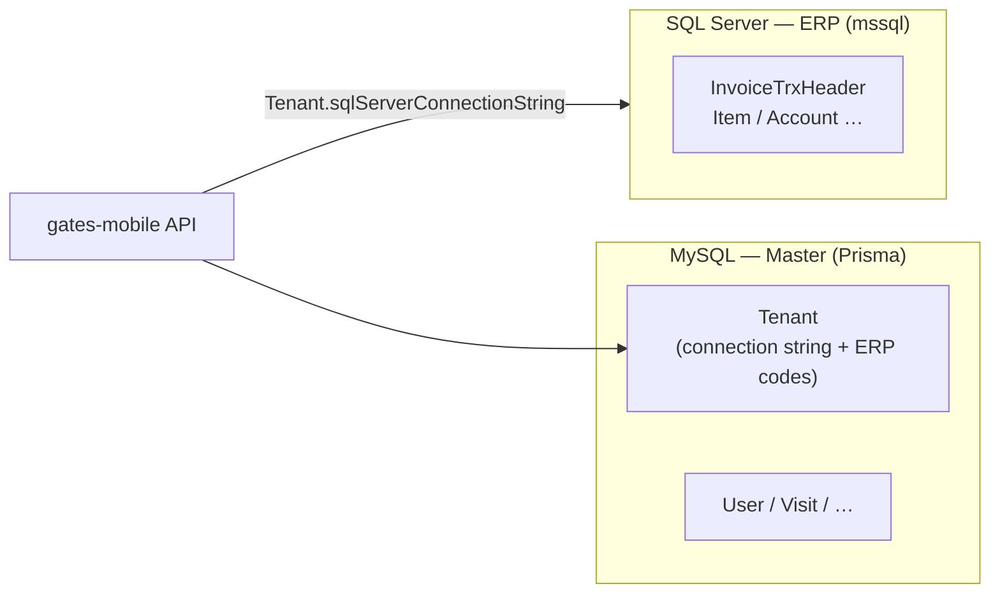
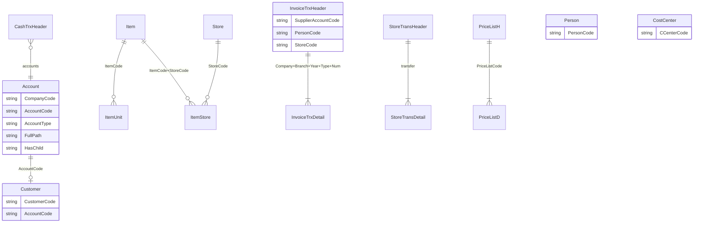

# دليل قاعدة ERP — SQL Server (ليست Prisma)

هذا **الدليل** يشرح **قاعدة البيانات التي يربطها برنامج Gates Desktop (Delphi) وتتصل بها gates-mobile** عبر `mssql` — **جدولاً بجدول** في نطاق ما يهم الموبايل، مع الإشارة إلى المرجع الكامل لـ **570 جدول**.

---

## 1. قاعدتان مختلفتان — لا تخلط بينهما



| | **MySQL (Prisma)** | **SQL Server (ERP)** |
|---|-------------------|---------------------|
| **الغرض** | مستخدمون، شركات، جلسات، زيارات GPS، سجل مستندات | بيانات المحاسبة والمخزون والفواتير كما في Desktop |
| **الإعداد** | `DATABASE_URL` في `.env` | `Tenant.sqlServerConnectionString` في MySQL (Super Admin) |
| **الوصول في الكود** | `getMasterDb()` → `src/lib/db/master.ts` | `connectTenantSql()` → `src/lib/tenant/sql-server-pool.ts` |
| **الـ schema في الم repo** | `prisma/schema.prisma` | `docs/erp/erp_schema.txt` |
| **عدد الجداول** | ~5 نماذج رئيسية | **570** جدول (فهرس: [ERP_TABLES_INDEX.md](./ERP_TABLES_INDEX.md)) |

**قاعدة ذهبية:** أي API تحت `/api/lookups`, `/api/invoices`, `/api/inventory`, `/api/reports`, `/api/hr` … يقرأ/يكتب **SQL Server**.  
`/api/auth/login`, `/api/visits/create` (الزيارة نفسها) … يكتب **MySQL** للزيارات؛ التحقق من العميل قد يلمس ERP.

---

## 2. كيف يصل التطبيق إلى SQL Server؟

1. **Super Admin** يضبط لكل شركة (`Tenant`):
   - `sqlServerConnectionString`
   - `erpCompanyCode`, `erpBranchCode`, `erpYearId`
   - اختياري: `erpSaveDataCompanyCode`, `erpDebtorParentAccountCode`
2. عند أي طلب API للمندوب/المالك، الكود يستدعي **`getTenantErpConfig()`** (`src/lib/tenant/resolve.ts`) — يقرأ الإعدادات من **JWT + MySQL** (لا يرسل العميل connection string).
3. **`connectTenantSql(connectionString)`** يفتح `ConnectionPool` من حزمة `mssql`.
4. الاستعلامات تستخدم تقريباً دائماً:
   - `CompanyCode` = `erpCompanyCode`
   - `BranchCode` = `erpBranchCode` (إن وُجد)
   - سنة مالية من `Year` / `fiscal-year-resolve.ts`

---

## 3. مفاتيح مشتركة في ERP (العلاقات «المنطقية»)

Delphi ERP **لا يعتمد بالكامل على Foreign Keys ظاهرة في dump**؛ الربط غالباً:

| مفتاح | يظهر في |
|--------|---------|
| `CompanyCode` | casi كل الجداول |
| `BranchCode` | فواتير، عملاء، مخازن، HR |
| `YearId` / `YearCode` | مستندات الفترة المالية |
| `AccountCode` | شجرة الحسابات + ربط `Customer` |
| `ItemCode` | الأصناف، أسطر الفاتورة، المخزون |
| `StoreCode` | مخزن، `ItemStore`, نقل مخزني |
| `PersonCode` | المندوب على الفاتورة |
| `CCenterCode` | مراكز تكلفة / **مواقع العمل** (حضور + زيارات) |

**العلاقات التي يفترضها الموبايل (مبسّطة):**



---

## 4. الجداول حسب وحدة الموبايل

### 4.1 العملاء والحسابات

| الجدول | الدور |
|--------|--------|
| **`Account`** | شجرة الحسابات؛ `AccountType = 'D'` تفصيلي؛ `FullPath` لتحت جذر العملاء |
| **`Customer`** | بيانات العميل؛ `AccountCode` يربط بحساب التفصيل |
| **`CompanySetting`** | إعدادات؛ مثل `CustomerAccount` لجذر العملاء (`debtor-root-resolve.ts`) |

**الكود:** `src/app/api/(tenant)/lookups/route.ts` (`SQL_CLIENTS`), `src/lib/tenant/rep-client-scope.ts`, `src/lib/erp/debtor-root-resolve.ts`

---

### 4.2 الأصناف والمخازن والرصيد

| الجدول | الدور |
|--------|--------|
| **`Item`** | master صنف؛ `ItemType`, `HasChild`, `ParentItem` |
| **`ItemUnit`** | وحدات القياس؛ **`Change`** يحوّل كمية سطر المستند إلى **الوحدة الأساسية** |
| **`ItemStore`** | رصيد مخزن (قد يكون ناقصاً — الموبايل يكمّل بحركات Delphi) |
| **`Store`** | تعريف المخازن |
| **`ItemColorSize`** | ألوان/مقاسات (شبكة GetAllItemsInStore) |
| **`ItemsFirstTimeH/D`** | رصيد افتتاحي |
| **`InvoiceTrxHeader/D`** | مبيعات/مردودات — **`Qty2`** (وحدة أساسية) |
| **`StoreTransHeader/D`** | نقل بين مخازن — **`TransMainQty` / `TransQty`** |
| **`StoreCollHeader/D`** | تجميع·تفكيك·تحصيل مخزني — **`StoreCollDetail.TransQty`** + رأس **`Qty`** للمنتج |
| **`ManufactProcessH/D1/D2`** | تصنيع — صرف مواد (**D1**) وإنتاج (**D2**) على **`ManufactStoreCode`** |

**منطق الرصيد في الموبايل** (`query-delphi-store-balances.ts`): جمع حركات **مرحّلة** (`Status = Post`) للمخزن؛ الرقم المعروض في الفواتير/النقل = **كمية بالوحدة الأساسية** (أصغر `ItemUnit` / `Qty2`).

**كتalog الأصناف في الفاتورة/تقرير المخزون** (`query-positive-store-balances.ts` + `/api/lookups?type=items&storeCode=`):

- يدمج دائماً **حركات Delphi** + **`GetAllItemsInStore`** + **`ItemStore`** (لا return مبكر على حركات فقط).
- `catalog=sales|transfer|stock` يُمرَّر إلى الـ SP / SQL fallback عند غياب الإجراء.
- أكواد أصناف شبيهة بالباركود (13+ رقم) لا تُدمَج عبر `parseInt` في `itemCodeDedupeKey`.
- تشخيص tenant: `npm run erp:probe-store-catalog -- <StoreCode> [CompanyCode]`.

**الكود:** `query-delphi-store-balances.ts`, `store-movement-base-qty.ts`, `query-positive-store-balances.ts`, `get-all-items-in-store.ts`

**إجراء:** `GetAllItemsInStore` — انظر [erp_procedures.txt](./erp_procedures.txt)

---

### 4.3 المبيعات والمردودات

| الجدول | الدور |
|--------|--------|
| **`InvoiceTrxHeader`** | رأس فاتورة/مردود (`Type`, `DocNum`, `SupplierAccountCode`, …) |
| **`InvoiceTrxDetail`** | أسطر (صنف، كمية، سعر، …) |
| **`PriceListH` / `PriceListD`** | قوائم أسعار |
| **`DaribaPercent`** | ضريبة/نسب |

**الحفظ:** إجراءات `SaveInvoices`, `SaveReturnInvoices` — سلسلة `SaveData` من `delphi-save-string.ts` / `delphi-return-string.ts`

**الكود:** `src/app/api/(tenant)/invoices/create/route.ts`, `returns/create/route.ts`

---

### 4.4 سندات القبض

| الجدول | الدور |
|--------|--------|
| **`CashTrxHeader`** / **`CashTrxDetail`** / **`CashTrxotherDetail`** | سند قبض (اسم الجدول في الـ schema: `CashTrxotherDetail` — حرف `o` صغير) |
| **`Account`** | عميل + خزينة |

**إجراء:** `SavePayment` (قد يُستخدم عبر مسار مشابه للفواتير)

**الكود:** `src/app/api/(tenant)/cash/receipt/create/route.ts`

---

### 4.5 النقل المخزني

| الجدول | الدور |
|--------|--------|
| **`StoreTransHeader`** | رأس أمر نقل |
| **`StoreTransDetail`** | أسطر |

**إجراء:** `SaveStoreTrans` — أو نسخ جداول (fallback) في `store-trans-save.ts`

---

### 4.6 القوائم المساعدة (Lookups)

| نوع lookup | جدول ERP |
|------------|----------|
| `stores` | `Store` |
| `clients` | `Account` + `Customer` |
| `items` | `Item` (+ رصيد مخزن) |
| `currencies` | `Currency` |
| `safes` | `Account` + `BankBoxRights` |
| `costCenters` | **`CostCenter`** |
| `persons` | **`Person`** |
| `priceLists` | `PriceListH` |

**الكود:** `src/app/api/(tenant)/lookups/route.ts`

---

### 4.7 الحضور والانصراف (HR)

| الجدول | الدور |
|--------|--------|
| **`HREmployeeH`** (و related) | ربط `AttCode` / `EmployeeCode` |
| **`HREmployeeFingerPrint`** | حضور/انصراف يومي |
| **`HRRecordManualAttendanceH`** | حركات يدوية |
| **`HREmployeeMobilePunch`** | **جدول موبايل** — GPS (يُنشأ بسكربت `scripts/erp/hr-mobile-punch-table.sql`) |

**الكود:** `src/app/api/(tenant)/hr/attendance/route.ts`, `hr-attendance-save.ts`, `attendance-geofence.ts`

**Geofence:** قبل الحفظ يُقارن GPS المندوب بموقع **`ClientVisitSite`** لنفس `CCenterCode` — **500 م** كحد أقصى + دقة GPS ≤ 50 م (نفس الزيارات).

**ملاحظة:** **مواقع الزيارات** في MySQL (`ClientVisitSite`) تُربط بـ **`CostCenter.CCenterCode`** — نفس قائمة «موقع العمل» في الحضور. بدون تسجيل GPS للموقع من مالك الشركة لا يُقبل الحضور.

---

### 4.8 MySQL فقط (لا ERP)

| نموذج Prisma | الغرض |
|--------------|--------|
| `Visit` | زيارة مندوب + GPS |
| `ClientVisitSite` | موقع GPS لكل cost center |
| `ErpDocumentLog` | ربط حفظ موبايل ↔ مفتاح مستند ERP |

---

## 5. الإجراءات المخزنة (Stored Procedures)

قائمة الأسماء من dump مرجعي: **[erp_procedures.txt](./erp_procedures.txt)** (قد لا تشمل كل ما يستدعيه الموبايل — راجع **5.1**).

| الإجراء | استخدام الموبايل |
|---------|------------------|
| `SaveInvoices` | حفظ فاتورة مبيعات |
| `SaveReturnInvoices` | مردود مبيعات |
| `SaveStoreTrans` | نقل مخزني |
| `SavePayment` | حفظ سند قبض |
| `GetAllItemsInStore` | فهرس مخزن / SP رصيد |
| `PostInvoice` | ترحيل فاتورة (اختياري بعد الحفظ) |

### 5.1 مطلوب للموبايل وقد يغيب من `erp_procedures.txt`

يُفحَص على قاعدة الـ tenant: `npm run erp:check-procedures` (SaveInvoices/SaveReturnInvoices إلزامي؛ الباقي تحذيرات).

| الإجراء | استخدام |
|---------|---------|
| `SaveStoreTrans` | حفظ/ترحيل نقل مخزني |
| `PostStoreTrans` / `PostStoreTransfer` | ترحيل مخزون النقل |
| `PostPayment` / `PostCash` / `PostCashTrx` | ترحيل سند قبض (يُجرَّب بالترتيب في الكود) |

### 5.2 أسماء جداول — casing

| في `erp_schema.txt` | في الكود أحياناً |
|---------------------|------------------|
| `CashTrxotherDetail` | `CashTrxOtherDetail` (SQL Server غالباً case-insensitive) |
| — | `HREmployeeMobilePunch` (جدول امتداد موبايل — ليس ضمن الـ 570) |

إذا ظهر خطأ «الإجراء placeholder» → انشر النسخة الكاملة من **SQL سطح المكتب** إلى **نفس** قاعدة ال tenant على Railway (انظر `migrate-to-railway.md`).

### 5.3 تقارير الموبايل (استعلام مباشر — بدون join `[Type]`)

| التقرير | API | جداول / منطق |
|---------|-----|----------------|
| سجل مبيعات | `/api/reports/sales-register` | `InvoiceTrxHeader` — `Type LIKE SV%` |
| سجل مشتريات | `/api/reports/purchase-register` | `InvoiceTrxHeader` — `Type LIKE PI%` |
| كشف مورد | `/api/reports/supplier-statement` | `PI%` دائن، `PR%` مدين، `CashTrx` `BP%` مدين + GL |
| دفعات متأخرة | `/api/reports/overdue-payments` | استحقاق = `Date + Days`، متبقي = `NetAmount×Change − PaidAmount` |

**Env (اختياري):** `ERP_REPORT_SALES_TYPE_PREFIX`, `ERP_REPORT_PURCHASE_TYPE_PREFIX`, `ERP_REPORT_SUPPLIER_PAYMENT_CASH_PREFIX`, `ERP_REPORT_CUSTOMER_RECEIPT_CASH_PREFIX`.

**Probe أنواع المستندات على tenant:** `npm run erp:probe-report-types`.

**Lookups:** `/api/lookups?type=suppliers` — `Supplier` + حسابات تحت `CompanySetting.SupplierAccount`.

---

## 6. أين أجد كل عمود لكل جدول؟

1. **[ERP_FULL_TABLES_CATALOG.md](./ERP_FULL_TABLES_CATALOG.md)** — كل الـ 570 جدول + أي جدول يظهر في SQL الموبايل + امتدادات (مثل `HREmployeeMobilePunch`).
2. **[ERP_TABLES_INDEX.md](./ERP_TABLES_INDEX.md)** — فهرس سريع (اسم + عدد أعمدة).
3. **[erp_schema.txt](./erp_schema.txt)** — ابحث عن `TableName.` — كل سطر: `TableName.ColumnName (type)`.

مثال:

```text
Customer.Place (nvarchar)
Customer.Address (nvarchar)
InvoiceTrxHeader.SupplierAccountCode (nvarchar)
```

---

## 7. أين في الكود أبحث عن جدول معيّن؟

```bash
rg "dbo\\.InvoiceTrxHeader" src/
rg "FROM CostCenter" src/
```

أو من جذر المشروع:

```bash
rg "Customer" src/lib/erp src/app/api
```

---

## 8. تحديث التوثيق بعد تغيير ERP

1. من SSMS على قاعدة Desktop: export قائمة أعمدة → `docs/erp/erp_schema.txt`.
2. export أسماء procedures → `docs/erp/erp_procedures.txt`.
3. أعد توليد الفهرس والفهرس الشامل:

```bash
node scripts/erp/generate-erp-tables-index.mjs
node scripts/erp/generate-erp-tables-catalog.mjs
```

4. تحقق من إجراءات الحفظ على tenant ERP: `npm run erp:check-procedures "Server=…"`.

---

## 9. ملخص سريع للمطور

- **Prisma** = هوية، صلاحيات، زيارات، إعدادات شركة.
- **SQL Server** = كل ما يظهر في Desktop ERP.
- **CompanyCode + BranchCode + Year** = سياق كل استعلام تقريباً.
- **Account ↔ Customer** = العملاء.
- **Item + Store + حركات** = المخزون والفواتير.
- **CostCenter** = مواقع العمل (HR + geofence زيارات).
- المرجع الكامل للـ **570 جدول**: [ERP_FULL_TABLES_CATALOG.md](./ERP_FULL_TABLES_CATALOG.md) (أعمدة + موبايل؟ + غرض) · [ERP_TABLES_INDEX.md](./ERP_TABLES_INDEX.md) (فهرس سريع)
