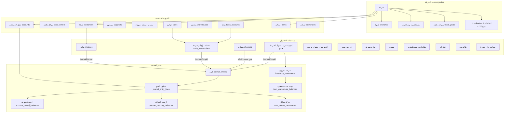
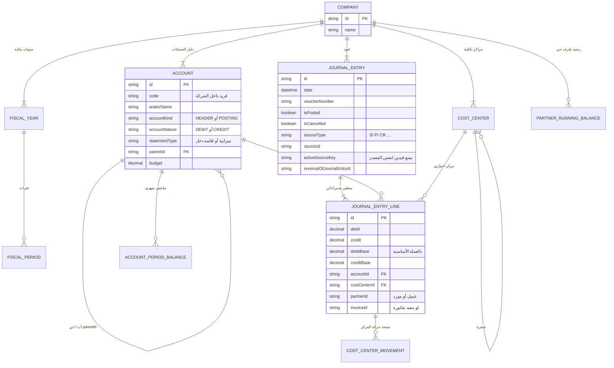
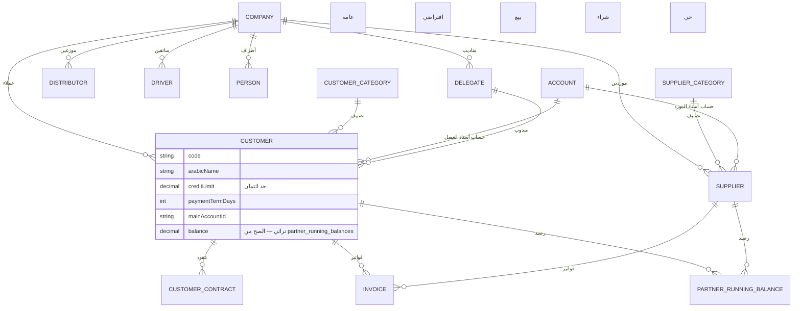
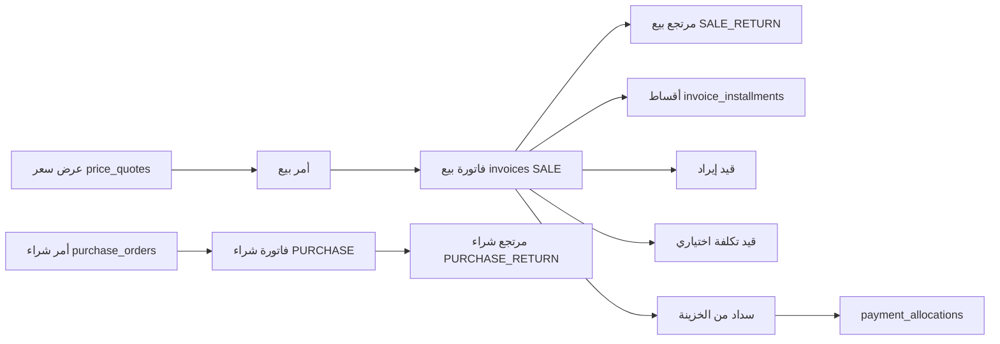
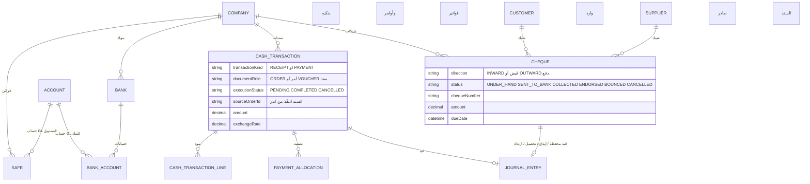
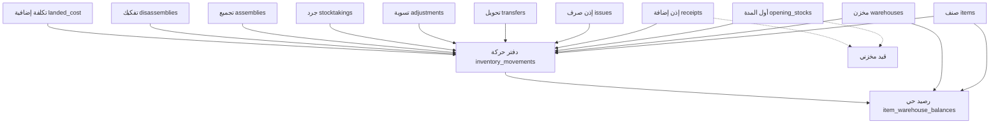
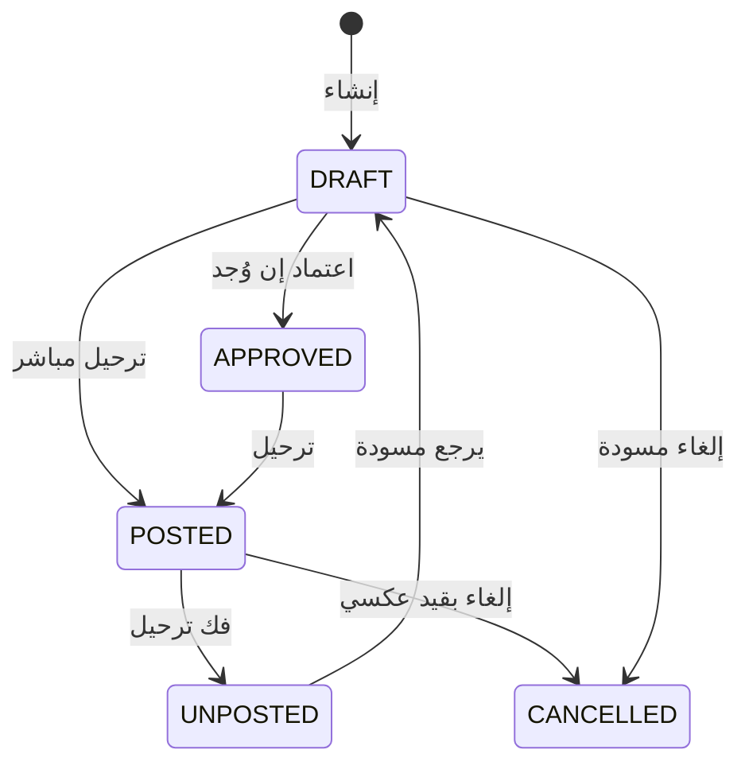

# خريطة تخيّل قاعدة بيانات GATES

الملف ده عشان **تشوف** النظام كصورة في دماغك.  
مستكشف كامل لكل الجداول: افتح [`database-explorer.html`](./database-explorer.html) — المصدر [`database-explorer.json`](./database-explorer.json) (**270 جدول**)  
الكتالوج الحرفي (كل عمود): [`DATABASE-FULL-CATALOG.md`](./DATABASE-FULL-CATALOG.md)  
الفكرة التشغيلية: [`DATABASE-STRUCTURE.md`](./DATABASE-STRUCTURE.md)

- افتح الملف في Cursor / GitHub: رسومات Mermaid هتترسم.
- أو انسخ قسم **برومبت الصورة** تحت واده لأي مولد صور / ChatGPT / Gemini يطلب «بوستر علاقات».

عدد الموديلات ≈ **270**. مفيش بوستر واحد يرسم كل عمود مقروء. الصورة الصحيحة = **شمس في النص (الشركة + القيد)** وحواليها مدارات.

---

## 0) الجملة اللي تلزق في الدماغ

```
شركة
  فيها دليل حسابات + أطراف + أصناف + مخازن + خزائن
  المستخدم يملا مستند (فاتورة / سند / إذن / شيك / مستخلص)
  الترحيل يولّد قيد يومية
  القيد يحرّك:
      أرصدة الحسابات الشهرية
      أرصدة العملاء/الموردين
      حركة مراكز التكلفة
  مستند المخزن يحرّك:
      دفتر حركة المخزون
      رصيد الصنف × المخزن
```

المفتاح الداخلي دايمًا **UUID**. الرقم اللي تشوفه على الشاشة حاجة تانية (`code` / `invoiceNumber` / `voucherNumber`).

تقريبًا كل جدول تشغيلي فيه **`companyId`**. مفيش صف يعيش برة الشركة.

---

## 1) الصورة الكبيرة — شمس النظام



---

## 2) مدار المحاسبة — القلب



### أعمدة لازم تتخيلها على القيد

| عمود | معنى عربي |
|---|---|
| `isPosted` | اترحّل ولا لأ. المرحّل ما بيتكتبش فوقه |
| `isCancelled` | ملغي |
| `sourceType` + `sourceId` | مين المستند اللي ولّد القيد |
| `activeSourceKey` | مفتاح فريد: شركة\|نوع\|رقم\|سنة — يفضل فاضي بعد فك الترحيل |
| `reversalOfJournalEntryId` | القيد ده عكس لقيد تاني |
| `debit` / `credit` | بعملة المستند |
| `debitBase` / `creditBase` | بعد سعر التحويل — ده اللي التقارير بتجمعه |

---

## 3) مدار الأطراف



تخيّل العميل ككارت. الكارت عليه اسم وحد ائتمان. **الرصيد التشغيلي** مش على الكارت؛ عايش في `partner_running_balances` ويتحدث مع كل قيد عليه.

---

## 4) مدار البيع والشراء



جدول الفاتورة **واحد**: `invoices`. النوع في `invoiceKind`:

| القيمة | المعنى |
|---|---|
| `SALE` | بيع |
| `PURCHASE` | شراء |
| `SALE_RETURN` | مرتجع بيع |
| `PURCHASE_RETURN` | مرتجع شراء |

سطور: `invoice_lines` (صنف، كمية، سعر، ضريبة، مخزن، مركز).  
إضافات: `invoice_adjustments`. شروط: `invoice_conditions`.

حقول فلوس مهمة على الرأس: `totalAmount` `discountAmount` `taxAmount` `netAmount` `paidAmount` `remainingAmount` `paymentStatus`.

---

## 5) مدار الخزينة والشيكات



دورة الشيك الوارد تتخيّلها خط أنابيب:

`في الخزينة → إيداع برسم التحصيل → تحصيل`  
أو `في الخزينة → تظهير لمورد`  
أو من البنك / التظهير → `ارتداد`.

كل سهم ممكن يولّد قيد. فك السهم يعكس القيد.

أوراق قبض/صرف التراثية: `securities_receipts` `securities_payments` `securities_renewals`.

---

## 6) مدار المخزون



كل مستند مخزن = **رأس + سطور**. الرأس فيه `journalEntryId` لو الترحيل المحاسبي شغال.

الرصيد الحي مفتاحه: شركة + صنف + مخزن (`quantityOnHand` `reservedQuantity` `averageCost`).

---

## 7) باقي المدارات — جدول واحد لكل مجموعة

| المدار | الجداول | تتخيّله إزاي |
|---|---|---|
| الشركة والإعداد | `companies` `branches` `company_settings` `company_setting_entries` `document_sequences` `new_modules` `document_profiles` `transaction_settings` | مفتاح البيت + قواعد كل شاشة |
| المستخدمين | `users` `user_groups` `user_permissions` `user_advanced_permissions` `user_branch_permissions` `bank_box_rights` | مين يدخل أنهي فرع/خزينة |
| الموارد البشرية | `employees` `employee_contracts` `payroll_runs` `monthly_salary` صرفيات نهاية الخدمة والإجازات | عقد → مسير → صرف |
| التصنيع | `bills_of_materials` `bom_lines` `production_orders` `production_material_issues` | وصفة → أمر تشغيل → صرف خام |
| المقاولات | مشاريع، مقاولين، مستخلصات عميل/مقاول، جداول كميات، خطابات ضمان | مشروع فيه بنود؛ المستخلص يقص منها |
| العقارات | مشاريع، مباني، وحدات، حجوزات، عقود، أقساط، شيكات آجلة | وحدة تتعمل عقد وتقسّط |
| المدارس | سنوات، فصول، طلبة، أقساط مصروفات | زي العقد العقاري بس طالب |
| المستخلصات العامة | `extracts` `extract_items` `extract_payments` `contractors` | دفعات مقاول على بنود |
| الاستيراد | اعتمادات مستندية `letter_of_credit` + خطاب ضمان | ملف استيراد بمصاريف |
| الضرائب | `tax_periods` `tax_declarations` `tax_settlements` `e_invoice_*` | فترة → إقرار → تسوية |
| نقاط البيع | `pos_terminals` `pos_shifts` `pos_orders` | وردية تقفل على فاتورة |
| العمولات | سياسات وشريحات مندوب | كمية/قيمة → نسبة |
| الذكاء الاصطناعي | محادثات، أدوات، مستندات مقطعة، إنذارات | مش دفتر محاسبي |
| المرفقات والطباعة | `document_attachments` `document_layout_configs` | شكل الورقة |

---

## 8) خط الحياة لأي مستند مالي



لما يترحل:

1. يتولد أو يتثبت `journal_entries` + سطوره.
2. يتحدث `account_period_balances` لنفس الشهر.
3. لو السطر عليه عميل/مورد → `partner_running_balances`.
4. لو السطر عليه مركز → `cost_center_movements`.
5. لو مخزن → `inventory_movements` + `item_warehouse_balances`.

التقارير **مش جداول جاهزة**. وقت ما تفتح التقرير السيرفر يجمع من الدفاتر دي.

---

## 9) علاقات الـ FK اللي تتكرر في كل حتة

تخيّل الأسهم دي مرسومة على كل مستند تقريبًا:

```
المستند
  companyId        → companies.id          إلزامي
  branchId         → branches.id           غالبًا اختياري
  fiscalYearId     → fiscal_years.id
  journalEntryId   → journal_entries.id    بعد الترحيل
  currency / currencyCode
  costCenterId     → cost_centers.id
  createdAt / updatedAt
  isPosted / isCancelled / version
```

الفاتورة تزيد: `customerId` أو `supplierId` + `warehouseId` + `delegateId`.  
السند يزيد: `safeId` أو `bankAccountId` + `offsetAccountId`.  
سطر القيد يزيد: `accountId` + `debit/credit` + `debitBase/creditBase`.

---

## 10) برومبت جاهز تديه لـ AI عشان يطلع صورة علاقات

انسخ البلوك تحت كما هو:

```
ارسم بوستر جداري أفقي ضخم Ultra detailed infographic، اتجاه عربي من اليمين لليسار، خلفية كحلي غامق #0A3D5E، خطوط وأسهم سماوي #1787B8، كروت بيضاء بكتابة عربية واضحة.

العنوان أعلى اليمين: «خريطة قاعدة بيانات GATES ERP — الشركة شمس النظام».

وسط الصورة شمس كبيرة اسمها «شركة companies» ومنها أسهم لكل المدارات التالية، كل مدار دائرة أو جزيرة بلون مختلف، وجواها جداول بصناديق صغيرة:

1) مدار الأساس ذهبي: فروع branches، مستخدمين users، صلاحيات، سنوات مالية fiscal_years، إعدادات company_settings، مسلسلات document_sequences، بروفايل مستند document_profiles، سياسات ترحيل transaction_settings.

2) مدار المحاسبة أحمر/خمري وهو الأكبر بعد الشمس: شجرة حسابات accounts أب-ابن، مراكز تكلفة cost_centers، قيد journal_entries مربوط بسطور journal_entry_lines مدين/دائن وdebitBase/creditBase. من السطور أسهم إلى account_period_balances ملخص شهري، partner_running_balances رصيد عميل/مورد، cost_center_movements حركة مركز.

3) مدار الأطراف أخضر: customers، suppliers، delegates، distributors، drivers، persons، تصنيفات، عقود. كل طرف مربوط بحساب أستاذ.

4) مدار البيع والشراء برتقالي: عرض سعر → أمر → فاتورة invoices بحالات SALE / PURCHASE / SALE_RETURN / PURCHASE_RETURN. سطور invoice_lines، أقساط، تسويات. الفاتورة سهم إلى القيد وسهم إلى السداد.

5) مدار الخزينة أزرق مائي: safes خزائن وbank_accounts بنوك مربوطين بحساب GL. cash_transactions نوع قبض/صرف ودور أمر ORDER أو سند VOUCHER. شيكات cheques دورة: في الخزينة → إيداع → تحصيل أو تظهير أو ارتداد. كل حالة سهم لقيد.

6) مدار المخزون بنفسجي: items، warehouses، رصيد حي item_warehouse_balances، دفتر inventory_movements. مستندات: أول مدة، إذن إضافة، إذن صرف، تحويل، تسوية، جرد، تجميع، تفكيك.

7) مدارات أصغر على الحافة: موارد بشرية، تصنيع BOM، مقاولات ومستخلصات، عقارات ووحدات وأقساط، مدارس، نقاط بيع، ضرائب وإي-فاتورة، اعتمادات مستندية، ذكاء اصطناعي.

أسفل البوستر شريط قواعد ذهبية بالعربي:
- كل صف تشغيلي عليه companyId
- المفتاح UUID والرقم الظاهر منفصل
- المستند ≠ القيد، الربط journalEntryId
- القيد المرحّل لا يُعدّل؛ يُعكس
- التقارير تُجمع لحظيًا من الدفاتر مش من جداول نتائج

الأسلوب: خريطة معمارية سينمائية، خط عربي حديث، صناديق بحواف دائرية، أسهم منحنية عليها كلمات علاقة قصيرة، كثافة عالية لكن مقروءة، كأن ملصق غرفة سيرفر لشركة محاسبة.
```

لو المولد يقبل صورة مرجعية: قوله «نفس ترتيب الشمس والمدارات، زوّد أسماء الجداول».

لو عايز صورة **ER تقنية** مش بوستر: قوله

```
Generate a dark-theme entity-relationship poster of a MySQL ERP.
Center: Company 1—N to Account, Customer, Item, Warehouse, Safe.
Account 1—N JournalEntryLine; JournalEntry 1—N JournalEntryLine.
Invoice N—1 Customer/Supplier and N—1 JournalEntry.
CashTransaction N—1 Safe/BankAccount and N—1 JournalEntry.
Item + Warehouse → ItemWarehouseBalance and InventoryMovement.
Use Arabic labels next to English table names. No decorative people.
```

---

## 11) إزاي تحدّث الكتالوج الحرفي بعد تغيير الـ schema

```bash
node gates-backend/scripts/generate-db-catalog.mjs
```

الملف المتولّد: `DATABASE-FULL-CATALOG.generated.md` — كل جدول + كل عمود + كل علاقة كما في Prisma.
