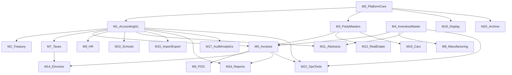

# Gates ERP — Delphi to Node.js Migration (Executive Summary)

**Status:** Wave 0 documentation baseline  
**Legacy:** [MainProgram](../../MainProgram/) — Delphi `Business.dpr`, SQL Server  
**Target:** [gates-backend](../../gates-backend/) — Express, TypeScript, **Prisma + MySQL**  
**Frontend:** [gates-web))

## Objective

Modular reverse-engineering and reimplementation of a production Delphi desktop ERP into an enterprise Node.js API. Schema and rules are learned from the **live legacy catalog** ([DataBase.ini](../../MainProgram/DataBase.ini): **569 tables**, column types) and Pascal business logic—not a blind greenfield design.

**Confirmed constraint:** Keep Prisma/MySQL; add missing tables, fields, posting rules, and validations discovered in SQL Server usage.

## Legacy system profile

| Dimension | Legacy | Target (current) |
|-----------|--------|------------------|
| Units | ~586 `.pas` (excl. Chilkat) | ~131 domain services |
| DB | SQL Server, composite keys `CompanyCode`, `BranchCode`, `YearId` | MySQL, UUID + `companyId` tenancy |
| Shared kernel | [untgeneral.pas](../../MainProgram/untgeneral.pas) (~15k lines) | Middleware + shared services |
| Journals | `GLTrxHeader` / `GLTrxDetail` | `JournalEntry` / `JournalEntryLine` |
| Stock costing | `ItemCost` + [GetItemCost](../../MainProgram/untgeneral.pas) | Partial; needs `ItemCostHistory` |
| Licensing | [smAppLisence.pas](../../MainProgram/smAppLisence.pas) | SaaS entitlements (M21, later) |

## Module catalog (24 domains)

| ID | Module | Legacy anchors | Node coverage (pre-Wave 0 code) |
|----|--------|----------------|----------------------------------|
| M0 | Platform core | `untgeneral`, company/branch/year/users | Strong |
| M1 | Accounting & GL | `UntGL`, COA, CC, currency | Strong; legacy field parity gaps |
| M2 | Treasury & bank | `CashTrx*`, checks | Good |
| M3 | Party masters | Customer, supplier, person, distributor | Good |
| M4 | Inventory | Items, stores, moves, costing | Good API; costing parity gap |
| M5 | Sales/purchase invoices | `untRInovice`, `untPInovice` | Partial |
| M6 | POS | `untPOS` | Partial |
| M7 | Taxes (Dariba) | `untDariba*` | Partial |
| M8 | Manufacturing | `UntManufProc` | Weak |
| M9 | HR / payroll | `HR/*.pas` (73 units) | Partial |
| M10 | Schools | `untSchool*` | Partial |
| M11 | Abstracts / contractors | `Abstracts/` | Good (`/extracts`) |
| M12 | Real estate | `Buildings/`, `BL*` | Partial |
| M13 | Projects | `UntProject` | Partial |
| M14 | E-invoicing | `UntSendElectronic*` | Good |
| M15 | Import/export | `UntExportImport` | Partial |
| M16 | Reporting | `*Rep`, RBuilder | Per-domain subset |
| M17 | Audit analytics | `Audit/`, `AuditH/D` | Weak (`audit-logs` only) |
| M18 | Display portal | `Display/` | Missing |
| M19 | Cars | `Car*` | Missing |
| M20 | Archive | `ArchiveFiles*` | Missing |
| M21 | License / replication | `smAppLisence`, `Replication/` | Redesign |
| M22 | Ops tools | `untPostAll`, approvals | Partial |
| M23 | Guarantees (Daman) | `untDaman` | Gap |

Optional legacy vertical in DB: **`Mos*`** tables (clinical/hospital)—not in main `Business.dpr` menu; treat as out-of-scope unless product confirms.

## Dependency graph (migration order)

### Waves

| Wave | Modules | Goal |
|------|---------|------|
| **0 (now)** | M0 → M1 → M3 → M4 | Tenant, GL, parties, inventory foundation |
| 1 | M2, M5, M7, M22 | Operational ERP + posting orchestration |
| 2 | M6, M14, M15 | Channels & compliance |
| 3 | M8–M12, M13 | Verticals |
| 4 | M16–M20, M17 | Analytics & portal |
| 5 | M21 | Commercial entitlements |

## Cross-cutting methodology

1. **Table mapping:** [01-table-mapping.csv](./01-table-mapping.csv) — all 569 legacy tables → module + Prisma target + status.
2. **Column truth:** `DataBase.ini` `[TableName]` sections (e.g. `Account`, `GLTrxHeader`) drive Prisma `@db.Decimal(18,4)` and lengths.
3. **Logic mining:** Form save/post handlers → `untgeneral` → document as TypeScript domain services.
4. **ACID:** One `prisma.$transaction` per legacy Save+Post; no partial GL/stock updates.
5. **Parity tests:** Golden SQL Server snapshots; debit/credit, stock qty, average cost to 4 decimal places.
6. **Integrations:** Replace Chilkat/SMS/replication with queues, webhooks, and tenant sync—not port DLLs.

## Wave 0 documentation artifacts

| File | Purpose |
|------|---------|
| [modules/M0-PlatformCore.md](./modules/M0-PlatformCore.md) | Platform & security |
| [modules/M1-AccountingGL.md](./modules/M1-AccountingGL.md) | GL, COA, posting rules |
| [modules/M3-PartyMasters.md](./modules/M3-PartyMasters.md) | Customers, suppliers, persons |
| [modules/M4-InventoryMaster.md](./modules/M4-InventoryMaster.md) | Items, warehouses, costing |

## Implementation pointers (existing code)

- API mount: [gates-backend/src/app.ts](../../gates-backend/src/app.ts)
- Journal service: [journal-entry.service.ts](../../gates-backend/src/modules/accounting/services/journal-entry.service.ts)
- Prisma accounting: [schema.prisma](../../gates-backend/prisma/schema.prisma) (`Account`, `JournalEntry`, …)
- SQL posting rules seed: [0005_posting_rules.sql](../../gates-backend/prisma/migrations/0005_posting_rules.sql)

## Next step after Wave 0 docs

Hands-on coding **M0 → M1 → M3 → M4**: legacy key fields on journal entries, `NumberSequenceService`, `ItemCostHistory`, branch/year request context, and permission enforcement (replace dev `anonymousApiContext` before production).
